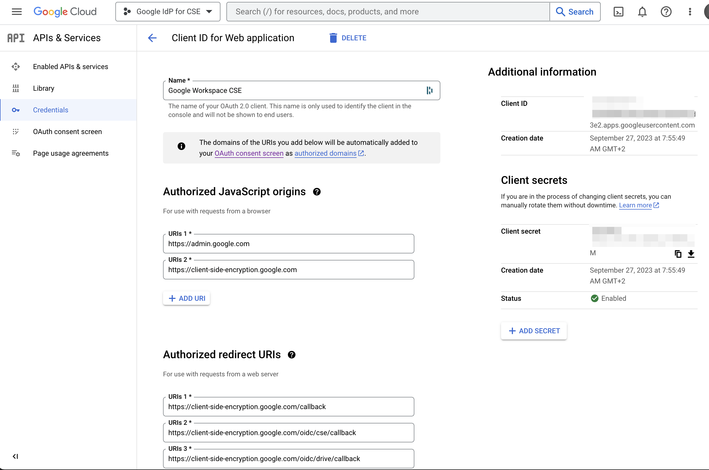

## Enable client side encryption for Google Workspace

### Configure the Identity Provider

You need to connect Google Workspace to your identity provider (IdP)—either a third party IdP or Google identity. Your external key service uses the IdP to authenticate users before they can encrypt files or access encrypted files.

General Instructions for configuring the Identity Provider can be found in the [Identity Provider Configuration](https://support.google.com/a/answer/10743588?sjid=1873175548451751092-EU&hl=en) section.

#### Use Google as the Identity Provider

To use Google as an Identity Provider, you need to create a client ID in the Google Cloud Console. Instructions for creating a client ID can be found in the [Create a client ID](https://support.google.com/a/answer/10743588?sjid=1873175548451751092-EU&hl=en#zippy=%2Ccreate-a-client-id-for-google-identity) section.

Once created the Client ID should look like this

