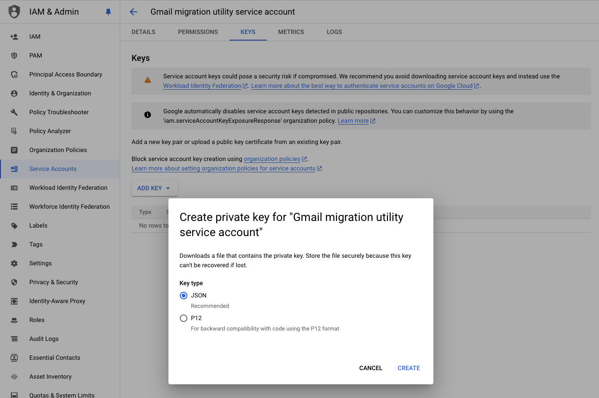
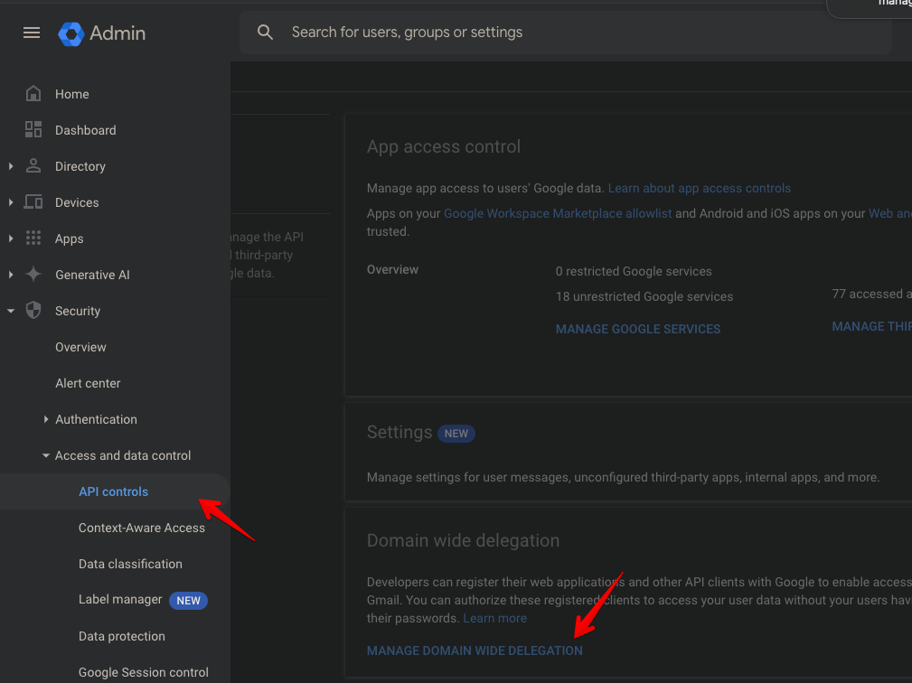
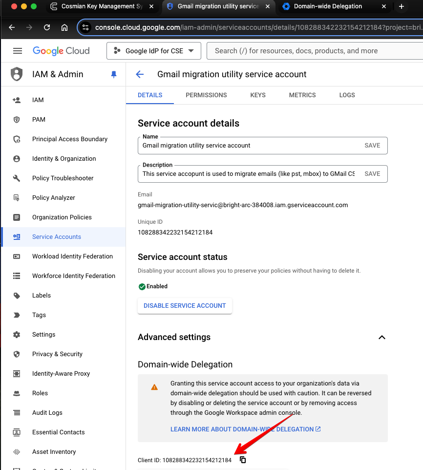

# Migrating existing emails to Gmail CSE

This documentation focuses on migrating email messages from a PST or Mbox archive to Gmail CSE.
An overview of all migration options is provided in
[this blog article](https://workspaceupdates.googleblog.com/2024/03/migrate-existingencrypted-messages-to-Gmail-CSE.html)
and covers other options such as migrating from Virtru or Microsoft Exchange.

A more general view of all the migration options to and from Gmail can be found at
[this link](https://support.google.com/a/topic/13002773)

- [Migrating existing emails to Gmail CSE](#migrating-existing-emails-to-gmail-cse)
  - [Install the migration utility](#install-the-migration-utility)
  - [Create a service account credential with domain-wide access](#create-a-service-account-credential-with-domain-wide-access)
    - [Create a service account](#create-a-service-account)
    - [Create a key in JSON format](#create-a-key-in-json-format)
    - [Grant the GMail API domain-wide access](#grant-the-gmail-api-domain-wide-access)
  - [Migrate : example usage](#migrate-example-usage)
  - [Export Data from GMail](#export-data-from-gmail)

## Install the migration utility

Download the migration utility from the first link above.

Make sure you look at the included readme file for the scopes that must be associated with the
service account (see below).

## Create a service account credential with domain-wide access

Head to the GCP console and follow the Google Documentation on creating a
[Service Account](https://developers.google.com/workspace/guides/create-credentials#create_a_service_account)

### Create a service account


### Create a key in JSON format



The key will be saved to your computer. The key will be provided to the migration utility.

### Grant the GMail API domain-wide access

Open the Google Workspace Admin and follow
[the instructions](https://support.google.com/a/answer/162106)
in the paragraph `Set up domain-wide delegation for a client`



Create a new API client, the client ID is available in the Details of the service account
 on the Google Cloud Console.

The OAuth scopes required are:

- `https://www.googleapis.com/auth/gmail.readonly` for a dry run

- `https://www.googleapis.com/auth/gmail.modify` when performing the actual migration

For more details on Google OAuth scopes, check
[this reference](https://developers.google.com/identity/protocols/oauth2/scopes)

## Migrate : example usage

Perform a dry-run over two input files to verify that they can be parsed and
that their messages can be encrypted in preparation for migration:

For Windows:

> gmail-cse-migrate.exe -input user1.pst -input user2.pst -api-credential
> c:\my_svc_acct.json -dryrun -logfile log.txt

If it looks good, then run the command again in migration mode:

> gmail-cse-migrate.exe -input user1.pst -input user2.pst -api-credential
> c:\my_svc_acct.json -logfile log.txt

For macOS:

```shell
/gmail-cse-migrate \
   -api-credential=./gmail-migration-service-account-key.json \
   -input=user1.mbox \
   -logfile=./log.txt -dryrun

Version: gmail_cse_migrate-24.11.0.2 (darwin)
Download URI:
  https://dl.google.com/clientsideencryption/gmail-cse-migrate/macos/latest/gmail-cse-migrate.dmg


COMPLETED
  Inspected: 1 file in 0 directories
  Found:     163 messages in 1 .mbox file
  Failures:  6 messages in .mbox files failed to parse

MIGRATION
  Processed: 127 messages
  Skipped:   127 messages were not uploaded due to dryrun
  Skipped:   36 already encrypted messages were not migrated

PARTIAL SUCCESS

LOG FILE WRITTEN TO
  ./log.txt
```

## Export Data from GMail

If you need to export data from Gmail, the easiest is to use TakeOut, which you can find
[here](https://knowledge.workspace.google.com/kb/how-to-export-a-single-user-data-000009160)

To export data for a single user, follow
[this documentation](https://support.google.com/a/answer/14338836)

To export the whole organization data, follow
[this documentation](https://support.google.com/a/answer/14339894)
