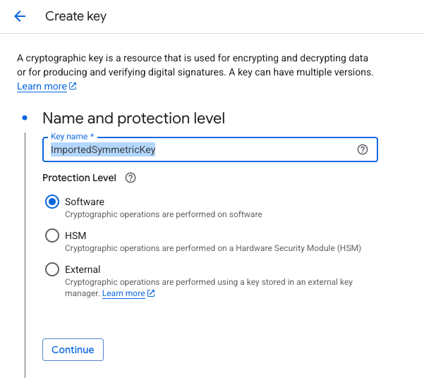
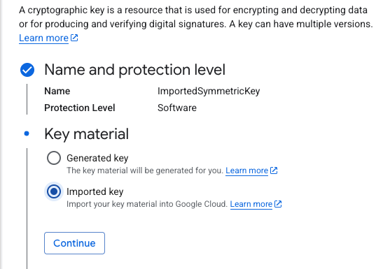
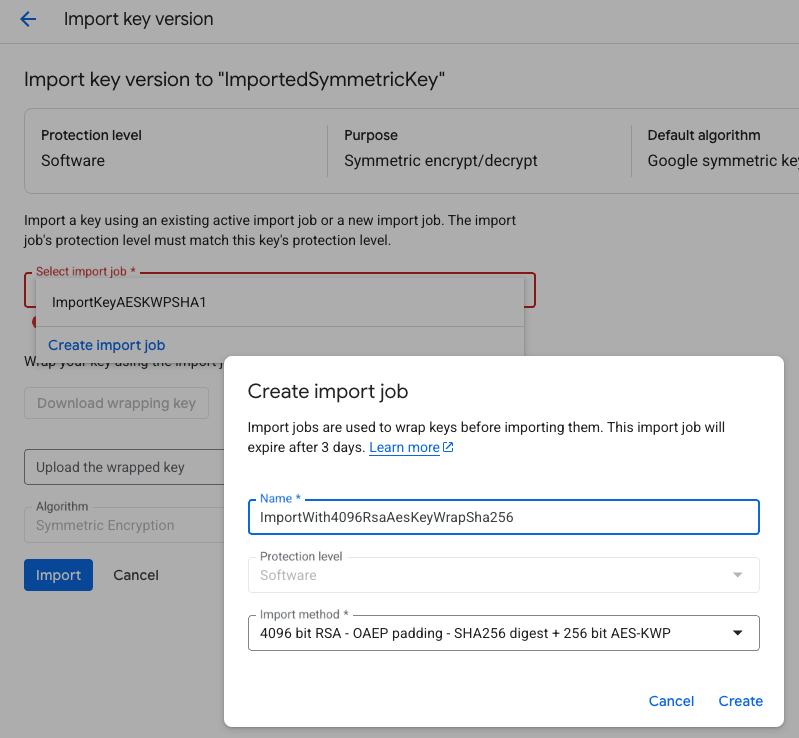
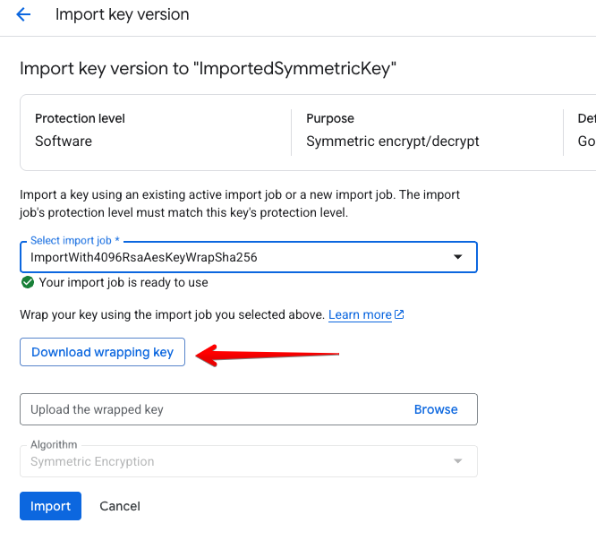
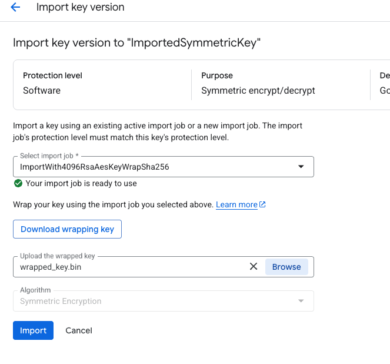
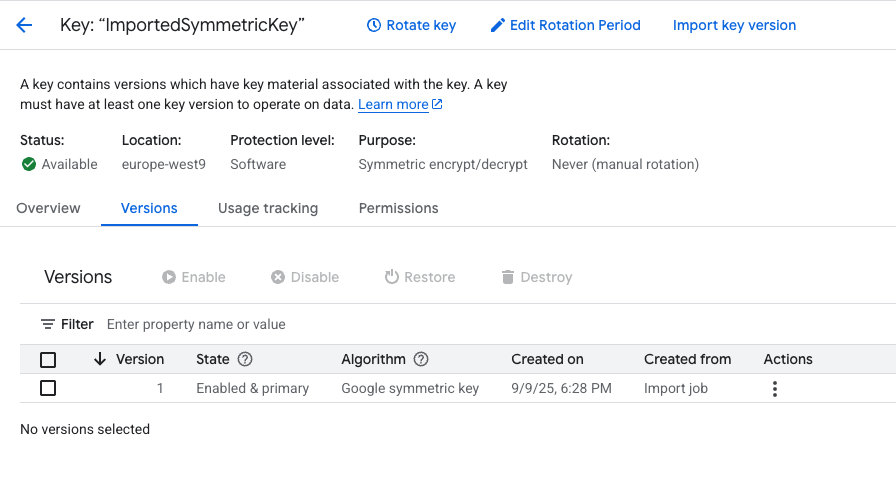

To import a Customer Managed Encryption Key in the Google KMS, follow the
instructions [on Google documentation](https://cloud.google.com/kms/docs/key-import) related to importing
a manually wrapped key.

<!-- TOC -->
  * [Prepare the symmetric key and wrapping key in Google Cloud KMS](#prepare-the-symmetric-key-and-wrapping-key-in-google-cloud-kms)
  * [Create a symmetric key in Cosmian KMS](#create-a-symmetric-key-in-cosmian-kms)
  * [Import the wrapping key in Cosmian KMS](#import-the-wrapping-key-in-cosmian-kms)
  * [Export the symmetric key wrapped by the wrapping key from Cosmian KMS](#export-the-symmetric-key-wrapped-by-the-wrapping-key-from-cosmian-kms)
  * [Import the wrapped key in Google Cloud KMS](#import-the-wrapped-key-in-google-cloud-kms)
<!-- TOC -->

## Prepare the symmetric key and wrapping key in Google Cloud KMS

Using the Google Console, first create a key in an existing Cloud KMS key ring.



Click `Continue` the select `Imported Key`



Then click `Create`

In the `Select Import Job` dropdown, select `Create Import Job`



Select `4096 bit RSA -OAEP Padding - SHA256 digest + 256 bit AES-KWP` as import method
then click `Create`

Then click `Download wrapping key`



The key will be downloaded as a PKCS#8 PEM named `ImportWith4096RsaAesKeyWrapSha256.pem`

## Create a symmetric key in Cosmian KMS

This is the symmetric key that will be wrapped by the Google wrapping key and imported in the Google KMS.

```shell
cosmian kms sym keys create  --number-of-bits 256 CMEK_Sym_Key

The symmetric key was successfully generated.
          Unique identifier: CMEK_Sym_Key
```

## Import the wrapping key in Cosmian KMS

```shell
cosmian kms rsa keys import --key-format pem --key-usage encrypt --key-usage wrap-key ImportWith4096RsaAesKeyWrapSha256.pem CMEK_Wrapping_Key

The PublicKey in file ImportWith4096RsaAesKeyWrapSha256.pem was imported with id: CMEK_Wrapping_Key
          Unique identifier: CMEK_Wrapping_Key
```

## Export the symmetric key wrapped by the wrapping key from Cosmian KMS

```shell
cosmian kms sym keys export --key-id CMEK_Sym_Key --wrap-key-id  CMEK_Wrapping_Key \
 --key-format raw --wrapping-algorithm rsa-aes-key-wrap wrapped_key.bin

The key CMEK_Sym_Key of type SymmetricKey was exported to "wrapped_key.bin"
          Unique identifier: CMEK_Sym_Key
```

Note 1: the default `rsa-aes-key-wrap` wrapping algorithm uses the SHA256 digest.

Note 2: the wrapped key should be 552 bytes (4416 bits) long: 
 
- 4096 bits (RSA key length) +
- 256 bits (Symmetric key length) + 
- 64 bits of AES KWP overhead).

## Import the wrapped key in Google Cloud KMS



The key should now be available in the Google Cloud KMS.

