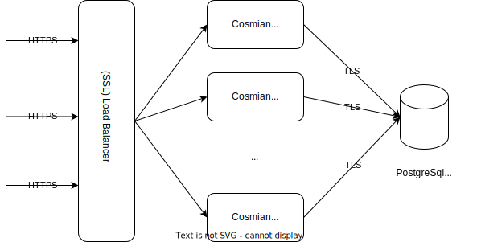

This mode offers high availability through redundancy and load-balancing.

The KMS servers are stateless, so they can simply be scaled horizontally by connecting them to the same database and fronting them with a load balancer.

### Configuring the load balancer

Since the KMS servers are stateless, any load-balancing strategy may be selected, such as a simple round-robin.

When the Cosmian KMS servers are configured to export an HTTPS port (as is the case when running inside a confidential VM):

- all the Cosmian KMS servers should expose the same server certificate on their HTTPS port
- and the load balancer should be configured as an SSL load balancer (HAProxy is a good example of a high-performance SSL load balancer)

