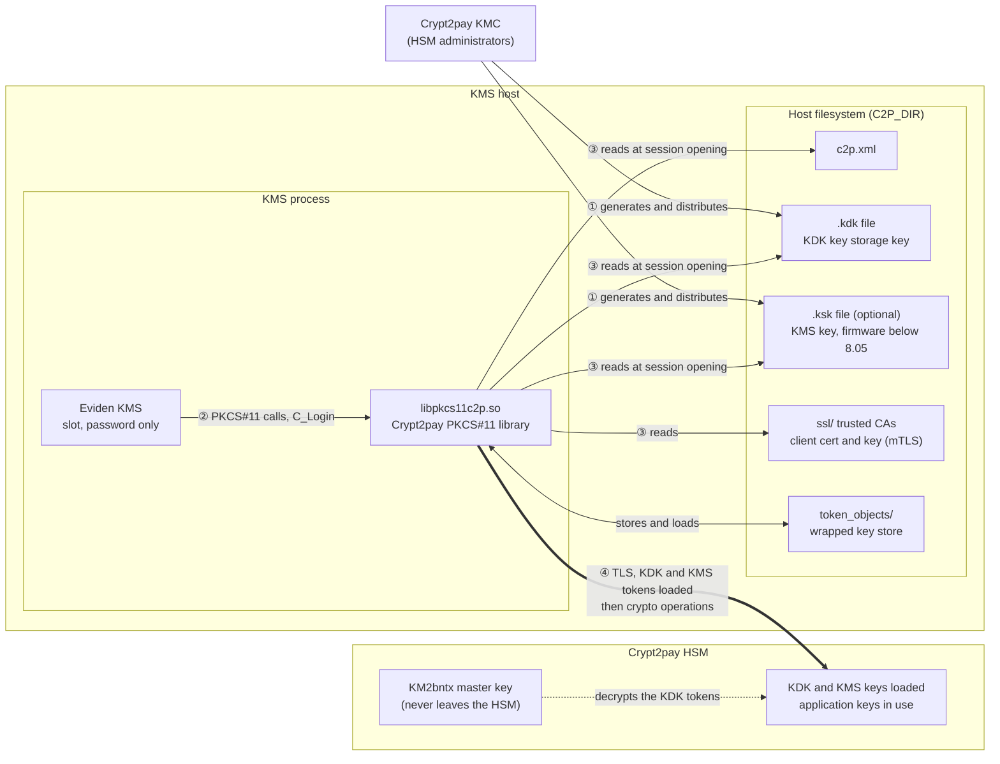

# Trustway Crypt2pay

The Crypt2pay HSM integration is supported on **Linux (x86_64)**.
It has been tested with the following devices: BULL PKCS11 C2P 5.0.7 (Release) Unix64

## How the KMS connects to the HSM

The KMS talks to the HSM exclusively through the vendor PKCS#11 library `/lib/libpkcs11c2p.so`.
Everything below the PKCS#11 API (the network channel to the HSM, TLS, the vendor key files)
is handled by that library, driven by the `c2p.xml` file that `C2P_CONF` points to
(default location when `C2P_CONF` is not set: `/c2p/c2p.xml`).

| Concern                           | Handled by                                  | Configured in                                                              |
|-----------------------------------|---------------------------------------------|----------------------------------------------------------------------------|
| Loading the library               | KMS (`/lib/libpkcs11c2p.so`)                | fixed path, see [Copy the library](#copy-the-crypt2pay-pkcs11-library-to-lib) |
| Slot login (PIN/password)         | KMS, via PKCS#11 `C_Login`                  | `hsm_slot` / `hsm_password` (KMS config)                                   |
| `.kdk` and `.ksk` key files       | Crypt2pay library, **not the KMS**          | `c2p.xml` (`KDKfile`, `KSKfile`)                                           |
| HSM certificate validation        | Crypt2pay library, **not the KMS**          | `c2p.xml` (`SSLDefinition/authorities`)                                    |
| KMS certificate to the HSM (mTLS) | Crypt2pay library, **not the KMS**          | `c2p.xml` (`SSLDefinition/certificate`, `privateKey`), see [mTLS](#mutual-authentication-mtls) |

### The `.kdk` and `.ksk` files

Per the Crypt2pay *PKCS#11 API User Guide* (§5), the PKCS#11 library protects the keys it stores with technical keys
that are created on the Crypt2pay Key Management Centre (KMC) and distributed as files:

- **KDK** (key storage key): encrypts the RSA, ECDSA and (HSM firmware 8.05 and later) secret keys generated through
  PKCS#11. It is distributed in a `.kdk` file (one per HSM), or on a smart card.
- **KSK** (the `.ksk` file carries the *KMS* storage key): only needed for secret keys generated with an HSM firmware
  older than 8.05. Optional on newer firmware.

At session opening the Crypt2pay library loads the KDK tokens from the `.kdk` file into the HSM (and the KMS key from the
`.ksk` file, if configured). With `KDKintroduction` set to `start` or `login`, it additionally asks for the KDK to be
inserted from a smart card through a PIN pad connected to the HSM, at `C_OpenSession` or `C_Login` time.
Smart-card insertion is meant for manually operated platforms and is not suitable for automated load-balanced setups.

The diagram below shows who owns what. The KMS process never touches the key files: the Crypt2pay PKCS#11 library,
loaded in the KMS process, reads them from the KMS host filesystem and pushes them to the HSM.



Steps ① to ④: the administrators create the key files on the KMC and copy them to the host; the KMS only issues
PKCS#11 calls; the library reads its configuration and key files when a session is opened; the library then opens the
(optionally mutually authenticated) TLS connection, loads the KDK tokens into the HSM, and relays the crypto operations.

Consequences for the KMS:

- The files are generated by the HSM administrators on the KMC and copied to `[C2P_DIR]` on the KMS host. The KMS never
  reads, loads, or transmits them to the HSM, and it has no configuration option for them.
- The load therefore goes **from the KMS host to the HSM, performed by the Crypt2pay PKCS#11 library**, not by the KMS.
- The KMS performs no certificate handling for the HSM link. The KMS server's own TLS and client-certificate
  settings are unrelated to this link.
- The KMS opens the PKCS#11 session and logs in lazily, when the first session on a slot is opened.
  With the special password `<NO_LOGIN>` no login is performed.
- If `c2p.xml` sets `login User="<CommonName>"`, `hsm_password` must be the user PIN; with `User="@"` it must be of
  the form `commonname@PIN` (*PKCS#11 API User Guide*, §4.2.2.4).

## HSM files installation

### Copy the Crypt2pay PKCS#11 library to `/lib`

Copy `libpkcs11c2p.so` to `/lib`.
Make sure it is readable by the user running the KMS.

### Create the `c2p` directory

Create a `c2p` directory in, say, `/etc/c2p` (hereafter called `[C2P_DIR]`)

In this directory copy the following files:

- `c2padmin`   <- The Crypt2pay admin tool
- `c2p.xml`    <- The Crypt2pay configuration file
- `ca.der`     <- The CA certificate
- `installca`  <- The Crypt2pay CA installation tool
- `p11tool`    <- The PKCS#11 tool used to test the connection
- The files with extensions `.kdk` (one per HSM) and `.ksk` (optional) <- The Crypt2pay key distribution files generated
  on the Crypt2pay KMC. They are only referenced from `c2p.xml`; see [The `.kdk` and `.ksk` files](#the-kdk-and-ksk-files)

### Install the CA certificate

This certificate is the one that signed the HSM certificate and will be used to authenticate the HSM.
In the `[C2P_DIR]`, run the `installca` tool:

```sh
./installca -i ./ca.der ssl
```

This will create an `ssl` directory in the `[C2P_DIR]` and copy the CA certificate there.
To check that the CA certificate is installed correctly, run:

```sh
./installca -l ./ssl/
```

Edit the `c2p.xml` file and insert the full path to the CA certificate `ssl` directory in `C2PConfig/SSLDefinition/authorities`:

```xml
<C2PConfig>
  ...
  <SSLDefinition>
    <authorities>[C2P_DIR]/ssl</authorities>
  </SSLDefinition>
  ...
</C2PConfig>
```

replace `[C2P_DIR]` with the actual path.

### Set logging and Verify the `c2p.xml` file

In the `c2p.xml` file, set the logging to

```xml
<C2Pconfig>
  <TraceLevel>debug functions parameters pkcs hsm</TraceLevel>
  <TraceFile>+logs\c2p.trc</TraceFile>
  ...
</C2Pconfig>
```

Check the Crypt2pay manual (*PKCS#11 API User Guide*, §4.2.2) to make sure that other elements of the `c2p.xml` are correct, in particular:

- `C2PConfig/LocalKeyOwner` (mandatory) and `C2PConfig/LocalKeyIndex` (optional, default `00`): identify the KDK used by the PKCS#11 library
- the name of the `.kdk` file in `C2PConfig/C2PSlot/KDKfile` (can be overridden per HSM in `C2PBox/KDKfile`)
- the name of the `.ksk` file in `C2PConfig/KSKfile`: optional, only needed for secret keys generated with an HSM firmware older than 8.05
- the IP address of the HSM in `C2PConfig/C2PSlot/C2PBox/IP`, and `ssl="on"` on the `C2PBox` element to use TLS
  (port `3001` for TLS connections, `2001` for clear connections)

.. and recover the configured Slot ID(s) in the `Id` attribute of `C2PConfig/C2PSlot`.

### Mutual authentication (mTLS)

The configuration above authenticates the HSM to the KMS host only. To also authenticate the KMS host to the HSM,
add the client certificate, its private key and its chain to the `SSLDefinition` section of `c2p.xml`
(*PKCS#11 API User Guide*, §4.2.2.3):

```xml
<SSLDefinition>
  <authorities>[C2P_DIR]/ssl</authorities>
  <certificate>[C2P_DIR]/ssl/client.pem</certificate>
  <privateKey password="<KEY_PASSWORD>">[C2P_DIR]/ssl/client-key.pem</privateKey>
  <certificateChain format="pkcs7">[C2P_DIR]/ssl/chain.der</certificateChain>
</SSLDefinition>
```

- `authorities` is mandatory for both HSM authentication and mutual authentication.
- `certificate` and `certificateChain` are only required for mutual authentication. Defining `privateKey` is what turns
  mutual authentication on. PKCS#12 is also supported (`format="pkcs12"`).
- A password-protected private key must be in PEM format. The `password` attribute can be plain text or encrypted
  in the file (`{++AES}...`, `{AES256}...`); see the manual for the `cipherMode` options.
- `SSLDefinition` can be set globally, per `C2PSlot`, or per `C2PBox`, the most specific one taking precedence.
- The HSM must in turn trust the CA that signed this client certificate, and the client certificate's common name
  must be an authorized crypto user on the HSM. This is prepared on the HSM side with the Crypt2pay KMC and
  administration interface; see the *User Handbook: Securing network communication with TLS protocol* (§2.1 to §2.3).

The KMS is not involved in any of this: it is entirely configured in `c2p.xml` and handled by `libpkcs11c2p.so`.

### Set the `C2P_CONF` environment variable to `[C2P_DIR]/c2p.xml`

```sh
export C2P_CONF=[C2P_DIR]/c2p.xml
```

replace `[C2P_DIR]` with the actual path.

### Test the configuration

Run the `p11tool` tool to create a new 256-bit AES key:

```shell
./p11tool -genkey -keyalg aes -keysize 256 -shared /lib/libpkcs11c2p.so -slot 1 -verbose
```

The creation should be successful and print the key alias and ID:

```shell
use slot #1
Alias 'mykey' selected
Secret key #1000004 created
```

The logs are available in `[C2P_DIR]/logs/c2p.trc`.

## KMS Configuration

When using the [TOML configuration file](../configuration/server_configuration_file.md#toml-configuration-file), enable HSM support by setting these parameters:

```toml
hsm_model = "crypt2pay"
hsm_admin = "<HSM_ADMIN_USERNAME>" # defaults to "admin"
hsm_slot = [0, 0, ] # example [0,4] for slots 0 and 4
hsm_password = ["<password>", "<password>", ] # example ["648219", "648219"] for slots 0 and 4
```

> ***NOTE:***  `hsm_slot` and `hsm_password` must always be arrays, even if only one slot is used.
>
> The order of the passwords must match the order of the slots in the `hsm_slot` array.
>
> If you want to login with an empty (null) password, use an empty string.
>
> If you do not want to login, use the special password value `<NO_LOGIN>`

### Configuration via command-line

HSM support can also be enabled with command-line arguments:

```shell
--hsm-model "crypt2pay" \
--hsm-admin "<HSM_ADMIN_USERNAME>"  \
--hsm-slot <number_of_1st_slot> --hsm-password <password_of_1st_slot> \
--hsm-slot <number_of_2and_slot> --hsm-password <password_of_2and_slot>
```

The `hsm-model` parameter is the HSM model. Use `crypt2pay`.

The `hsm-admin` parameter is the username of the HSM administrator.
The HSM administrator is the only user who can create objects on the HSM via the KMIP `Create` operation
and delegate other operations to other users.

The `hsm-slot` and `hsm-password` parameters are the slot number and user password (PIN) of the HSM slots used by the KMS.
These options can be repeated to configure multiple slots.

> ***NOTE:*** To list available slots and keys run from the `[C2P_DIR]` directory:
>
> ```shell
> ./p11tool -list -shared /lib/libpkcs11c2p.so -verbose
> ```
