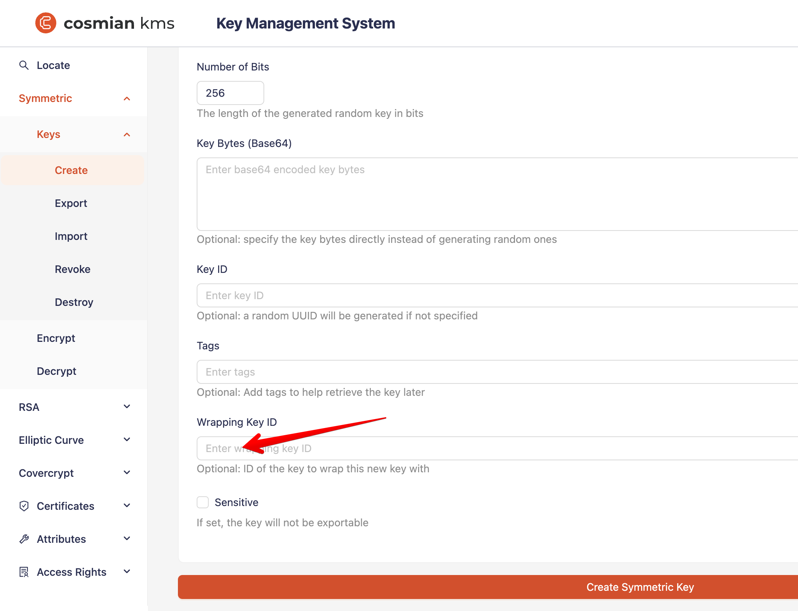

In addition to managing its keys, Cosmian KMS can act as a proxy to an HSM, storing and managing keys within the HSM.

[TOC]

## HSM keys

HSM keys are prefixed keys. They are created with a unique identifier that is prefixed by the `hsm` keyword and the
slot number in the form:

```shell
hsm::<slot_number>::<key_identifier>
```

For instance, the key `hsm::1::mykey` is stored in the HSM slot 1 with the identifier `mykey`. Technically, the identifier
is stored in the `LABEL` field of the key object in the HSM.

!!! warning Labels must be unique within a slot
    The PKCS#11 standard does **not** enforce label uniqueness: multiple key objects can share the same `LABEL`
    in the same slot. Cosmian KMS however uses the label as the sole key identifier within a slot, so it requires
    labels to be **unique per slot per key type**. If two objects of the same type share a label in the same slot,
    Cosmian KMS will return an error when that label is referenced. Always verify that no existing object already
    uses a label before creating a new key with `pkcs11-tool --list-objects`.

!!! info CKA_ID is automatically set by Cosmian KMS
    Cosmian KMS sets both `CKA_LABEL` and `CKA_ID` (to the same bytes as the label) on every key it creates in
    the HSM.  This conforms to PKCS#11 v2.40 and prevents spurious warnings from tools such as
    `pkcs11-tool --list-objects`.  Keys provisioned externally (via `pkcs11-tool` or the HSM vendor software)
    should also have `CKA_ID` set to match the label bytes if they are intended to be used with Cosmian KMS.

Non-prefixed keys are considered KMS keys and are stored in the KMS database.

## HSM admin

The KMS server maintains a list of **HSM admin** users that are allowed to create and destroy
objects directly in the HSM. This is configured with the `hsm_admin` key in `kms.toml`:

```toml
# One or more KMS usernames with HSM admin privileges
hsm_admin = ["alice@example.com", "bob@example.com"]

# Wildcard: any authenticated user becomes an HSM admin
hsm_admin = ["*"]
```

From the command line, pass one `--hsm-admin` flag per username (or a single comma-separated value):

```shell
# Two explicit admins
cosmian_kms --hsm-admin alice@example.com --hsm-admin bob@example.com ...

# Or via environment variable
KMS_HSM_ADMIN=alice@example.com,bob@example.com cosmian_kms ...
```

!!! note Authorization of HSM keys is still managed by the KMS
    Although key material is stored in the HSM, the KMS continues to enforce the standard
    ownership and access-rights model for all other operations (`Encrypt`, `Decrypt`, `Get`, etc.).
    An HSM admin can therefore `grant` these operations to ordinary users, who can then use the
    HSM key without themselves being HSM admins.
    See [HSM keys and authorization](../configuration/authorization.md#hsm-keys-and-authorization) for details.

## Creating a KMS key wrapped by an HSM key

KMS Keys can be created wrapped by an HSM key, either manually or automatically.

### Manually using the CLI

To create a KMS key wrapped by an HSM key, the `--wrapping-key-id` argument must be used to specify the unique
identifier of the HSM key.

The user creating the key must be the HSM admin (see above) or have been granted the `Encrypt` operation on the HSM key.

!!! note Server-level `key_encryption_key` is accessible to all users
    When the server is configured with a `key_encryption_key` (see [Automatically using the server configuration](#automatically-using-the-server-configuration)),
    that KEK is a shared server resource and can be used as a wrapping key by **any authenticated user**, not just
    the HSM admin.  This allows non-admin users to create their own KMS keys wrapped by the server KEK.

For instance, the following command creates a 256-bit AES key wrapped by the HSM RSA (public) key
`hsm::4::my_rsa_key_pk`:

```shell
> ckms sym keys create --algorithm aes --number-of-bits 256 --sensitive \
  --wrapping-key-id hsm::4::my_rsa_key_pk my_sym_key
The symmetric key was successfully generated.
      Unique identifier: my_sym_key
```

The symmetric key is now stored in the database encrypted (wrapped) by the HSM key. The encryption happened in the HSM.

### Manually using the Web UI

In the web UI, fill in the `Wrapping Key ID` field with the unique identifier of the HSM key.


### Automatically using the server configuration

The KMS server can automatically wrap all KMS keys with a specific HSM key.
This is done by setting the `key_encryption_key` property in the TOML server configuration file
or using the corresponding command line switch.

When `key_encryption_key` is configured, all newly created and imported keys will be automatically wrapped
by the specified Key Encryption Key (KEK), typically an HSM key. Keys are stored wrapped in the KMS database,
ensuring no clear-text key material is persisted.

The server provides **selective automatic unwrapping** through the `default_unwrap_type` configuration parameter.
This controls which KMIP object types are automatically unwrapped when retrieved via Get or Export operations:

- Valid values: `["PrivateKey", "PublicKey", "SymmetricKey", "SecretData"]`
- Default: `[]` (no automatic unwrapping)
- When a `key_encryption_key` is set, it's common to configure `default_unwrap_type = ["SymmetricKey", "SecretData"]`

**Example configuration:**

```toml
# Force all keys to be wrapped by an HSM key
key_encryption_key = "hsm::4::master_kek"

# Automatically unwrap symmetric keys and secret data when retrieved
default_unwrap_type = ["SymmetricKey", "SecretData"]
```

When an object matching the configured types is retrieved, it is automatically unwrapped and cached
in the server's memory cache (see [The Unwrapped Objects Cache](#the-unwrapped-objects-cache)).
This enables transparent encryption/decryption operations without storing clear-text keys in the database
while minimizing HSM calls through expiring caching.

## Using the wrapped KMS key

The symmetric key created above can now be used to encrypt and decrypt data, and the KMS will transparently unwrap the
key using the HSM key.

This unwrapping will happen once, and the unwrapped symmetric key will be cached in memory for later operations; no
clear-text symmetric key will be stored in the KMS database.

### Small data: encrypting server-side

For example, to encrypt a message with the key `my_sym_key` server-side, the following command can be used:

```shell
> ckms sym encrypt --key-id my_sym_key /tmp/secret.txt
The encrypted file is available at "/tmp/secret.enc"
```

To decrypt a message with the key `my_sym_key`, the following command can be used:

```shell
> ckms sym decrypt --key-id my_sym_key --output-file /tmp/secret.recovered.txt /tmp/secret.enc
The decrypted file is available at "/tmp/secret.recovered.txt"
```

#### Large data: encrypting client side with key wrapping

To encrypt a large file with the key `my_sym_key` client side, the following command can be used:

```shell
>ckms sym encrypt --key-id my_sym_key_2 --data-encryption-algorithm aes-gcm \
--key-encryption-algorithm rfc5649 /tmp/large.bin
The encrypted file is available at "/tmp/large.enc"
```

In this case, an ephemeral symmetric key (the Data Encryption Key, DEK) is generated and used to encrypt the data.
The DEK is then encrypted/wrapped with RFC4659 (a.k.a NIST AES Key Wrap) with the key `my_sym_key`,
called the Key Encryption Key, KEK.
The wrapping of the DEK by the KEK is stored at the beginning of the encrypted file.
At rest, in the KMS database, `my_sym_key` is stored encrypted/wrapped with the HSM key `hsm::4::my_rsa_key_pk`.

To decrypt a large file with the KEK `my_sym_key` client side, the following command can be used:

```shell
> ckms sym decrypt --key-id my_sym_key_2 --data-encryption-algorithm aes-gcm \
  --key-encryption-algorithm rfc5649 --output-file /tmp/large.recovered.bin /tmp/large.enc
The decrypted file is available at "/tmp/large.recovered.bin"
```

### Unwrapping a KMS-wrapped key from a file

If a KMS key was exported in wrapped KMIP JSON TTLV format (for example, via `ckms sym keys export` without `--unwrap`),
it can later be unwrapped using `ckms sym keys unwrap`.

When the unwrapping key is an HSM key (identified by the `hsm::` prefix), the KMS performs the unwrap
**server-side** using its crypto oracle: the wrapped file is imported to the KMS with `key_wrap_type=NotWrapped`,
the server decrypts it using the HSM key, and the result is exported back to the output file.
This is transparent to the caller and works even when the HSM key is marked `sensitive` (non-extractable).

```shell
# Export a wrapped DEK to disk
ckms sym keys export --key-id my_sym_key /tmp/my_sym_key_wrapped.json

# Unwrap it using the HSM KEK — the KMS handles the decryption server-side
ckms sym keys unwrap --unwrap-key-id hsm::4::master_kek \
  /tmp/my_sym_key_wrapped.json /tmp/my_sym_key_unwrapped.json
```

## The Unwrapped Objects Cache

The unwrapped cache is a memory cache, and it is not persistent. The unwrapped cache is used to store unwrapped objects
that are fetched from the database.

When a wrapped object is fetched from the database, it is unwrapped and stored in the unwrapped cache.
Further calls to the same object will use the unwrapped object from the cache until the cache expires.

The time in minutes after an unused object is evicted from the cache is configurable
using the `unwrapped_cache_max_age` setting. The default is 15 minutes.

When HSM keys wrap objects, a long expiration time reduces the number of calls made to the HSM to unwrap the object.
However, increasing the cache time will increase the memory the KMS server uses and expose the key in clear text
in the memory for a longer time.

## HSM KMIP operations

Some KMIP operations can be performed directly via the KMS server API on the HSM keys.

### Create

Create a new key in the HSM. The key unique must be provided on the request and must follow the
`hsm::<slot_number>::<key_identifier>` format described above.
Only HSM admin users can create keys directly in the HSM (see [HSM admin](#hsm-admin) above).

RSA and AES keys are supported.

When creating an RSA key, the `key_identifier` will be that of the private key. The corresponding public key will be
automatically created and stored in the HSM with the same `key_identifier` but with the `_pk` suffix, for example,
the public key of the `hsm::1::mykey` private key will be created with a unique identifier `hsm::1::mykey_pk`.

Create an RSA 4096-bit key on the HSM slot 4, with the KMS CLI:

```shell
❯ ckms rsa keys create --size_in_bits 4096 --sensitive hsm::4::my_rsa_key
The RSA key pair has been created.
      Public key unique identifier: hsm::4::my_rsa_key_pk
      Private key unique identifier: hsm::4::my_rsa_key
```

Create an AES 256-bit key on HSM slot 4, with the KMS CLI:

```shell
❯ ckms sym keys create --algorithm aes --number-of-bits 256 --sensitive hsm::4::my_aes_key
The symmetric key was successfully generated.
   Unique identifier: hsm::4::my_aes_key
```

Keys should be flagged as `sensitive` when created in the HSM, so that the private key or symmetric key cannot be
exported (see below `Get` and `Export`).

Note: HSM keys do not support object tagging in this release.

#### Using pkcs11-tool directly

Keys can also be provisioned directly in the HSM with `pkcs11-tool` (part of OpenSC), bypassing the Cosmian KMS
entirely. This is useful for pre-provisioning a master KEK before the KMS server starts, or for HSM models where
the Cosmian PKCS#11 integration does not yet support key generation.

The `LABEL` set with `--label` becomes the `<key_identifier>` part of the Cosmian KMS unique identifier
`hsm::<slot_number>::<label>`.

##### Step 1 — List available slots

```shell
pkcs11-tool --module /tw/oemDist/libnethsmpkcs11.so --list-slots
```

##### Step 2 — Create an AES key

`--key-type AES:<bytes>` — size in **bytes** (16 = 128-bit, 24 = 192-bit, 32 = 256-bit).

```shell
# AES-128 key on slot 1, label "master_kek"
pkcs11-tool --module /tw/oemDist/libnethsmpkcs11.so \
  --slot 1 \
  --key-type AES:16 \
  --keygen \
  --label master_kek

# AES-256 key on slot 1, label "data_kek"
pkcs11-tool --module /tw/oemDist/libnethsmpkcs11.so \
  --slot 1 \
  --key-type AES:32 \
  --keygen \
  --label data_kek
```

If the slot requires a PIN, add `--login --pin <PIN>` (or `--login` alone to be prompted interactively):

```shell
pkcs11-tool --module /tw/oemDist/libnethsmpkcs11.so \
  --slot 1 \
  --login --pin 1234 \
  --key-type AES:32 \
  --keygen \
  --label data_kek
```

##### Step 3 — Create an RSA key pair

```shell
# RSA-4096 key pair on slot 4, label "my_rsa_key"
pkcs11-tool --module /tw/oemDist/libnethsmpkcs11.so \
  --slot 4 \
  --login --pin 1234 \
  --key-type RSA:4096 \
  --keypairgen \
  --label my_rsa_key
```

The private key label becomes `hsm::4::my_rsa_key` in Cosmian KMS. For RSA key pairs, Cosmian KMS
appends `_pk` to the label to build the public key identifier: `hsm::4::my_rsa_key_pk`.

##### Step 4 — Verify the objects are visible

Always check for existing objects with the same label before creating a new key — Cosmian KMS requires
labels to be unique within a slot and key type:

```shell
pkcs11-tool --module /tw/oemDist/libnethsmpkcs11.so \
  --slot 1 \
  --list-objects
```

The AES key created above will then be addressable in Cosmian KMS as `hsm::1::master_kek`
and can immediately be used as a KEK:

```toml
# kms.toml
key_encryption_key = "hsm::1::master_kek"
```

### Destroy

Unlike KMS keys, HSM keys must not be revoked before being destroyed. The `Destroy` operation will remove the
key from the HSM.

Only HSM admin users, or a user granted the `Destroy` operation by an HSM admin, can destroy keys in the HSM.

To destroy the key `hsm::4::my_rsa_key`, the following command can be used:

```shell
❯ ckms rsa keys destroy --key-id hsm::4::my_rsa_key
Successfully destroyed the key.
      Unique identifier: hsm::4::mykey
```

To destroy the corresponding public key `hsm::4::my_rsa_key_pk`, the following command can be used:

```shell
❯ ckms rsa keys destroy --key-id hsm::4::my_rsa_key_pk
Successfully destroyed the object.
   Unique identifier: hsm::4::my_rsa_key_pk
```

### Get - Export

The `Get` and `Export` operations are used to retrieve the key material from the HSM.
Only HSM admin users, or a user granted the `Get` operation by an HSM admin, can retrieve keys from the HSM.

Private or symmetric keys marked as `sensitive` cannot be retrieved from the HSM.
The public key of a key pair can always be retrieved.

To export the public key `hsm::4::my_rsa_key_pk` in PKCS#8 PEM format, the following command can be used:

```shell
❯ ckms rsa keys export --key-id hsm::4::my_rsa_key_pk --key-format pkcs8-pem /tmp/pubkey.pem
The key hsm::4::my_rsa_key_pk of type PublicKey was exported to "/tmp/pubkey.pem"
   Unique identifier: hsm::4::my_rsa_key_pk
```

To export the private key `hsm::4::mykey` in PKCS#8 PEM format, the following command can be used:

```shell
❯ ckms rsa keys export --key-id hsm::4::my_rsa_key --key-format pkcs8-pem /tmp/privkey.pem
The key hsm::4::my_rsa_key of type PrivateKey was exported to "/tmp/privkey.pem"
   Unique identifier: hsm::4::my_rsa_key
```

To export the symmetric key `hsm::4::my_aes_key` in raw format (i.e., raw bytes),
the following command can be used:

```shell
❯ ckms sym keys export --key-id hsm::4::my_aes_key --key-format raw /tmp/symkey.raw
The key hsm::4::my_aes_key of type SymmetricKey was exported to "/tmp/symkey.raw"
   Unique identifier: hsm::4::my_aes_key
```

### Encrypt

Symmetric keys and public keys can be used to encrypt data. Only HSM admin users, or a user granted the `Encrypt`
operation by an HSM admin, can encrypt data with keys stored in the HSM.

For symmetric keys, only AES GCM is supported. CKM_RSA_PKCS_OAEP and the now-deprecated, but still widely
used, CKM_RSA_PKCS (v1.5) are supported for RSA keys. The hashing algorithm is fixed to SHA256.

When using RSA, the maximum message size in bytes is:

- PKCS#1 v1.5: (key size in bits / 8) - 11
- OAEP: (key size in bits / 8) - 66

To encrypt a message with the public key `hsm::4::my_rsa_key_pk` and the CKM RSA PKCS OAEP algorithm, the following
command can be used:

```shell
❯ ckms rsa encrypt --key-id hsm::4::my_rsa_key_pk --encryption-algorithm ckm-rsa-pkcs-oaep \
/tmp/secret.txt
The encrypted file is available at "/tmp/secret.enc"
```

To encrypt a message using AES GCM with the symmetric key `hsm::4::my_aes_key`, the following command can be used:

```shell
❯ ckms sym encrypt --key-id hsm::4::my_aes_key --data-encryption-algorithm aes-gcm /tmp/secret.txt
The encrypted file is available at "/tmp/secret.enc"
```

### Decrypt

Symmetric keys and private keys can be used to decrypt data. Only HSM admin users, or a user granted the `Decrypt`
operation by an HSM admin, can decrypt data with keys stored in the HSM.

For symmetric keys, only AES GCM is supported. CKM_RSA_PKCS_OAEP and the now-deprecated, but still widely
used, CKM_RSA_PKCS (v1.5) are supported for RSA keys. The hashing algorithm is fixed to SHA256.

To decrypt a message with the private key
key `hsm::4::hsm::4::my_rsa_key` and the CKM RSA PKCS OAEP algorithm, the following command can be used:

```shell
❯ ckms rsa decrypt --key-id hsm::4::my_rsa_key --encryption-algorithm ckm-rsa-pkcs-oaep \
  --output-file /tmp/secret.recovered.txt /tmp/secret.enc
The decrypted file is available at "/tmp/secret.plain"
```

To decrypt a message using AES GCM with the symmetric key `hsm::4::my_aes_key`, the following command can be used:

```shell
> ckms sym decrypt --key-id hsm::4::my_aes_key --data-encryption-algorithm aes-gcm \
  --output-file /tmp/secret.recovered.txt /tmp/secret.enc
The decrypted file is available at "/tmp/secret.recovered.txt"
```
