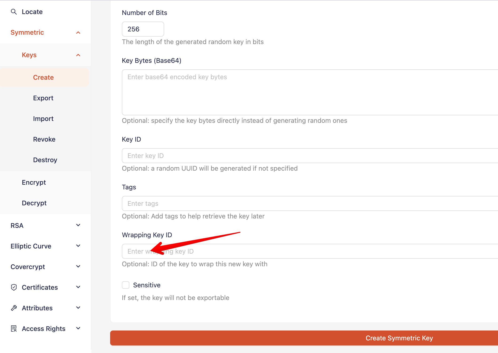

# HSM keys & operations

In addition to managing its keys, Eviden KMS can act as a proxy to an HSM, storing and managing keys within the HSM.

## HSM keys

HSM keys are prefixed keys. They are created with a unique identifier that is prefixed by the `hsm` keyword and the
slot number in the form:

```shell
hsm::<slot_number>::<key_identifier>
```

For instance, the key `hsm::1::mykey` is stored in the HSM slot 1 with the identifier `mykey`. Technically, the identifier
is stored in the `LABEL` field of the key object in the HSM.

!!! warning Labels must be unique within a slot
    The PKCS#11 standard does **not** enforce label uniqueness: multiple key objects can share the same `LABEL`
    in the same slot. Eviden KMS however uses the label as the sole key identifier within a slot, so it requires
    labels to be **unique per slot per key type**. If two objects of the same type share a label in the same slot,
    Eviden KMS will return an error when that label is referenced. Always verify that no existing object already
    uses a label before creating a new key with `pkcs11-tool --list-objects`.

!!! info CKA_ID is automatically set by Eviden KMS
    Eviden KMS sets both `CKA_LABEL` and `CKA_ID` (to the same bytes as the label) on every key it creates in
    the HSM.  This conforms to PKCS#11 v2.40 and prevents spurious warnings from tools such as
    `pkcs11-tool --list-objects`.  Keys provisioned externally (via `pkcs11-tool` or the HSM vendor software)
    should also have `CKA_ID` set to match the label bytes if they are intended to be used with Eviden KMS.

Non-prefixed keys are considered KMS keys and are stored in the KMS database.

## HSM admin

The KMS server maintains a list of **HSM admin** users that are allowed to create and destroy
objects directly in the HSM. This is configured with the `hsm_admin` key in `kms.toml`:

```toml
# One or more KMS usernames with HSM admin privileges
hsm_admin = ["alice@example.com", "bob@example.com"]

# Wildcard: any authenticated user becomes an HSM admin
hsm_admin = ["*"]
```

From the command line, pass one `--hsm-admin` flag per username (or a single comma-separated value):

```shell
# Two explicit admins
cosmian_kms --hsm-admin alice@example.com --hsm-admin bob@example.com ...

# Or via environment variable
KMS_HSM_ADMIN=alice@example.com,bob@example.com cosmian_kms ...
```

!!! note Authorization of HSM keys is still managed by the KMS
    Although key material is stored in the HSM, the KMS continues to enforce the standard
    ownership and access-rights model for all other operations (`Encrypt`, `Decrypt`, `Get`, etc.).
    An HSM admin can therefore `grant` these operations to ordinary users, who can then use the
    HSM key without themselves being HSM admins.
    See [HSM keys and authorization](../configuration/authorization.md#hsm-keys-and-authorization) for details.

## HSM key authorization model

HSM keys follow a stricter permission model than regular KMS keys. The key principles are:

- **HSM admins** are the only users who can **create** and **destroy** HSM keys.
- **All HSM admins share ownership** of all HSM keys (any admin can grant, revoke, or destroy any HSM key).
- **Non-admin users** can only use HSM keys they have been **explicitly granted** operations on.
- The `Get` permission does **not** act as a wildcard for HSM keys — each operation must be granted individually.
- **Locate** only returns HSM keys the user is authorized to see (all keys for admins, granted keys for non-admins).
- The server **KEK** (Key Encryption Key) is a shared wrapping resource accessible to all users for wrapping/unwrapping, but direct cryptographic operations on the KEK itself require explicit grants.

### Operations by role

| Operation                                                       | HSM Admin         | Non-admin (granted)       | Non-admin (no grant) |
| --------------------------------------------------------------- | ----------------- | ------------------------- | -------------------- |
| Create / CreateKeyPair                                          | ✅                 | ❌                         | ❌                    |
| Destroy                                                         | ✅                 | ❌ (cannot be granted)     | ❌                    |
| Locate                                                          | All HSM keys      | Granted keys only         | None                 |
| Grant / Revoke (access rights)                                  | ✅ (any HSM key)   | ❌                         | ❌                    |
| Encrypt                                                         | ✅                 | ✅                         | ❌                    |
| Decrypt                                                         | ✅                 | ✅                         | ❌                    |
| Sign                                                            | ✅                 | ✅                         | ❌                    |
| SignatureVerify                                                 | ✅                 | ✅                         | ❌                    |
| MAC                                                             | ✅                 | ✅                         | ❌                    |
| Get / Export                                                    | ✅                 | ✅ (metadata if sensitive) | ❌                    |
| GetAttributes                                                   | ✅                 | ✅                         | ❌                    |
| SetAttribute / ModifyAttribute / AddAttribute / DeleteAttribute | ✅                 | ✅                         | ❌                    |
| Revoke (lifecycle state)                                        | ❌ (not supported) | ❌                         | ❌                    |

### Grantable operations on HSM keys

| Operation          | Can be granted? | Notes                                                    |
| ------------------ | --------------- | -------------------------------------------------------- |
| `encrypt`          | ✅               | Symmetric (AES) and asymmetric (RSA)                     |
| `decrypt`          | ✅               | Symmetric (AES) and asymmetric (RSA)                     |
| `sign`             | ✅               | RSA private keys only                                    |
| `signature_verify` | ✅               | RSA public keys only                                     |
| `mac`              | ✅               | Compute a Message Authentication Code using the HSM key  |
| `get`              | ✅               | Retrieve key material or metadata; also implies `export` |
| `export`           | ✅               | Export key; also implies `get`                           |
| `get_attributes`   | ✅               | Read KMS metadata                                        |
| `locate`           | ✅               | Search visibility for this key                           |
| `set_attribute`    | ✅               | Modify KMS metadata — does not access HSM hardware       |
| `modify_attribute` | ✅               | Modify KMS metadata — does not access HSM hardware       |
| `add_attribute`    | ✅               | Modify KMS metadata — does not access HSM hardware       |
| `delete_attribute` | ✅               | Modify KMS metadata — does not access HSM hardware       |
| `destroy`          | ❌               | Admin-only — irreversible hardware operation             |
| `revoke`           | ❌               | HSM keys do not support KMIP lifecycle state changes     |
| `create`           | ❌               | Admin-only — not a per-key grant                         |

!!! warning Get is not a wildcard for HSM keys
    Unlike regular KMS keys, granting `Get` on an HSM key does **not** implicitly grant all other operations.
    Each operation (`Encrypt`, `Decrypt`, `Sign`, etc.) must be granted individually.

## Creating a KMS key wrapped by an HSM key

KMS Keys can be created wrapped by an HSM key, either manually or automatically.

### Manually using the CLI

To create a KMS key wrapped by an HSM key, the `--wrapping-key-id` argument must be used to specify the unique
identifier of the HSM key.

The user creating the key must be the HSM admin (see above) or have been granted the `Encrypt` operation on the HSM key.

!!! note Server-level `key_encryption_key` is accessible to all users
    When the server is configured with a `key_encryption_key` (see [Automatically using the server configuration](#automatically-using-the-server-configuration)),
    that KEK is a shared server resource and can be used as a wrapping key by **any authenticated user**, not just
    the HSM admin.  This allows non-admin users to create their own KMS keys wrapped by the server KEK.

For instance, the following command creates a 256-bit AES key wrapped by the HSM RSA (public) key
`hsm::4::my_rsa_key_pk`:

```shell
> ckms sym keys create --algorithm aes --number-of-bits 256 --sensitive \
  --wrapping-key-id hsm::4::my_rsa_key_pk my_sym_key
The symmetric key was successfully generated.
      Unique identifier: my_sym_key
```

The symmetric key is now stored in the database encrypted (wrapped) by the HSM key. The encryption happened in the HSM.

### Manually using the Web UI

In the web UI, fill in the `Wrapping Key ID` field with the unique identifier of the HSM key.


### Automatically using the server configuration

The KMS server can automatically wrap all KMS keys with a specific HSM key.
This is done by setting the `key_encryption_key` property in the TOML server configuration file
or using the corresponding command line switch.

When `key_encryption_key` is configured, all newly created and imported keys will be automatically wrapped
by the specified Key Encryption Key (KEK), typically an HSM key. Keys are stored wrapped in the KMS database,
ensuring no clear-text key material is persisted.

The server provides **selective automatic unwrapping** through the `default_unwrap_type` configuration parameter.
This controls which KMIP object types are automatically unwrapped when retrieved via Get or Export operations:

- Valid values: `["PrivateKey", "PublicKey", "SymmetricKey", "SecretData"]`
- Default: `[]` (no automatic unwrapping)
- When a `key_encryption_key` is set, it's common to configure `default_unwrap_type = ["SymmetricKey", "SecretData"]`

**Example configuration:**

```toml
# Force all keys to be wrapped by an HSM key
key_encryption_key = "hsm::4::master_kek"

# Automatically unwrap symmetric keys and secret data when retrieved
default_unwrap_type = ["SymmetricKey", "SecretData"]
```

When an object matching the configured types is retrieved, it is automatically unwrapped and cached
in the server's memory cache (see [The Unwrapped Objects Cache](#the-unwrapped-objects-cache)).
This enables transparent encryption/decryption operations without storing clear-text keys in the database
while minimizing HSM calls through expiring caching.

## Using the wrapped KMS key

The symmetric key created above can now be used to encrypt and decrypt data, and the KMS will transparently unwrap the
key using the HSM key.

This unwrapping will happen once, and the unwrapped symmetric key will be cached in memory for later operations; no
clear-text symmetric key will be stored in the KMS database.

### Small data: encrypting server-side

For example, to encrypt a message with the key `my_sym_key` server-side, the following command can be used:

```shell
> ckms sym encrypt --key-id my_sym_key /tmp/secret.txt
The encrypted file is available at "/tmp/secret.enc"
```

To decrypt a message with the key `my_sym_key`, the following command can be used:

```shell
> ckms sym decrypt --key-id my_sym_key --output-file /tmp/secret.recovered.txt /tmp/secret.enc
The decrypted file is available at "/tmp/secret.recovered.txt"
```

#### Large data: encrypting client side with key wrapping

To encrypt a large file with the key `my_sym_key` client side, the following command can be used:

```shell
>ckms sym encrypt --key-id my_sym_key_2 --data-encryption-algorithm aes-gcm \
--key-encryption-algorithm rfc5649 /tmp/large.bin
The encrypted file is available at "/tmp/large.enc"
```

In this case, an ephemeral symmetric key (the Data Encryption Key, DEK) is generated and used to encrypt the data.
The DEK is then encrypted/wrapped with RFC4659 (a.k.a NIST AES Key Wrap) with the key `my_sym_key`,
called the Key Encryption Key, KEK.
The wrapping of the DEK by the KEK is stored at the beginning of the encrypted file.
At rest, in the KMS database, `my_sym_key` is stored encrypted/wrapped with the HSM key `hsm::4::my_rsa_key_pk`.

To decrypt a large file with the KEK `my_sym_key` client side, the following command can be used:

```shell
> ckms sym decrypt --key-id my_sym_key_2 --data-encryption-algorithm aes-gcm \
  --key-encryption-algorithm rfc5649 --output-file /tmp/large.recovered.bin /tmp/large.enc
The decrypted file is available at "/tmp/large.recovered.bin"
```

### Unwrapping a KMS-wrapped key from a file

If a KMS key was exported in wrapped KMIP JSON TTLV format (for example, via `ckms sym keys export` without `--unwrap`),
it can later be unwrapped using `ckms sym keys unwrap`.

When the unwrapping key is an HSM key (identified by the `hsm::` prefix), the KMS performs the unwrap
**server-side** using its crypto oracle: the wrapped file is imported to the KMS with `key_wrap_type=NotWrapped`,
the server decrypts it using the HSM key, and the result is exported back to the output file.
This is transparent to the caller and works even when the HSM key is marked `sensitive` (non-extractable).

```shell
# Export a wrapped DEK to disk
ckms sym keys export --key-id my_sym_key /tmp/my_sym_key_wrapped.json

# Unwrap it using the HSM KEK — the KMS handles the decryption server-side
ckms sym keys unwrap --unwrap-key-id hsm::4::master_kek \
  /tmp/my_sym_key_wrapped.json /tmp/my_sym_key_unwrapped.json
```

## The Unwrapped Objects Cache

The unwrapped cache is a memory cache, and it is not persistent. The unwrapped cache is used to store unwrapped objects
that are fetched from the database.

When a wrapped object is fetched from the database, it is unwrapped and stored in the unwrapped cache.
Further calls to the same object will use the unwrapped object from the cache until the cache expires.

The time in minutes after an unused object is evicted from the cache is configurable
using the `unwrapped_cache_max_age` setting. The default is 15 minutes.

When HSM keys wrap objects, a long expiration time reduces the number of calls made to the HSM to unwrap the object.
However, increasing the cache time will increase the memory the KMS server uses and expose the key in clear text
in the memory for a longer time.

## HSM KMIP operations

Some KMIP operations can be performed directly via the KMS server API on the HSM keys.

### Create

Create a new key in the HSM. The key unique must be provided on the request and must follow the
`hsm::<slot_number>::<key_identifier>` format described above.
Only HSM admin users can create keys directly in the HSM (see [HSM admin](#hsm-admin) above).

RSA and AES keys are supported.

When creating an RSA key, the `key_identifier` will be that of the private key. The corresponding public key will be
automatically created and stored in the HSM with the same `key_identifier` but with the `_pk` suffix, for example,
the public key of the `hsm::1::mykey` private key will be created with a unique identifier `hsm::1::mykey_pk`.

Create an RSA 4096-bit key on the HSM slot 4, with the KMS CLI:

```shell
❯ ckms rsa keys create --size_in_bits 4096 hsm::4::my_rsa_key
The RSA key pair has been created.
      Public key unique identifier: hsm::4::my_rsa_key_pk
      Private key unique identifier: hsm::4::my_rsa_key
```

Create an AES 256-bit key on HSM slot 4, with the KMS CLI:

```shell
❯ ckms sym keys create --algorithm aes --number-of-bits 256 hsm::4::my_aes_key
The symmetric key was successfully generated.
   Unique identifier: hsm::4::my_aes_key
```

!!! info HSM-delegated EC key generation
    Elliptic curve key pairs can also be created directly on the HSM, using the same `ec keys
    create` CLI command as for software keys. The FIPS-approved NIST curves supported by the HSM
    integration are P-256 (default), P-384, and P-521 — the same curves accepted by
    `--curve nist-p256/nist-p384/nist-p521`. With the `non-fips` build feature,
    Ed25519 and Ed448 (for `EdDSA` signing) and X25519 (for ECDH key agreement) are also
    supported — see [HSM-delegated `EdDSA` signing](#sign) below. X448 and the non-FIPS NIST
    curves (secp256k1, secp224k1) remain unsupported by the HSM delegation and are
    software-only.

Create an EC P-384 key pair on HSM slot 4, with the KMS CLI:

```shell
❯ ckms ec keys create --curve nist-p384 hsm::4::my_ec_key
The EC key pair has been created.
      Public key unique identifier: hsm::4::my_ec_key_pk
      Private key unique identifier: hsm::4::my_ec_key
```

HSM keys are always created with `CKA_SENSITIVE=true` (private/symmetric key material cannot be
exported). Pass `--sensitive false` explicitly only if you intentionally need an extractable key.

Note: HSM keys do not support object tagging in this release.

#### Using pkcs11-tool directly

Keys can also be provisioned directly in the HSM with `pkcs11-tool` (part of OpenSC), bypassing the Eviden KMS
entirely. This is useful for pre-provisioning a master KEK before the KMS server starts, or for HSM models where
the Eviden PKCS#11 integration does not yet support key generation.

The `LABEL` set with `--label` becomes the `<key_identifier>` part of the Eviden KMS unique identifier
`hsm::<slot_number>::<label>`.

##### Step 1 — List available slots

```shell
pkcs11-tool --module /tw/oemDist/libnethsmpkcs11.so --list-slots
```

##### Step 2 — Create an AES key

`--key-type AES:<bytes>` — size in **bytes** (16 = 128-bit, 24 = 192-bit, 32 = 256-bit).

```shell
# AES-128 key on slot 1, label "master_kek"
pkcs11-tool --module /tw/oemDist/libnethsmpkcs11.so \
  --slot 1 \
  --key-type AES:16 \
  --keygen \
  --label master_kek

# AES-256 key on slot 1, label "data_kek"
pkcs11-tool --module /tw/oemDist/libnethsmpkcs11.so \
  --slot 1 \
  --key-type AES:32 \
  --keygen \
  --label data_kek
```

If the slot requires a PIN, add `--login --pin <PIN>` (or `--login` alone to be prompted interactively):

```shell
pkcs11-tool --module /tw/oemDist/libnethsmpkcs11.so \
  --slot 1 \
  --login --pin 1234 \
  --key-type AES:32 \
  --keygen \
  --label data_kek
```

##### Step 3 — Create an RSA key pair

```shell
# RSA-4096 key pair on slot 4, label "my_rsa_key"
pkcs11-tool --module /tw/oemDist/libnethsmpkcs11.so \
  --slot 4 \
  --login --pin 1234 \
  --key-type RSA:4096 \
  --keypairgen \
  --label my_rsa_key
```

The private key label becomes `hsm::4::my_rsa_key` in Eviden KMS. For RSA key pairs, Eviden KMS
appends `_pk` to the label to build the public key identifier: `hsm::4::my_rsa_key_pk`.

##### Step 4 — Verify the objects are visible

Always check for existing objects with the same label before creating a new key — Eviden KMS requires
labels to be unique within a slot and key type:

```shell
pkcs11-tool --module /tw/oemDist/libnethsmpkcs11.so \
  --slot 1 \
  --list-objects
```

The AES key created above will then be addressable in Eviden KMS as `hsm::1::master_kek`
and can immediately be used as a KEK:

```toml
# kms.toml
key_encryption_key = "hsm::1::master_kek"
```

### Destroy

Unlike KMS keys, HSM keys must not be revoked before being destroyed. The `Destroy` operation will remove the
key from the HSM.

Only HSM admin users can destroy keys in the HSM. The `Destroy` operation cannot be delegated to non-admin users.

To destroy the key `hsm::4::my_rsa_key`, the following command can be used:

```shell
❯ ckms rsa keys destroy --key-id hsm::4::my_rsa_key
Successfully destroyed the key.
      Unique identifier: hsm::4::mykey
```

To destroy the corresponding public key `hsm::4::my_rsa_key_pk`, the following command can be used:

```shell
❯ ckms rsa keys destroy --key-id hsm::4::my_rsa_key_pk
Successfully destroyed the object.
   Unique identifier: hsm::4::my_rsa_key_pk
```

### Get - Export

The `Get` and `Export` operations are used to retrieve the key material from the HSM.
Only HSM admin users, or a user granted the `Get` operation by an HSM admin, can retrieve keys from the HSM.

Private or symmetric keys marked as `sensitive` cannot be retrieved from the HSM.
The public key of a key pair can always be retrieved.

To export the public key `hsm::4::my_rsa_key_pk` in PKCS#8 PEM format, the following command can be used:

```shell
❯ ckms rsa keys export --key-id hsm::4::my_rsa_key_pk --key-format pkcs8-pem /tmp/pubkey.pem
The key hsm::4::my_rsa_key_pk of type PublicKey was exported to "/tmp/pubkey.pem"
   Unique identifier: hsm::4::my_rsa_key_pk
```

To export the private key `hsm::4::mykey` in PKCS#8 PEM format, the following command can be used:

```shell
❯ ckms rsa keys export --key-id hsm::4::my_rsa_key --key-format pkcs8-pem /tmp/privkey.pem
The key hsm::4::my_rsa_key of type PrivateKey was exported to "/tmp/privkey.pem"
   Unique identifier: hsm::4::my_rsa_key
```

To export the symmetric key `hsm::4::my_aes_key` in raw format (i.e., raw bytes),
the following command can be used:

```shell
❯ ckms sym keys export --key-id hsm::4::my_aes_key --key-format raw /tmp/symkey.raw
The key hsm::4::my_aes_key of type SymmetricKey was exported to "/tmp/symkey.raw"
   Unique identifier: hsm::4::my_aes_key
```

### Encrypt

Symmetric keys and public keys can be used to encrypt data. Only HSM admin users, or a user granted the `Encrypt`
operation by an HSM admin, can encrypt data with keys stored in the HSM.

For symmetric keys, only AES GCM is supported. CKM_RSA_PKCS_OAEP and the now-deprecated, but still widely
used, CKM_RSA_PKCS (v1.5) are supported for RSA keys. The hashing algorithm is fixed to SHA256.

When using RSA, the maximum message size in bytes is:

- PKCS#1 v1.5: (key size in bits / 8) - 11
- OAEP: (key size in bits / 8) - 66

To encrypt a message with the public key `hsm::4::my_rsa_key_pk` and the CKM RSA PKCS OAEP algorithm, the following
command can be used:

```shell
❯ ckms rsa encrypt --key-id hsm::4::my_rsa_key_pk --encryption-algorithm ckm-rsa-pkcs-oaep \
/tmp/secret.txt
The encrypted file is available at "/tmp/secret.enc"
```

To encrypt a message using AES GCM with the symmetric key `hsm::4::my_aes_key`, the following command can be used:

```shell
❯ ckms sym encrypt --key-id hsm::4::my_aes_key --data-encryption-algorithm aes-gcm /tmp/secret.txt
The encrypted file is available at "/tmp/secret.enc"
```

### Decrypt

Symmetric keys and private keys can be used to decrypt data. Only HSM admin users, or a user granted the `Decrypt`
operation by an HSM admin, can decrypt data with keys stored in the HSM.

For symmetric keys, only AES GCM is supported. CKM_RSA_PKCS_OAEP and the now-deprecated, but still widely
used, CKM_RSA_PKCS (v1.5) are supported for RSA keys. The hashing algorithm is fixed to SHA256.

To decrypt a message with the private key
key `hsm::4::hsm::4::my_rsa_key` and the CKM RSA PKCS OAEP algorithm, the following command can be used:

```shell
❯ ckms rsa decrypt --key-id hsm::4::my_rsa_key --encryption-algorithm ckm-rsa-pkcs-oaep \
  --output-file /tmp/secret.recovered.txt /tmp/secret.enc
The decrypted file is available at "/tmp/secret.plain"
```

To decrypt a message using AES GCM with the symmetric key `hsm::4::my_aes_key`, the following command can be used:

```shell
> ckms sym decrypt --key-id hsm::4::my_aes_key --data-encryption-algorithm aes-gcm \
  --output-file /tmp/secret.recovered.txt /tmp/secret.enc
The decrypted file is available at "/tmp/secret.recovered.txt"
```

### Sign

RSA and EC private keys can be used to sign data. Only HSM admin users, or a user granted the
`Sign` operation by an HSM admin, can sign data with keys stored in the HSM.

Two families of RSA signing mechanisms are supported:

- **PKCS#1 v1.5** (`CKM_SHA{1,256,384,512}_RSA_PKCS`): deterministic, the classic RSA signature
  scheme.
- **RSASSA-PSS** (`CKM_SHA{256,384,512}_RSA_PKCS_PSS`): the probabilistic scheme recommended by
  current standards (e.g. FIPS 186-5, RFC 8017). The salt length defaults to the digest length in
  bytes (32 for SHA-256, 48 for SHA-384, 64 for SHA-512) and can be overridden via the KMIP
  `CryptographicParameters.salt_length` field; `salt_length: 0` produces a deterministic PSS
  signature.

The `ckms rsa sign` CLI command always uses RSASSA-PSS with SHA-256, matching the KMS software
signing path. To sign a file with the HSM-resident private key `hsm::4::my_rsa_key`, the following
command can be used:

```shell
❯ ckms rsa sign --key-id hsm::4::my_rsa_key -o /tmp/secret.sig /tmp/secret.txt
The signature is available at "/tmp/secret.sig"
```

!!! info HSM-delegated RSA-PSS signing
    RSA-PSS signing over HSM-resident keys is delegated end-to-end to the PKCS#11 device: the
    private key never leaves the HSM, and the PSS mechanism parameters (hash algorithm, MGF1
    hash algorithm, salt length) are built from the KMIP request and passed directly to
    `C_Sign` via `CK_RSA_PKCS_PSS_PARAMS`. When the KMIP request carries `digested_data`, the KMS
    uses raw `CKM_RSA_PKCS_PSS` so the supplied digest is signed directly; otherwise it uses the
    matching `CKM_SHA{256,384,512}_RSA_PKCS_PSS` mechanism. This is purely additive: existing
    PKCS#1 v1.5 and OAEP mechanisms, key types, and HSM vendor loaders are unaffected. See
    [ADR-2026-09-05](../adr/2026-09-05-hsm-track-a-rsa-pss-scope-decision.md) for the scope
    decision.

ECDSA signing over an HSM-resident EC private key uses the same `ec sign` CLI command as the
software signing path. The CLI now sends curve-appropriate KMIP `CryptographicParameters`
automatically (`P-256 → ECDSAWithSHA256`, `P-384 → ECDSAWithSHA384`, `P-521 → ECDSAWithSHA512`),
and the HSM path dispatches them to `C_Sign` with `CKM_ECDSA_SHA{256,384,512}`. When `--digested`
is used, the server switches to raw `CKM_ECDSA` so the supplied digest is signed directly instead
of being hashed a second time.

To sign a file with the HSM-resident EC private key `hsm::4::my_ec_key`, the following command
can be used:

```shell
❯ ckms ec sign --key-id hsm::4::my_ec_key -o /tmp/secret.sig /tmp/secret.txt
The signature is available at "/tmp/secret.sig"
```

!!! info HSM-delegated ECDSA signing
    ECDSA signing over HSM-resident EC keys is delegated end-to-end to the PKCS#11 device: the
    private key never leaves the HSM. PKCS#11 ECDSA signatures are the raw, fixed-length `r‖s`
    concatenation; the KMS converts this to the DER `SEQUENCE { r, s }` encoding expected
    elsewhere in the codebase before returning the signature. Depending on the HSM and mechanism
    implementation, ECDSA signatures may be randomized or deterministic (for example RFC 6979);
    both behaviors are valid as long as the returned signature verifies. This is purely additive:
    existing RSA signing mechanisms, key types, and HSM vendor loaders are unaffected. See
    [ADR-2026-09-06](../adr/2026-09-06-hsm-track-a-ec-ecdsa-completion-pbkdf2-deferral.md) for
    implementation details and the PBKDF2 deferral rationale (SoftHSM2, the only backend
    available for end-to-end validation in this environment, does not implement
    `CKM_PKCS5_PBKD2`).

`EdDSA` signing (Ed25519/Ed448) over an HSM-resident Edwards-curve private key is available with
the `non-fips` build feature, using the same `ec sign` CLI command as ECDSA above. Unlike ECDSA,
`EdDSA` is a pure, un-hashed signature scheme (RFC 8032): the raw message is passed directly to
`C_Sign` with `CKM_EDDSA`, with no digest step and no DER re-encoding.

```shell
❯ ckms ec keys create --curve ed25519 hsm::4::my_ed25519_key
The EC key pair has been created.
      Public key unique identifier: hsm::4::my_ed25519_key_pk
      Private key unique identifier: hsm::4::my_ed25519_key

❯ ckms ec sign --key-id hsm::4::my_ed25519_key -o /tmp/secret.sig /tmp/secret.txt
The signature is available at "/tmp/secret.sig"
```

!!! info HSM-delegated `EdDSA` signing (Ed25519/Ed448)
    `EdDSA` signing over HSM-resident Ed25519/Ed448 keys is delegated end-to-end to the PKCS#11
    device via `CKM_EC_EDWARDS_KEY_PAIR_GEN` (key generation) and `CKM_EDDSA` (signing). Unlike
    ECDSA, `EdDSA` is deterministic: signing the same data twice with the same key always
    produces the same signature. Gated behind the `non-fips` build feature, mirroring the
    existing software `EdDSA` gating in `crate::crypto::elliptic_curves::sign` — HKDF and SP
    800-108 KDF are NIST-approved and not affected by this flag. Validated live against a
    `SoftHSM2` 2.6.1 token. HSM-delegated X25519 key generation
    (`CKM_EC_MONTGOMERY_KEY_PAIR_GEN`) is also implemented, but X25519 ECDH key agreement
    (`DeriveKey`), HKDF/SP 800-108 key derivation, and message-based AEAD are **not yet**
    implemented — no PKCS#11 backend available in this environment (`SoftHSM2`, the Utimaco
    CryptoServer simulator) exposes the required mechanisms for end-to-end validation. This
    remains open, tracked on
    [issue #1157](https://github.com/Cosmian/kms/issues/1157).

## PKCS#11 protocol version compatibility

Eviden KMS talks to HSMs over Cryptoki (PKCS#11) **v2.40** on the consumer side (`crate/hsm/base_hsm`
and its vendor loaders: SoftHSM2, Utimaco, Proteccio, Crypt2Pay, SmartCard HSM). Every Cryptoki
function (`C_Initialize`, `C_GetInfo`, `C_Encrypt`, ...) is resolved by its stable C symbol name,
never through the PKCS#11 v3.0 "interfaces" discovery mechanism
(`C_GetInterfaceList`/`C_GetInterface`). This means any v2.40-compliant HSM library works out of
the box, and this behavior is unaffected regardless of whether the library also happens to support
v3.0.

!!! info Additive PKCS#11 v3 capability detection
    Eviden KMS uses the canonical v3 bindings supplied by `pkcs11-sys` to optionally detect
    whether the loaded PKCS#11 library exposes the v3
    interfaces discovery entry point (`C_GetInterfaceList`), without changing how any function is
    resolved or called. This is a **read-only capability probe** for diagnostics — a v2.40-only
    library simply does not export `C_GetInterfaceList`, so the probe reports "not
    supported" and nothing else changes; a v3-capable library additionally reports the list of
    interfaces it exposes (e.g. `"PKCS 11"`). See
    [ADR-2026-09-03](../adr/2026-09-03-pkcs11-v3-scope-decision-ffi-foundation.md) for the full
    scope decision and rationale.

### Supported operations and mechanisms

The tables below enumerate **every mechanism/operation category defined by the OASIS PKCS#11
v2.40 and v3.0 specifications** (Cryptoki mechanisms table, `PKCS11-Curr-v2.40` §12 and
`PKCS11-Curr-v3.0` §2/§6), and mark, per the actual source code, which are supported by:

- **KMS server** — Eviden KMS acting as a PKCS#11 **consumer**/client of a vendor HSM
  (`crate/hsm/base_hsm`), delegating KMIP operations to `C_*` calls against the loaded vendor
  library.
- **`cosmian_pkcs11`** — the `libcosmian_pkcs11` provider DLL (documented in full on the
  [PKCS#11 provider module](../integrations/pkcs11_provider.md) page), which exposes KMS-managed
  keys as a Cryptoki token to third-party applications — the opposite PKCS#11 role.

✅ supported · ⚠️ partially supported (see Notes) · ❌ not supported · ➖ not applicable to this role

#### Random number generation

| Function | Ver. | KMS server | `cosmian_pkcs11` | Notes |
|---|---|---|---|---|
| `C_GenerateRandom` | v2.40 | ✅ delegated to the HSM's own RNG | ✅ system CSPRNG (`rand::rng()`), not HSM-backed | — |
| `C_SeedRandom` | v2.40 | ➖ (HSM's own RNG is not re-seedable through `base_hsm`) | ❌ always returns `CKR_RANDOM_NO_RNG` | the provider's OS-backed CSPRNG does not accept caller seed material |

#### Object management — symmetric key generation (§6.31 v2.40, §2.3 v3.0)

| Mechanism | Ver. | KMS server: parameters | `cosmian_pkcs11` | Notes |
|---|---|---|---|---|
| `CKM_AES_KEY_GEN` | v2.40 | ✅ AES-128 or AES-256 (`CKA_VALUE_LEN` 16/32 bytes) | ❌ | provider: `C_GenerateKeyPair`/`C_GenerateKey` for secret keys stubbed except the `CKM_AES_KEY_GEN` mapping used internally by `C_GenerateKey`'s `KeyAlgorithm` conversion (keys are still created via KMIP `Create`, not through this provider's PKCS#11 surface) |
| `CKM_GENERIC_SECRET_KEY_GEN` | v3.0 | ✅ `CKK_GENERIC_SECRET`, arbitrary length (HKDF IKM) | ❌ | FIPS-eligible (not gated) |
| `CKM_DES_KEY_GEN`<br>`CKM_DES2_KEY_GEN`<br>`CKM_DES3_KEY_GEN` | v2.40 | ❌ | ❌ | not implemented (deprecated algorithm) |
| `CKM_RC2_KEY_GEN`<br>`CKM_RC4_KEY_GEN`<br>`CKM_RC5_KEY_GEN`<br>`CKM_CAST_KEY_GEN`<br>`CKM_CAST3_KEY_GEN`<br>`CKM_CAST128_KEY_GEN`<br>`CKM_IDEA_KEY_GEN`<br>`CKM_CDMF_KEY_GEN`<br>`CKM_BLOWFISH_KEY_GEN`<br>`CKM_CAMELLIA_KEY_GEN`<br>`CKM_SEED_KEY_GEN` | v2.40 | ❌ | ❌ | legacy/vendor ciphers, not implemented |
| `CKM_GOST28147_KEY_GEN` | v2.40 | ❌ | ❌ | not implemented (Russian GOST cryptosystem) |

#### Object management — asymmetric key-pair generation (§6.31 v2.40, §2.3 v3.0)

| Mechanism | Ver. | KMS server: parameters | `cosmian_pkcs11` | Notes |
|---|---|---|---|---|
| `CKM_RSA_PKCS_KEY_PAIR_GEN` | v2.40 | ✅ `CKA_MODULUS_BITS` ∈ {1024, 2048, 3072, 4096}, `CKA_PUBLIC_EXPONENT` fixed `0x010001` (65537) | ❌ | keys created via the KMIP `CreateKeyPair` API, then discovered by the provider |
| `CKM_RSA_X9_31_KEY_PAIR_GEN` | v2.40 | ❌ | ❌ | not implemented |
| `CKM_EC_KEY_PAIR_GEN` (NIST prime curves) | v2.40 | ✅ P-224/P-256/P-384/P-521, `CKA_EC_PARAMS` = DER `OBJECT IDENTIFIER` | ❌ (recognized for sign/verify only, see below) | secp256k1/secp224k1 (SECG Koblitz) explicitly **rejected** on the KMS side (`curve_from_der_oid`, issue #1157) |
| `CKM_DSA_KEY_PAIR_GEN`<br>`CKM_DSA_PARAMETER_GEN` | v2.40 | ❌ | ❌ | not implemented (deprecated algorithm) |
| `CKM_DH_PKCS_KEY_PAIR_GEN`<br>`CKM_DH_PKCS_PARAMETER_GEN` | v2.40 | ❌ | ❌ | not implemented (classic Diffie-Hellman) |
| `CKM_X9_42_DH_KEY_PAIR_GEN`<br>`CKM_X9_42_DH_PARAMETER_GEN` | v2.40 | ❌ | ❌ | not implemented |
| `CKM_GOST3410_KEY_PAIR_GEN` | v2.40 | ❌ | ❌ | not implemented (Russian GOST cryptosystem) |
| `CKM_EC_EDWARDS_KEY_PAIR_GEN` | v3.0 | ✅ Ed25519 (`non-fips`)/Ed448 (`non-fips`); `CKA_EC_PARAMS` encoded as a `PrintableString` curve name (empirically required by SoftHSM2 2.6.1, not the OID form) | ❌ | capability-gated: attempted best-effort, degrades gracefully if the loaded library lacks the mechanism |
| `CKM_EC_MONTGOMERY_KEY_PAIR_GEN` | v3.0 | ✅ X25519 (`non-fips`), `CKA_DERIVE` set instead of `CKA_SIGN`/`CKA_VERIFY` | ❌ | keygen only — `C_DeriveKey`/ECDH not yet wired ([#1157](https://github.com/Cosmian/kms/issues/1157)) |

#### Symmetric encryption and decryption (§6.3 v2.40, §5.20-5.21 v3.0)

| Mechanism | Ver. | KMS server: parameters | `cosmian_pkcs11`: parameters | Notes |
|---|---|---|---|---|
| `CKM_AES_GCM` | v2.40 | ✅ random 96-bit IV per call; **no AAD** (`ulAADLen` always 0); fixed 128-bit tag, `ciphertext‖tag` layout | ✅ caller-supplied IV 1–128 bytes; caller-supplied AAD 0–1 MiB; tag **must** be exactly 128 bits (rejected otherwise); `ciphertext‖tag` layout; single-shot only (`C_EncryptUpdate`/`C_EncryptFinal` multi-part stubbed) | provider AES-GCM is implemented in the KMS crypto backend, not delegated to a vendor HSM |
| `CKM_AES_CBC` | v2.40 | ✅ random 16-byte IV; software PKCS#7 padding applied before `C_Encrypt`; multi-round chaining above `max_cbc_data_size` | ✅ caller-supplied 16-byte IV, unpadded | — |
| `CKM_AES_CBC_PAD` | v2.40 | ❌ (padding done in software, see above) | ✅ caller-supplied 16-byte IV, native PKCS#7 padding | — |
| `CKM_AES_ECB`<br>`CKM_AES_CTR`<br>`CKM_AES_CFB{8,64,128}`<br>`CKM_AES_OFB`<br>`CKM_AES_CCM`<br>`CKM_AES_CTS` | v2.40 | ❌ | ❌ | not implemented |
| `CKM_DES_ECB`<br>`CKM_DES_CBC`<br>`CKM_DES_CBC_PAD`<br>`CKM_DES3_ECB`<br>`CKM_DES3_CBC`<br>`CKM_DES3_CBC_PAD`<br>`CKM_DES_CFB{8,64}`<br>`CKM_DES_OFB64` | v2.40 | ❌ | ❌ | not implemented (deprecated algorithm) |
| `CKM_RC2_*`<br>`CKM_RC4`<br>`CKM_RC5_*`<br>`CKM_CAST_*`<br>`CKM_CAST3_*`<br>`CKM_CAST128_*`<br>`CKM_IDEA_*`<br>`CKM_CDMF_*`<br>`CKM_BLOWFISH_CBC`<br>`CKM_CAMELLIA_*`<br>`CKM_SEED_*`<br>`CKM_GOST28147_ECB`<br>`CKM_GOST28147` | v2.40 | ❌ | ❌ | legacy/vendor ciphers, not implemented |

#### Asymmetric encryption and decryption (§6.4 v2.40)

| Mechanism | Ver. | KMS server: parameters | `cosmian_pkcs11` | Notes |
|---|---|---|---|---|
| `CKM_RSA_PKCS` | v2.40 | ✅ RSA PKCS#1 v1.5 encrypt/decrypt, no parameters | ❌ (sign/verify only, see below) | — |
| `CKM_RSA_PKCS_OAEP` | v2.40 | ✅ SHA-1/MGF1-SHA1 or SHA-256/MGF1-SHA256 (`CK_RSA_PKCS_OAEP_PARAMS`, empty source data); also used via `C_WrapKey`/`C_UnwrapKey` to wrap AES KEKs | ❌ | not implemented on the provider side |
| `CKM_RSA_X_509` (raw RSA) | v2.40 | ❌ | ❌ | not implemented |

#### Signatures and MACs (§6.4-6.5 v2.40, §2.3.9 v3.0)

| Mechanism | Ver. | KMS server: algorithm & parameters | `cosmian_pkcs11`: algorithm & parameters | Notes |
|---|---|---|---|---|
| `CKM_RSA_PKCS` (raw) | v2.40 | ✅ RSA PKCS#1 v1.5 over a caller-supplied `DigestInfo` (SHA-1/256/384/512 OID prefix) | ✅ raw PKCS#1 v1.5 | — |
| `CKM_SHA{1,256,384,512}_RSA_PKCS` | v2.40 | ✅ RSA PKCS#1 v1.5, hash computed by the HSM | ✅ same 4 hashes | `CKM_SHA224_RSA_PKCS`/`CKM_MD5_RSA_PKCS` not implemented on either side |
| `CKM_RSA_PKCS_PSS` | v2.40 | ✅ hash ∈ {SHA-256, SHA-384, SHA-512}, independent MGF1 hash, explicit salt length (`CK_RSA_PKCS_PSS_PARAMS`) | ✅ hash & MGF1 ∈ {SHA-1, SHA-224, SHA-256, SHA-384, SHA-512} (any combination), explicit salt length; operates on a **pre-hashed** digest per §6.4.7 | — |
| `CKM_SHA{256,384,512}_RSA_PKCS_PSS` | v2.40 | ✅ combined hash-then-PSS-sign in one call | ➖ (provider always uses the pre-hashed `CKM_RSA_PKCS_PSS` form) | — |
| `CKM_RSA_X_509` (raw sign/verify) / `CKM_RSA_9796` | v2.40 | ❌ | ❌ | not implemented |
| `CKM_ECDSA` (raw digest) | v2.40 | ✅ NIST P-256/P-384/P-521, raw `r‖s` re-encoded to DER `ECDSA-Sig-Value` | ✅ NIST P-256/P-384/P-521 + secp256k1 (non-FIPS) | KMS: secp256k1 explicitly rejected; provider: usable for sign/verify against KMS-generated secp256k1 keys |
| `CKM_ECDSA_SHA{1,224,256,384,512}` | v2.40 | ✅ (SHA-256/384/512 only) hash-then-sign in one call | ❌ (provider hashes client-side, then uses raw `CKM_ECDSA`) | — |
| `CKM_DSA`<br>`CKM_DSA_SHA{1,224,256,384,512}` | v2.40 | ❌ | ❌ | not implemented (deprecated algorithm) |
| `CKM_MD2_HMAC`<br>`CKM_MD5_HMAC`<br>`CKM_SHA_1_HMAC`<br>`CKM_SHA224_HMAC`<br>`CKM_SHA256_HMAC`<br>`CKM_SHA384_HMAC`<br>`CKM_SHA512_HMAC` | v2.40 | ❌ | ❌ | not implemented |
| `CKM_AES_CMAC`<br>`CKM_AES_CMAC_GENERAL`<br>`CKM_DES3_CMAC`<br>`CKM_DES3_CMAC_GENERAL` | v2.40 | ❌ | ❌ | not implemented |
| `CKM_GOST3410_WITH_GOSTR3411` | v2.40 | ❌ | ❌ | not implemented (Russian GOST cryptosystem) |
| `CKM_EDDSA` | v3.0 | ✅ Ed25519/Ed448 (`non-fips`), pure un-hashed signing (RFC 8032); `pParameter` omitted (`NULL`) to select plain `Ed25519`, not `Ed25519ctx` | ✅ Ed25519/Ed448, same pure un-hashed convention | capability-gated on the KMS side |
| `C_MessageSignInit`<br>`C_SignMessage`<br>`C_MessageSignFinal` | v3.0 | ➖ | ✅ EdDSA (Ed25519/Ed448) only | provider-only concept (message-based split flow); not applicable to the KMS-as-consumer role |
| `C_MessageVerifyInit`<br>`C_VerifyMessage`<br>`C_MessageVerifyFinal` | v3.0 | ➖ | ❌ | present in the v3.0 function list but stubbed on the provider side |

#### Message digesting (§6.2 v2.40, §2.1 v3.0)

| Mechanism | Ver. | KMS server | `cosmian_pkcs11` | Notes |
|---|---|---|---|---|
| `C_Digest` with `CKM_MD2`<br>`CKM_MD5`<br>`CKM_SHA_1`<br>`CKM_SHA224`<br>`CKM_SHA256`<br>`CKM_SHA384`<br>`CKM_SHA512`<br>`CKM_SHA512_224`<br>`CKM_SHA512_256`<br>`CKM_RIPEMD128`<br>`CKM_RIPEMD160` (standalone) | v2.40 | ❌ | ❌ stubbed (`C_Digest` family) | hash mechanisms are used internally only, as parameters to RSA-OAEP/PSS and "hash-and-sign" mechanisms; no standalone digest operation is exposed on either side |
| `CKM_SHA3_224`<br>`CKM_SHA3_256`<br>`CKM_SHA3_384`<br>`CKM_SHA3_512`<br>`CKM_SHAKE_128`<br>`CKM_SHAKE_256` | v3.0 | ❌ | ❌ | not implemented |
| `CKM_GOSTR3411` | v2.40 | ❌ | ❌ | not implemented (Russian GOST hash) |

#### Key derivation (§6.30 v2.40, §2.5 v3.0)

| Mechanism | Ver. | KMS server: parameters | `cosmian_pkcs11` | Notes |
|---|---|---|---|---|
| `CKM_HKDF_DERIVE`<br>`CKM_HKDF_DATA` | v3.0 | ⚠️ HKDF-Extract-and-Expand, PRF hash ∈ {SHA-256, SHA-384, SHA-512}, optional salt (`CK_HKDF_PARAMS`), base key must be `CKK_GENERIC_SECRET` — implemented in `base_hsm` (`derive_hkdf_key`), not yet KMIP-reachable ([#1182](https://github.com/Cosmian/kms/issues/1182)) | ❌ | provider: `C_DeriveKey` stubbed |
| `CKM_ECDH1_DERIVE`<br>`CKM_ECDH1_COFACTOR_DERIVE`<br>`CKM_ECMQV_DERIVE` | v2.40/v3.0 | ❌ (X25519 keygen exists but ECDH derive is not wired) | ❌ | not implemented on either side |
| `CKM_DH_PKCS_DERIVE`<br>`CKM_X9_42_DH_DERIVE`<br>`CKM_X9_42_DH_HYBRID_DERIVE`<br>`CKM_X9_42_MQV_DERIVE` | v2.40 | ❌ | ❌ | not implemented |
| `CKM_SSL3_MASTER_KEY_DERIVE`<br>`CKM_SSL3_KEY_AND_MAC_DERIVE`<br>`CKM_TLS_MASTER_KEY_DERIVE`<br>`CKM_TLS_KEY_AND_MAC_DERIVE`<br>`CKM_TLS12_MASTER_KEY_DERIVE`<br>`CKM_TLS12_KEY_AND_MAC_DERIVE`<br>`CKM_TLS_KDF` | v2.40 | ❌ | ❌ | not implemented (TLS/SSL session-key derivation) |
| `CKM_CONCATENATE_BASE_AND_KEY`<br>`CKM_CONCATENATE_BASE_AND_DATA`<br>`CKM_CONCATENATE_DATA_AND_BASE`<br>`CKM_XOR_BASE_AND_DATA`<br>`CKM_EXTRACT_KEY_FROM_KEY`<br>`CKM_AES_CBC_ENCRYPT_DATA`<br>`CKM_DES3_CBC_ENCRYPT_DATA` | v2.40 | ❌ | ❌ | key-derivation utility mechanisms, not implemented |
| `CKM_PKCS5_PBKD2` | v2.40 | ❌ | ❌ | not implemented (password-based key derivation) |
| `CKM_SP800_108_COUNTER_KDF`<br>`_FEEDBACK_KDF`<br>`_DOUBLE_PIPELINE_KDF` | v3.0 | ❌ | ❌ | not implemented |

#### Key wrapping and unwrapping (§6.31 v2.40)

| Function | Ver. | KMS server: parameters | `cosmian_pkcs11` | Notes |
|---|---|---|---|---|
| `C_WrapKey`<br>`C_UnwrapKey` with `CKM_RSA_PKCS_OAEP` | v2.40 | ✅ RSA-OAEP wraps/unwraps an AES KEK (`wrap_aes_key_with_rsa_oaep`/`unwrap_aes_key_with_rsa_oaep`), SHA-1 or SHA-256 | ❌ stubbed | — |
| `C_WrapKey`<br>`C_UnwrapKey` with `CKM_RSA_PKCS`<br>`CKM_RSA_X_509` | v2.40 | ❌ | ❌ stubbed | not implemented |
| `C_WrapKey`<br>`C_UnwrapKey` with `CKM_AES_KEY_WRAP`<br>`CKM_AES_KEY_WRAP_PAD`<br>`CKM_AES_KEY_WRAP_KWP` | v2.40/v3.0 | ❌ | ❌ stubbed | not implemented |
| `C_WrapKey`<br>`C_UnwrapKey` with `CKM_DES3_ECB`<br>`CKM_DES3_CBC`/CMS wrap variants | v2.40 | ❌ | ❌ stubbed | not implemented |

#### Message-based dual-function encryption/decryption (§5.20-5.21 v3.0, additive to signatures table above)

| Function | Ver. | KMS server: parameters | `cosmian_pkcs11` | Notes |
|---|---|---|---|---|
| `C_MessageEncryptInit`<br>`C_EncryptMessage`<br>`C_MessageEncryptFinal` | v3.0 | ⚠️ AES-GCM, random 96-bit IV, **caller-supplied AAD supported** (unlike classic `CKM_AES_GCM` above), fixed 128-bit tag — implemented in `base_hsm`, not yet KMIP-reachable ([#1182](https://github.com/Cosmian/kms/issues/1182)) | ❌ | provider: `C_Message*` family present in the v3.0 function list but stubbed |
| `C_MessageDecryptInit`<br>`C_DecryptMessage`<br>`C_MessageDecryptFinal` | v3.0 | ⚠️ same as above | ❌ | same as above |

#### Session, object and interface management (v3.0 additions)

| Function | Ver. | KMS server | `cosmian_pkcs11` | Notes |
|---|---|---|---|---|
| `C_GetInterfaceList`<br>`C_GetInterface` | v3.0 | ➖ | ✅ | KMS: read-only capability *probe* only (see below), does not change how any function is resolved |
| `C_LoginUser` | v3.0 | ➖ | ✅ | real implementation on the provider side (not a stub) |
| `C_SessionCancel` | v3.0 | ➖ | ❌ | present in the v3.0 function list but stubbed |
| `C_FindObjects` on `CKO_PROFILE` | v3.0 | ➖ | ✅ | self-declares `CKP_BASELINE_PROVIDER`/`CKP_EXTENDED_PROVIDER`/`CKP_AUTHENTICATION_TOKEN`/`CKP_PUBLIC_CERTIFICATES_TOKEN` |
| `C_Login`<br>`C_Logout`<br>`C_FindObjects*`<br>`C_CreateObject`<br>`C_DestroyObject`<br>`C_GetAttributeValue`<br>`C_SetAttributeValue` | v2.40 | ➖ | ✅ | baseline session/object management |
| `C_CopyObject`, `C_GetObjectSize`, `C_GetOperationState`, `C_SetOperationState` | v2.40 | ➖ | ❌ | stubbed on the provider side |

### PKCS#11 v3.0 mechanisms (conditional, capability-gated)

Beyond the discovery probe above, `crate/hsm/base_hsm` also implements a set of PKCS#11
v3.0-only **mechanisms**, always attempted best-effort and never assumed present:

- **EdDSA sign/verify** (`CKM_EDDSA`, OASIS Cryptoki v3.0 §2.3.9) — pure Ed25519 (RFC 8032),
  requested with `pParameter = NULL`/`ulParameterLen = 0` (omitting `CK_EDDSA_PARAMS`
  entirely selects the plain Ed25519 variant; an explicit, even empty-context, params
  struct instead selects the distinct `Ed25519ctx` variant, which not every conformant
  library implements).
- **HKDF key derivation** (`CKM_HKDF_DERIVE`, OASIS Cryptoki v3.0 §2.5) — input key
  material must be a `CKK_GENERIC_SECRET`/`CKK_HKDF` secret key with `CKA_DERIVE=true`
  (produced via `Session::generate_generic_secret_key`); the derived key is likewise
  typed `CKK_GENERIC_SECRET`.
- **Message-based AEAD** (`C_MessageEncryptInit`/`C_EncryptMessage`/...) for AES-GCM.

Every one of these calls degrades gracefully: if the loaded library reports
`CKR_MECHANISM_INVALID` or `CKR_MECHANISM_PARAM_INVALID`, the KMS treats the mechanism as
simply unavailable on that library rather than surfacing a hard error, mirroring the
additive philosophy of the capability probe. **KMIP reachability is currently limited to
RSA `SignatureVerify`** — EdDSA/HKDF/message-AEAD are implemented and unit-tested at the
`base_hsm` layer but not yet exposed through a KMIP operation end-to-end, since that
requires expanding the `KeyType`/`HsmKeypairAlgorithm` enums (today limited to
AES/RSA) — tracked as a dedicated follow-up ([#1182](https://github.com/Cosmian/kms/issues/1182)).

#### Validating v3.0 mechanisms: the Kryoptic conformance suite

No vendor HSM currently supported by Eviden KMS (SoftHSM2, Utimaco, Proteccio, Crypt2Pay,
SmartCard HSM) implements PKCS#11 v3.0, so none of them can exercise the mechanisms above —
SoftHSM2's own v3 probe test only confirms the "not supported" degrade path.

To actually validate this code against a real v3.0 implementation, `crate/hsm/base_hsm`
includes an opt-in, dev-only test suite (`tests/kryoptic_conformance.rs`) built against
[`kryoptic`](https://github.com/latchset/kryoptic) — a Rust PKCS#11 v3.0 software token
maintained by Red Hat's identity team (`latchset`), used here purely as a **conformance-test
oracle**, not as a supported production HSM backend (no wizard step, no `HSM_MODEL` entry).
`kryoptic` is fetched and built out-of-tree from its published crates.io release, in its own
isolated build/lockfile — it is never added to this workspace's dependency graph (its
`rusqlite` pin conflicts with `crate/server_database`'s; see the `NOTE` in
`crate/hsm/base_hsm/Cargo.toml`). The fetch/build step is owned entirely by
`.mise/lib/kryoptic.sh::kryoptic_build_cdylib` (mirroring how `.mise/lib/softhsm2.sh` builds
and locates the SoftHSM2 library) — no Rust code in this crate builds `kryoptic`. The mise
task exports the resulting cdylib path as `KRYOPTIC_PKCS11_LIB`, which the test reads directly
from the environment, exactly like `SOFTHSM2_PKCS11_LIB`. Like every other vendor HSM suite in
this workspace (SoftHSM2/Utimaco/Proteccio/Crypt2Pay), the test always compiles and is opt-in
purely via `#[ignore]` — no Cargo feature is needed since `kryoptic` is never a real
dependency.

`kryoptic`'s own `standard` feature (EdDSA, HKDF, etc.) requires OpenSSL >= 3.2.0, which is
newer than the system OpenSSL on some CI runners/dev machines (e.g. Ubuntu 22.04/24.04 ship
3.0.x). Rather than depend on whatever OpenSSL happens to be installed, `kryoptic_build_cdylib`
first builds this workspace's own OpenSSL 3.6.2 (`crate/crypto/build.rs`, if not already built)
and points `kryoptic`'s pkg-config-based OpenSSL discovery at it via `PKG_CONFIG_PATH` — so the
suite always builds against the exact same, known-good OpenSSL version this workspace already
uses, on every machine.

Run it locally with:

```shell
mise run test:hsm-kryoptic-conformance
```

or, once `KRYOPTIC_PKCS11_LIB` has been built and exported (e.g. by sourcing
`.mise/lib/kryoptic.sh` and calling `kryoptic_build_cdylib` yourself), directly:

```shell
cargo test -p cosmian_kms_base_hsm --test kryoptic_conformance -- --ignored
```

This suite provisions a fresh Kryoptic token (`C_InitToken`/`C_InitPIN`) and exercises, against
real v3.0 crypto: a populated `C_GetInterfaceList` result, an EdDSA sign/verify round trip, an
HKDF key derivation, and a message-based AES-GCM round trip. It runs in CI as the
`hsm-kryoptic-conformance` entry of the `test-nix` job's matrix in
`.github/workflows/test_all.yml` (fips only — no hardware/secrets required, so it does not need
the `hsm` job's concurrency-limited vendor matrix).

Craton HSM (`craton-co/craton-hsm-core`) was also evaluated as a candidate v3.0 conformance
oracle: it is a pure-Rust PKCS#11 v3.0 library with post-quantum algorithm support, but as of
this writing it is ~5 months old, has a single/small maintainer group, and has not undergone
independent security review — not yet a suitable trust anchor for protocol-conformance testing
in a FIPS-140-3-oriented KMS. It may be reconsidered once it matures.
