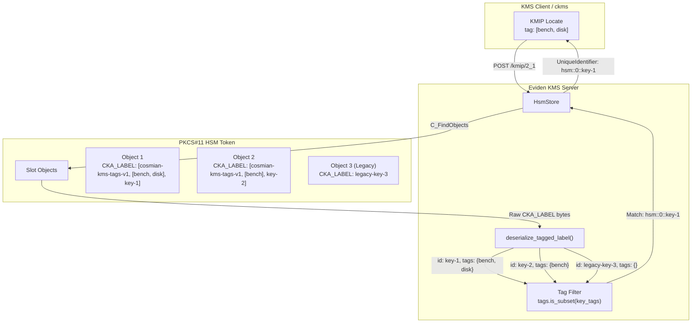

# HSM key labeling & tag-based location

Eviden KMS supports storing, discovering, and managing keys directly on Hardware Security Modules (HSMs) via PKCS#11.
To enable key organization, lifecycle management, and discovery across hardware tokens without relying on external databases,
Eviden KMS implements an inline **tag-based labeling** mechanism inside the PKCS#11 `CKA_LABEL` attribute.

This page explains how HSM keys encode application and system tags, how tag-based discovery works via KMIP `Locate`,
and how Eviden KMS maintains backward compatibility with plain PKCS#11 labels.

## Overview

Unlike database-backed keys where metadata and tags are stored in dedicated tables, HSM keys reside entirely on hardware tokens.
PKCS#11 tokens natively expose a single `CKA_LABEL` string per object, but do not provide a native metadata dictionary or tag query API.

Eviden KMS solves this by serializing both the logical identifier and user/system tags into an envelope stored directly in `CKA_LABEL`.
When clients execute operations such as `Locate`, `Get Attributes`, or `Export`, the KMS inspects token objects,
decodes the tagged label, and evaluates tag-based filters.



## Tagged label format

When an HSM key is created or imported with tags, Eviden KMS formats the `CKA_LABEL` attribute as a serialized JSON envelope:

```json
["cosmian-kms-tags-v1", ["tag1", "tag2"], "key_identifier"]
```

The three components of the envelope are:

1. **Version marker**: `cosmian-kms-tags-v1` identifies the label as an Eviden KMS tagged structure.
2. **Tag array**: a set of string tags associated with the object.
3. **Key identifier**: the byte string representing the key's logical identifier within the slot.

### Backward compatibility

Eviden KMS maintains strict backward compatibility with existing or externally-provisioned PKCS#11 objects:

- **Tagged labels**: If `CKA_LABEL` deserializes as a JSON tuple matching `cosmian-kms-tags-v1`,
  the inner identifier is extracted as the key ID, and the tag set is populated from the array.
- **Legacy plain labels**: If `CKA_LABEL` does not match the marker or is not valid JSON,
  the KMS treats the entire raw byte sequence as a plain UTF-8 string identifier with an empty tag set (`HashSet::new()`).
- **Empty tags optimization**: When a key is created without tags, Eviden KMS stores the raw identifier directly without JSON overhead.

## System tags on HSM objects

When keypairs or symmetric keys are created on the HSM, Eviden KMS automatically attaches system tags to distinguish key types:

| System tag | Purpose | Description |
|---|---|---|
| `_kk` | Symmetric key | Automatically attached to AES keys |
| `_sk` | Private key | Automatically attached to asymmetric private keys (RSA, EC, Ed25519) |
| `_pk` | Public key | Automatically attached to asymmetric public keys |

!!! info Keypair generation and system tags
    When generating an asymmetric keypair via PKCS#11 (`C_GenerateKeyPair`), both the private and public key objects
    receive the shared application tags, along with their respective `_sk` and `_pk` system tags.
    This enables clients to independently discover either the private or public half using tag filters.

## Tag-based location (`Locate`)

The KMIP `Locate` operation queries objects based on search criteria.
For HSM stores, `Locate` inspects objects across all configured HSM slots:

1. **Slot enumeration**: The KMS retrieves the list of active slots (`get_available_slot_list`).
2. **Object enumeration**: For each slot, it lists candidate objects (`find(slot_id, HsmObjectFilter::Any)`).
3. **Metadata decoding**: It reads `CKA_LABEL` and decodes the tag set via `deserialize_tagged_label`.
4. **Subset matching**: A candidate matches if and only if **all** requested query tags are present in the object's tag set:

$$\text{requested\_tags} \subseteq \text{object\_tags}$$

If an object matches, its full KMS identifier is returned in the form:

```text
hsm::<slot_id>::<key_identifier>
```

### KMIP Locate example

To locate all HSM keys containing both the `bench` and `disk` tags:

=== "KMIP JSON-TTLV request"

    ```json
    {
      "tag": "Locate",
      "type": "Structure",
      "value": [
        {
          "tag": "Attributes",
          "type": "Structure",
          "value": [
            {
              "tag": "Attribute",
              "type": "Structure",
              "value": [
                {
                  "tag": "VendorIdentification",
                  "type": "TextString",
                  "value": "cosmian"
                },
                {
                  "tag": "AttributeName",
                  "type": "TextString",
                  "value": "tag"
                },
                {
                  "tag": "AttributeValue",
                  "type": "TextString",
                  "value": "[\"bench\",\"disk\"]"
                }
              ]
            }
          ]
        }
      ]
    }
    ```

=== "KMIP JSON-TTLV response"

    ```json
    {
      "tag": "LocateResponse",
      "type": "Structure",
      "value": [
        {
          "tag": "LocatedItems",
          "type": "Integer",
          "value": 1
        },
        {
          "tag": "UniqueIdentifier",
          "type": "TextString",
          "value": "hsm::7::matching"
        }
      ]
    }
    ```

## CLI usage (`ckms`)

The `ckms` command-line client transparently sets and queries tags on HSM objects using the `--tag` flag.

### Creating an HSM key with tags

```bash
# Create an AES-256 key in HSM slot 0 with tags 'bench' and 'disk'
ckms --url "http://127.0.0.1:9998" sym keys create \
    --algorithm aes \
    --number-of-bits 256 \
    --tag bench \
    --tag disk \
    hsm::0::my-tagged-key
```

### Locating keys by tag

```bash
# Locate all keys tagged with 'bench'
ckms --url "http://127.0.0.1:9998" locate --tag bench
```

## Security considerations

- **Tag confidentiality**: Tags are stored in plaintext within the HSM token's `CKA_LABEL`.
  Do not include sensitive information (passwords, PII, secret parameters) in tag values.
- **Label size limits**: PKCS#11 tokens and HSM firmwares impose maximum byte lengths on `CKA_LABEL` (typically between 32 and 255 bytes).
  Keep tag names concise to avoid exceeding token label capacity.
- **Authorization**: Tag discovery respects KMS authorization. Non-admin users only receive identifiers for keys
  on which they have been explicitly granted permissions.
