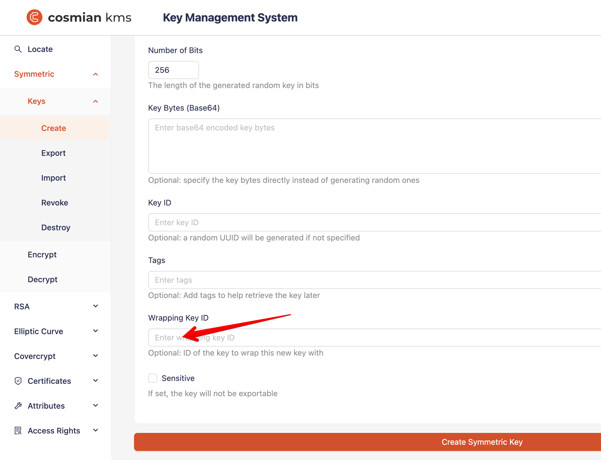

In addition to managing its own keys, Cosmian KMS can act as a proxy to an HSM to store and manage keys in the HSM.

<!-- TOC -->

* [HSM keys](#hsm-keys)
* [Creating a KMS key wrapped by an HSM key](#creating-a-kms-key-wrapped-by-an-hsm-key)
    * [Manually using the CLI](#manually-using-the-cli)
    * [Manually using the Web UI](#manually-using-the-web-ui)
    * [Automatically using the server configuration](#automatically-using-the-server-configuration)
* [Using the wrapped KMS key](#using-the-wrapped-kms-key)
    * [Small data: encrypting server-side](#small-data-encrypting-server-side)
        * [Large data: encrypting client side with key wrapping](#large-data-encrypting-client-side-with-key-wrapping)
* [The Unwrapped Objects Cache](#the-unwrapped-objects-cache)
* [HSM KMIP operations](#hsm-kmip-operations)
    * [Create](#create)
    * [Destroy](#destroy)
    * [Get & Export](#get--export)
    * [Encrypt](#encrypt)
    * [Decrypt](#decrypt)

<!-- TOC -->

## HSM keys

HSM keys are prefixed keys. They are created with a unique identifier that is prefixed by the `hsm` keyword and the
slot number in the form:

```shell
hsm::<slot_number>::<key_identifier>
```

For instance, the key `hsm::1::mykey` is stored in the HSM slot 1 with the identifier `mykey`. Technically, the
identifier is stored in the `LABEL` field of the key object in the HSM.

Non-prefixed keys are considered KMS keys and are stored in the KMS database.

## Creating a KMS key wrapped by an HSM key

KMS Keys can be created wrapped by an HSM key, either manually or automatically.

### Manually using the CLI

To create a KMS key wrapped by an HSM key, the `--wrapping-key-id` argument must be used to specify the unique
identifier of the HSM key.

The user creating the key must be the HSM admin (see above) or have been granted the `Encrypt` operation on the HSM key.

For instance, the following command creates a 256-bit AES key wrapped by the HSM RSA (public) key
`hsm::4::my_rsa_key_pk`:

```shell
> cosmian kms sym keys create --algorithm aes --number-of-bits 256 --sensitive \
  --wrapping-key-id hsm::4::my_rsa_key_pk my_sym_key
The symmetric key was successfully generated.
      Unique identifier: my_sym_key
```

The symmetric key is now stored in the database encrypted (wrapped) by the HSM key. The encryption happened in the HSM.

### Manually using the Web UI

In the web UI, fill in the `Wrapping Key ID` field with the unique identifier of the HSM key.


### Automatically using the server configuration

The KMS server can automatically wrap all KMS keys with a specific HSM key.
This is done by setting the `key_encryption_key` property in the TOML server configuration file
or using the corresponding command line switch.

## Using the wrapped KMS key

The symmetric key created above can now be used to encrypt and decrypt data, and the KMS will transparently unwrap the
key using the HSM key.

This unwrapping will happen once, and the unwrapped symmetric key will be cached in memory for later operations; no
clear-text symmetric key will be stored in the KMS database.

### Small data: encrypting server-side

For example, to encrypt a message with the key `my_sym_key` server-side, the following command can be used:

```shell
> cosmian kms sym encrypt --key-id my_sym_key /tmp/secret.txt
The encrypted file is available at "/tmp/secret.enc"
```

To decrypt a message with the key `my_sym_key`, the following command can be used:

```shell
> cosmian kms sym decrypt --key-id my_sym_key --output-file /tmp/secret.recovered.txt /tmp/secret.enc
The decrypted file is available at "/tmp/secret.recovered.txt"
```

#### Large data: encrypting client side with key wrapping

To encrypt a large file with the key `my_sym_key` client side, the following command can be used:

```shell
>cosmian kms sym encrypt --key-id my_sym_key_2 --data-encryption-algorithm aes-gcm \
--key-encryption-algorithm rfc5649 /tmp/large.bin
The encrypted file is available at "/tmp/large.enc"
```

In this case, an ephemeral symmetric key (the Data Encryption Key, DEK) is generated and used to encrypt the data.
The DEK is then encrypted/wrapped with RFC4659 (a.k.a NIST AES Key Wrap) with the key `my_sym_key`,
called the Key Encryption Key, KEK.
The wrapping of the DEK by the KEK is stored at the beginning of the encrypted file.
At rest, in the KMS database, `my_sym_key` is stored encrypted/wrapped with the HSM key `hsm::4::my_rsa_key_pk`.

To decrypt a large file with the KEK `my_sym_key` client side, the following command can be used:

```shell
> cosmian kms sym decrypt --key-id my_sym_key_2 --data-encryption-algorithm aes-gcm \
  --key-encryption-algorithm rfc5649 --output-file /tmp/large.recoverd.bin /tmp/large.enc
The decrypted file is available at "/tmp/large.recoverd.bin"
```

## The Unwrapped Objects Cache

The unwrapped cache is a memory cache, and it is not persistent. The unwrapped cache is used to store unwrapped objects
that are fetched from the database.

When a wrapped object is fetched from the database, it is unwrapped and stored in the unwrapped cache.
Further calls to the same object will use the unwrapped object from the cache until the cache expires.

The time in minutes after an unused object is evicted from the cache is configurable
using the `unwrapped_cache_max_age` setting. The default is 15 minutes.

When HSM keys wrap objects, a long expiration time will reduce the number of calls made to HSM to unwrap the object.
However, increasing the cache time will increase the memory the KMS server uses and expose the key in clear text
in the memory for a longer time.

## HSM KMIP operations

Some KMIP operations can be performed directly via the KMS server API on the HSM keys.

### Create

Create a new key in the HSM. The key unique must be provided on the request and must follow the
`hsm::<slot_number>::<key_identifier>` format described above.
Only the user identified by the `--hsm-admin` argument can create keys in the HSM.

RSA and AES keys are supported.
When creating an RSA key, the `key_identifier` will be that of the private key. The corresponding public key will be
automatically created and stored in the HSM with the same `key_identifier` but with the `_pk` suffix, for example,
the public key of the `hsm::1::mykey` private key will be created with a unique identifier `has::1::mykey_pk`.

Create an RSA 4096-bit key with the Cosmiian CLI:

```shell
❯ cosmian kms rsa keys create --size_in_bits 4096 --sensitive hsm::4::my_rsa_key
The RSA key pair has been created.
      Public key unique identifier: hsm::4::my_rsa_key_pk
      Private key unique identifier: hsm::4::my_rsa_key
```

Create an AES 256-bit key with the Cosmiian CLI:

```shell
❯ cosmian kms sym keys create --algorithm aes --number-of-bits 256 --sensitive hsm::4::my_aes_key
The symmetric key was successfully generated.
   Unique identifier: hsm::4::my_aes_key
```

Keys should be flagged as `sensitive` when created in the HSM, so that the private key or symmetric key cannot be
exported (see below `Get` and `Export`).

Note: HSM keys do not support object tagging in this release.

### Destroy

Contrary to the KMS keys, HSM keys must not be revoked before being destroyed. The `Destroy` operation will remove the
key from the HSM.

Only the user identified by the `--hsm-admin` argument or a user who has been granted the `Destroy` operation (by the
HSM admin) can destroy keys in the HSM.

To destroy the key `hsm::4::my_rsa_key`, the following command can be used:

```shell
❯ cosmian kms rsa keys destroy --key-id hsm::4::my_rsa_key
Successfully destroyed the key.
      Unique identifier: hsm::4::mykey
```

To destroy the corresponding public key `hsm::4::my_rsa_key_pk`, the following command can be used:

```shell
❯ cosmian kms rsa keys destroy --key-id hsm::4::my_rsa_key_pk
Successfully destroyed the object.
   Unique identifier: hsm::4::my_rsa_key_pk
```

### Get & Export

The `Get` and `Export` operations are used to retrieve the key material from the HSM.
Only the user identified by the `--hsm-admin` argument or a user who has been granted the `Get` operation (by the HSM
admin) can retrieve keys from the HSM.

Private or symmetric keys marked as `sensitive` cannot be retrieved from the HSM.
The public key of a key pair can always be retrieved.

To export the public key `hsm::4::my_rsa_key_pk` in PKCS#8 PEM format, the following command can be used:

```shell
❯ cosmian kms rsa keys export --key-id hsm::4::my_rsa_key_pk --key-format pkcs8-pem /tmp/pubkey.pem
The key hsm::4::my_rsa_key_pk of type PublicKey was exported to "/tmp/pubkey.pem"
   Unique identifier: hsm::4::my_rsa_key_pk
```

To export the private key `hsm::4::mykey` in PKCS#8 PEM format, the following command can be used:

```shell
❯ cosmian kms rsa keys export --key-id hsm::4::my_rsa_key --key-format pkcs8-pem /tmp/privkey.pem
The key hsm::4::my_rsa_key of type PrivateKey was exported to "/tmp/privkey.pem"
   Unique identifier: hsm::4::my_rsa_key
```

To export the symmetric key `hsm::4::my_aes_key` in raw format (i.e., raw bytes),
the following command can be used:

```shell
❯ cosmian kms sym keys export --key-id hsm::4::my_aes_key --key-format raw /tmp/symkey.raw
The key hsm::4::my_aes_key of type SymmetricKey was exported to "/tmp/symkey.raw"
   Unique identifier: hsm::4::my_aes_key
```

### Encrypt

Symmetric keys and public keys can be used to encrypt data. Only the user identified by the `--hsm-admin` argument or a
user granted the `Encrypt` operation (by the HSM admin) can encrypt data with keys stored in the HSM.

For symmetric keys, only AES GCM is supported. CKM_RSA_PKCS_OAEP and the now-deprecated, but still widely
used, CKM_RSA_PKCS (v1.5) are supported for RSA keys. The hashing algorithm is fixed to SHA256.

When using RSA, the maximum message size in bytes is:

* PKCS#1 v1.5: (key size in bits / 8) - 11
* OAEP: (key size in bits / 8) - 66

To encrypt a message with the public key `hsm::4::my_rsa_key_pk` and the CKM RSA PKCS OAEP algorithm, the following
command can be used:

```shell
❯ cosmian kms rsa encrypt --key-id hsm::4::my_rsa_key_pk --encryption-algorithm ckm-rsa-pkcs-oaep \
/tmp/secret.txt
The encrypted file is available at "/tmp/secret.enc"
```

To encrypt a message using AES GCM with the symmetric key `hsm::4::my_aes_key`, the following command can be used:

```shell
❯ cosmian kms sym encrypt --key-id hsm::4::my_aes_key --data-encryption-algorithm aes-gcm /tmp/secret.txt
The encrypted file is available at "/tmp/secret.enc"
```

### Decrypt

Symmetric keys and private keys can be used to decrypt data. Only the user identified by the `--hsm-admin` argument or a
A user granted the `Decrypt` operation (by the HSM admin) can decrypt data with keys stored in the HSM.

For symmetric keys, only AES GCM is supported. CKM_RSA_PKCS_OAEP and the now-deprecated, but still widely
used, CKM_RSA_PKCS (v1.5) are supported for RSA keys. The hashing algorithm is fixed to SHA256.

To decrypt a message with the private key
key `hsm::4::hsm::4::my_rsa_key` and the CKM RSA PKCS OAEP algorithm, the following command can be used:

```shell
❯ cosmian kms rsa decrypt --key-id hsm::4::my_rsa_key --encryption-algorithm ckm-rsa-pkcs-oaep \
  --output-file /tmp/secret.recovered.txt /tmp/secret.enc
The decrypted file is available at "/tmp/secret.plain"
```

To decrypt a message using AES GCM with the symmetric key `hsm::4::my_aes_key`, the following command can be used:

```shell
> cosmian kms sym decrypt --key-id hsm::4::my_aes_key --data-encryption-algorithm AesGcm \
  --output-file /tmp/secret.recovered.txt /tmp/secret.enc
The decrypted file is available at "/tmp/secret.recoverd.txt"
```
