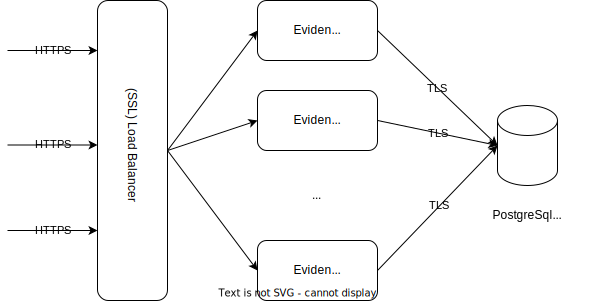
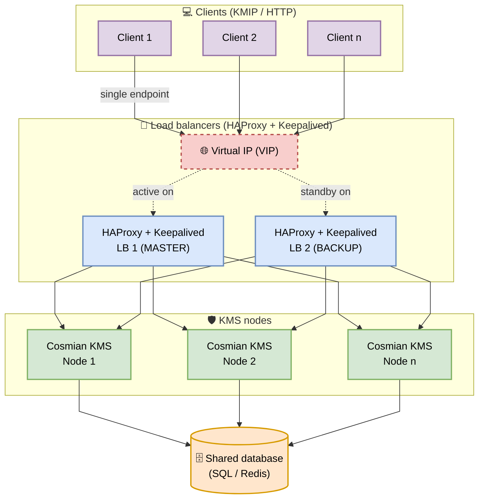

This mode offers high availability through redundancy and load-balancing.

The KMS servers are stateless, so they can be scaled horizontally from a single node up to any number of nodes,
simply by connecting them all to the same database and fronting them with a load balancer.



## Architecture with HAProxy and Keepalived



All KMS clients (backup software, applications) connect exclusively to the **Virtual IP (VIP)**.
Individual KMS node IPs are never exposed to clients.

The number of KMS nodes can be adjusted at any time without reconfiguring clients:
add a new node to the database and to the HAProxy backend, and it will start receiving traffic immediately.

Because the KMS nodes are stateless, the **shared database is the source of truth**: ensure you have **regular database backups**
(and periodically test restores) using your database engine's recommended procedures.

## Configuring the load balancer

Since the KMS servers are stateless, any load-balancing strategy may be selected, such as a simple round-robin.

When the Cosmian KMS servers are configured to export an HTTPS port (as is the case when running inside a confidential
VM):

- all the Cosmian KMS servers should expose the same server certificate on their HTTPS port
- and the load balancer should be configured as an SSL load balancer (HAProxy is a good example of a high-performance
  SSL load balancer)

### HAProxy Configuration

Use the **same configuration on all HAProxy nodes** — Keepalived handles which one is active.

In a typical two-node setup, HAProxy and Keepalived are installed on two dedicated load balancer nodes. Each load balancer node:

- runs HAProxy (load-balances requests to all KMS nodes)
- runs Keepalived (shares a Virtual IP between the HAProxy instances so clients have a single endpoint)

Typical configuration file path (may vary by distribution):

- HAProxy: `/etc/haproxy/haproxy.cfg`

On systemd-based distributions, after updating the configuration you can restart HAProxy with:

```bash
sudo systemctl restart haproxy
```

Health checks use the Cosmian KMS `/health` endpoint on the HTTP port (`9998`), while KMIP traffic is forwarded to
port `5696`. Add or remove `server` lines in the backend to match your number of KMS nodes.

```haproxy
global
    log /dev/log local0
    maxconn 2000
    user haproxy
    group haproxy

defaults
    log     global
    mode    tcp                 # TCP mode: required for TLS/KMIP passthrough
    option  tcplog
    timeout connect 5000ms
    timeout client  50000ms
    timeout server  50000ms

# Frontend for KMIP traffic (standard KMIP port)
frontend kmip_frontend
    bind *:5696
    default_backend kmip_backend

backend kmip_backend
    mode tcp
    balance roundrobin

    # Health check via Cosmian KMS /health endpoint (HTTP port 9998)
    option httpchk GET /health
    http-check expect status 200

    # Check every 3s; mark DOWN after 3 failures, mark UP after 2 successes
    default-server inter 3s fall 3 rise 2

    # Add one line per KMS node.
    # Traffic goes to port 5696; health is checked on port 9998.
    server kms1 <kms1-ip>:5696 check port 9998
    server kms2 <kms2-ip>:5696 check port 9998
    # server kms3 <kms3-ip>:5696 check port 9998
    # …
```

### Keepalived Configuration

Keepalived manages the Virtual IP (VIP) across the load balancer nodes. Use the same configuration on all load balancer nodes,
adjusting only `state` and `priority` per node:

You must define a **Virtual IP (VIP)** that will be shared by the nodes. Keepalived ensures that **only the current
MASTER node responds to the VIP**, so clients always connect to a single stable address.

Typical configuration file path (may vary by distribution):

- Keepalived: `/etc/keepalived/keepalived.conf`

On systemd-based distributions, after updating the configuration you can restart Keepalived with:

```bash
sudo systemctl restart keepalived
```

| Load balancer node | `state`  | `priority`                        |
|--------------|----------|-----------------------------------|
| Primary      | `MASTER` | highest value (e.g. `101`)        |
| Secondary    | `BACKUP` | lower value (e.g. `100`)          |
| Additional   | `BACKUP` | lower still (e.g. `99`, `98`, …)  |

```keepalived
vrrp_script chk_haproxy {
    script "killall -0 haproxy"   # Checks that the HAProxy process is running
    interval 2
    weight 2
}

vrrp_instance VI_1 {
    state MASTER                  # → BACKUP on all non-primary nodes
    interface eth0                # Adapt to your network interface name
    virtual_router_id 51          # Must be identical on all load balancer nodes
    priority 101                  # → Decrease by 1 for each additional node
    advert_int 1

    authentication {
        auth_type PASS
        auth_pass SecretPassword  # Strong shared secret; must be identical on all nodes
    }

    virtual_ipaddress {
        192.168.1.100             # VIP — configure this address in all KMS clients
    }

    track_script {
        chk_haproxy
    }
}
```

## Failover behavior

| Event | Result |
|---|---|
| Active HAProxy node goes down | Keepalived promotes the next highest-priority HAProxy; VIP moves within ~2s |
| A KMS node goes down | HAProxy detects failure via `/health` within `inter × fall` ≈ 9s and stops routing to it; remaining nodes absorb the traffic |
| A KMS node recovers | HAProxy re-adds it after 2 successful checks (~6s) |
| A new KMS node is added | Add a `server` line to the HAProxy backend and reload HAProxy; no client reconfiguration needed |

## Deployment options

You can run a single HAProxy instance (similar to using Nginx as a reverse-proxy/load balancer) in front of the KMS
nodes. This provides load balancing but introduces a **single point of failure (SPOF)**: if that HAProxy server goes
down, clients cannot reach the KMS.

Using Keepalived (with at least two HAProxy instances) avoids the SPOF by providing a floating VIP.
