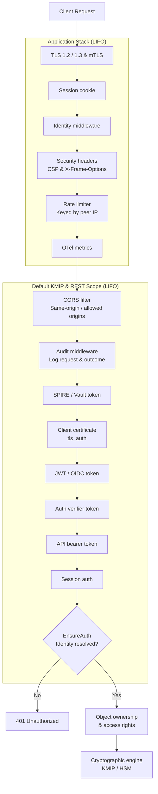

# API Overview & Security

The Eviden KMS server exposes multiple API interfaces over HTTP/TLS and TCP, including standard KMIP protocols, a native REST cryptographic API, access control endpoints, and enterprise cloud provider integrations.

This page provides an architectural overview of all available API endpoints, the request processing pipeline, and the server-side API security measures enforced across all routes.

---

## API Endpoints

The KMS server exposes endpoints grouped by function:

| Interface | Base Path | Protocol / Format | Purpose |
|---|---|---|---|
| **KMIP 2.1 JSON TTLV** | `POST /kmip/2_1` | KMIP 2.1 over JSON TTLV | Primary standard KMIP management & cryptographic operations |
| **KMIP 1.4 JSON TTLV** | `POST /kmip/1_4` | KMIP 1.4 over JSON TTLV | Legacy KMIP 1.4 client compatibility |
| **KMIP Binary Socket** | Port `5696` | KMIP TTLV over TLS TCP | Binary wire-format KMIP protocol (TLS + mTLS required) |
| **REST Native Crypto** | `/v1/crypto/*` | REST / JSON (JOSE-aligned) | Key generation, encryption, decryption, sign, verify, and MAC |
| **Access Control** | `/access/*` | REST / JSON | Object ownership queries, grant/revoke permissions, Crypto Officer ceremony |
| **System & Diagnostics** | `/health`, `/version` (public); `/server-info` (auth required) | REST / JSON | Service health checks, version information, and server capabilities |
| **JWKS Public Keys** | `GET /.well-known/jwks.json` | JSON Web Key Set | Public key distribution for active keys tagged with `jwks` (unauthenticated) |
| **PKI & Revocation** | `GET /public/certificates/{issuer_id}/crl`, `GET /ocsp/{request}` | RFC 5280 CRL / RFC 6960 OCSP | Public certificate revocation list distribution and OCSP responder |
| **OpenAPI / Swagger** | `GET /openapi.yaml`, `GET /swagger` | OpenAPI 3.1 & Swagger UI | Interactive documentation and API schema download (publicly served) |
| **Cloud Integrations** | `/aws`, `/google_cse`, `/ms_dke`, `/azureekm` | Vendor-specific REST protocols | External Key Store integrations (AWS XKS, Google CSE, MS DKE, Azure EKM) |

See [KMIP Support](../kmip_support/json_ttlv_api.md) for KMIP protocol details and [Ownership and access rights](../configuration/authorization.md) for access control endpoints.

---

## Calling the KMIP API

This API is documented in the [KMIP section](../kmip_support/json_ttlv_api.md) of this manual.

### Calling the authorization API

This API is documented in the [authorization section](../configuration/authorization.md) of this manual.

---

## Authentication

The Eviden server supports various authentication mechanisms: see the [authentication section](../configuration/authentication.md) of this manual for details.

When authenticating using JWT, an HTTP `Authorization` header must be passed with the JWT token as a bearer token:

```text
Authorization: Bearer <JWT_TOKEN>
```

---

## Security Architecture & Middleware Pipeline

All HTTP requests pass through an Actix-web middleware pipeline executing in **LIFO order** (the last middleware added via `.wrap()` runs first on incoming requests). The pipeline enforces defense-in-depth across two distinct tiers:

1. **Application Level**: Applied globally across the entire HTTP server (all scopes and routes).
2. **Scope Level**: Applied to specific service scopes (such as the default KMIP and REST scope, or dedicated cloud provider scopes).



---

## Security Measures

### 1. Transport Security (TLS & mTLS)

All communication with the KMS server is encrypted using TLS:

- **Protocol Versions**: Supports TLS 1.2 and TLS 1.3.
- **Cipher Profiles**: Uses Mozilla Intermediate v5 cipher suites by default. The cipher list can be customized using `--tls-cipher-suites` or the `tls_cipher_suites` key in `kms.toml`.
- **Mutual TLS (mTLS)**: Configured with `clients_ca_cert_file`. Client certificates presented during TLS negotiation are validated against the specified CA. The client certificate's Subject Common Name (`CN`) is extracted as the authenticated user identity.
- **KMIP Binary Socket Listener**: The binary KMIP socket on port 5696 requires both TLS and a `clients_ca_cert_file` configured to start. The server refuses to listen without them.

For configuration details, see [Enabling TLS](../configuration/tls.md) and [Obtaining TLS Certificates](../configuration/certificates.md).

### 2. Rate Limiting (DoS & Brute-Force Mitigation)

The KMS server includes a built-in token bucket rate limiter keyed by client peer IP address, backed by the `governor` crate.

- **Sustained Limit & Burst**: Configured via `rate_limit_per_second` (CLI: `--rate-limit-per-second`, env: `KMS_RATE_LIMIT_PER_SECOND`). When set, the burst capacity is automatically scaled to **3x** the sustained rate.
- **HTTP 429 Responses**: Requests exceeding the quota receive `HTTP 429 Too Many Requests`, returning `Retry-After` and `X-RateLimit-After` headers indicating the wait time in seconds.
- **Global Coverage**: Wrapped at the application level, protecting all endpoints including unauthenticated routes and authentication proxies.
- **Startup Protection Warnings**: The server warns at startup if rate limiting is omitted while high-cost endpoints are active (e.g., the unauthenticated `/v1/auth/*` proxy or the Crypto Officer ceremony endpoint).

!!! warning "Reverse Proxy & Load Balancer Caveat"
    The rate limiter keys strictly on the TCP connection's peer IP address, not on the `X-Forwarded-For` header. When deployed behind a reverse proxy or load balancer, all client requests arrive from the proxy's IP address and will share a single rate-limiting bucket. In such deployments, configure rate limiting at the reverse proxy/ingress layer, or size `rate_limit_per_second` accordingly.

For configuration syntax, see [Server configuration file](../configuration/server_configuration_file.md).

### 3. Authentication Pipeline

The HTTP server validates client identities through a cascading middleware chain. When an authenticator succeeds, it populates an `AuthenticatedUser` extension on the request.

Supported authentication methods include:

- **TLS Client Certificates (`tls_auth`)**: Authenticates via X.509 client certificate `CN` presented over mTLS.
- **JWT / OIDC Bearer Tokens (`jwt_auth`)**: Validates OpenID Connect JWT tokens (including JWT-SVID for SPIFFE workloads) from configured identity providers against remote or local JWKS keys. Sent via `Authorization: Bearer <TOKEN>`.
- **Cosmian Auth Verifier (`AuthVerifier`)**: Validates Bearer tokens against JWKS keys when tokens do not include a `kid` header.
- **API Tokens (`api_token`)**: Validates static pre-shared bearer tokens corresponding to symmetric key objects stored in the KMS database.
- **SPIRE App-Tokens (`spire_token`)**: Validates `X-Vault-Token` headers for HashiCorp Vault-compatible Zero-Trust integrations.
- **AWS SigV4 (`Sigv4MWare`)**: Authenticates AWS KMS requests on the `/aws` scope using AWS Signature Version 4 HMAC signatures.
- **Web UI Sessions (`SessionAuth`)**: Uses an encrypted, `HttpOnly`, `SameSite=Lax` cookie (`auth_session`) with a 24-hour lifetime.

#### Fail-Closed Enforcement (`EnsureAuth`)

The `EnsureAuth` middleware runs after all credential extractors:

- If authentication is enabled and all extractors fail, the request is rejected with `401 Unauthorized`.
- If no authentication methods are configured, the request falls back to the configured `default_username` (default `admin`), unless `--force-default-username` is specified.

See [Authenticating users to the server](../configuration/authentication.md) and [PKCE Authentication](../configuration/pkce_authentication.md).

### 4. Object Authorization & Access Rights

Once authenticated, the server evaluates access control rules per cryptographic object:

- **Ownership**: Every key or secret object has an assigned creator/owner established at creation (`Create`, `CreateKeyPair`, `Import`).
- **Granular Permissions**: Object owners or administrators can grant or revoke granular rights (`Read`, `Modify`, `Destroy`, `UseKey`, `Authorize`, etc.) via `/access/grant` and `/access/revoke`.
- **Role Management (`[roles] crypto_officer_users`)**: Restricts critical administrative privileges and key lifecycle management to designated Crypto Officer identities.
- **Crypto Officer Ceremony**: Optional quorum-based dual control requiring multi-party authorization for high-security key operations.

See [Ownership and access rights](../configuration/authorization.md) and [Role Management and Key Ceremony](../configuration/authorization/key_ceremony.md).

### 5. HTTP Protocol & Boundary Hardening

- **Security Headers**: All HTTP responses include `X-Frame-Options: DENY` and `Content-Security-Policy: frame-ancestors 'none'` to block clickjacking and prevent framing in unauthorized web contexts.
- **Payload Size Limits**: Strict **64 MB** deserialization ceiling prevents memory exhaustion and DoS from maliciously oversized KMIP or JSON bodies.
- **CORS Scope Isolation**: The default KMIP and REST scope (`/kmip`, `/v1/crypto`, `/access`) defaults to same-origin. Cross-origin access requires explicit approval in `cors_allowed_origins`. Cloud provider scopes (`/aws`, `/google_cse`, `/ms_dke`) enable permissive CORS as required by their protocol specifications.

### 6. Audit Logging & Non-Repudiation

When enabled, the audit logging middleware records every KMIP and crypto operation into a tamper-evident, cryptographically chained JSONL log:

- **Pre-Authentication Recording**: In the default scope, the audit middleware wraps outside the authentication layers, capturing both successful operations and failed attempts (`401 Unauthorized`, `403 Forbidden`).
- **Trusted Proxy CIDRs**: Client IP addresses are extracted from `X-Forwarded-For` only when the immediate peer IP matches configured CIDR ranges in `audit_trusted_proxy_cidrs`.
- **Failure Modes**: Configurable via `audit_failure_mode` to either `continue` (log failure and proceed) or `reject` (fail closed and return HTTP 503 if an event cannot be audited).

See [Audit logs](../configuration/audit-logs.md) and [SIEM integration](../configuration/siems.md).

---

## REST Native Crypto API

In addition to the KMIP protocol, the server exposes a lightweight JOSE-compatible REST API under `/v1/crypto` for encrypt, decrypt, sign, verify, and MAC operations. See the [REST Native Crypto API](jose/jose_api.md) page for full documentation.

---

## OpenAPI Specification and Swagger UI

The KMS server exposes its complete API as an [OpenAPI 3.1](https://spec.openapis.org/oas/v3.1.0) specification and serves an interactive Swagger UI browser directly from the server binary. Both are publicly accessible at `/openapi.yaml` and `/swagger`.

See [OpenAPI Specification and Swagger UI](openapi.md) for full details on the interactive documentation, downloading the spec, and using external tools.
