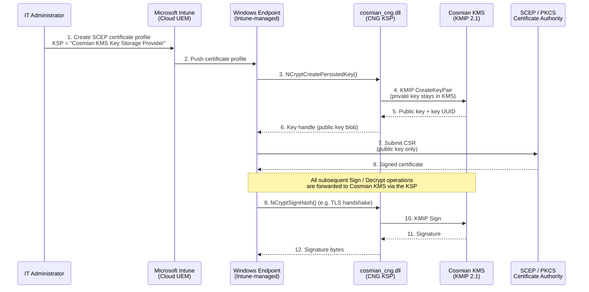
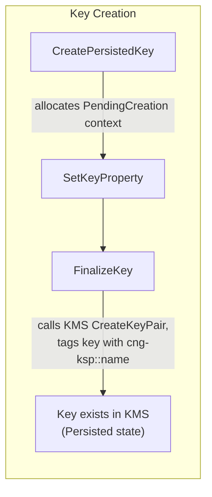
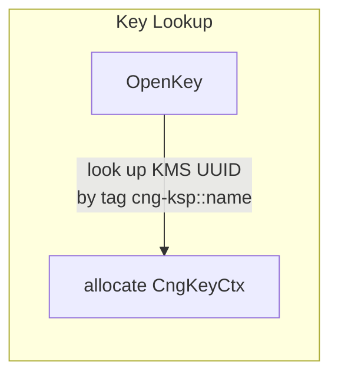
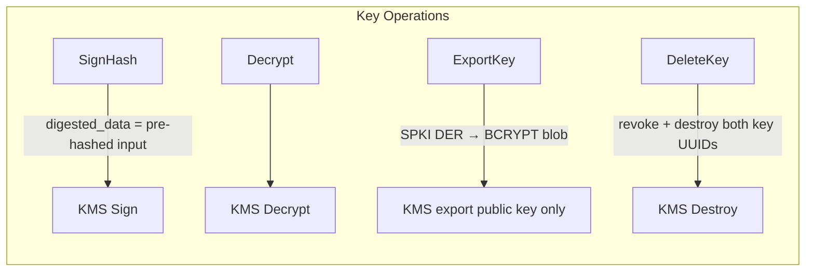
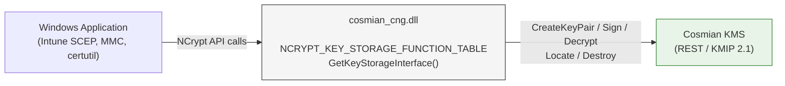
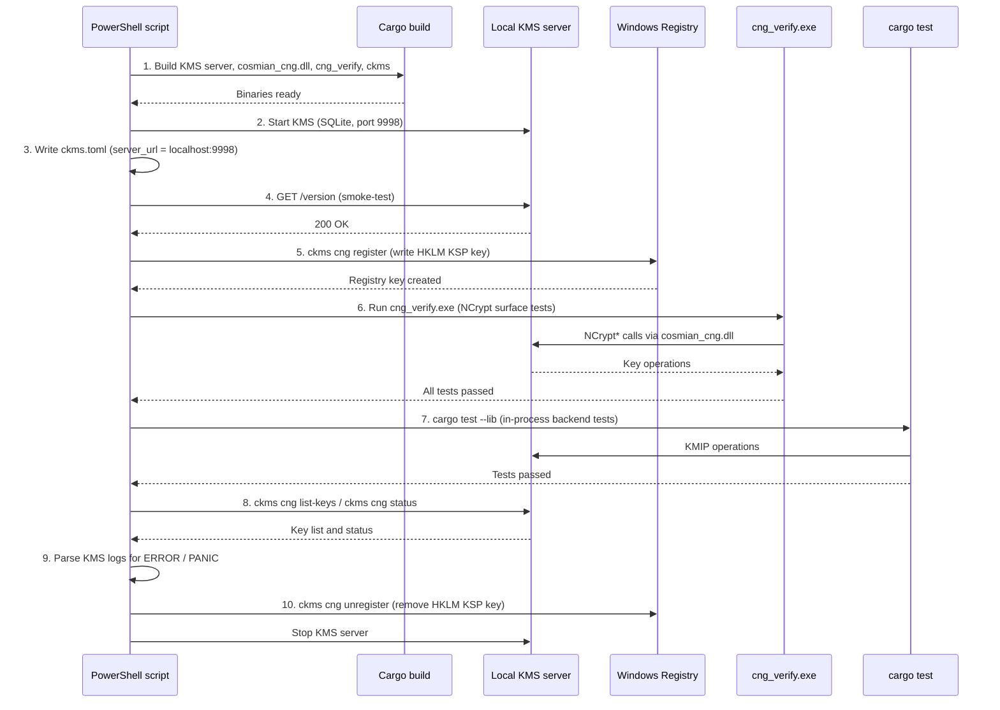

# Windows CNG Key Storage Provider (KSP)

> **Microsoft Intune integration** — The Cosmian KMS CNG KSP integrates natively
> with [Microsoft Intune](https://learn.microsoft.com/en-us/mem/intune/fundamentals/what-is-intune)
> SCEP and PKCS certificate profiles. When Intune provisions a device certificate,
> the private key is created and permanently stored in Cosmian KMS — never on the
> endpoint. See the [Intune integration section](#microsoft-intune-integration)
> for setup details.

## Intune + CNG KSP architecture



---

## What is it?

Cosmian KMS provides a Windows **CNG Key Storage Provider (KSP)** DLL —
`cosmian_cng.dll` — that stores private keys inside Cosmian KMS rather
than the local Windows machine store.

A **Key Storage Provider** is a pluggable module defined by the Windows
**Cryptography API: Next Generation (CNG)** framework (introduced in Windows
Vista / Server 2008). CNG replaces the older CAPI (CryptoAPI). Any application
that calls the standard `NCrypt*` family of functions — including the Windows
certificate enrollment engine, Schannel (TLS), and Code Signing — automatically
uses whichever KSP is associated with a given key, with no application changes
required. By deploying `cosmian_cng.dll`, all private key material is
kept inside Cosmian KMS: it never exists on the device disk.

---

## Why use it?

| Need | How the KSP addresses it |
|---|---|
| **Private-key protection** | Keys are generated and stored exclusively inside Cosmian KMS — never on the endpoint disk or in the Windows registry. |
| **FIPS 140-3 compliance** | Cosmian KMS is FIPS 140-3 validated. All cryptographic operations (sign, decrypt, key generation) are executed by the KMS, not by Windows. |
| **Centralised audit trail** | Every sign / decrypt operation is logged in the KMS with user identity, timestamp, and key identifier. |
| **Key revocation** | Revoking a key in the KMS immediately blocks all devices using it, without requiring an MDM policy push. |
| **Zero-touch provisioning** | Works natively with Microsoft Intune SCEP and PKCS certificate profiles — no custom enrollment agent is needed. |
| **Export prevention** | Export policy is disabled by default (`NCRYPT_ALLOW_PLAINTEXT_EXPORT_FLAG` is off), so private keys cannot be extracted from the device. |

---

## Who should use it?

- **Enterprise IT / Security teams** deploying Microsoft Intune device
  certificates where device private keys must be hardware-protected or
  centrally managed.
- **PKI administrators** who need a hardware-security-module (HSM)-equivalent
  experience without deploying a physical HSM on every endpoint.
- **Compliance officers** who need full audit logs of every private key usage on
  corporate endpoints.
- **Windows developers** integrating with any NCrypt-based API (Schannel, Code
  Signing, S/MIME, BitLocker recovery) who want keys protected by a remote KMS.

---

## When to use it?

Use the CNG KSP when:

- You are enrolling **device certificates** through Microsoft Intune SCEP or
  PKCS profiles and you want the private key to remain inside Cosmian KMS rather
  than in the Windows software KSP or TPM.
- You need to **remotely wipe** a key (e.g. lost device): destroy the key in the
  KMS and all signing / decryption operations on that device fail immediately.
- Your organisation is subject to regulations (FIPS 140-3, Common Criteria,
  eIDAS, NIS2) that mandate private key custody inside a certified key store.
- You want a single, centralised, KMIP 2.1-compliant inventory of **all** device
  keys with metadata and access-control policies.

Do **not** use the CNG KSP for keys that must be available offline (e.g. full-disk
encryption unlock keys), because operations require a live HTTPS connection to
the KMS.

---

## How it works

### CNG plug-in mechanism

Windows CNG defines the `NCRYPT_KEY_STORAGE_FUNCTION_TABLE` interface: a struct
of 30 function pointers that Windows calls for every key operation. A KSP DLL
exports a single entry point:

```c
SECURITY_STATUS GetKeyStorageInterface(
    LPCWSTR pszProviderName,
    NCRYPT_KEY_STORAGE_FUNCTION_TABLE **ppFunctionTable,
    DWORD dwFlags
);
```

`cosmian_cng.dll` implements this interface entirely in Rust. When
Windows loads the DLL, it calls `GetKeyStorageInterface` to obtain the function
table, and from that point on every `NCrypt*` call is handled by the
corresponding Rust function.

### Request flow


Private keys **never leave the KMS**: only the public key blob
(`BCRYPT_RSAKEY_BLOB` or `BCRYPT_ECCKEY_BLOB`) is serialised and returned to
Windows for certificate construction.

### Provider and key context objects

| Windows concept | Rust type | What it holds |
|---|---|---|
| `NCRYPT_PROV_HANDLE` | `CngProviderCtx` (heap box → raw `usize`) | Shared `Arc<KmsClient>`, provider config path |
| `NCRYPT_KEY_HANDLE` | `CngKeyCtx` (heap box → raw `usize`) | Key state (`Persisted` or `Pending`), `Arc<KmsClient>` |

Both types carry a magic number (`0xC05_1A_AC`) that is validated on every
handle dereference — a stale or forged handle returns `NTE_INVALID_HANDLE`
instead of causing undefined behaviour.

### Key lifecycle







### Key naming and tagging

Each key is tagged in the KMS with two vendor tags (namespace `Cosmian`):

| Tag | Purpose |
|---|---|
| `cng-ksp` | Marks the object as managed by this KSP |
| `cng-ksp::<name>` | Allows lookup by the CNG key name string |

### Authentication

The DLL reads `ckms.toml` using the same search order as the `ckms` CLI:

1. Path in the `CKMS_CONF` environment variable.
2. `ckms.toml` in the same directory as `cosmian_cng.dll`.
3. `%APPDATA%\.cosmian\ckms.toml`.

The configuration file supports bearer-token OAuth 2.0, mTLS (PKCS#12 client
certificate), or unauthenticated (for local dev/test only).

### SECURITY_STATUS error mapping

| KSP error | SECURITY_STATUS returned |
|---|---|
| Handle invalid / null | `NTE_INVALID_HANDLE` (`0x80090026`) |
| Key not found in KMS | `NTE_NO_KEY` (`0x80090008`) |
| Algorithm not in supported list | `NTE_BAD_ALGID` (`0x8009000D`) |
| Export requested on non-exportable key | `NTE_PERM` (`0x80090010`) |
| Output buffer too small | `NTE_BUFFER_TOO_SMALL` (`0x80090028`) |
| Any KMS REST error | `NTE_FAIL` (`0x8009002A`) |

---

## Architecture



> **Private keys never touch the local machine.** Only public key blobs are returned to Windows.

---

## Supported algorithms

| Algorithm    | Key sizes / curves            | Operations           |
|-------------|-------------------------------|----------------------|
| RSA          | 2048, 3072, 4096 bits         | Sign, Decrypt        |
| ECDSA P-256  | NIST P-256                    | Sign                 |
| ECDSA P-384  | NIST P-384                    | Sign                 |
| ECDSA P-521  | NIST P-521                    | Sign                 |
| ECDH P-256/384/521 | NIST curves              | Key Agreement        |

---

## Installation

### 1. Install the Cosmian KMS CLI

The `cosmian_cng.dll` is bundled inside the **Cosmian KMS CLI installer**
alongside `ckms.exe`. Download and run the installer for your platform:

```powershell
# Download the CLI installer (adjust the version number as needed)
Invoke-WebRequest `
    -Uri "https://package.cosmian.com/kms/5.22.0/windows/x86_64/non-fips/static-openssl/cosmian-kms-cli-non-fips-static-openssl_5.22.0_x86_64.exe" `
    -OutFile "$env:TEMP\cosmian-kms-cli.exe"

# Run the installer (accepts the default installation directory)
Start-Process -FilePath "$env:TEMP\cosmian-kms-cli.exe" -ArgumentList "/S" -Wait
```

The installer places both files in the default installation directory:

```text
C:\Program Files\Cosmian\Kms\ckms.exe
C:\Program Files\Cosmian\Kms\cosmian_cng.dll
```

Ensure `C:\Program Files\Cosmian\Kms` is on your `PATH` (the installer does
this automatically for system-wide installs):

```powershell
$env:PATH += ";C:\Program Files\Cosmian\Kms"
```

### 2. Configure the KMS connection

Run the interactive configuration wizard to create `ckms.toml`:

```powershell
ckms configure
```

The wizard prompts for the KMS server URL and authentication method (none,
bearer token, PEM client certificate, or PKCS#12 client certificate). It writes
the configuration to `%APPDATA%\.cosmian\ckms.toml`.

### 3. Verify the DLL

Before registering the KSP, confirm that the DLL loads correctly and can reach
the KMS server:

```powershell
ckms cng verify --dll "C:\Program Files\Cosmian\Kms\cosmian_cng.dll"
```

Expected output (with a running KMS):

```text
=== Cosmian CNG KSP Verification ===

Loading DLL: C:\Program Files\Cosmian\Kms\cosmian_cng.dll

  [OK]   OpenProvider
── RSA key pair + sign + export + lookup ──
  [OK]   RSA key pair + sign + export + lookup
  ...
─────────────────────────────────────────
All 15 verification step(s) PASSED.
```

If any step shows `[FAIL]` with `NTE_FAIL (0x8009002A)`, the DLL cannot reach
the KMS server — check `ckms.toml` and network connectivity before proceeding.

### 4. Register the KSP (requires Administrator)

```powershell
# From an elevated PowerShell prompt:
ckms cng register --dll "C:\Program Files\Cosmian\Kms\cosmian_cng.dll"
```

This writes the following registry key:

```text
HKLM\SYSTEM\CurrentControlSet\Control\Cryptography\Providers\
    Cosmian KMS Key Storage Provider\
        DllFileName  REG_SZ  "C:\Program Files\Cosmian\Kms\cosmian_cng.dll"
        Capabilities REG_DWORD  2  (NCRYPT_IMPL_SOFTWARE_FLAG)
```

### 5. Verify registration

```powershell
ckms cng status
# Expected: Cosmian KMS CNG KSP: REGISTERED
```

---

## Using the KSP

### Create a key pair via NCrypt API

The KSP is automatically available to any Windows application that calls
`NCryptOpenStorageProvider` with the provider name
`"Cosmian KMS Key Storage Provider"`.

```c
NCRYPT_PROV_HANDLE hProv;
NCryptOpenStorageProvider(
    &hProv,
    L"Cosmian KMS Key Storage Provider",
    0
);

NCRYPT_KEY_HANDLE hKey;
NCryptCreatePersistedKey(hProv, &hKey, BCRYPT_RSA_ALGORITHM, L"my-key", 0, 0);
NCryptSetProperty(hKey, NCRYPT_LENGTH_PROPERTY, (PBYTE)&keyLength, sizeof(DWORD), 0);
NCryptFinalizeKey(hKey, 0);
// The private key is now stored in Cosmian KMS
// FinalizeKey returns only after the KMS confirms creation
```

### Intune SCEP device certificate

Microsoft Intune uses the Windows CNG CSR pipeline. Once the KSP is registered,
configure the Intune SCEP profile to use the **Cosmian KMS Key Storage Provider**
as the key storage location. The private key backing the device certificate will
be created and permanently stored in Cosmian KMS.

### List all CNG KSP keys in the KMS

```powershell
ckms cng list-keys
```

### Unregister the KSP

```powershell
# Elevated PowerShell:
ckms cng unregister
```

---

## Logging

Log output is written to `cosmian_cng.log` in the same directory as the
DLL by default — no additional configuration is required. If the DLL directory
is not writable, the log file is created in `%APPDATA%\.cosmian\cosmian_cng.log`
instead. Logging to a file always happens without any configuration.

Set the `COSMIAN_CNG_KSP_LOGGING_LEVEL` environment variable to control
verbosity: `trace`, `debug`, `info` (default), `warn`, or `error`.

---

## Key naming and tag convention

Each key created through the KSP is tagged in the KMS with:

- `cng-ksp` — identifies all KSP-managed keys.
- `cng-ksp::<key_name>` — identifies the key by its CNG name (the string
  passed to `NCryptCreatePersistedKey` / `NCryptOpenKey`).

Use `ckms cng list-keys` or the standard `ckms locate` command to find keys:

```powershell
ckms locate --tag "cng-ksp::my-key"
```

---

## Security considerations

- Private keys are **never** stored locally; they exist only in Cosmian KMS.
- All key operations require an authenticated connection to the KMS.
- The `NCRYPT_ALLOW_PLAINTEXT_EXPORT_FLAG` is **off** by default; private keys cannot
  be exported in plaintext.
- Use mTLS or bearer-token authentication in `ckms.toml` for production deployments.
- Run `ckms cng register` as Administrator. The DLL path stored in the registry
  is read by the Windows LSASS process — only trusted, signed DLLs should be
  registered.
- Consider restricting read access to `ckms.toml` so that unprivileged users
  cannot extract the KMS server URL or client certificate.

---

## Microsoft Intune integration

[Microsoft Intune](https://learn.microsoft.com/en-us/mem/intune/fundamentals/what-is-intune)
is Microsoft's cloud-based **Unified Endpoint Management (UEM)** service. It
lets IT administrators manage devices (Windows, macOS, iOS, Android) and enforce
security policies — including deploying certificates — without on-premises
infrastructure. When Intune provisions a certificate on a Windows endpoint, the
private key is generated locally via a **Key Storage Provider**. By default
Windows uses its built-in software KSP, which stores keys in the registry.

With the Cosmian KMS CNG KSP registered on the device, Intune can be configured
to use it instead: the private key is created and permanently stored in Cosmian
KMS rather than on the device. This gives the organisation centralised custody,
FIPS 140-3 compliance, real-time revocation, and a full audit trail — all
without any change to the Intune enrollment workflow itself.

### SCEP certificate profile

1. In the Microsoft Intune admin center, create a **SCEP certificate profile**
   for Windows 10/11.
2. Set **Key storage provider (KSP)** to
   **"Enroll to Custom KSP, otherwise fail"** and enter the provider name
   exactly as:

   ```text
   Cosmian KMS Key Storage Provider
   ```

3. Ensure the `ckms.toml` configuration file and the DLL are deployed to managed
   endpoints via an Intune Win32 app or PowerShell script before the certificate
   profile is applied.
4. The Intune SCEP agent will call `NCryptCreatePersistedKey` on the Cosmian KSP,
   then send the resulting CSR (public key only) to the SCEP server. The private
   key never leaves Cosmian KMS.

### PKCS certificate profile

Set **Key storage provider (KSP)** to
**"Enroll to Custom KSP, otherwise fail"** and enter the same provider name.
The Intune PKCS connector will use the Cosmian KSP to generate the key pair on
the device.

### Remote key revocation for lost devices

When a device is lost or decommissioned:

```powershell
# From the KMS administrator workstation:
ckms locate --tag "cng-ksp::intune-device-<serial>"
ckms revoke --id <uuid> "Device decommissioned"
ckms destroy --id <uuid>
```

Once the key is destroyed in the KMS, any subsequent sign or decrypt attempt
from the device returns `NTE_FAIL`, effectively revoking the private key without
requiring a certificate revocation list (CRL) propagation delay.

---

## Integration testing

The CNG KSP is tested at three levels — all runnable without Azure credentials
or an Intune tenant.

### Prerequisites

| Requirement | Why |
|---|---|
| **Windows 10/11 or Server 2019+** | The DLL uses the Windows CNG API (`NCrypt*`), which is Windows-only. |
| **Rust toolchain (MSVC target)** | `cargo build` produces the DLL, server binary, and verification tool. |
| **Administrator privileges** | Required to write the KSP registry key under `HKLM`. |
| **vcpkg with `openssl_x64-windows-static`** | Set `OPENSSL_DIR` or `VCPKG_INSTALLATION_ROOT`. |

No Azure account, Intune license, or SCEP infrastructure is needed — all tests
run against a **local Cosmian KMS server** with a SQLite backend.

### Test layers

| Layer | What it tests | Runner | Location |
|---|---|---|---|
| **Rust lib tests** | Backend functions (`backend::create_rsa_key_pair`, `sign_hash`, `list_cng_keys`, …) via an in-process KMS | `cargo test --lib -p cosmian_cng` | `crate/clients/cng/src/tests.rs` |
| **DLL surface tests** | Loads `cosmian_cng.dll` at runtime, calls `GetKeyStorageInterface`, exercises every `NCrypt*` function pointer against a live KMS | `ckms cng verify --dll <path>` | `crate/clients/clap/src/actions/cng_verify.rs` |
| **CLI commands** | `ckms cng register`, `status`, `list-keys`, `unregister` | PowerShell assertions | `.github/scripts/windows/test_cng_ksp.ps1` |

### Running the full test suite

From an **elevated PowerShell** prompt at the repository root:

```powershell
.\.github\scripts\windows\test_cng_ksp.ps1
```

The script performs the following steps:



### Test coverage

The **cng_verify** tool exercises the following NCrypt operations against a live KMS:

| Test | Operations exercised |
|---|---|
| RSA key pair + sign + export + lookup | `CreatePersistedKey` → `SetKeyProperty` → `FinalizeKey` → `ExportKey` → `OpenKey` → `SignHash` (PKCS1v15) → `DeleteKey` |
| RSA encrypt / decrypt (OAEP) | `Encrypt` → `Decrypt` (round-trip validation) |
| RSA-PSS sign | `SignHash` with PSS padding + salt |
| RSA signature verify | `SignHash` → `VerifySignature` (valid + invalid hash) |
| EC P-256 key pair + sign + export | `CreatePersistedKey` → `FinalizeKey` → `ExportKey` → `SignHash` (ECDSA) → `DeleteKey` |
| ECDSA signature verify (P-256) | `SignHash` → `VerifySignature` |
| EC P-384 key pair + sign | `CreatePersistedKey` → `FinalizeKey` → `ExportKey` → `SignHash` (SHA-384) |
| EC P-521 key pair + export | `CreatePersistedKey` → `FinalizeKey` → `ExportKey` |
| DeleteKey + verify gone | `DeleteKey` → `OpenKey` (expect `NTE_NO_KEY`) |

### Environment variables

| Variable | Default | Purpose |
|---|---|---|
| `CKMS_CONF` | `<target_dir>/ckms.toml` | Path to the KMS client configuration file |
| `OPENSSL_DIR` | Auto-detected from vcpkg | OpenSSL static library directory |
| `VCPKG_INSTALLATION_ROOT` | — | Fallback for `OPENSSL_DIR` |
| `CNG_TEST_RELEASE` | `0` | Set to `1` to build and test in release mode |
| `RUST_LOG` | `cosmian_kms_server=info,cosmian_cng=debug` | Log verbosity for KMS server and DLL |
| `COSMIAN_CNG_KSP_LOGGING_LEVEL` | `info` | DLL-specific logging (trace/debug/info/warn/error) |

### Testing the Intune enrollment flow

The automated tests above validate the **CNG KSP DLL itself** — the same code
path that Intune SCEP uses when it calls `NCryptCreatePersistedKey` and
`NCryptSignHash`. To test the full **Intune → endpoint → KMS** flow you need:

| Requirement | Purpose |
|---|---|
| Microsoft Intune tenant (Azure AD / Entra ID) | Manages the SCEP certificate profile |
| SCEP server (NDES or third-party) | Signs the CSR generated by the endpoint |
| Intune-enrolled Windows device | Receives the SCEP profile and triggers key creation |
| Cosmian KMS instance reachable from the device | Stores the private key |

This is typically validated manually or in a dedicated staging environment,
not in CI.

---

## Troubleshooting

| Problem | Likely cause | Solution |
|---|---|---|
| `NTE_FAIL` on `OpenKey` or `CreatePersistedKey` | `ckms.toml` missing or KMS unreachable | Verify `ckms.toml` is present and `server_url` is reachable (`curl https://<kms>/kmip/2_1`). |
| `NTE_NO_KEY` on `OpenKey` | Key name not found in the KMS | Run `ckms cng list-keys`; verify the name and that the `cng-ksp::<name>` tag exists. |
| `NTE_PERM` on `ExportKey` | Export policy disabled (by design) | Private key export is intentionally blocked. Use `ExportKey` only for public key blobs. |
| `NTE_BAD_ALGID` | Algorithm string not recognised | Use `RSA`, `ECDSA_P256`, `ECDSA_P384`, `ECDSA_P521`, `ECDH_P256`, `ECDH_P384`, or `ECDH_P521`. |
| `RegCreateKeyExW` returns `0x80070005` (Access Denied) | Not running as Administrator | Run `ckms cng register` from an elevated PowerShell prompt. |
| KSP not listed in `certutil -csplist` | Registry key missing or `CryptSvc` cached old list | Re-run `ckms cng register` and restart the `CryptSvc` service (`Restart-Service CryptSvc`). |
| `NTE_INVALID_HANDLE` | Stale handle or DLL unloaded mid-operation | Ensure the DLL is not forcibly unloaded during an active key operation. |
| Intune SCEP enrollment fails with "Custom KSP not found" | DLL not deployed before profile applies | Deploy the Win32 app containing the DLL and `ckms.toml` before the certificate profile, using an Intune assignment filter or dependency. |
| Log file not created | DLL directory not writable | Set `COSMIAN_CNG_KSP_LOGGING_LEVEL` and check stderr, or grant write access to the DLL directory. |

---

## Glossary

| Term | Full name | Definition |
|---|---|---|
| **BCRYPT** | Base Cryptography API: Next Generation | The symmetric/hash/key-derivation half of the Windows CNG API (`BCrypt*` functions), as opposed to the asymmetric/key-storage half (`NCrypt*`). |
| **BYOK** | Bring Your Own Key | A cloud-provider feature that lets customers supply (and control) the encryption key used by a cloud service, rather than having the provider generate it. |
| **CA** | Certificate Authority | A trusted entity that issues and signs digital certificates, binding a public key to an identity. |
| **CAPI** | Cryptography API | The original Windows cryptographic subsystem (pre-Vista), replaced by CNG. Also written CryptoAPI. |
| **CNG** | Cryptography API: Next Generation | The Windows cryptographic framework introduced in Vista / Server 2008. It defines pluggable Key Storage Providers and Algorithm Providers via well-known function tables, replacing the older CAPI/CryptoAPI. |
| **CRL** | Certificate Revocation List | A signed list published by a CA of certificates that have been revoked before their expiry date. |
| **CSR** | Certificate Signing Request | A PKCS#10 message containing a public key and subject information, sent to a CA to obtain a signed certificate. |
| **DLL** | Dynamic-Link Library | A Windows shared library loaded at runtime, providing functions and data to calling processes without static linking. |
| **ECDH** | Elliptic-Curve Diffie–Hellman | A key-agreement protocol that allows two parties to establish a shared secret over an insecure channel using elliptic-curve arithmetic. |
| **ECDSA** | Elliptic Curve Digital Signature Algorithm | A digital signature scheme based on elliptic-curve cryptography, offering equivalent security to RSA with significantly smaller key sizes. |
| **eIDAS** | Electronic Identification, Authentication and Trust Services | EU regulation establishing a legal framework for electronic signatures, seals, timestamps, and authentication across EU member states. |
| **FIPS 140-3** | Federal Information Processing Standard Publication 140-3 | A US government standard (NIST) specifying security requirements for cryptographic modules. Level 1–4 define increasing physical and logical security. |
| **HKLM** | HKEY_LOCAL_MACHINE | The Windows registry hive containing system-wide configuration settings that apply to all users on the machine. |
| **HSM** | Hardware Security Module | A tamper-resistant physical device that generates, stores, and protects cryptographic keys and performs cryptographic operations. |
| **HTTPS** | Hypertext Transfer Protocol Secure | HTTP layered over TLS, providing encrypted and authenticated communication between client and server. |
| **KMS** | Key Management System / Key Management Service | A centralised service that manages cryptographic keys throughout their lifecycle (creation, distribution, rotation, revocation, destruction). In this document, refers to Cosmian KMS. |
| **KMIP** | Key Management Interoperability Protocol | An OASIS standard (current version 2.1) defining a protocol for communication between clients and key management servers. |
| **KSP** | Key Storage Provider | A pluggable Windows CNG component (a DLL implementing `NCRYPT_KEY_STORAGE_FUNCTION_TABLE`) that stores private keys and performs asymmetric key operations on behalf of Windows and applications. |
| **LSASS** | Local Security Authority Subsystem Service | The Windows process responsible for enforcing security policy, handling authentication, and loading CNG/CAPI providers. |
| **MDM** | Mobile Device Management | A class of software and protocols that allow organisations to remotely configure, monitor, and enforce policies on employee devices. |
| **MMC** | Microsoft Management Console | A Windows host application for administrative snap-in tools, including the Certificates snap-in (`certmgr.msc`). |
| **MSVC** | Microsoft Visual C++ | Microsoft's C/C++ compiler and runtime toolchain, required to build Windows native binaries and DLLs (including Rust code targeting `x86_64-pc-windows-msvc`). |
| **mTLS** | Mutual TLS | A variant of TLS in which both the client and the server present X.509 certificates to authenticate each other. |
| **NCrypt** | N-Crypt (CNG asymmetric API) | The asymmetric-key and key-storage half of the Windows CNG API. `NCrypt*` functions delegate to the registered KSP DLL for private key operations. |
| **NDES** | Network Device Enrollment Service | A Microsoft Windows Server role that implements the SCEP protocol, acting as a proxy between Intune/MDM and an enterprise CA. |
| **NIS2** | Network and Information Systems Directive 2 | EU cybersecurity directive (2022/2555) that expands the scope of the original NIS directive, imposing stricter security requirements and incident reporting obligations. |
| **NIST** | National Institute of Standards and Technology | US federal agency that publishes cryptographic standards (AES, SHA, ECDSA, FIPS 140, etc.). |
| **OAEP** | Optimal Asymmetric Encryption Padding | A padding scheme (RFC 8017) used with RSA encryption that provides semantic security and resistance to chosen-ciphertext attacks. |
| **OAuth 2.0** | Open Authorization 2.0 | An open standard for token-based delegated authorisation, widely used for API access. Bearer tokens issued by an identity provider are used to authenticate calls to the KMS. |
| **PKCS** | Public Key Cryptography Standards | A family of cryptographic standards published by RSA Security / IETF. Commonly referenced standards include PKCS#1 (RSA), PKCS#7/CMS (signed data), PKCS#10 (CSR), PKCS#11 (token interface), and PKCS#12 (PFX key store). |
| **PKCS#12** | Public Key Cryptography Standard #12 | A binary format (`.pfx` / `.p12`) for storing a private key together with its certificate chain, protected by a password. |
| **PKI** | Public Key Infrastructure | The set of roles, policies, hardware, software, and procedures needed to create, manage, distribute, use, store, and revoke digital certificates. |
| **PSS** | Probabilistic Signature Scheme | A padding scheme (RFC 8017 / RSASSA-PSS) for RSA digital signatures that adds randomness, providing provable security without requiring a full-domain hash. |
| **RSA** | Rivest–Shamir–Adleman | A widely used public-key cryptosystem based on the difficulty of factoring large integers, supporting both encryption and digital signatures. |
| **SCEP** | Simple Certificate Enrollment Protocol | An IETF protocol (RFC 8894) that automates the issuance of X.509 certificates, typically used by MDM systems like Microsoft Intune to enroll device certificates. |
| **S/MIME** | Secure/Multipurpose Internet Mail Extensions | A standard for public-key encryption and digital signing of email messages, using X.509 certificates. |
| **SPKI** | Subject Public Key Info | The ASN.1 structure (from X.509 / RFC 5480) that encodes a public key together with its algorithm identifier, used in CSRs and DER-format public key exports. |
| **TLS** | Transport Layer Security | The cryptographic protocol that secures communications over networks, successor to SSL. Used for all HTTPS connections between the KSP DLL and the KMS server. |
| **TPM** | Trusted Platform Module | A hardware chip embedded in many PCs that provides secure key generation and storage tied to the physical machine. The CNG KSP is an alternative to TPM-backed key storage, offering remote management capabilities. |
| **UEM** | Unified Endpoint Management | A category of IT management solutions that provide a single platform for managing all endpoint types (PCs, mobiles, IoT). Microsoft Intune is a UEM service. |
| **UUID** | Universally Unique Identifier | A 128-bit identifier (RFC 4122) used by Cosmian KMS to uniquely identify every managed key object. |
| **vcpkg** | Visual C++ Package Manager | Microsoft's open-source C/C++ package manager, used in this project to obtain pre-built OpenSSL static libraries for Windows builds. |
