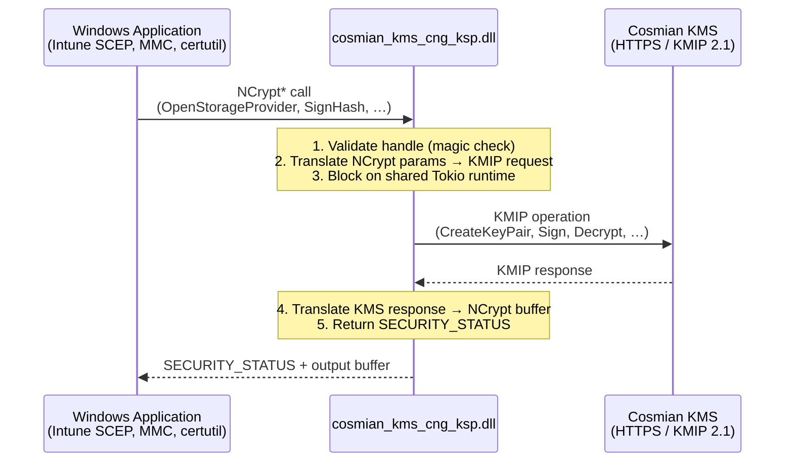
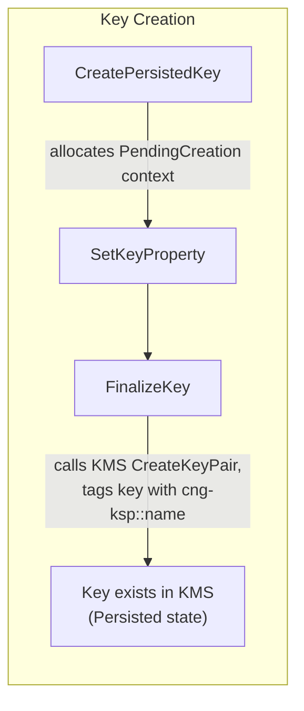
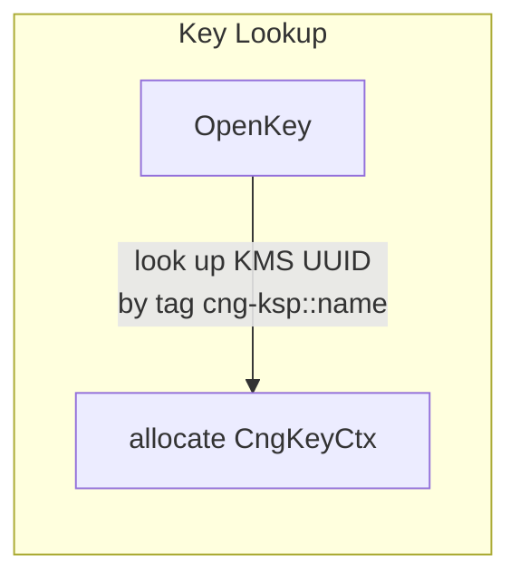
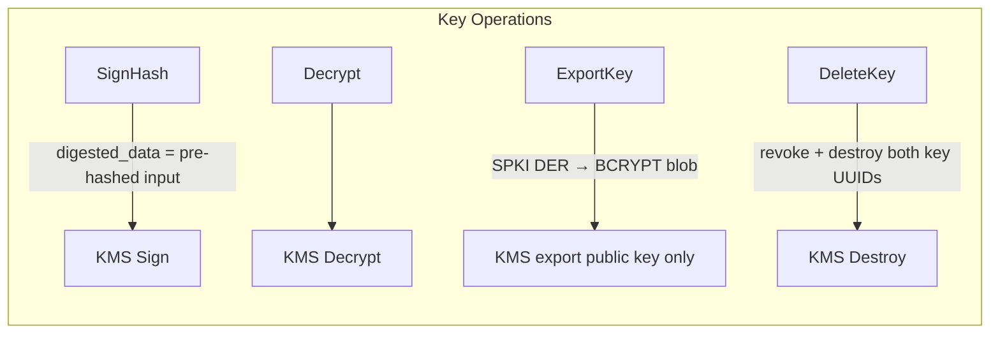

# Windows CNG Key Storage Provider (KSP)

## What is it?

Cosmian KMS provides a Windows **CNG Key Storage Provider (KSP)** DLL —
`cosmian_kms_cng_ksp.dll` — that stores private keys inside Cosmian KMS rather
than the local Windows machine store.

A **Key Storage Provider** is a pluggable module defined by the Windows
**Cryptography API: Next Generation (CNG)** framework (introduced in Windows
Vista / Server 2008). CNG replaces the older CAPI (CryptoAPI). Any application
that calls the standard `NCrypt*` family of functions — including the Windows
certificate enrollment engine, Schannel (TLS), and Code Signing — automatically
uses whichever KSP is associated with a given key, with no application changes
required. By deploying `cosmian_kms_cng_ksp.dll`, all private key material is
kept inside Cosmian KMS: it never exists on the device disk.

---

## Why use it?

| Need | How the KSP addresses it |
|---|---|
| **Private-key protection** | Keys are generated and stored exclusively inside Cosmian KMS — never on the endpoint disk or in the Windows registry. |
| **FIPS 140-3 compliance** | Cosmian KMS is FIPS 140-3 validated. All cryptographic operations (sign, decrypt, key generation) are executed by the KMS, not by Windows. |
| **Centralised audit trail** | Every sign / decrypt operation is logged in the KMS with user identity, timestamp, and key identifier. |
| **Key revocation** | Revoking a key in the KMS immediately blocks all devices using it, without requiring an MDM policy push. |
| **Zero-touch provisioning** | Works natively with Microsoft Intune SCEP and PKCS certificate profiles — no custom enrollment agent is needed. |
| **Export prevention** | Export policy is disabled by default (`NCRYPT_ALLOW_PLAINTEXT_EXPORT_FLAG` is off), so private keys cannot be extracted from the device. |

---

## Who should use it?

- **Enterprise IT / Security teams** deploying Microsoft Intune device
  certificates where device private keys must be hardware-protected or
  centrally managed.
- **PKI administrators** who need a hardware-security-module (HSM)-equivalent
  experience without deploying a physical HSM on every endpoint.
- **Compliance officers** who need full audit logs of every private key usage on
  corporate endpoints.
- **Windows developers** integrating with any NCrypt-based API (Schannel, Code
  Signing, S/MIME, BitLocker recovery) who want keys protected by a remote KMS.

---

## When to use it?

Use the CNG KSP when:

- You are enrolling **device certificates** through Microsoft Intune SCEP or
  PKCS profiles and you want the private key to remain inside Cosmian KMS rather
  than in the Windows software KSP or TPM.
- You need to **remotely wipe** a key (e.g. lost device): destroy the key in the
  KMS and all signing / decryption operations on that device fail immediately.
- Your organisation is subject to regulations (FIPS 140-3, Common Criteria,
  eIDAS, NIS2) that mandate private key custody inside a certified key store.
- You want a single, centralised, KMIP 2.1-compliant inventory of **all** device
  keys with metadata and access-control policies.

Do **not** use the CNG KSP for keys that must be available offline (e.g. full-disk
encryption unlock keys), because operations require a live HTTPS connection to
the KMS.

---

## How it works

### CNG plug-in mechanism

Windows CNG defines the `NCRYPT_KEY_STORAGE_FUNCTION_TABLE` interface: a struct
of 30 function pointers that Windows calls for every key operation. A KSP DLL
exports a single entry point:

```c
SECURITY_STATUS GetKeyStorageInterface(
    LPCWSTR pszProviderName,
    NCRYPT_KEY_STORAGE_FUNCTION_TABLE **ppFunctionTable,
    DWORD dwFlags
);
```

`cosmian_kms_cng_ksp.dll` implements this interface entirely in Rust. When
Windows loads the DLL, it calls `GetKeyStorageInterface` to obtain the function
table, and from that point on every `NCrypt*` call is handled by the
corresponding Rust function.

### Request flow



Private keys **never leave the KMS**: only the public key blob
(`BCRYPT_RSAKEY_BLOB` or `BCRYPT_ECCKEY_BLOB`) is serialised and returned to
Windows for certificate construction.

### Provider and key context objects

| Windows concept | Rust type | What it holds |
|---|---|---|
| `NCRYPT_PROV_HANDLE` | `CngProviderCtx` (heap box → raw `usize`) | Shared `Arc<KmsClient>`, provider config path |
| `NCRYPT_KEY_HANDLE` | `CngKeyCtx` (heap box → raw `usize`) | Key state (`Persisted` or `Pending`), `Arc<KmsClient>` |

Both types carry a magic number (`0xC05_1A_AC`) that is validated on every
handle dereference — a stale or forged handle returns `NTE_INVALID_HANDLE`
instead of causing undefined behaviour.

### Key lifecycle







### Key naming and tagging

Each key is tagged in the KMS with two vendor tags (namespace `Cosmian`):

| Tag | Purpose |
|---|---|
| `cng-ksp` | Marks the object as managed by this KSP |
| `cng-ksp::<name>` | Allows lookup by the CNG key name string |

### Authentication

The DLL reads `ckms.toml` using the same search order as the `ckms` CLI:

1. Path in the `CKMS_CONF` environment variable.
2. `ckms.toml` in the same directory as `cosmian_kms_cng_ksp.dll`.
3. `%APPDATA%\.cosmian\ckms.toml`.

The configuration file supports bearer-token OAuth 2.0, mTLS (PKCS#12 client
certificate), or unauthenticated (for local dev/test only).

### SECURITY_STATUS error mapping

| KSP error | SECURITY_STATUS returned |
|---|---|
| Handle invalid / null | `NTE_INVALID_HANDLE` (`0x80090026`) |
| Key not found in KMS | `NTE_NO_KEY` (`0x80090008`) |
| Algorithm not in supported list | `NTE_BAD_ALGID` (`0x8009000D`) |
| Export requested on non-exportable key | `NTE_PERM` (`0x80090010`) |
| Output buffer too small | `NTE_BUFFER_TOO_SMALL` (`0x80090028`) |
| Any KMS REST error | `NTE_FAIL` (`0x8009002A`) |

---

## Architecture


> **Private keys never touch the local machine.** Only public key blobs are returned to Windows.

---

## Supported algorithms

| Algorithm    | Key sizes / curves            | Operations           |
|-------------|-------------------------------|----------------------|
| RSA          | 2048, 3072, 4096 bits         | Sign, Decrypt        |
| ECDSA P-256  | NIST P-256                    | Sign                 |
| ECDSA P-384  | NIST P-384                    | Sign                 |
| ECDSA P-521  | NIST P-521                    | Sign                 |
| ECDH P-256/384/521 | NIST curves              | Key Agreement        |

---

## Installation

### 1. Build or download the DLL

Build from source (Windows, requires Rust + MSVC):

```powershell
cargo build --release --package cosmian_kms_cng_ksp --features non-fips
# Output: target\release\cosmian_kms_cng_ksp.dll
```

Place the DLL in an installation directory, e.g.:

```
C:\Program Files\Cosmian\Kms\cosmian_kms_cng_ksp.dll
```

### 2. Configure KMS connection

Create `ckms.toml` **in the same directory as the DLL**
(or at `%USERPROFILE%\.cosmian\ckms.toml`):

```toml
[kms_config.http_config]
server_url = "https://kms.example.com:9998"
# Optional: client certificate authentication
# tls_client_pkcs12_path = "C:\\certs\\client.p12"
# tls_client_pkcs12_password = "changeme"
```

The DLL searches for `ckms.toml` in this order:

1. Path set in `CKMS_CONF` environment variable.
2. `ckms.toml` in the same directory as `cosmian_kms_cng_ksp.dll`.
3. `%APPDATA%\.cosmian\ckms.toml`.

### 3. Register the KSP (requires Administrator)

```powershell
# From an elevated PowerShell prompt:
ckms cng register --dll "C:\Program Files\Cosmian\Kms\cosmian_kms_cng_ksp.dll"
```

This writes the following registry key:

```
HKLM\SYSTEM\CurrentControlSet\Control\Cryptography\Providers\
    Cosmian KMS Key Storage Provider\
        DllFileName  REG_SZ  "C:\Program Files\Cosmian\Kms\cosmian_kms_cng_ksp.dll"
        Capabilities REG_DWORD  2  (NCRYPT_IMPL_SOFTWARE_FLAG)
```

### 4. Verify registration

```powershell
ckms cng status
# Expected: Cosmian KMS CNG KSP: REGISTERED
```

---

## Using the KSP

### Create a key pair via NCrypt API

The KSP is automatically available to any Windows application that calls
`NCryptOpenStorageProvider` with the provider name
`"Cosmian KMS Key Storage Provider"`.

```c
NCRYPT_PROV_HANDLE hProv;
NCryptOpenStorageProvider(
    &hProv,
    L"Cosmian KMS Key Storage Provider",
    0
);

NCRYPT_KEY_HANDLE hKey;
NCryptCreatePersistedKey(hProv, &hKey, BCRYPT_RSA_ALGORITHM, L"my-key", 0, 0);
NCryptSetProperty(hKey, NCRYPT_LENGTH_PROPERTY, (PBYTE)&keyLength, sizeof(DWORD), 0);
NCryptFinalizeKey(hKey, 0);
// The private key is now stored in Cosmian KMS
// FinalizeKey returns only after the KMS confirms creation
```

### Intune SCEP device certificate

Microsoft Intune uses the Windows CNG CSR pipeline. Once the KSP is registered,
configure the Intune SCEP profile to use the **Cosmian KMS Key Storage Provider**
as the key storage location. The private key backing the device certificate will
be created and permanently stored in Cosmian KMS.

### List all CNG KSP keys in the KMS

```powershell
ckms cng list-keys
```

### Unregister the KSP

```powershell
# Elevated PowerShell:
ckms cng unregister
```

---

## Logging

Set the `COSMIAN_CNG_KSP_LOGGING_LEVEL` environment variable to `trace`,
`debug`, `info` (default), `warn`, or `error`.

Log output is written to `cosmian_cng_ksp.log` in the same directory as the
DLL (when the DLL directory is writable), or to stderr.

---

## Key naming and tag convention

Each key created through the KSP is tagged in the KMS with:

- `cng-ksp` — identifies all KSP-managed keys.
- `cng-ksp::<key_name>` — identifies the key by its CNG name (the string
  passed to `NCryptCreatePersistedKey` / `NCryptOpenKey`).

Use `ckms cng list-keys` or the standard `ckms locate` command to find keys:

```powershell
ckms locate --tag "cng-ksp::my-key"
```

---

## Security considerations

- Private keys are **never** stored locally; they exist only in Cosmian KMS.
- All key operations require an authenticated connection to the KMS.
- The `NCRYPT_ALLOW_PLAINTEXT_EXPORT_FLAG` is **off** by default; private keys cannot
  be exported in plaintext.
- Use mTLS or bearer-token authentication in `ckms.toml` for production deployments.
- Run `ckms cng register` as Administrator. The DLL path stored in the registry
  is read by the Windows LSASS process — only trusted, signed DLLs should be
  registered.
- Consider restricting read access to `ckms.toml` so that unprivileged users
  cannot extract the KMS server URL or client certificate.

---

## Microsoft Intune integration

### SCEP certificate profile

1. In the Microsoft Intune admin center, create a **SCEP certificate profile**
   for Windows 10/11.
2. Set **Key storage provider (KSP)** to
   **"Enroll to Custom KSP, otherwise fail"** and enter the provider name
   exactly as:

   ```
   Cosmian KMS Key Storage Provider
   ```

3. Ensure the `ckms.toml` configuration file and the DLL are deployed to managed
   endpoints via an Intune Win32 app or PowerShell script before the certificate
   profile is applied.
4. The Intune SCEP agent will call `NCryptCreatePersistedKey` on the Cosmian KSP,
   then send the resulting CSR (public key only) to the SCEP server. The private
   key never leaves Cosmian KMS.

### PKCS certificate profile

Set **Key storage provider (KSP)** to
**"Enroll to Custom KSP, otherwise fail"** and enter the same provider name.
The Intune PKCS connector will use the Cosmian KSP to generate the key pair on
the device.

### Remote key revocation for lost devices

When a device is lost or decommissioned:

```powershell
# From the KMS administrator workstation:
ckms locate --tag "cng-ksp::intune-device-<serial>"
ckms revoke --id <uuid> "Device decommissioned"
ckms destroy --id <uuid>
```

Once the key is destroyed in the KMS, any subsequent sign or decrypt attempt
from the device returns `NTE_FAIL`, effectively revoking the private key without
requiring a certificate revocation list (CRL) propagation delay.

---

## Troubleshooting

| Problem | Likely cause | Solution |
|---|---|---|
| `NTE_FAIL` on `OpenKey` or `CreatePersistedKey` | `ckms.toml` missing or KMS unreachable | Verify `ckms.toml` is present and `server_url` is reachable (`curl https://<kms>/kmip/2_1`). |
| `NTE_NO_KEY` on `OpenKey` | Key name not found in the KMS | Run `ckms cng list-keys`; verify the name and that the `cng-ksp::<name>` tag exists. |
| `NTE_PERM` on `ExportKey` | Export policy disabled (by design) | Private key export is intentionally blocked. Use `ExportKey` only for public key blobs. |
| `NTE_BAD_ALGID` | Algorithm string not recognised | Use `RSA`, `ECDSA_P256`, `ECDSA_P384`, `ECDSA_P521`, `ECDH_P256`, `ECDH_P384`, or `ECDH_P521`. |
| `RegCreateKeyExW` returns `0x80070005` (Access Denied) | Not running as Administrator | Run `ckms cng register` from an elevated PowerShell prompt. |
| KSP not listed in `certutil -csplist` | Registry key missing or `CryptSvc` cached old list | Re-run `ckms cng register` and restart the `CryptSvc` service (`Restart-Service CryptSvc`). |
| `NTE_INVALID_HANDLE` | Stale handle or DLL unloaded mid-operation | Ensure the DLL is not forcibly unloaded during an active key operation. |
| Intune SCEP enrollment fails with "Custom KSP not found" | DLL not deployed before profile applies | Deploy the Win32 app containing the DLL and `ckms.toml` before the certificate profile, using an Intune assignment filter or dependency. |
| Log file not created | DLL directory not writable | Set `COSMIAN_CNG_KSP_LOGGING_LEVEL` and check stderr, or grant write access to the DLL directory. |
