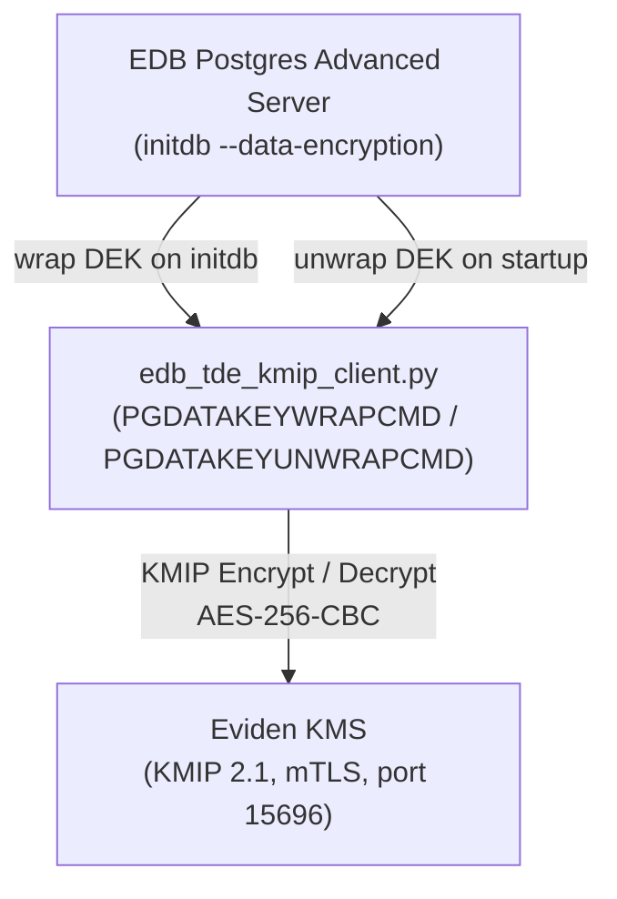

# EDB Postgres Advanced Server TDE with Eviden KMS

This guide demonstrates how to configure **EDB Postgres Advanced Server 17
Transparent Data Encryption (TDE)** to use Eviden KMS as its key management
server via KMIP over mTLS.

## Overview

| Item | Details |
|------|---------|
| **Protocol** | KMIP 2.1 over TCP/TLS with mutual certificate authentication (mTLS) |
| **Port** | 5696 or 15696 (configurable) |
| **Key type** | AES-256 symmetric key (CBC mode with PKCS#5 padding) |
| **EDB version** | EDB Postgres Advanced Server 15.2+ and 17.x |
| **Client** | `edb_tde_kmip_client.py` (shipped inside the EDB image) |
| **Eviden KMS feature** | Works in **non-FIPS** mode (PyKMIP uses `ssl.wrap_socket`) |

[TOC]

---

## Architecture



During `initdb --data-encryption`:

1. Postgres generates a random cluster DEK.
2. It invokes `PGDATAKEYWRAPCMD` — the `edb_tde_kmip_client.py encrypt` command.
3. The client calls **KMIP Encrypt** on the Eviden KMS, which returns `[IV][ciphertext]`.
4. The wrapped DEK is written to `pg_encryption/key.bin`.

On every subsequent server start, Postgres calls `PGDATAKEYUNWRAPCMD`
(`edb_tde_kmip_client.py decrypt`) to unwrap the DEK before mounting the cluster.

---

## Wire Format

The `edb_tde_kmip_client.py` script defines the on-disk format for the wrapped DEK:

```text
key.bin = [16-byte IV][AES-256-CBC ciphertext]
```

This format is assembled **client-side**; the KMS is unaware of it.

### KMIP Variants

The client supports two `--variant` options that differ in how they call KMIP:

| Variant | `Encrypt` | `Decrypt` |
|---------|-----------|-----------|
| `pykmip` (**required for Eviden KMS**) | `Encrypt(data=DEK)` → KMS returns `IVCounterNonce=IV, Data=CT` | `Decrypt(Data=CT, IVCounterNonce=IV)` — standard KMIP |
| `thales` | Same as pykmip | `Decrypt(Data=IV‖CT)` — no `IVCounterNonce`; specific to Thales CipherTrust Manager |

> **Note:** Eviden KMS follows the KMIP mandatory conformance requirement: a Decrypt
> request without `IVCounterNonce` returns `Invalid_Message`.  Always use
> `--variant=pykmip` when connecting `edb_tde_kmip_client.py` to Eviden KMS.

---

## Prerequisites

- A running Eviden KMS server with the **KMIP socket** enabled (`listen_address` / `port`).
- mTLS certificates: CA, server, and client certificate+key.
- EDB Postgres Advanced Server 15.2+ or 17.x.
- `edb_tde_kmip_client.py` installed via the `edb-tde-kmip-client` package from
  [EDB repositories](https://www.enterprisedb.com/repos-downloads).
- Python 3 with **PyKMIP** (`pip3 install PyKMIP`).

---

## Configuration

### 1. KMS Configuration

Add the KMIP socket listener to `kms.toml`:

```toml
[server]
port = 9998

[server.kmip]
server_port = 15696
```

Generate or reuse mTLS certificates for the KMS and the EDB client.
See [Certificates](../pki/certificates.md) for details.

### 2. Create the Master Key

The `edb_tde_kmip_client.py` script does not implement key creation.
Use `create_master_key.py` (bundled with the Eviden KMS test scripts)
or any other KMIP client to create an AES-256 key:

```bash
# Using the bundled helper script
python3 .mise/scripts/edb_tde/create_master_key.py \
  --pykmip-config-file=/path/to/pykmip.conf
# → prints the key UID, e.g. 0193a4b2-...
```

The `pykmip.conf` file must point to the Eviden KMS KMIP socket:

```ini
[client]
host = localhost
port = 15696
keyfile  = /path/to/client.key
certfile = /path/to/client.crt
ca_certs = /path/to/ca.crt
```

### 3. Configure PGDATAKEYWRAPCMD / PGDATAKEYUNWRAPCMD

```bash
export PGDATAKEYWRAPCMD='python3 /usr/edb/kmip/client/edb_tde_kmip_client.py \
  encrypt \
  --pykmip-config-file=/path/to/pykmip.conf \
  --key-uid=<UID from step 2> \
  --variant=pykmip \
  --out-file=%p'

export PGDATAKEYUNWRAPCMD='python3 /usr/edb/kmip/client/edb_tde_kmip_client.py \
  decrypt \
  --pykmip-config-file=/path/to/pykmip.conf \
  --key-uid=<UID from step 2> \
  --variant=pykmip \
  --in-file=%p'
```

### 4. Initialize the Cluster

```bash
initdb -D /var/lib/edb/data -y -U enterprisedb \
  --key-wrap-command="$PGDATAKEYWRAPCMD" \
  --key-unwrap-command="$PGDATAKEYUNWRAPCMD"
```

`initdb` calls `PGDATAKEYWRAPCMD` once to seal the freshly generated cluster DEK.

### 5. Start the Server

```bash
pg_ctl -D /var/lib/edb/data start
```

Verify TDE is active:

```sql
SELECT data_encryption_version FROM pg_control_init();
-- Returns 1 if TDE is enabled
```

---

## Key Rotation

To rotate the master key:

```bash
PGDATA=/var/lib/edb/data
OLD_KEY=<old UID>
NEW_KEY=<new UID created via create_master_key.py>
KMIP_CONF=/path/to/pykmip.conf
CLIENT=/usr/edb/kmip/client/edb_tde_kmip_client.py

cd $PGDATA/pg_encryption
cp key.bin key.bin.bak

python3 $CLIENT decrypt --in-file=key.bin \
  --pykmip-config-file=$KMIP_CONF --key-uid=$OLD_KEY --variant=pykmip \
| python3 $CLIENT encrypt --out-file=key.bin \
  --pykmip-config-file=$KMIP_CONF --key-uid=$NEW_KEY --variant=pykmip

sed -i "s/$OLD_KEY/$NEW_KEY/" $PGDATA/postgresql.conf
pg_ctl -D $PGDATA restart
```

---

## Running the Integration Tests

The Eviden KMS repository includes a full integration test suite for EDB TDE.
It requires an EDB subscription token to pull the `edb-postgres-advanced:17`
Docker image.

```bash
EDB_SUBSCRIPTION_TOKEN=<token> \
  mise run test:edb_tde --variant non-fips
```

The test suite:

1. Logs in to `docker.enterprisedb.com`, starts the EDB container.
2. Runs `initdb` with TDE — the real `edb_tde_kmip_client.py` seals the cluster
   DEK against Eviden KMS over KMIP/mTLS.
3. Verifies `data_encryption_version = 1`.
4. Exercises both `--variant=pykmip` and `--variant=thales` wrap/unwrap roundtrips.
5. Tests key rotation (re-wrap DEK with a new master key).

See `.mise/scripts/edb_tde/README.md` for full test documentation.

---

## Reference

| Resource | Link |
|----------|------|
| EDB TDE documentation | <https://www.enterprisedb.com/docs/tde/latest/> |
| Thales CipherTrust integration | <https://www.enterprisedb.com/docs/partner_docs/ThalesCipherTrustManager/05-UsingThalesCipherTrustManager/> |
| IBM Guardium CM integration | <https://www.ibm.com/docs/en/guardium-cm/2.0.0?topic=ctc-configuring-postgresql-transparent-database-encryption-tde-key-management-guardium-cryptography-manager> |
| Entrust KeyControl integration | <https://nshielddocs.entrust.com/interops-docs/pdfs/EDB_Postgres_v16.4-Entrust_KeyControl_v10.3.1_(PUBLIC)_ig.pdf> |
| PyKMIP documentation | <https://pykmip.readthedocs.io/en/latest/client.html> |
