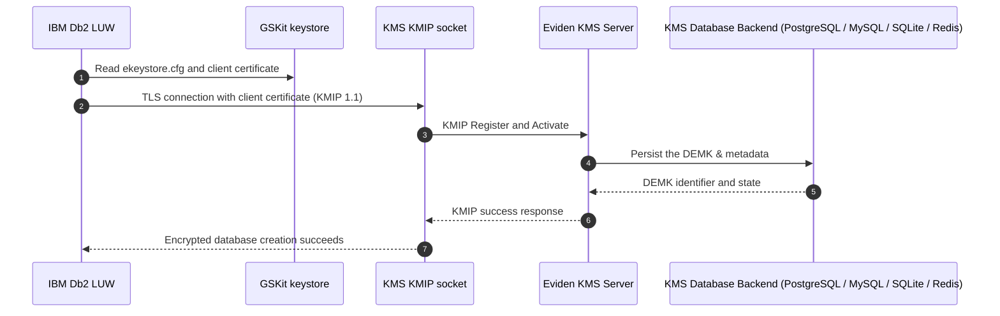

# IBM Db2 LUW TDE with Eviden KMS

This guide describes the integration between Eviden KMS and **IBM Db2 LUW** (Linux, UNIX, Windows) for Transparent Data Encryption (TDE).

IBM Db2 connects to the Eviden KMS native KMIP socket server (KMIP 1.1) through IBM GSKit to create and retrieve the Database Encryption Master Key (DEMK).

## Architecture

Db2 connects directly to the KMS binary KMIP socket over mutual TLS (mTLS) through GSKit. Db2 references a KMIP configuration file (`ekeystore.cfg`), which references a GSKit PKCS#12 keystore containing the client certificate and CA certificate.



## Prerequisites

- Docker and Docker Compose.
- A local checkout of the Eviden KMS repository.
- Test certificates under `test_data/certificates/client_server/` (or production mTLS certificates).
- Access to the IBM Db2 Community Edition Docker image (requires `LICENSE=accept`).

| Product | Tested path | Test entry point |
| --- | --- | --- |
| IBM Db2 LUW 12.1+ | GSKit to KMS KMIP socket, KMIP 1.1 | `.mise/scripts/test/test_db2_tde.sh` |

## Configuration

The test starts the `db2-tde` Compose service and creates a GSKit PKCS#12 keystore containing the KMS CA and the Db2 client certificate.

Db2 requires a KMIP client configuration file (e.g. `ekeystore.cfg`) inside the container:

```text
VERSION=1
PRODUCT_NAME=OTHER
ALLOW_KEY_INSERT_WITHOUT_KEYSTORE_BACKUP=TRUE
SSL_KEYDB=<GSKit PKCS#12 path>
SSL_KEYDB_STASH=<GSKit stash path>
SSL_KMIP_CLIENT_CERTIFICATE_LABEL=db2kmip_client
PRIMARY_SERVER_HOST=kmserver.acme.com
PRIMARY_SERVER_KMIP_PORT=<KMS_KMIP_PORT>
```

- `PRODUCT_NAME=OTHER` selects third-party KMIP key managers like Eviden KMS.
- `KEYSTORE_LOCATION` must point to this configuration file, not directly to the GSKit `.p12` file.

Configure Db2 Database Manager to use KMIP:

```bash
db2 "UPDATE DBM CFG USING KEYSTORE_TYPE KMIP KEYSTORE_LOCATION '<path-to-ekeystore.cfg>'"
```

Create an encrypted database:

```bash
db2 "CREATE DATABASE KMIPDB ENCRYPT CIPHER AES KEY LENGTH 256"
```

Db2 registers and activates the DEMK through the KMS KMIP socket.

## Integration Testing

Run the integration test with:

```bash
mise run test:db2 --variant non-fips
```

The test verifies:

1. mTLS rejection without a client certificate.
2. Independent KMS REST encrypt/decrypt round-trip.
3. GSKit keystore initialization and KMIP configuration.
4. Encrypted database creation via `CREATE DATABASE ... ENCRYPT`.
5. Verification that the master key is created and activated in KMS via `ckms locate`.

## Troubleshooting

- **Keystore / client label error:** If Db2 cannot create the database, verify that `gsk9certutil_64` created the client label `db2kmip_client`, that `libicu` is installed, and that `KEYSTORE_LOCATION` references `ekeystore.cfg`.
- **TLS negotiation failure:** Verify the CA, server certificate hostname / SANs, client certificate, and the KMS KMIP socket configuration.

The complete reproducible procedure is in `.mise/scripts/test/test_db2_tde.sh`.
