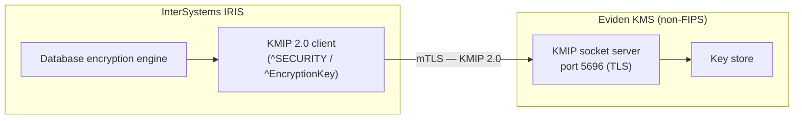

# InterSystems IRIS Database Encryption with Eviden KMS

**InterSystems IRIS** supports [database encryption](https://docs.intersystems.com/irislatest/csp/docbook/DocBook.UI.Page.cls?KEY=GCAS_encrypt) via the **KMIP 2.0** protocol, allowing encryption keys to be managed externally by a dedicated Key Management System. Eviden KMS acts as the KMIP server: IRIS connects to it over a **mutual TLS (mTLS)** channel, retrieves or creates symmetric keys, and uses them to encrypt database files on disk.

---

## Architecture overview



The mTLS channel requires:

| Side   | Material                                          |
|--------|---------------------------------------------------|
| KMS    | Server certificate + private key (PKCS#12)        |
| IRIS   | Client certificate + private key + CA certificate |
| Both   | Same CA that signed both certificates             |

---

## Prerequisites

| Component             | Version                   | Notes                                            |
|-----------------------|---------------------------|--------------------------------------------------|
| Eviden KMS            | 5.0+ (non-FIPS build)     | KMIP socket server requires `--features non-fips` |
| InterSystems IRIS     | 2022.1+                   | Community or Enterprise edition                  |
| KMIP protocol         | 2.0                       | Configured on the IRIS side                      |
| OpenSSL               | 3.0+                      | For TLS 1.3                                      |

> **FIPS note**: The KMIP socket server is only available in the **non-FIPS** build of Eviden KMS.
> Start the server with `--features non-fips` or use the non-FIPS Docker image.

---

## Certificate preparation

Both the KMS server and the IRIS client must present certificates signed by the same CA.
The repository ships test certificates under `test_data/certificates/client_server/`; for production, generate your own PKI.

```text
test_data/certificates/client_server/
  ca/
    ca.crt                   ← CA certificate (trusted by both sides)
  server/
    kmserver.acme.com.p12    ← KMS server cert + key (PKCS#12, password: "password")
  owner/
    owner.client.acme.com.crt ← IRIS client certificate
    owner.client.acme.com.key ← IRIS client private key
```

---

## Starting Eviden KMS with the KMIP socket server

The KMIP socket server is disabled by default. Enable it with:

```bash
cosmian_kms \
  --database-type  sqlite \
  --sqlite-path    /var/lib/kms/data \
  --socket-server-start true \
  --socket-server-port  5696 \
  --tls-p12-file        /path/to/kmserver.acme.com.p12 \
  --tls-p12-password    <p12-password> \
  --clients-ca-cert-file /path/to/ca.crt \
  --port     9998 \
  --hostname 0.0.0.0
```

| Flag                    | Purpose                                                  |
|-------------------------|----------------------------------------------------------|
| `--socket-server-start` | Enable the KMIP TCP/TLS socket listener                  |
| `--socket-server-port`  | TCP port for KMIP (default: 5696)                        |
| `--tls-p12-file`        | PKCS#12 bundle containing the server certificate and key |
| `--tls-p12-password`    | Password for the PKCS#12 bundle                          |
| `--clients-ca-cert-file`| CA that must have signed every connecting client cert    |

Verify the socket is up:

```bash
openssl s_client -connect <kms-host>:5696 \
  -cert /path/to/client.crt \
  -key  /path/to/client.key \
  -CAfile /path/to/ca.crt \
  -quiet 2>&1 | head -5
# Expected: "Verify return code: 0 (ok)"
```

---

## Configuring IRIS

All configuration is done via ObjectScript in the `%SYS` namespace. You can run these commands interactively in the IRIS terminal, via the Management Portal, or in batch mode with `iris session IRIS -B`.

### Step 1 — Create a TLS/SSL configuration

IRIS uses named SSL configurations to reference certificate material. Create one for the Eviden KMS connection:

```objectscript
zn "%SYS"
; Create a client TLS configuration using the Security.SSLConfigs ObjectScript API
set tls = ##class(Security.SSLConfigs).%New()
set tls.Name             = "CosmianKMSTLS"
set tls.Enabled          = 1
set tls.Type             = 1                           ; 1 = client
set tls.CertificateFile  = "/path/to/client.crt"
set tls.PrivateKeyFile   = "/path/to/client.key"
set tls.CAFile           = "/path/to/ca.crt"
set tls.VerifyPeer       = 1                           ; verify KMS server cert
set sc = tls.%Save()
write $select(sc=1:"OK",1:"ERROR: "_$system.Status.GetErrorText(sc)),!
```

> `Type = 1` configures the SSL entry as a **client** configuration.
> Set `VerifyPeer = 1` to enforce server-certificate verification (recommended for production).

### Step 2 — Register the KMIP server

The documented command-line interface for KMIP server management is `^SECURITY` **option 14**.
Run it from a `%SYS` terminal session and follow the interactive prompts:

```text
do ^SECURITY
14                  ← KMIP server setup
1                   ← Create KMIP server
CosmianKMS          ← Server name
Eviden KMS – mTLS   ← Description
<kms-host>          ← Host DNS name or IP
5696                ← TCP port
2.0                 ← OASIS KMIP protocol version
CosmianKMSTLS       ← SSL/TLS configuration name (from Step 1)
Y                   ← Non-blocking I/O (recommended)
N                   ← Auto-reconnect
30                  ← I/O timeout in seconds
N                   ← Log KMIP messages
N                   ← Debug SSL/TLS
Y                   ← Confirm creation
0                   ← Back
q                   ← Quit
```

### Step 3 — Create an encryption key

Use the `^EncryptionKey` routine to create a key on the external KMIP server:

1. From the IRIS terminal, run `do ^EncryptionKey`.
2. Select **5 – Manage KMIP server**.
3. Enter the server name: `CosmianKMS`.
4. Select **2 – Create new key** and choose the desired key length (256-bit recommended).

The key is created on the KMS and referenced in IRIS by its KMIP object identifier.

### Step 4 — Activate the KMIP key for database encryption

After creating the key, activate it for database encryption using `^EncryptionKey`
([IRIS docs — Activate a Database Encryption Key from a KMIP Server](https://docs.intersystems.com/iris20261/csp/docbook/DocBook.UI.Page.cls?KEY=ROARS_encrypt_mgmt#ROARS_encrypt_mgmt_kmip_keydbactivate)):

1. Run `do ^EncryptionKey`.
2. Select **3 – Database encryption**.
3. Select **1 – Activate database encryption keys**.
4. Select **2 – Use KMIP server**.
5. Enter the KMIP server name: `CosmianKMS`.
6. Select the key number shown in the list (e.g., `1` for the first key).

The key is now activated in IRIS memory and can be used to encrypt databases.

### Step 5 — Encrypt a database

1. Go to the IRIS Management Portal → System Administration → Encryption → Database Encryption.
2. Select the database you want to encrypt.
3. Click **Encrypt** and choose the activated KMIP key.
4. IRIS starts a background encryption task for that database.

---

## Configuring with Docker

If IRIS runs inside a Docker container and the KMS runs on the Docker host, use
`host.docker.internal` as the KMS hostname and pass the `--add-host` flag:

```bash
docker run \
  --add-host host.docker.internal:host-gateway \
  --volume /path/to/certs:/iris-kmip-certs:ro \
  intersystemsdc/iris-community:latest
```

Mount the CA certificate, client certificate, and client key under `/iris-kmip-certs/`
and reference those paths in the ObjectScript configuration above.

---

## CI integration

The repository includes an automated mTLS integration test that:

1. Builds and starts Eviden KMS (non-FIPS) with the KMIP socket server.
2. Validates the mTLS sad path (connection without a client certificate is rejected).
3. Validates the mTLS happy path (connection with a valid client certificate succeeds).
4. Pulls the IRIS Docker image.
5. Detects whether KMIP support is available by probing `^SECURITY` option 14.
6. If KMIP is available:
   - Creates a TLS configuration (`Security.SSLConfigs` API).
   - Creates a KMIP server entry via `^SECURITY` option 14 (documented command-line interface).
   - Creates a symmetric encryption key via `^EncryptionKey` option 5.
   - **Activates the KMIP key for database encryption** via `^EncryptionKey` option 3 → 1 → 2
     (per [IRIS docs — Activate a Database Encryption Key from a KMIP Server](https://docs.intersystems.com/iris20261/csp/docbook/DocBook.UI.Page.cls?KEY=ROARS_encrypt_mgmt#ROARS_encrypt_mgmt_kmip_keydbactivate)).
   - Enables encryption on the TEST namespace database (`SYS.Database` API).
   - Verifies at-rest encryption: inserts test data, proves it is NOT readable in `IRIS.DAT`, proves it IS readable via IRIS session.
7. If KMIP is not available (Community edition): reports SKIPPED cleanly — the mTLS test still passes.

### IRIS editions and KMIP support

| Edition | KMIP support | Detection |
|---------|--------------|---|
| IRIS Community (`intersystemsdc/iris-community`) | No | `^SECURITY` option 14 not available |
| IRIS Enterprise / licensed | Yes | `^SECURITY` option 14 shows KMIP server setup sub-menu |

The test script detects KMIP availability at runtime by probing `^SECURITY` option 14.
If the KMIP server setup sub-menu does not appear in the output, all IRIS KMIP steps are skipped gracefully.
The CI job exits 0 with the KMIP steps marked as `SKIPPED` when using the Community image.

> **False-positive protection**: IRIS terminal batch mode echoes each command before executing it. A naïve `grep "OK_MARKER"` would match the command echo (`WRITE "OK_MARKER",!`) even when the command failed. The test uses anchored grep (`grep -q "^OK_MARKER$"`) to match only the bare output line produced by the `write` command — not the surrounding echo.

### Running the test

```bash
# Local run (uses Community image by default)
bash .mise/scripts/test/test_iris.sh --variant non-fips

# With a licensed IRIS image (full KMIP test)
IRIS_DOCKER_IMAGE=containers.intersystems.com/intersystems/iris:latest \
bash .mise/scripts/test/test_iris.sh --variant non-fips

# Via the Nix wrapper (matches CI exactly)
mise run test:iris --variant non-fips
```

### Environment variables

| Variable             | Default                                    | Purpose                                             |
|----------------------|--------------------------------------------|-----------------------------------------------------|
| `IRIS_DOCKER_IMAGE`  | `intersystemsdc/iris-community:latest`     | Override to use a licensed or ARM image             |
| `IRIS_LICENSE_KEY`   | _(empty)_                                  | ISC license key injected as `ISC_PACKAGE_LICENSEKEY`|

> On ARM hardware (Apple Silicon, AWS Graviton), use `intersystemsdc/iris-community-arm64:latest` or the script will automatically add `--platform linux/amd64` to run the x86-64 image via emulation.

### GitHub Actions

The CI job (`iris-mtls` in `.github/workflows/test_all.yml`) runs on every PR
from the main repository and on every release tag. It supports two optional secrets
for accessing enterprise IRIS images from the InterSystems Container Registry:

| Secret / Variable          | Purpose                                  |
|----------------------------|------------------------------------------|
| `ISC_DOCKER_USERNAME`      | Username for `containers.intersystems.com` |
| `ISC_DOCKER_PASSWORD`      | Password for `containers.intersystems.com` |
| `IRIS_LICENSE_KEY`         | License key for licensed IRIS images     |
| `IRIS_DOCKER_IMAGE` (var)  | Repository variable to override the image |

---

## Troubleshooting

| Symptom                          | Likely cause                                                 | Fix                                                             |
|----------------------------------|--------------------------------------------------------------|-----------------------------------------------------------------|
| `handshake failure`              | IRIS client cert not signed by the KMS trusted CA           | Ensure both certs share the same CA (`--clients-ca-cert-file`) |
| `Instance is not running`        | `iris session` called before IRIS fully initialized          | Wait for the instance; retry for up to 120 s                   |
| `ERROR: <status code>`           | Wrong `^SECURITY` option 14 prompt answer                    | Check the IRIS version; menu prompts may vary between releases  |
| KMS log: `unexpected EOF`        | Client connected without a certificate (expected for sad path) | Normal — mTLS enforced; provide a valid client cert            |
| `host.docker.internal` not found | Docker Desktop < 4.0 or Linux without `--add-host`          | Add `--add-host host.docker.internal:host-gateway` to `docker run` |
