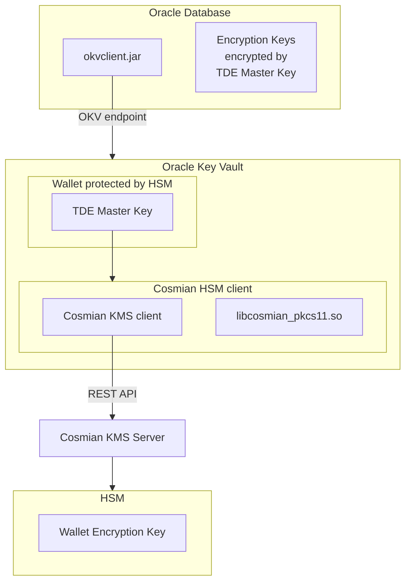
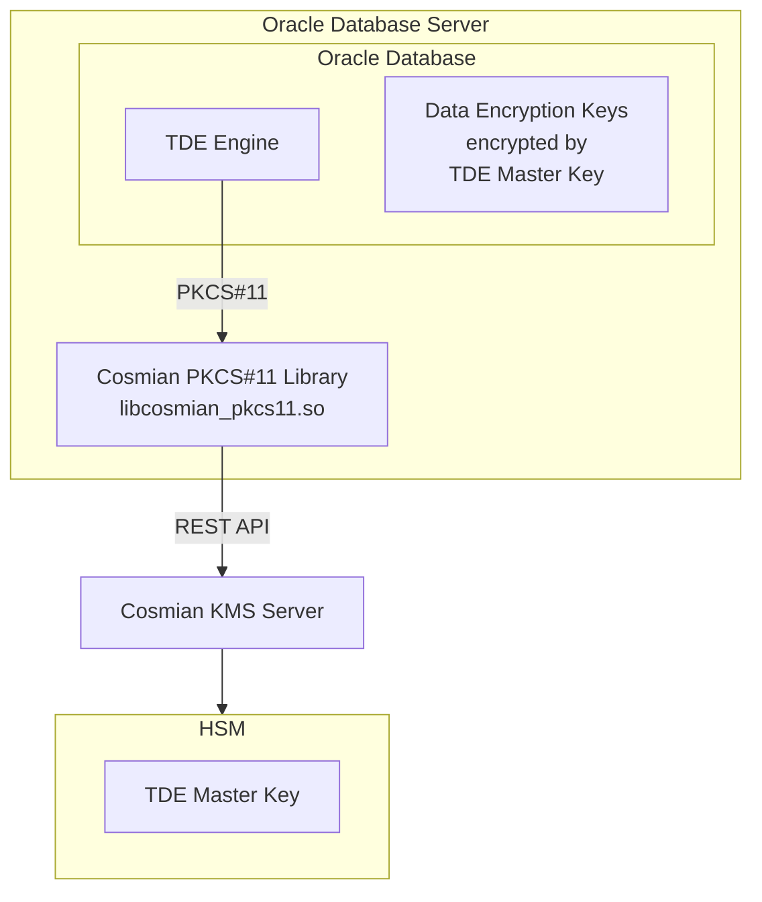

# Oracle Database Transparent Data Encryption (TDE)

**Oracle Database** [Transparent Data Encryption (TDE)](https://docs.oracle.com/en/database/oracle/oracle-database/23/dbtde/introduction-to-transparent-data-encryption.html) enables automatic encryption of data at rest in Oracle databases. Users can execute SQL queries normally while TDE handles encryption transparently in the background. Encryption keys are stored directly in the database but can be encrypted using **Oracle Key Vault** or directly with **Hardware Security Modules (HSM)** via PKCS#11.

Cosmian provides two deployment modes for Oracle TDE integration:

1. **Oracle Key Vault + HSM Mode**: Uses Oracle Key Vault as an intermediary with HSM as Root-of-Trust
2. **Direct HSM Mode**: Direct communication between Oracle Database and HSM via PKCS#11 interface

## Mode 1: Oracle Key Vault + HSM Integration

**Oracle Key Vault** centralizes encryption key management, offering secure storage and distribution for Oracle databases and enterprise applications. It uses `wallets` to the crucial TDE `master key` which acts as the `Key-Encryption-Key (KEK)` for TDE. The `master key` is stored in a `wallet` that is protected by a password. This `wallet` provides a secure and centralized location for managing encryption keys.

For enhanced security, **Hardware Security Modules (HSM)** can be integrated with Oracle Key Vault to provide additional protection for these `wallets`. This configuration establishes a [Root-of-Trust (RoT)](https://docs.oracle.com/en/database/oracle/key-vault/18.5/okvhm/getting-started-hsm.html#GUID-DADA7E20-82E2-40C9-A63A-4A159EBD5F09): when an HSM is deployed with Oracle Key Vault, the RoT remains in the HSM. The HSM RoT protects the Transparent Data Encryption (TDE) wallet password, which protects the TDE master key, which in turn protects all the encryption keys, certificates, and other security artifacts managed by the Oracle Key Vault server. Note that the HSM in this RoT usage scenario does not store any customer encryption keys. The customer keys are stored and managed directly by the Oracle Key Vault server.

Using HSM as a RoT is intended to mitigate attempts to recover keys from an Oracle Key Vault server which has been started in an unauthorized environment.
Physical loss of an Oracle Key Vault server from a facility is one example of such a scenario.

When an **Oracle Key Vault server** is HSM-enabled, Oracle Key Vault contacts the HSM every five minutes (or whatever you have set the monitoring interval to) to ensure that the Root of Trust key is available and the TDE wallet password can be decrypted.

What Cosmian provides is:

- **a HSM client**: this is a PKCS#11 provider library that make the Oracle Key Vault a HSM client itself. **It enables the Root-of-Trust** by protecting the Oracle Key Vault wallets passwords. That library also provides a KMS client to communicate with the KMS server.
- **a KMS server** that is interrogated by the KMS client. The KMS server can either front a HSM or act as a HSM but deployed in a secure environment.

<div align="center">



</div>

### Oracle Key Vault Configuration

Before configuring a HSM such as described in [Oracle Key Vault](https://docs.oracle.com/en/database/oracle/key-vault/21.10/okvhm/index.html), some steps are needed:

For Oracle Database OS, the PKCS#11 library is available here: [cosmian-pkcs11](https://package.cosmian.com/kms/5.22.0/pkcs11-zip/amd64/non-fips/static/cosmian-pkcs11-non-fips-static-openssl_5.22.0_linux-amd64.zip).

- Extract the package:

    ```bash
    unzip cosmian-pkcs11-non-fips-static-openssl_5.22.0_linux-amd64.zip
    ```

- Copy the PKCS#11 provider library to the Oracle Key Vault server to `/usr/local/okv/hsm/generic/libcosmian_pkcs11.so`
- Copy the configuration of the PKCS#11 provider library to `/usr/local/okv/hsm/generic/ckms.toml`
- Override the OKV generic HSM configuration files:

    - `/usr/local/okv/hsm/generic/okv_hsm_env`

    ```bash
    COSMIAN_PKCS11_LOGGING_LEVEL="trace"
    CKMS_CONF="/usr/local/okv/hsm/generic/ckms.toml"
    COSMIAN_PKCS11_LOGGING_FOLDER="/var/okv/log/hsm"
    ```

    - `/usr/local/okv/hsm/generic/okv_hsm_conf`

    ```bash
    # Oracle Key Vault HSM vendor configuration file
    # Lines must be shorter than 4096 characters.

    # The vendor name, to be displayed on the HSM page on the management console.
    VENDOR_NAME="Cosmian"

    # The location of the PKCS#11 library. This file must be preserved on upgrade.
    PKCS11_LIB_LOC="/usr/local/okv/hsm/generic/libcosmian_pkcs11.so"

    # A colon-separated list of the full paths of files and directories that must
    # be preserved on upgrade. All of these files and directories should have been
    # created by the HSM client software setup; none should have existed on Oracle
    # Key Vault by default. These will be necessary when upgrading to a version
    # of Oracle Key Vault that is running on a higher major OS version.
    # Do not use wildcards.
    PRESERVED_FILES=""
    ```

- At this point, the symmetric key labeled `OKV 18.1 HSM Root Key` has been created in KMS server by Oracle Key Vault.
- Then you can follow the official [HSM-Enabling in a Standalone Oracle Key Vault Deployment](https://docs.oracle.com/en/database/oracle/key-vault/21.10/okvhm/configuring-hsm-oracle-key-vault1.html#GUID-5645696A-3F19-4CF9-AE79-105569529182).

## Mode 2: Direct HSM Integration

For simplified deployments or environments where Oracle Key Vault is not available, Oracle Database can communicate directly with HSM via PKCS#11. In this mode, the Cosmian PKCS#11 library (`libcosmian_pkcs11.so`) provides direct access to the Cosmian KMS server, which manages the TDE master keys in the HSM.

This approach eliminates Oracle Key Vault from the architecture, reducing complexity while maintaining the security benefits of HSM-protected keys.

<div align="center">



</div>

### Direct HSM Configuration

#### Linux

1. **Install Cosmian PKCS#11 Library**

    For Oracle Database OS, the PKCS#11 library is available here: [cosmian-pkcs11](https://package.cosmian.com/kms/5.22.0/pkcs11-zip/amd64/non-fips/static/cosmian-pkcs11-non-fips-static-openssl_5.22.0_linux-amd64.zip).

    ```bash
    # Extract library from PKCS#11 ZIP package.
    unzip cosmian-pkcs11-non-fips-static-openssl_5.22.0_linux-amd64.zip

    # Copy to Oracle's HSM directory
    mkdir -p /opt/oracle/extapi/64/hsm/Cosmian/
    cp libcosmian_pkcs11.so /opt/oracle/extapi/64/hsm/Cosmian/
    chown oracle:oinstall /opt/oracle/extapi/64/hsm/Cosmian/libcosmian_pkcs11.so
    ```

2. **Configure Cosmian PKCS#11 Library**

    Create the configuration file `/home/oracle/.cosmian/ckms.toml`:

    ```toml
    [http_config]
    server_url = "http://kms:9998"
    ```

    Set proper ownership:

    ```bash
    mkdir -p /home/oracle/.cosmian/
    chown oracle:oinstall /home/oracle/.cosmian/ckms.toml
    ```

3. **Prepare Oracle Directory Structure**

    ```bash
    # Create keystore directories
    mkdir -p /etc/ORACLE/KEYSTORES/FREE
    chown -R oracle:oinstall /etc/ORACLE/KEYSTORES/FREE

    # Setup logging
    chown -R oracle:oinstall /var/log
    ```

4. **Configure Oracle Database for PKCS#11**

    Set up TDE to use the HSM via PKCS#11:

    ```sql
    -- Set WALLET_ROOT to point to the PKCS#11 library
    ALTER SYSTEM SET WALLET_ROOT='/opt/oracle/extapi/64/hsm/Cosmian/libcosmian_pkcs11.so' SCOPE=SPFILE;
    SHUTDOWN IMMEDIATE;
    STARTUP;

    -- Configure TDE to use HSM keystore
    ALTER SYSTEM SET TDE_CONFIGURATION='KEYSTORE_CONFIGURATION=HSM' SCOPE=BOTH SID='*';
    SHUTDOWN IMMEDIATE;
    STARTUP;
    ```

5. **Create and Configure HSM Keystore**

    ```sql
    -- Open the HSM keystore
    ADMINISTER KEY MANAGEMENT SET KEYSTORE OPEN IDENTIFIED BY hsm_identity_pass;

    -- Create TDE master key in HSM with backup
    ADMINISTER KEY MANAGEMENT SET KEY IDENTIFIED BY hsm_identity_pass WITH BACKUP;
    ```

6. **Verify Configuration**

    ```sql
    -- Check keystore status
    COLUMN WRL_PARAMETER FORMAT A50;
    SET LINES 200;
    SELECT WRL_TYPE, WRL_PARAMETER, WALLET_TYPE, STATUS FROM V$ENCRYPTION_WALLET;

    -- Verify keys are stored in HSM
    COLUMN NAME FORMAT A40;
    SET LINES 400;
    SELECT KEY_ID, KEYSTORE_TYPE, CREATOR_DBNAME, ACTIVATION_TIME, KEY_USE, ORIGIN
    FROM V$ENCRYPTION_KEYS;
    ```

7. **Optional: Create Test Encrypted Table**

    ```sql
    -- Create a table with encrypted columns to verify TDE is working
    CREATE TABLE test_tde (something CHAR(32) ENCRYPT);
    ```

#### Windows

Oracle 26ai Free for Windows has two unfixed HSM/PKCS#11 issues that require workarounds
when configuring TDE directly (without Oracle Key Vault):

1. **`skgdllDiscover` finds nothing on Windows.** The auto-discovery function only scans the
   hard-coded Linux path `/opt/oracle/extapi/64/pkcs11/`. No equivalent Windows path is
   scanned, so Oracle cannot locate any PKCS#11 DLL automatically.

2. **`pkcs11_library_location` rejects Windows paths.** The `ALTER SYSTEM SET` validator checks
   that the supplied path starts with `/opt/oracle/extapi/64/pkcs11/`. Any Windows path
   (`C:\...`) is rejected with `ORA-46707` / `ORA-32017`.

The steps below apply the required workarounds.

1. **Install Cosmian PKCS#11 Library**

    Download `cosmian_pkcs11.dll` from the [release packages](https://package.cosmian.com/kms/5.16.2/).

    The DLL **must** be placed at the drive-relative Linux path so that Oracle's
    `LoadLibrary` call resolves it. On Windows a path starting with `/` is treated as
    drive-relative (`/opt/...` → `C:\opt\...` on a system where `C:` is the current drive).

    ```powershell
    # Create the required directory structure
    New-Item -ItemType Directory -Force -Path 'C:\opt\oracle\extapi\64\pkcs11'

    # Install the DLL (both locations are used by Oracle)
    Copy-Item cosmian_pkcs11.dll 'C:\opt\oracle\extapi\64\pkcs11\cosmian_pkcs11.dll'

    New-Item -ItemType Directory -Force -Path "$env:ORACLE_HOME\extapi\64\hsm\Cosmian"
    Copy-Item cosmian_pkcs11.dll "$env:ORACLE_HOME\extapi\64\hsm\Cosmian\cosmian_pkcs11.dll"
    ```

2. **Configure Cosmian PKCS#11 Library**

    Place `ckms.toml` alongside the DLL so it is found regardless of which Windows user
    account Oracle's service runs under:

    ```powershell
    @'
    [http_config]
    server_url = "http://kms:9998"
    '@ | Set-Content -Path 'C:\opt\oracle\extapi\64\pkcs11\ckms.toml' -Encoding UTF8
    ```

    > **Note:** The PKCS#11 library searches for `ckms.toml` in the following order:
    > `CKMS_CONF` environment variable → directory containing the DLL →
    > `%USERPROFILE%\.cosmian\ckms.toml`.

3. **Prepare Oracle Wallet Directory**

    ```powershell
    # Create the wallet directory (adjust path to match your ORACLE_BASE)
    New-Item -ItemType Directory -Force -Path 'C:\app\oracle\admin\FREE\wallet'
    ```

4. **Configure Oracle Database for PKCS#11**

    Because `ALTER SYSTEM SET pkcs11_library_location` rejects Windows paths, set all three
    TDE parameters via a plain PFILE and restart with `STARTUP PFILE=`:

    ```sql
    -- Step 1: capture current in-memory parameters to a text PFILE
    CREATE PFILE='C:\app\oracle\dbhomeFree\database\initFREE_pkcs11.ora' FROM MEMORY;
    SHUTDOWN IMMEDIATE;
    ```

    Edit the generated `initFREE_pkcs11.ora` with a text editor and add (or update) the
    following three lines — using forward slashes throughout:

    ```ini
    *.wallet_root='C:/app/oracle/admin/FREE/wallet'
    *.tde_configuration='KEYSTORE_CONFIGURATION=HSM'
    *.pkcs11_library_location='/opt/oracle/extapi/64/pkcs11/cosmian_pkcs11.dll'
    ```

    Then restart and persist:

    ```sql
    -- Step 2: start the instance using the edited PFILE
    STARTUP PFILE='C:\app\oracle\dbhomeFree\database\initFREE_pkcs11.ora';

    -- Step 3: write the active configuration back to SPFILE
    CREATE SPFILE FROM MEMORY;
    ```

5. **Create and Configure HSM Keystore**

    ```sql
    -- Open the HSM keystore (loads cosmian_pkcs11.dll)
    ADMINISTER KEY MANAGEMENT SET KEYSTORE OPEN IDENTIFIED BY hsm_identity_pass;

    -- Create TDE master key in HSM
    ADMINISTER KEY MANAGEMENT SET KEY IDENTIFIED BY hsm_identity_pass;
    ```

6. **Verify Configuration**

    ```sql
    -- Check keystore status
    COLUMN WRL_PARAMETER FORMAT A50;
    SET LINES 200;
    SELECT WRL_TYPE, WRL_PARAMETER, WALLET_TYPE, STATUS FROM V$ENCRYPTION_WALLET;

    -- Verify keys are stored in HSM
    SET LINES 400;
    SELECT KEY_ID, KEYSTORE_TYPE, CREATOR_DBNAME, ACTIVATION_TIME, KEY_USE, ORIGIN
    FROM V$ENCRYPTION_KEYS;
    ```

7. **Optional: Create Test Encrypted Table**

    ```sql
    CREATE TABLE test_tde (something CHAR(32) ENCRYPT);
    ```

**Troubleshooting:**

- PKCS#11 log (service user): `C:\WINDOWS\ServiceProfiles\OracleService<SID>\.cosmian\cosmian-pkcs11.log`
- PKCS#11 log (current user): `%USERPROFILE%\.cosmian\cosmian-pkcs11.log`
- Oracle alert log: `%ORACLE_BASE%\diag\rdbms\free\<SID>\trace\alert_<SID>.log`
- Oracle trace dir: `%ORACLE_BASE%\diag\rdbms\free\<SID>\trace\`

### HSM Identity and Authentication

#### Architecture: libcosmian_pkcs11.so as a proxy

`libcosmian_pkcs11.so` is **not** an HSM driver. It is a thin **proxy** between Oracle Database
and the Cosmian KMS server:

```text
Oracle TDE Engine  →  libcosmian_pkcs11.so  →  (HTTP/HTTPS)  →  Cosmian KMS Server  →  HSM
                       (PKCS#11 C API)          (REST API via                         (slot + PIN
                                                 ckms.toml)                            managed here)
```

The KMS server is responsible for the actual HSM connection — including slot selection and HSM
PIN. Oracle never communicates directly with the HSM; `libcosmian_pkcs11.so` simply forwards
PKCS#11 operations to the KMS over the network.

#### What the SQL command does

```sql
ADMINISTER KEY MANAGEMENT SET KEYSTORE OPEN IDENTIFIED BY hsm_identity_pass;
```

Oracle's `ADMINISTER KEY MANAGEMENT` syntax always ends with `IDENTIFIED BY <value>`. This
command internally translates into two PKCS#11 calls:

1. **`C_OpenSession`** — opens a PKCS#11 session on the slot exposed by `libcosmian_pkcs11.so`.
2. **`C_Login(CKU_USER, pin=hsm_identity_pass)`** — passes `hsm_identity_pass` as the PKCS#11
   user PIN.

#### `hsm_identity_pass` and authentication modes

The value after `IDENTIFIED BY` in Oracle SQL is passed as the PIN to `C_Login`. The library
supports two modes, controlled by `pkcs11_use_pin_as_access_token` in `ckms.toml`:

| `pkcs11_use_pin_as_access_token` | Behavior |
|----------------------------------|----------|
| `false` (default) | `C_Login` accepts any PIN without validation and returns `CKR_OK`. The value `hsm_identity_pass` is a self-documenting placeholder — any non-empty string works. KMS authentication uses credentials from `ckms.toml`. |
| `true` | `C_Login` treats the PIN as a short-lived OIDC/JWT bearer token forwarded to the KMS REST API. No credentials are stored in `ckms.toml`; Oracle supplies the token at keystore-open time. |

**Bearer token mode** (`pkcs11_use_pin_as_access_token = true`):

```toml
# ckms.toml
pkcs11_use_pin_as_access_token = true

[http_config]
server_url = "https://kms.example.com:9998"
```

Oracle then passes the JWT token directly:

```sql
ADMINISTER KEY MANAGEMENT SET KEYSTORE OPEN IDENTIFIED BY '<jwt_token>';
```

This approach lets Oracle authenticate to the KMS without storing any credentials in
`ckms.toml` or on the filesystem.

For all other KMS authentication methods (mTLS, static bearer token, OAuth2/OIDC), configure
`ckms.toml` using the [CLI Authentication guide](../../../cli_documentation/docs/authentication.md).

## Wallet Migration

Oracle TDE supports migrating the master encryption key between a software wallet (file-based
keystore) and the HSM wallet backed by `libcosmian_pkcs11.so`. Both directions are supported
and are verified in CI by `.github/scripts/oracle/run_sql_commands.sh`.

- **Forward (SW → HSM)**: Oracle calls `C_GenerateKey(CKM_AES_KEY_GEN)` to create a new master key in the KMS, then `C_Encrypt` to re-wrap DEKs.
- **Reverse (HSM → SW)**: Oracle calls `C_Decrypt` on the HSM master key to unwrap DEKs before re-encrypting under the new software key.

> **Configuration note**: In pure HSM mode, `WALLET_ROOT` points to the PKCS#11 library
> file path. In hybrid or file-only modes, `WALLET_ROOT` must be a **directory**; Oracle
> then auto-discovers the library from `/opt/oracle/extapi/64/hsm/<vendor>/lib<name>.so`.
>
> **Note**: `libcosmian_pkcs11.so` prior to version 5.20 reported `CKF_WRITE_PROTECTED`,
> blocking `C_GenerateKey` during forward migration. This flag was removed in 5.20.

### HSM Wallet → Software Wallet (Reverse Migration)

Starting from HSM-only mode, follow these steps. Each `TDE_CONFIGURATION` change requires a restart.

```sql
-- 1. Switch WALLET_ROOT from library path to a directory (required for file-based keystore)
ALTER SYSTEM SET WALLET_ROOT='/etc/ORACLE/KEYSTORES/FREE' SCOPE=SPFILE;
SHUTDOWN IMMEDIATE;
STARTUP;

-- 2. Create the software keystore
ADMINISTER KEY MANAGEMENT CREATE KEYSTORE IDENTIFIED BY <sw_password>;

-- 3. Switch to FILE|HSM hybrid mode (file primary, HSM secondary)
ALTER SYSTEM SET TDE_CONFIGURATION='KEYSTORE_CONFIGURATION=FILE|HSM' SCOPE=BOTH SID='*';
SHUTDOWN IMMEDIATE;
STARTUP;

-- 4. Open both keystores (software wallet first, then HSM)
ADMINISTER KEY MANAGEMENT SET KEYSTORE OPEN IDENTIFIED BY <sw_password>;
ADMINISTER KEY MANAGEMENT SET KEYSTORE OPEN IDENTIFIED BY <token>;
-- <token> = hsm_identity_pass (or JWT token if pkcs11_use_pin_as_access_token = true)

-- 5. Generate a new software master key and re-wrap DEKs
--    Oracle calls C_Decrypt on the HSM key to unwrap DEKs, then re-encrypts under the new software key.
ADMINISTER KEY MANAGEMENT SET ENCRYPTION KEY
  IDENTIFIED BY <sw_password>
  REVERSE MIGRATE USING <token>
  WITH BACKUP;

-- 6. Switch to file-only mode
ALTER SYSTEM SET TDE_CONFIGURATION='KEYSTORE_CONFIGURATION=FILE' SCOPE=BOTH SID='*';
SHUTDOWN IMMEDIATE;
STARTUP;
ADMINISTER KEY MANAGEMENT SET KEYSTORE OPEN IDENTIFIED BY <sw_password>;
```

### Software Wallet → HSM Wallet (Forward Migration)

Starting from file-only mode (after a reverse migration, or from a fresh software wallet),
with `WALLET_ROOT` already pointing to a directory:

```sql
-- 1. Switch to HSM|FILE hybrid mode (HSM primary, file secondary)
ALTER SYSTEM SET TDE_CONFIGURATION='KEYSTORE_CONFIGURATION=HSM|FILE' SCOPE=BOTH SID='*';
SHUTDOWN IMMEDIATE;
STARTUP;

-- 2. Open both keystores (HSM first, then software wallet)
ADMINISTER KEY MANAGEMENT SET KEYSTORE OPEN IDENTIFIED BY <token>;
ADMINISTER KEY MANAGEMENT SET KEYSTORE OPEN IDENTIFIED BY <sw_password>;

-- 3. Generate a new HSM master key and re-wrap DEKs
--    Oracle calls C_GenerateKey → C_Encrypt internally.
--    WITH BACKUP is omitted: ORA-46623 prevents backup creation in HSM|FILE mode.
ADMINISTER KEY MANAGEMENT SET ENCRYPTION KEY
  IDENTIFIED BY <token>
  MIGRATE USING <sw_password>;

-- 4. Switch to HSM-only mode
ALTER SYSTEM SET TDE_CONFIGURATION='KEYSTORE_CONFIGURATION=HSM' SCOPE=BOTH SID='*';
SHUTDOWN IMMEDIATE;
STARTUP;
ADMINISTER KEY MANAGEMENT SET KEYSTORE OPEN IDENTIFIED BY <token>;
```

## Multiple Wallets Handling with the Same Database

Oracle TDE supports several multi-wallet configurations on a single database instance. The Cosmian PKCS#11 library is transparent to these layouts: every keystore operation that reaches the HSM is forwarded to the KMS server regardless of the number of active wallets.

### Combined HSM and Software Wallet

Oracle supports a combined keystore by setting `KEYSTORE_CONFIGURATION=HSM|FILE`. In this mode the TDE master key is generated and stored in the HSM (via the Cosmian PKCS#11 library), while Oracle also maintains a local file-based software wallet. This is useful when an auto-login wallet is required for datafile decryption during automatic instance startup, or for keystore redundancy.

Configure the combined mode:

```sql
ALTER SYSTEM SET TDE_CONFIGURATION='KEYSTORE_CONFIGURATION=HSM|FILE' SCOPE=BOTH SID='*';
SHUTDOWN IMMEDIATE;
STARTUP;
```

With the combined configuration, both keystores must be opened explicitly before any key operation:

```sql
-- Open the HSM keystore (Cosmian PKCS#11)
ADMINISTER KEY MANAGEMENT SET KEYSTORE OPEN IDENTIFIED BY hsm_identity_pass FOR HSM;

-- Open the file-based wallet (use the wallet password here)
ADMINISTER KEY MANAGEMENT SET KEYSTORE OPEN IDENTIFIED BY wallet_password FOR WALLET;
```

To rotate the TDE master key and update both keystores simultaneously:

```sql
ADMINISTER KEY MANAGEMENT SET KEY IDENTIFIED BY hsm_identity_pass
    WITH BACKUP USING 'pre_rotation_backup' CONTAINER = ALL;
```

### Per-PDB Isolated Keystores (Multitenant CDB)

In a multitenant Container Database (CDB), each Pluggable Database (PDB) can hold its own TDE master key. All PDB master keys are ultimately protected by the same Cosmian KMS through the shared PKCS#11 library, while Oracle enforces key isolation at the PDB boundary.

Activate per-PDB isolated keystores:

```sql
-- In the CDB root: enable HSM for all containers
ALTER SYSTEM SET TDE_CONFIGURATION='KEYSTORE_CONFIGURATION=HSM' SCOPE=BOTH SID='*';
SHUTDOWN IMMEDIATE;
STARTUP;

-- Open the root keystore
ADMINISTER KEY MANAGEMENT SET KEYSTORE OPEN IDENTIFIED BY hsm_identity_pass CONTAINER = ALL;

-- Switch to a specific PDB and create its own master key
ALTER SESSION SET CONTAINER = pdb1;
ADMINISTER KEY MANAGEMENT SET KEY IDENTIFIED BY hsm_identity_pass
    WITH BACKUP CONTAINER = CURRENT;
```

Each PDB master key is stored in the Cosmian KMS under a unique label prefixed with `ORACLE.SECURITY.TDE.HSM.MASTERKEY.`, ensuring tenant isolation within the same KMS server. No additional KMS configuration is required to support multiple PDBs.

### Key Rotation Across Wallets

When rotating TDE master keys in a multi-wallet setup, always open all active keystores before issuing the `SET KEY` command so Oracle can re-wrap the existing data encryption keys:

```sql
-- Open both keystores (combined HSM+FILE example)
ADMINISTER KEY MANAGEMENT SET KEYSTORE OPEN IDENTIFIED BY hsm_identity_pass FOR HSM;
ADMINISTER KEY MANAGEMENT SET KEYSTORE OPEN IDENTIFIED BY wallet_password FOR WALLET;

-- Rotate the master key
ADMINISTER KEY MANAGEMENT SET KEY IDENTIFIED BY hsm_identity_pass
    WITH BACKUP USING 'rotation_backup';
```

After rotation, verify the new key is active:

```sql
SELECT KEY_ID, KEYSTORE_TYPE, CREATOR_DBNAME, ACTIVATION_TIME, KEY_USE, ORIGIN
FROM V$ENCRYPTION_KEYS
ORDER BY ACTIVATION_TIME DESC;
```

---

## Environment Variables Used by `cosmian_pkcs11`

The Cosmian PKCS#11 library reads the following environment variables at startup (i.e. when
`C_GetFunctionList` is called). All variables are optional unless otherwise noted.

| Variable | Default | Description |
|---|---|---|
| `CKMS_CONF` | *(none)* | Explicit path to a `ckms.toml` configuration file. Overrides all other discovery paths. |
| `COSMIAN_PKCS11_LOGGING_LEVEL` | `info` | Log verbosity level: `trace`, `debug`, `info`, `warn`, or `error`. |
| `COSMIAN_PKCS11_LOGGING_FOLDER` | `~/.cosmian/` | *(Linux only)* Directory where `cosmian-pkcs11.log` is written. On macOS/Windows the log is always written to `~/.cosmian/`. |
| `COSMIAN_PKCS11_DISK_ENCRYPTION_TAG` | `disk-encryption` | KMS object tag used to identify disk-encryption keys (VeraCrypt, LUKS). Override if your KMS objects use a different tag. |
| `COSMIAN_PKCS11_SSH_KEY_TAG` | `ssh-auth` | KMS object tag used to identify SSH authentication keys. Override if your KMS objects use a different tag. |
| `COSMIAN_PKCS11_IGNORE_SESSIONS` | `false` | When set to `true`, the module reuses a single internal session handle instead of creating one per `C_OpenSession` call. Intended for applications that call `C_OpenSession` more times than the token supports. |

### Notes

- Variables must be set **before** the application loads the library (i.e. before the first
  call to `C_GetFunctionList`). Changes made after loading have no effect.
- For Oracle Database (Linux), set variables in the Oracle instance environment before starting
  the process, or via the `okv_hsm_env` file for Oracle Key Vault.
- For Oracle Database (Windows), set them as system environment variables (visible to the Oracle
  service account) or in the Oracle service user's profile.
- `CKMS_CONF` is the most commonly needed variable. If `ckms.toml` is not found through any
  discovery path, `C_GetFunctionList` returns `CKR_FUNCTION_FAILED` and the library refuses
  to load.
- The log file is always appended (never rotated). Monitor its size in long-running deployments.

### Making variables persistent for the Oracle Database process (Linux)

Oracle Database runs as the OS user `oracle` (or a custom service account). Environment variables
must be present in that user's **process environment at the moment the Oracle instance starts**,
not only in an interactive shell. There are several standard approaches:

#### Option A — Oracle instance environment file (`oraenv`-style `.env`)

Oracle Database 12c and later can load a per-instance environment file from
`$ORACLE_HOME/dbs/oraenv_<ORACLE_SID>` or the path specified by `ORACLE_ENV_PATH`. Variables
placed there are injected before the instance starts:

```bash
# /etc/oratab (verified)
ORCL:/opt/oracle/product/19c/dbhome_1:Y

# /opt/oracle/product/19c/dbhome_1/dbs/oraenv_ORCL   (create if absent, owned by oracle)
CKMS_CONF="/home/oracle/.cosmian/ckms.toml"
COSMIAN_PKCS11_DISK_ENCRYPTION_TAG="disk-encryption"
COSMIAN_PKCS11_LOGGING_LEVEL="info"
COSMIAN_PKCS11_LOGGING_FOLDER="/var/log/cosmian/"
```

> **Permissions**: the file must be readable by the `oracle` user and must not be world-writable.

#### Option B — `oracle` user's login profile (`~oracle/.bash_profile` or `~oracle/.profile`)

When Oracle is started manually (e.g. by running `sqlplus / as sysdba` then
`startup`) or via a wrapper script that sources the user profile, exporting
variables in the login profile is sufficient:

```bash
# ~oracle/.bash_profile  (or ~/.profile for sh/ksh)
export CKMS_CONF="/home/oracle/.cosmian/ckms.toml"
export COSMIAN_PKCS11_DISK_ENCRYPTION_TAG="disk-encryption"
export COSMIAN_PKCS11_LOGGING_LEVEL="info"
export COSMIAN_PKCS11_LOGGING_FOLDER="/var/log/cosmian/"
```

!!! warning
    `~/.bashrc` is **not** read for non-interactive sessions.  Use `.bash_profile`
    (Bash login), `.profile` (POSIX sh / ksh), or `.zprofile` (zsh).
    When Oracle is started by `systemd` or another init system, this file is only
    sourced if the unit uses `User=oracle` **and** the init system spawns a login
    shell — which many do not.

#### Option C — `systemd` service unit (recommended when Oracle is managed by `systemd`)

This is the most reliable option when Oracle is controlled by a `systemd` unit file
(common for Oracle 19c+ on RHEL/OEL 8+):

```ini
# /etc/systemd/system/oracle-database.service.d/cosmian.conf
# (drop-in override — create the .d/ directory if absent)
[Service]
Environment="CKMS_CONF=/home/oracle/.cosmian/ckms.toml"
Environment="COSMIAN_PKCS11_DISK_ENCRYPTION_TAG=disk-encryption"
Environment="COSMIAN_PKCS11_LOGGING_LEVEL=info"
Environment="COSMIAN_PKCS11_LOGGING_FOLDER=/var/log/cosmian/"
```

Reload and restart after adding the drop-in:

```bash
sudo systemctl daemon-reload
sudo systemctl restart oracle-database
```

Verify the variables are visible to the running process:

```bash
sudo cat /proc/$(pgrep -o pmon)/environ | tr '\0' '\n' | grep -E 'CKMS|COSMIAN'
```

#### Option D — Oracle Key Vault `okv_hsm_env` (OKV deployments only)

If Oracle Key Vault (OKV) is the HSM manager, the canonical location is the OKV
environment file that is sourced before every HSM operation:

```bash
# /usr/local/okv/hsm/generic/okv_hsm_env
CKMS_CONF="/usr/local/okv/hsm/generic/ckms.toml"
COSMIAN_PKCS11_DISK_ENCRYPTION_TAG="disk-encryption"
COSMIAN_PKCS11_LOGGING_LEVEL="info"
COSMIAN_PKCS11_LOGGING_FOLDER="/var/log/cosmian/"
```

> See the [Oracle Key Vault Administrator's Guide](https://docs.oracle.com/en/database/oracle/key-vault/) for details on `okv_hsm_env` format and reload procedure.

#### Verifying that Oracle sees the variables

After any of the above changes, confirm the library picks them up **without restarting
Oracle**-side applications** by running the diagnostic binary as the `oracle` user:

```bash
sudo -u oracle \
  COSMIAN_PKCS11_LOGGING_LEVEL=debug \
  cosmian_pkcs11_verify \
  --so-path /opt/oracle/extapi/64/hsm/Cosmian/libcosmian_pkcs11.so
```

If the correct tag and config path appear in the debug output, the variables are
propagated correctly.

### Verifying the library loads correctly

Use the `cosmian_pkcs11_verify` diagnostic binary (shipped alongside `ckms` and
`libcosmian_pkcs11.so` in the Cosmian KMS CLI package) to confirm that the library is loadable,
`ckms.toml` is found, and the KMS server is reachable.

**Modes 0 and 1** (no auth or static token/TLS cert — the default):

```bash
# Basic check (uses ~/.cosmian/ckms.toml by default)
cosmian_pkcs11_verify --so-path /usr/local/lib/libcosmian_pkcs11.so

# Explicit config path
cosmian_pkcs11_verify \
  --so-path /opt/oracle/extapi/64/hsm/Cosmian/libcosmian_pkcs11.so \
  --conf /home/oracle/.cosmian/ckms.toml

# Verbose — combine with logging env var to also capture library-side trace output
COSMIAN_PKCS11_LOGGING_LEVEL=debug \
  cosmian_pkcs11_verify --so-path /usr/local/lib/libcosmian_pkcs11.so
```

**Mode 2** (`pkcs11_use_pin_as_access_token = true` — OIDC token supplied at keystore open):

A short-lived JWT must be obtained from your identity provider and passed via `--token`
(or the `COSMIAN_PKCS11_TOKEN` environment variable):

```bash
TOKEN=$(oidc-token my-oidc-profile)   # example using oidc-agent; adapt to your IdP

cosmian_pkcs11_verify \
  --so-path /opt/oracle/extapi/64/hsm/Cosmian/libcosmian_pkcs11.so \
  --conf /home/oracle/.cosmian/ckms.toml \
  --token "$TOKEN"
```

Expected output when everything is working (modes 0 and 1):

```text
[conf] Will use default home config: /home/oracle/.cosmian/ckms.toml

[load] Opening: /usr/local/lib/libcosmian_pkcs11.so
[load] OK: shared library opened

[C_GetFunctionList] OK: ckms.toml parsed
[C_Initialize] OK
[C_GetSlotList] OK: using slot ID 1
[C_OpenSession] OK: session opened on slot 1
[C_FindObjects] Enumerating objects by class:
  CKO_DATA: N
  CKO_PUBLIC_KEY: N
  CKO_PRIVATE_KEY: N
  CKO_SECRET_KEY: N
[C_FindObjects] OK: N PKCS#11 object(s) visible on KMS
[C_CloseSession] OK
[C_Finalize] OK

All checks passed.
```

Expected output for mode 2 (with `--token`):

```text
[C_GetFunctionList] OK: ckms.toml parsed
[C_Initialize] OK
[C_GetSlotList] OK: using slot ID 1
[C_OpenSession] OK: session opened on slot 1
[C_Login] OK: session authenticated with provided token
[C_FindObjects] Enumerating objects by class:
  ...
All checks passed.
```

If `--token` is omitted with mode 2, object enumeration fails with `CKR_USER_NOT_LOGGED_IN`.

---

## Authentication from Oracle to KMS

The Cosmian PKCS#11 library (`libcosmian_pkcs11.so` on Linux, `cosmian_pkcs11.dll` on Windows) communicates with the Cosmian KMS server over HTTP or HTTPS. Authentication is configured through the `ckms.toml` file that the library reads at startup.

### Configuration File Discovery

The library resolves `ckms.toml` using the following search order:

1. **`CKMS_CONF` environment variable** — explicit path, takes precedence over everything else. For Oracle Key Vault, set this in `/usr/local/okv/hsm/generic/okv_hsm_env`.
2. **`ckms.toml` beside the PKCS#11 library** — a file named `ckms.toml` placed in the same directory as the `.so`/`.dll`. Convenient when the library is deployed at a fixed path (e.g. `C:\opt\oracle\extapi\64\pkcs11\ckms.toml` on Windows).
3. **`~/.cosmian/ckms.toml`** — home directory of the OS user running the Oracle process (typically `/home/oracle/.cosmian/ckms.toml` on Linux).
4. **`/etc/cosmian/ckms.toml`** — system-wide fallback on Linux.

For Oracle Key Vault, set `CKMS_CONF` in the OKV environment file so all Oracle Key Vault processes share the same configuration:

```bash
# /usr/local/okv/hsm/generic/okv_hsm_env
CKMS_CONF="/usr/local/okv/hsm/generic/ckms.toml"
```

### No Authentication (Development / Internal Networks)

For development environments or deployments where the KMS is on a fully trusted internal network:

```toml
[http_config]
server_url = "http://kms:9998"
```

### Bearer Token Authentication

When the KMS server is configured with API-token or JWT/OIDC authentication, supply an `access_token`. The token is sent as an `Authorization: Bearer <token>` HTTP header on every request.

```toml
[http_config]
server_url = "https://kms.example.com:9998"
access_token = "<your-bearer-token>"
```

> **Note**: storing a long-lived token in `ckms.toml` means any OS user who can read the file gains KMS access. For production, prefer TLS client certificates (below) or the OIDC dynamic-token mode.

### OIDC / JWT Keystore Authentication (Dynamic Token)

This mode keeps **zero credentials** in `ckms.toml`. Instead, when Oracle opens the encrypted wallet, the DBA supplies a short-lived JWT from an identity provider via the `IDENTIFIED BY` clause. The library validates it against the KMS on every keystore open.

| Mode | `ckms.toml` credentials | When KmsClient is created | `C_Login` behavior |
|---|---|---|---|
| **0 — No auth** | none | library load | no-op |
| **1 — Static token / TLS cert** | token or cert paths | library load | no-op |
| **2 — OIDC dynamic token** | **none** (flag only) | `C_Login` call | validates + uses token |

#### `ckms.toml` for mode 2

```toml
[http_config]
server_url = "https://kms.example.com:9998"
# No credentials stored here

pkcs11_use_pin_as_access_token = true
```

#### Oracle SQL

The value after `IDENTIFIED BY` becomes the bearer token sent to the KMS:

```sql
ADMINISTER KEY MANAGEMENT SET KEYSTORE OPEN
  IDENTIFIED BY 'eyJhbGciOiJSUzI1NiIsInR5cCI6IkpXVCJ9...';
```

A wrapper script that fetches a fresh token before opening the keystore is strongly recommended:

```bash
#!/usr/bin/env bash
# Fetch a short-lived JWT (example using oidc-agent; adapt to your IdP)
TOKEN=$(oidc-token my-oidc-profile)
sqlplus -s / as sysdba <<EOF
ADMINISTER KEY MANAGEMENT SET KEYSTORE OPEN IDENTIFIED BY '$TOKEN';
EOF
```

#### Security properties

- `ckms.toml` contains no secrets — reading the file grants nothing.
- Each keystore open requires a fresh token from the IdP; expired tokens are rejected (`401 Unauthorized` from KMS → `C_Login` failure).
- An empty `IDENTIFIED BY` string returns `CKR_PIN_INCORRECT` (Oracle: `ORA-28354`).
- Use `cosmian_pkcs11_verify --token <JWT>` to test the full flow end-to-end; see [Verifying the library loads correctly](#verifying-the-library-loads-correctly).

### TLS Client Certificate Authentication (Recommended for Production)

Mutual TLS (mTLS) is the recommended authentication method for production deployments. Each Oracle host or database instance is provisioned with a unique client certificate; the KMS identifies and authorises callers by the certificate's Common Name (CN).

**KMS server prerequisites:** the server must be started in TLS mode with a CA certificate configured to validate client certificates. See [TLS configuration](../../configuration/tls.md) and [Authentication](../../configuration/authentication.md) for the server-side setup.

#### PEM Certificates (FIPS-Compatible, Recommended)

```toml
[http_config]
server_url = "https://kms.example.com:9998"

# Client certificate in PEM format (leaf certificate, or leaf + intermediate chain)
tls_client_pem_cert_path = "/home/oracle/.cosmian/oracle-client.crt"

# Matching private key in PEM format (PKCS#8 or traditional RSA/EC)
tls_client_pem_key_path = "/home/oracle/.cosmian/oracle-client.key"
```

#### PKCS#12 Bundle (Non-FIPS Only)

```toml
[http_config]
server_url = "https://kms.example.com:9998"

# PKCS#12 bundle containing the client certificate and private key
tls_client_pkcs12_path = "/home/oracle/.cosmian/oracle-client.p12"
tls_client_pkcs12_password = "changeit"
```

#### Combined mTLS + Bearer Token (Multi-Factor)

```toml
[http_config]
server_url = "https://kms.example.com:9998"
tls_client_pem_cert_path = "/home/oracle/.cosmian/oracle-client.crt"
tls_client_pem_key_path  = "/home/oracle/.cosmian/oracle-client.key"

# Additional JWT bearer token for a second authentication factor
access_token = "<JWT_BEARER_TOKEN>"
```

### Server Certificate Pinning

To validate the KMS server against a specific PEM certificate (instead of the system CA bundle), use `verified_cert`. This is particularly useful when the KMS uses a self-signed or internal CA certificate:

```toml
[http_config]
server_url = "https://kms.example.com:9998"
# PEM-encoded server certificate expected from the KMS
verified_cert = """
-----BEGIN CERTIFICATE-----
MIIBxTCCAW...
-----END CERTIFICATE-----
"""
```

For testing only, you can disable server certificate verification entirely (not for production):

```toml
[http_config]
server_url = "https://kms.example.com:9998"
accept_invalid_certs = true  # INSECURE — testing only
```

> For the complete set of authentication options available on the KMS server side, see [Authentication](../../configuration/authentication.md).
