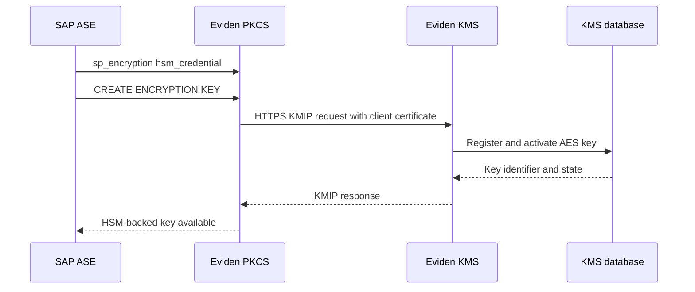
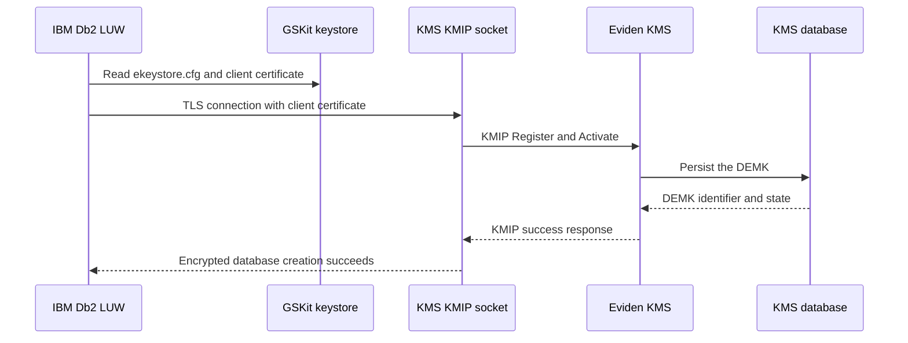

# SAP ASE and IBM Db2 LUW TDE

This guide describes the tested integration paths between Eviden KMS and two database products:

- SAP Sybase Adaptive Server Enterprise (ASE) uses the Eviden PKCS#11 provider for HSM-backed encryption keys.
- IBM Db2 LUW uses its GSKit keystore and KMIP 1.1 to create a database encryption master key (DEMK).

The integration tests run in non-FIPS mode because the PKCS#11 provider test path currently builds with the
`non-fips` feature.

## Architecture

### SAP ASE

ASE does not connect to KMIP directly in this integration. It loads `libcosmian_pkcs11.so`, and the provider
sends KMIP-over-REST requests to Eviden KMS.



### IBM Db2 LUW

Db2 connects to the KMS KMIP socket through GSKit. The Db2 configuration points to a KMIP configuration file,
which references the GSKit PKCS#12 keystore containing the CA and client certificate.



## Prerequisites

- Docker and Docker Compose.
- A local checkout of the Eviden KMS repository.
- The test certificates under `test_data/certificates/client_server/`.
- For SAP ASE, access to the SAP ASE Developer Edition installer. The default download URL is used by the test,
  but it can be overridden with `ASE_INSTALLER_URL`.
- For IBM Db2, access to the IBM Db2 Community Edition image. The image requires `LICENSE=accept`.

The integration tests use the following database versions and protocol paths:

| Product | Tested path | Test entry point |
| --- | --- | --- |
| SAP ASE 16 | PKCS#11 provider to KMS HTTPS endpoint | `.mise/scripts/test/test_ase_tde.sh` |
| IBM Db2 LUW 12.1+ | GSKit to KMS KMIP socket, KMIP 1.1 | `.mise/scripts/test/test_db2_tde.sh` |

## SAP ASE configuration

The test builds the `cosmian-ase-kmip` image for `linux/amd64`, builds `libcosmian_pkcs11.so`, and copies the
provider into the running ASE container. The provider reads a `ckms.toml` file similar to:

```toml
[http_config]
server_url = "https://host.docker.internal:<KMS_HTTP_PORT>"
accept_invalid_certs = true
tls_client_pkcs12_path = "/opt/sap/ASE-16_1/ssl/client.p12"
tls_client_pkcs12_password = "password"
```

Configure the ASE external keystore and provider credential with `isql`:

```sql
sp_configure 'external keystore', 0, 'HSM'
go
sp_configure 'enable encrypted columns', 1
go
sp_encryption 'system_encr_passwd', 'MasterPass1!'
go
sp_encryption 'hsm_credential', 'lib=libcosmian_pkcs11.so; pin=0000; slot=1'
go
create encryption key hsm_key on external keystore with keylength 256 init_vector random
go
```

The `lib`, `pin`, and `slot` values are passed to the PKCS#11 provider. KMIP endpoint, TLS, and KMS credentials
remain in `ckms.toml` and are not configured as ASE KMIP parameters.

Run the integration test with:

```bash
mise run test:ase --variant non-fips
```

The test verifies mTLS rejection without a client certificate, a KMS REST encrypt/decrypt round-trip, provider
loading inside ASE, creation of an HSM-backed AES key, and visibility of the new key in KMS.

## IBM Db2 LUW configuration

The test starts the `db2-tde` Compose service and creates a GSKit PKCS#12 keystore containing the KMS CA and the
Db2 client certificate. It then writes a KMIP configuration file like this inside the Db2 container:

```text
VERSION=1
PRODUCT_NAME=OTHER
ALLOW_KEY_INSERT_WITHOUT_KEYSTORE_BACKUP=TRUE
SSL_KEYDB=<GSKit PKCS#12 path>
SSL_KEYDB_STASH=<GSKit stash path>
SSL_KMIP_CLIENT_CERTIFICATE_LABEL=db2kmip_client
PRIMARY_SERVER_HOST=kmserver.acme.com
PRIMARY_SERVER_KMIP_PORT=<KMS_KMIP_PORT>
```

`PRODUCT_NAME=OTHER` selects a third-party KMIP key manager. `KEYSTORE_LOCATION` must point to this configuration
file, not to the GSKit PKCS#12 file itself. The test applies the setting with:

```bash
db2 "UPDATE DBM CFG USING KEYSTORE_TYPE KMIP KEYSTORE_LOCATION '<path-to-ekeystore.cfg>'"
```

Create the encrypted database with:

```bash
db2 "CREATE DATABASE KMIPDB ENCRYPT CIPHER AES KEY LENGTH 256"
```

Db2 registers and activates the DEMK through the KMS KMIP socket. The test confirms that the encrypted database
creation succeeds and that an additional AES key is visible through `ckms locate`.

Run the integration test with:

```bash
mise run test:db2 --variant non-fips
```

The test also verifies mTLS rejection without a client certificate and an independent KMS REST encrypt/decrypt
round-trip before configuring Db2.

## Troubleshooting

- If ASE cannot load the provider, inspect the container logs and verify that `libcosmian_pkcs11.so` is built for
  `linux/amd64` and has no dynamic OpenSSL dependency.
- If Db2 cannot create the database, verify that `gsk9certutil_64` created the client label
  `db2kmip_client`, that `libicu` is installed, and that `KEYSTORE_LOCATION` references `ekeystore.cfg`.
- If either client fails TLS negotiation, verify the CA, server certificate hostname, client certificate, and the
  KMS client-CA configuration.

The complete reproducible procedures are in `.mise/scripts/test/test_ase_tde.sh` and
`.mise/scripts/test/test_db2_tde.sh`.
