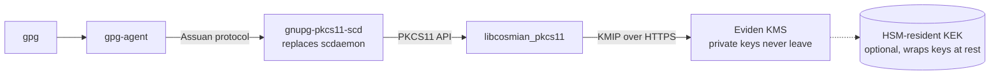
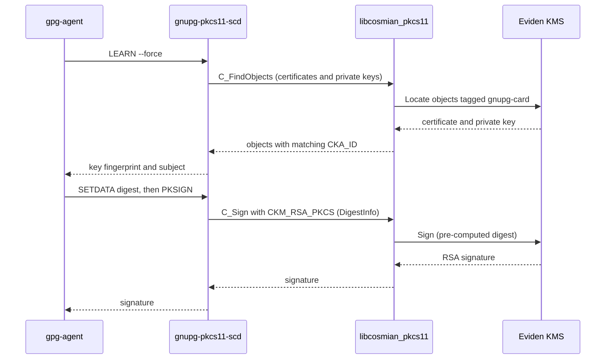
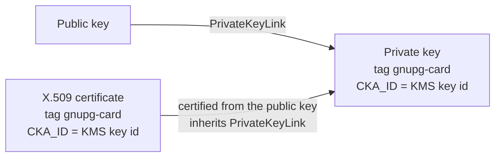

# GnuPG smartcard (gnupg-pkcs11-scd)

[`gnupg-pkcs11-scd`](https://github.com/alonbl/gnupg-pkcs11-scd) is a drop-in replacement for
GnuPG's `scdaemon` that bridges GnuPG's smartcard protocol to any PKCS#11 module. Pointed at the
Eviden KMS PKCS#11 provider (`libcosmian_pkcs11`), it lets `gpg` sign and decrypt with
KMS-managed RSA keys as if they were stored on a smartcard. The **private key never leaves the
KMS**: every private-key operation is performed server-side and only the result is returned.

See the [PKCS#11 provider module](../pkcs11_provider.md) reference page for the mechanisms and
Cryptoki versions supported by the library. For OpenPGP keys held and used directly by the KMS
(no smartcard emulation), see [OpenPGP key support](openpgp.md).

---

## How it works

1. You create an RSA key pair in the KMS and tag it `gnupg-card`.
2. You certify the public key (self-signed X.509) and tag the certificate `gnupg-card` as well.
3. `gnupg-pkcs11-scd` loads `libcosmian_pkcs11`, enumerates the certificates and private keys, and
   presents each matching pair to GnuPG as a virtual smartcard key.
4. When GnuPG signs or decrypts, `gnupg-pkcs11-scd` calls `C_Sign` / `C_Decrypt` through the
   library, which forwards the request to the KMS.





---

## Constraints

From the upstream `gnupg-pkcs11-scd` manual (CONSTRAINTS section):

- Only **RSA** key pairs are supported (no EC / EdDSA).
- For every private key object, a certificate object (`CKO_CERTIFICATE`) with an **identical
  `CKA_ID`** must exist.

The provider satisfies the second constraint by construction: a certificate created from a public
key with `ckms certificates certify --public-key-id-to-certify` inherits that public key's link to
its private key, and both the certificate's and the private key's `CKA_ID` are the private key's
KMS unique identifier.



---

## Prerequisites

- A running Eviden KMS instance (see the [Quick-start guide](../../quick_start.md)).
- The `ckms` CLI configured and authenticated against it.
- The `libcosmian_pkcs11.so` (Linux) or `libcosmian_pkcs11.dylib` (macOS) shared library, e.g.
  `/usr/local/lib/libcosmian_pkcs11.so`.
- `gnupg-pkcs11-scd` installed (`apt install gnupg-pkcs11-scd`, built from source, or the
  `gnupg-pkcs11-scd` nixpkgs package) and GnuPG 2.x.

---

## Step 1 — Create an RSA key pair and a self-signed certificate tagged `gnupg-card`

```bash
ckms rsa keys create --size_in_bits 2048 --tag gnupg-card
#   Private key unique identifier: <private-key-id>
#   Public  key unique identifier: <public-key-id>

ckms certificates certify \
  --public-key-id-to-certify <public-key-id> \
  --subject-name "CN=Alice,O=Acme" \
  --days 1095 \
  --tag gnupg-card
```

Do not pass `--issuer-private-key-id`: without an issuer, the KMS self-signs the certificate with
the private key linked to the public key, which keeps the `CKA_ID` of the certificate and the
private key identical.

The discovery tag defaults to `gnupg-card`; override it with `COSMIAN_PKCS11_GNUPG_KEY_TAG`
(same pattern as `COSMIAN_PKCS11_SSH_KEY_TAG` and `COSMIAN_PKCS11_DISK_ENCRYPTION_TAG`).

---

## Step 2 — Configure gnupg-pkcs11-scd

`~/.gnupg/gnupg-pkcs11-scd.conf`:

```text
providers cosmian
provider-cosmian-library /usr/local/lib/libcosmian_pkcs11.so
provider-cosmian-allow-protected-auth
```

`~/.gnupg/gpg-agent.conf`:

```text
scdaemon-program /usr/bin/gnupg-pkcs11-scd
```

The library advertises `CKF_PROTECTED_AUTHENTICATION_PATH` (authentication comes from the `ckms`
configuration), so `provider-cosmian-allow-protected-auth` makes `gnupg-pkcs11-scd` skip the PIN
prompt entirely.

---

## Step 3 — Register the card with GnuPG

```bash
gpg-connect-agent 'scd learn --force' /bye
gpg --card-status
```

Then either register the key as a new primary key with `gpg --card-edit` → `admin` → `generate`,
or attach it to an existing key with `gpg --edit-key <MASTER_KEY_ID>` → `addcardkey`. Both flows
are described in the GNUPG INTEGRATION section of the
[upstream manual](https://github.com/alonbl/gnupg-pkcs11-scd/blob/master/doc/gnupg-pkcs11-scd.1.adoc).

---

## Environment variables

| Variable | Default | Description |
|---|---|---|
| `COSMIAN_KMS_CLI_CONF` | `~/.cosmian/kms.toml` | Path to the `ckms` client config (KMS URL, credentials). |
| `COSMIAN_PKCS11_LOGGING_LEVEL` | `info` | Log level for the provider: `trace`, `debug`, `info`, `warn`, `error`. |
| `COSMIAN_PKCS11_GNUPG_KEY_TAG` | `gnupg-card` | The KMS tag used to discover GnuPG smartcard certificates and private keys. |

---

## Troubleshooting

### The key does not appear in `scd learn`

- Both the private key **and** the certificate must carry the `gnupg-card` tag (or the value of
  `COSMIAN_PKCS11_GNUPG_KEY_TAG`).
- The key must be RSA. Non-RSA keys are not supported by `gnupg-pkcs11-scd`.
- If the certificate's `CKA_ID` differs from the private key's, `gnupg-pkcs11-scd` silently drops
  the key. Always certify via `--public-key-id-to-certify` on the exact key pair, and do not use a
  different issuer key unless you are intentionally chaining a CA.
- Run `pkcs11-tool --module /usr/local/lib/libcosmian_pkcs11.so --list-objects` and compare the
  `ID:` fields of the certificate and private key objects.

### `COSMIAN_KMS_CLI_CONF not set` or connection refused

- The library reads the same `ckms` configuration file as the CLI. Make sure the environment
  variable points to a valid configuration and that the KMS server is reachable from the
  `gpg-agent` environment.

---

## Automated tests

`mise run test:gnupg` runs the OpenPGP interoperability suite and then this integration end to
end: a KMS server whose keys are wrapped by a SoftHSM2 key-encryption key, an RSA key pair and
self-signed certificate tagged `gnupg-card`, `LEARN` and `PKSIGN` driven through the real
`gnupg-pkcs11-scd`, and an `openssl` verification of the resulting signature.
