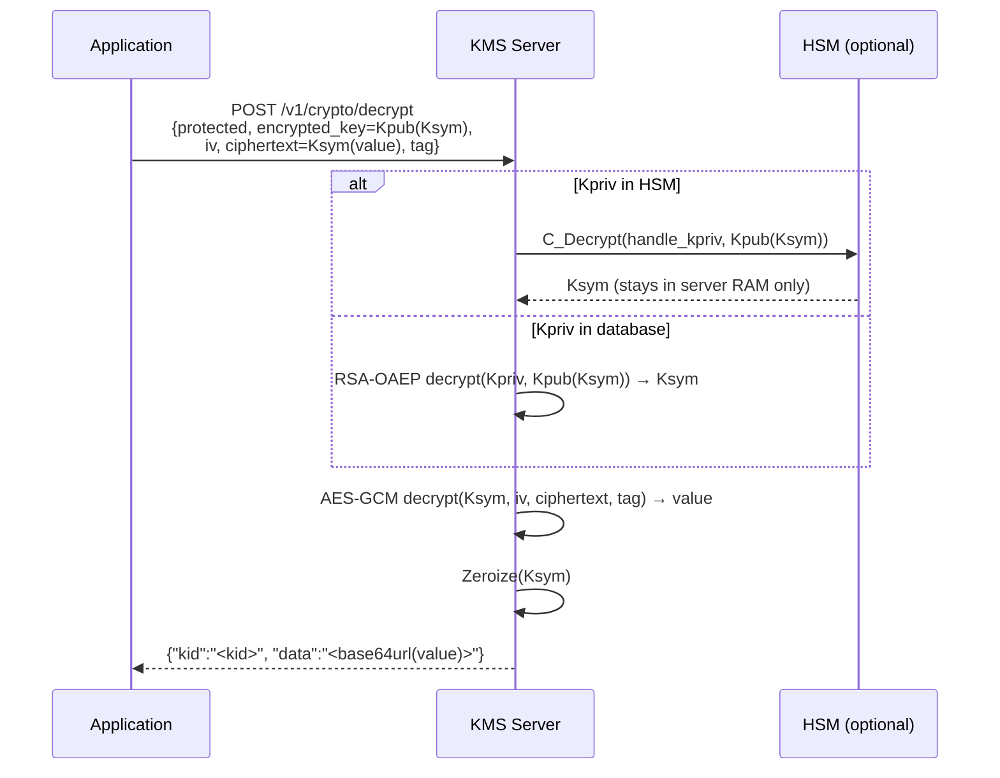
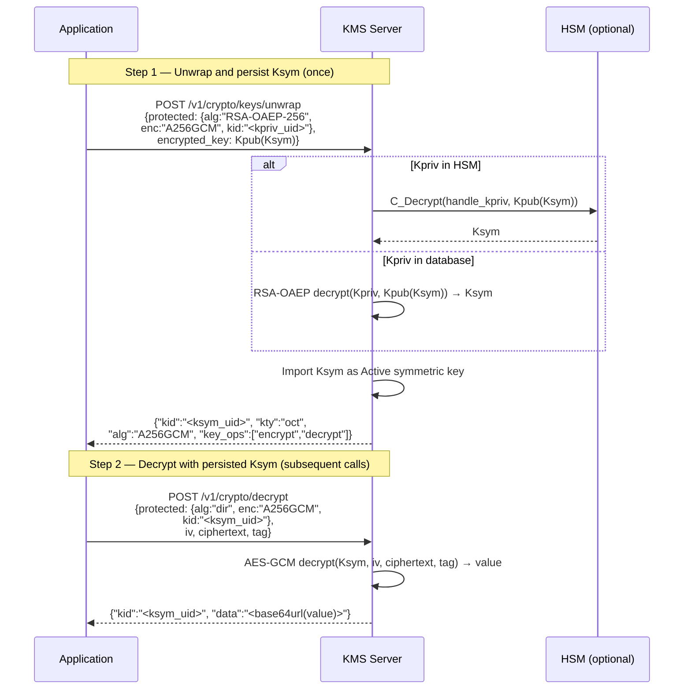
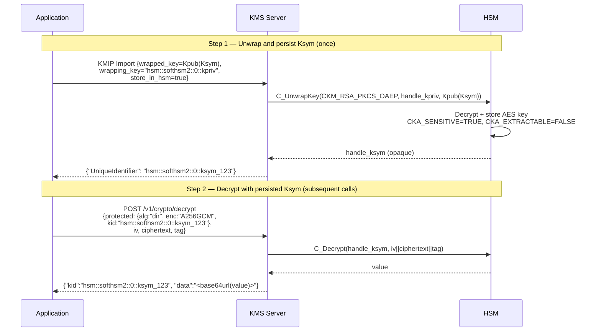

# JWE Decryption — Unwrap without Key Exposure

This use case describes how to decrypt JWE (JSON Web Encryption) tokens using the
Cosmian KMS without ever exposing the symmetric content encryption key (CEK) to the
calling application.

## Problem Statement

You receive JWE tokens with the structure: `Kpub(Ksym) . Ksym(value)`

- `Ksym(value)`: the payload `value` is encrypted with a symmetric AES key `Ksym` (the CEK)
- `Kpub(Ksym)`: the CEK is wrapped (encrypted) with an RSA public key `Kpub`
- The `kid` (Key ID) of the RSA key pair is known

**Security constraint**: the calling application must **never** have access to `Ksym`.

## Solution: One-Shot JWE Decrypt (No Key Persistence)

If the full JWE is available at each decryption call (including the `encrypted_key`
field), the REST crypto endpoint performs all operations server-side in a single request.
`Ksym` is used ephemerally in memory and immediately zeroized.

**No additional development required.**

### Flow



### Request

```bash
curl -s -X POST https://kms.example.com/v1/crypto/decrypt \
  -H 'Content-Type: application/json' \
  -d '{
    "protected": "<base64url JWE header: {\"alg\":\"RSA-OAEP-256\",\"enc\":\"A256GCM\",\"kid\":\"<kid>\"}>",
    "encrypted_key": "<base64url of Kpub(Ksym)>",
    "iv": "<base64url of 12-byte IV>",
    "ciphertext": "<base64url of Ksym(value)>",
    "tag": "<base64url of 16-byte GCM tag>"
  }'
```

### Response

```json
{ "kid": "<kid>", "data": "<base64url of decrypted value>" }
```

The application receives `value` — **never `Ksym`**.

### Server Configuration (TOML)

Minimal configuration with HSM holding the RSA private key:

```toml
[[hsm_instances]]
hsm_model    = "softhsm2"     # or: utimaco, proteccio, crypt2pay, smartcardhsm
hsm_admin    = ["admin"]
hsm_slot     = [0]
hsm_password = ["changeme"]

[http]
port = 9998
hostname = "0.0.0.0"

[db]
database_type = "sqlite"
sqlite_path   = "data/kms-objects"
```

If `Kpriv` is stored in the HSM with UID `hsm::softhsm2::0::my_rsa_key`, set the
`kid` in the JWE protected header to this UID. The KMS automatically routes the
RSA-OAEP decrypt to the HSM via the crypto oracle.

### Re-encryption

After decryption, re-encrypt `value` with a new key in the same call flow:

```bash
curl -s -X POST https://kms.example.com/v1/crypto/encrypt \
  -H 'Content-Type: application/json' \
  -d '{
    "kid": "<kid_new_key>",
    "alg": "RSA-OAEP-256",
    "enc": "A256GCM",
    "data": "<base64url of value>"
  }'
```

## Advanced: Persisting Ksym in the KMS (Key Unwrap Endpoint)

If the application receives subsequent ciphertexts `Ksym(value)` **without** the
`Kpub(Ksym)` wrapper (i.e., the same CEK is reused across multiple messages), then
`Ksym` must be persisted for later reuse. The `POST /v1/crypto/keys/unwrap` endpoint
unwraps the CEK using RSA-OAEP and imports it as a managed symmetric key — without
ever exposing the raw key material to the calling application.

### Flow



### Step 1: Unwrap the CEK

```bash
curl -s -X POST https://kms.example.com/v1/crypto/keys/unwrap \
  -H 'Content-Type: application/json' \
  -d '{
    "protected": "<base64url of {\"alg\":\"RSA-OAEP-256\",\"enc\":\"A256GCM\",\"kid\":\"<kpriv_uid>\"}>",
    "encrypted_key": "<base64url of Kpub(Ksym)>"
  }'
```

#### Response

```json
{
  "kid": "<ksym_uid>",
  "kty": "oct",
  "alg": "A256GCM",
  "key_ops": ["encrypt", "decrypt"]
}
```

The symmetric key is now stored in the KMS. The application receives only the `kid`
identifier — **never the raw key bytes**.

### Step 2: Decrypt with the Persisted Key

```bash
curl -s -X POST https://kms.example.com/v1/crypto/decrypt \
  -H 'Content-Type: application/json' \
  -d '{
    "protected": "<base64url of {\"alg\":\"dir\",\"enc\":\"A256GCM\",\"kid\":\"<ksym_uid>\"}>",
    "iv": "<base64url of 12-byte IV>",
    "ciphertext": "<base64url of Ksym(value)>",
    "tag": "<base64url of 16-byte GCM tag>"
  }'
```

#### Response

```json
{ "kid": "<ksym_uid>", "data": "<base64url of decrypted value>" }
```

### Supported Algorithms

| `alg` (key wrapping)  | `enc` (content encryption) |
|-----------------------|---------------------------|
| `RSA-OAEP`           | `A128GCM`, `A192GCM`, `A256GCM` |
| `RSA-OAEP-256`       | `A128GCM`, `A192GCM`, `A256GCM` |

### Error Conditions

| Condition | HTTP Status | Error Code |
|-----------|-------------|------------|
| Invalid base64url in `protected` or `encrypted_key` | 400 | `bad_request` |
| Missing `kid`, `alg`, or `enc` in protected header | 400 | `bad_request` |
| Empty `encrypted_key` | 400 | `bad_request` |
| Unsupported algorithm (e.g., `dir`, `A128KW`) | 422 | `unsupported_algorithm` |
| Private key not found | 404 | `not_found` |
| Decryption failure (wrong key, corrupted data) | 422 | `decryption_failed` |
| CEK size mismatch with `enc` algorithm | 422 | `crypto_failure` |

---

## Advanced: Persisting Ksym in the HSM (Requires Development)

If the application requires that `Ksym` never leaves the HSM boundary (even transiently
in KMS server memory), the PKCS#11 `C_UnwrapKey` operation can be used to import the
key directly into the HSM hardware.

!!! warning "Development Required"
    The PKCS#11 `C_UnwrapKey` operation is implemented in the HSM driver code but is
    **not yet exposed** by any production KMS endpoint. Integrating it into a server
    endpoint requires additional development.

### Target Flow (After Development)



!!! note "Step 2 already works"
    The `POST /v1/crypto/decrypt` endpoint with `alg=dir` and a `kid` referencing an
    HSM key (`hsm::...`) already routes to `C_Decrypt` on the HSM. Only Step 1
    (`C_UnwrapKey` integration) requires development.

### What Needs to be Developed

| Component | Current State | Required Change |
|-----------|---------------|-----------------|
| PKCS#11 `C_UnwrapKey` wrapper | ✅ Implemented (test-only) | Wire into production endpoint |
| `HsmStore::atomic()` | Only RSA keypairs | Support symmetric key import |
| UID routing for unwrapped keys | N/A | Assign `hsm::model::slot::label` UID |
| KMIP Import with HSM target | Not supported | Add `store_in_hsm` flag or detect HSM wrapping key |

## Summary

| Approach | Ksym exposed? | Ksym persisted? | Dev required? | Conformant? |
|----------|---------------|-----------------|---------------|-------------|
| `POST /v1/crypto/decrypt` (RSA-OAEP, full JWE) | ❌ No | ❌ No | ❌ No | ✅ If full JWE always available |
| `POST /v1/crypto/keys/unwrap` + `alg=dir` decrypt | ❌ No | ✅ Yes (KMS DB) | ❌ No | ✅ Yes |
| KMIP Decrypt + Import | ✅ Yes | ✅ Yes | ❌ No | ❌ No (violates constraint) |
| HSM `C_UnwrapKey` + `alg=dir` | ❌ No | ✅ Yes (HSM) | ⚠️ Yes | ✅ Yes |
