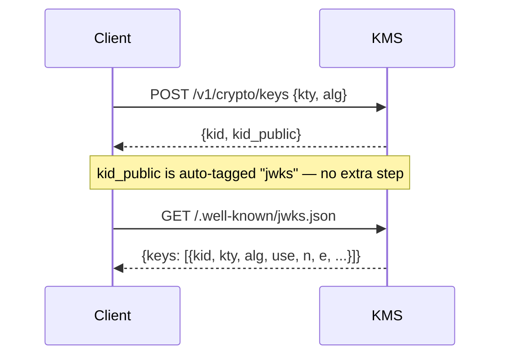

# JWKS endpoint

The KMS exposes a standard [RFC 7517](https://www.rfc-editor.org/rfc/rfc7517)
JWKS endpoint at:

```
GET /.well-known/jwks.json
```

By default, every public key pair created through the REST API is **automatically tagged
`jwks`** and immediately advertised in the JWKS document. No extra step is
needed for the common case.

To exclude a specific public key from the JWKS remove its `jwks` tag via the tag management
endpoint.

## How it works



## Quickstart

```bash
# EC P-256 key for JWS (ES256)
curl -s -X POST "https://kms.example.com/v1/crypto/keys" \
  -H "Authorization: Bearer ${TOKEN}" \
  -H "Content-Type: application/json" \
  -d '{"kty":"EC","alg":"ES256"}'
```

The response contains the KMS identifier for both the private key (`kid`) and
the public key (`kid_public`):

```json
{
  "kid": "<private-key-uuid>",
  "kid_public": "<public-key-uuid>",
  "kty": "EC",
  "alg": "ES256",
  "crv": "P-256",
  "key_ops": ["sign", "verify"]
}
```

### Verify the key is advertised

```bash
curl -s "https://kms.example.com/.well-known/jwks.json" | jq .
```

Expected output (abbreviated):

```json
{
  "keys": [
    {
      "kty": "EC",
      "use": "sig",
      "alg": "ES256",
      "kid": "<public-key-uuid>",
      "crv": "P-256",
      "x": "...",
      "y": "..."
    }
  ]
}
```

## Opt a key out of JWKS

Remove the `jwks` tag from the public key to stop advertising it. The key
material is not deleted.

```bash
curl -s -X DELETE "https://kms.example.com/v1/crypto/keys/${KID_PUBLIC}/tags" \
  -H "Authorization: Bearer ${TOKEN}" \
  -H "Content-Type: application/json" \
  -d '{"tags": ["jwks"]}'
```

The response confirms the updated tag set (the `jwks` tag is absent):

```json
{ "kid": "<public-key-uuid>", "tags": [] }
```

If you later want to re-advertise a key that was previously opted out, add the`jwks` tag back via `https://kms.example.com/v1/crypto/keys/${KID_PUBLIC}/tags`

## Key rotation

During rotation, both the retiring key and the new key are present in the JWKS
document for a brief overlap period, allowing relying parties to verify tokens
signed by either key.

```bash
# 1. Create the new key pair — automatically tagged "jwks".
NEW_KID_PUBLIC=$(curl -s -X POST "https://kms.example.com/v1/crypto/keys" \
  -H "Authorization: Bearer ${TOKEN}" \
  -H "Content-Type: application/json" \
  -d '{"kty":"EC","alg":"ES256"}' | jq -r .kid_public)

# 2. (overlap window) Both old and new keys appear in JWKS.

# 3. Opt the old key out of JWKS once all outstanding tokens have expired.
curl -s -X DELETE "https://kms.example.com/v1/crypto/keys/${OLD_KID_PUBLIC}/tags" \
  -H "Authorization: Bearer ${TOKEN}" \
  -H "Content-Type: application/json" \
  -d '{"tags": ["jwks"]}'
```

## Keys created outside the REST API

Keys created directly through the KMIP protocol (e.g. via `ckms` or a KMIP
client library) are **not** auto-tagged. To include such a key in the JWKS
document, explicitly add the `jwks` tag:

```bash
curl -s -X POST "https://kms.example.com/v1/crypto/keys/${KID_PUBLIC}/tags" \
  -H "Authorization: Bearer ${TOKEN}" \
  -H "Content-Type: application/json" \
  -d '{"tags": ["jwks"]}'
```

## Disable auto-tagging globally

By default the KMS tags every REST-created key pair for JWKS inclusion. If you
prefer a fully manual opt-in model, disable auto-tagging in the server
configuration:

| Method               | Value                              |
| -------------------- | ---------------------------------- |
| CLI flag             | `--jwks-endpoint-auto-tag=false`   |
| Environment variable | `KMS_JWKS_ENDPOINT_AUTO_TAG=false` |
| TOML config          | `jwks_endpoint_auto_tag = false`   |

When auto-tagging is disabled, newly created key pairs do **not** receive the
`jwks` tag. To publish a key you must tag it explicitly:

```bash
curl -s -X POST "https://kms.example.com/v1/crypto/keys/${KID_PUBLIC}/tags" \
  -H "Authorization: Bearer ${TOKEN}" \
  -H "Content-Type: application/json" \
  -d '{"tags": ["jwks"]}'
```

Existing keys are not affected when you change this setting.

---

## See also

- [REST Native Crypto API](rest_crypto_api.md) — full endpoint reference
- [JWE Decryption](jwe_decryption.md) — using the KMS as a JWE decryption oracle
