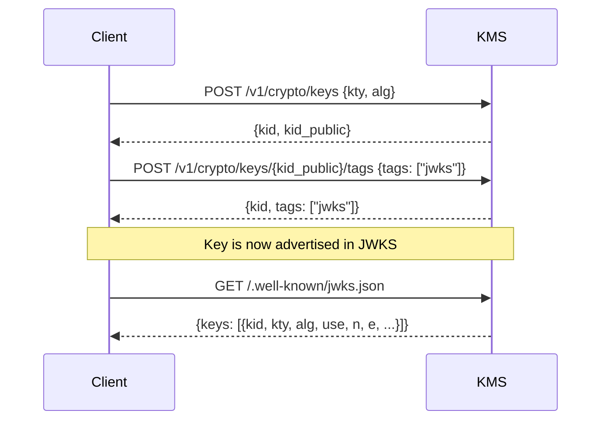

# JWKS key selection

The KMS exposes a standard [RFC 7517](https://www.rfc-editor.org/rfc/rfc7517)
JWKS endpoint at:

```
GET /.well-known/jwks.json
```

Only keys that carry the `"jwks"` user tag are included in the JWKS document.
This lets you manage a large keystore while controlling exactly which public keys
are advertised to relying parties.

---

## How it works



1. **Generate** a key pair — the private key `kid` stays in the KMS; the public
   key `kid_public` is returned.
2. **Tag** the public key with `"jwks"` using the tag management endpoint.
3. **Discover** — any relying party can now fetch `/.well-known/jwks.json` and
   find the public key.

---

## Step-by-step

### 1 — Generate an EC or RSA key pair

```bash
# EC P-256 key for JWS (ES256)
KID=$(curl -s -X POST "https://kms.example.com/v1/crypto/keys" \
  -H "Authorization: Bearer ${TOKEN}" \
  -H "Content-Type: application/json" \
  -d '{"kty":"EC","alg":"ES256"}' \
  | jq -r .kid_public)
```

### 2 — Tag the public key for JWKS inclusion

```bash
curl -s -X POST "https://kms.example.com/v1/crypto/keys/${KID}/tags" \
  -H "Authorization: Bearer ${TOKEN}" \
  -H "Content-Type: application/json" \
  -d '{"tags": ["jwks"]}'
```

### 3 — Verify the key appears in the JWKS document

```bash
curl -s "https://kms.example.com/.well-known/jwks.json" | jq .
```

Expected output (abbreviated):

```json
{
  "keys": [
    {
      "kty": "EC",
      "use": "sig",
      "alg": "ES256",
      "kid": "<key-uuid>",
      "crv": "P-256",
      "x": "...",
      "y": "..."
    }
  ]
}
```

### 4 — Rotate: tag new key, un-tag old key

```bash
# Tag the new public key
curl -s -X POST "https://kms.example.com/v1/crypto/keys/${NEW_KID}/tags" \
  -H "Authorization: Bearer ${TOKEN}" \
  -H "Content-Type: application/json" \
  -d '{"tags": ["jwks"]}'

# Remove JWKS tag from the old key (key material stays in KMS)
curl -s -X DELETE "https://kms.example.com/v1/crypto/keys/${OLD_KID}/tags" \
  -H "Authorization: Bearer ${TOKEN}" \
  -H "Content-Type: application/json" \
  -d '{"tags": ["jwks"]}'
```

Both old and new keys are present in the JWKS document during the brief overlap
window, allowing relying parties to verify tokens signed by either key.

---

## Multiple environments

Add additional environment tags alongside `"jwks"` to group keys:

```bash
# Tag a key for JWKS and mark it as belonging to the "prod" environment
curl -s -X POST "https://kms.example.com/v1/crypto/keys/${KID}/tags" \
  -H "Authorization: Bearer ${TOKEN}" \
  -H "Content-Type: application/json" \
  -d '{"tags": ["jwks", "prod"]}'
```

Only the `"jwks"` tag controls JWKS inclusion.  Additional tags (`"prod"`,
`"staging"`, …) are for your own organisational use and have no effect on the
JWKS endpoint.

---

## See also

- [REST Native Crypto API](rest_crypto_api.md) — full endpoint reference
- [JWE Decryption](jwe_decryption.md) — using the KMS as a JWE decryption oracle
