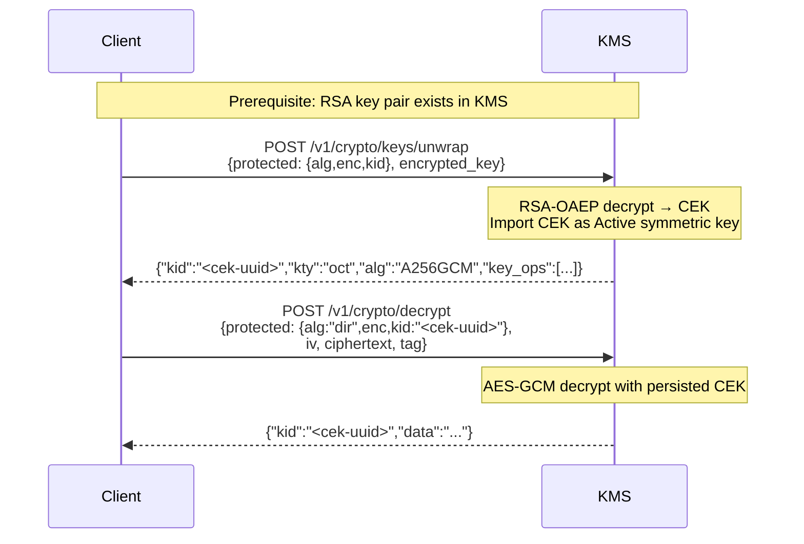
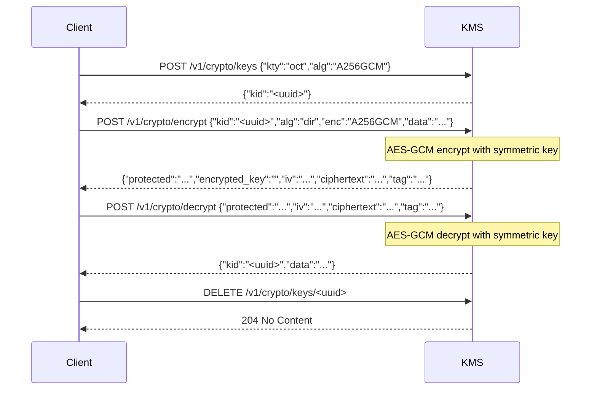
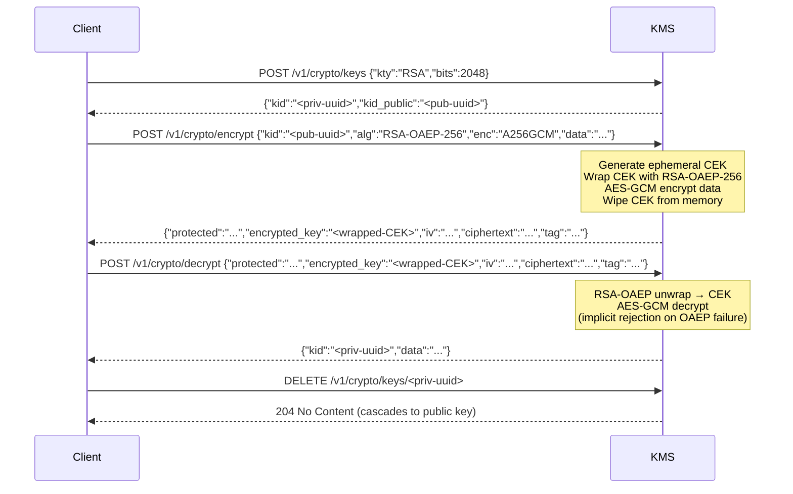
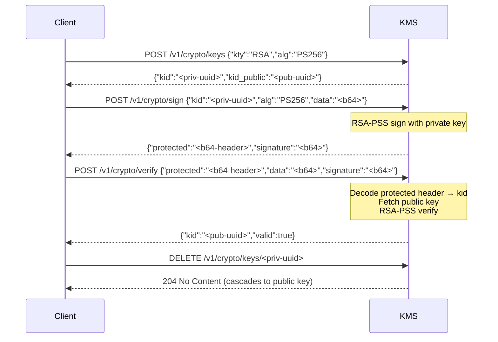
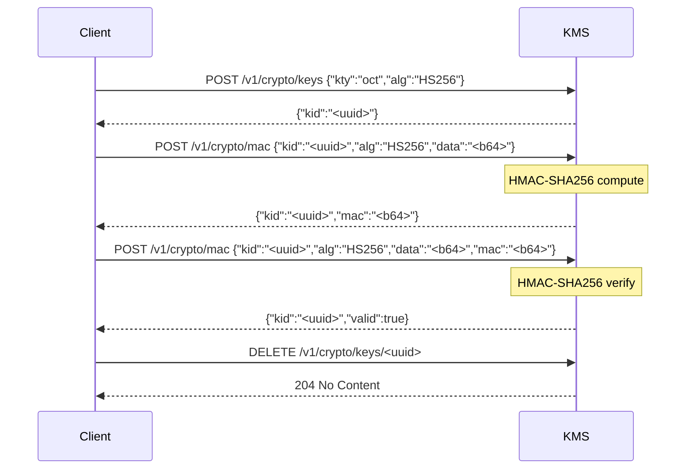

# REST Native Crypto API (`/v1/crypto`)

The Eviden KMS exposes a lightweight **REST Native Crypto API** under the `/v1/crypto` path.
This API follows the **JOSE** (JSON Object Signing and Encryption) conventions from
[RFC 7516 (JWE)](https://www.rfc-editor.org/rfc/rfc7516),
[RFC 7515 (JWS)](https://www.rfc-editor.org/rfc/rfc7515), and
[RFC 7518 (JWA)](https://www.rfc-editor.org/rfc/rfc7518).

Key material **never leaves the KMS**. Only ciphertext, signatures, and MACs travel over the network.

---

## Table of Contents

- [Authentication](#authentication)
- [Endpoints](#endpoints)
    - [POST /v1/crypto/keys](#post-v1cryptokeys)
    - [DELETE /v1/crypto/keys/{kid}](#delete-v1cryptokeyskid)
    - [POST /v1/crypto/keys/unwrap](#post-v1cryptokeysunwrap)
    - [POST /v1/crypto/encrypt](#post-v1cryptoencrypt)
    - [POST /v1/crypto/decrypt](#post-v1cryptodecrypt)
    - [POST /v1/crypto/sign](#post-v1cryptosign)
    - [POST /v1/crypto/verify](#post-v1cryptoverify)
    - [POST /v1/crypto/mac](#post-v1cryptomac)
- [Error responses](#error-responses)
- [Known limitations](#known-limitations)
- [Algorithm support matrix](#algorithm-support-matrix)

---

## Authentication

The `/v1/crypto` endpoints share the same authentication as the rest of the KMS API.
Pass a JWT bearer token, a TLS client certificate, or an API token, depending on your
server configuration. See [Authentication](../../configuration/authentication.md).

---

## Endpoints

### `POST /v1/crypto/keys`

Generate a new cryptographic key (or key pair) in the KMS. The request follows JWK
conventions — specify `kty` (key type) and `alg` (algorithm) at minimum.

#### Request body

```json
{
  "kty": "oct",
  "alg": "A256GCM"
}
```

| Field | Required | Description |
|-------|----------|-------------|
| `kty` | ✓ | Key type: `oct` (symmetric), `RSA`, `EC`, `OKP` (non-FIPS) |
| `alg` | ✓ | JOSE algorithm identifier (determines key size and usage) |
| `crv` | EC/OKP | Curve name: `P-256`, `P-384`, `P-521`, `Ed25519` (non-FIPS) |

#### Response body

```json
{
  "kid": "<key-uuid>",
  "kid_public": "<public-key-uuid>"  // only for asymmetric key pairs
}
```

#### Examples

**Symmetric key (AES-256-GCM)**:

```json
{ "kty": "oct", "alg": "A256GCM" }
```

**RSA key pair (PS256)**:

```json
{ "kty": "RSA", "alg": "PS256" }
```

**EC key pair (ES256)**:

```json
{ "kty": "EC", "crv": "P-256", "alg": "ES256" }
```

---

### `DELETE /v1/crypto/keys/{kid}`

Destroy (permanently delete) a key from the KMS. The key is first revoked
(deactivated) then removed from the database, including any linked public/private
key in the pair.

#### Path parameters

| Parameter | Description |
|-----------|-------------|
| `kid` | The UUID of the key to destroy |

#### Response

- **204 No Content** on success (empty body).

---

### `POST /v1/crypto/keys/unwrap`

Unwrap (decrypt) a JWE `encrypted_key` using an RSA private key and import the
resulting symmetric CEK into the KMS as a managed key. The raw key material is
**never returned** to the caller — only a `kid` identifier is provided.

This endpoint is designed for the JWE decryption use case where the same CEK is
reused across multiple messages: unwrap once, then decrypt subsequent ciphertexts
using `POST /v1/crypto/decrypt` with `alg=dir`.

**Supported `alg` values**: `RSA-OAEP`, `RSA-OAEP-256`.
**Supported `enc` values**: `A128GCM`, `A192GCM`, `A256GCM`.

#### Flow — Unwrap CEK then decrypt



#### Request body

```json
{
  "protected":     "<base64url JWE Protected Header>",
  "encrypted_key": "<base64url wrapped CEK>"
}
```

| Field | Required | Description |
|-------|----------|-------------|
| `protected` | ✓ | Base64url-encoded JWE Protected Header (must contain `alg`, `enc`, `kid`) |
| `encrypted_key` | ✓ | Base64url-encoded RSA-OAEP-wrapped CEK (must be non-empty) |

The `protected` header must decode to a JSON object containing:

| Header field | Required | Description |
|--------------|----------|-------------|
| `kid` | ✓ | UUID of the RSA private key (or its linked public key) |
| `alg` | ✓ | `RSA-OAEP` or `RSA-OAEP-256` |
| `enc` | ✓ | `A128GCM`, `A192GCM`, or `A256GCM` (determines expected CEK size) |

#### Response body

```json
{
  "kid":     "<cek-uuid>",
  "kty":     "oct",
  "alg":     "A256GCM",
  "key_ops": ["encrypt", "decrypt"]
}
```

| Field | Description |
|-------|-------------|
| `kid` | UUID of the imported symmetric key in the KMS |
| `kty` | Always `oct` (symmetric key) |
| `alg` | The `enc` algorithm from the protected header |
| `key_ops` | Allowed operations: `["encrypt", "decrypt"]` |

#### Error conditions

| Condition | Status | Error code |
|-----------|--------|------------|
| Invalid base64url in `protected` or `encrypted_key` | 400 | `bad_request` |
| Missing `kid`, `alg`, or `enc` in protected header | 400 | `bad_request` |
| Empty `encrypted_key` | 400 | `bad_request` |
| Unsupported algorithm (e.g., `dir`, `A128KW`) | 422 | `unsupported_algorithm` |
| Private key not found | 404 | `not_found` |
| Decryption failure (wrong key, corrupted data) | 422 | `decryption_failed` |
| CEK size does not match `enc` algorithm | 422 | `crypto_failure` |

#### Example (curl)

```bash
# Assume $PROTECTED and $ENCRYPTED_KEY come from a JWE token
# The protected header contains {"alg":"RSA-OAEP-256","enc":"A256GCM","kid":"<priv-uuid>"}

# 1. Unwrap the CEK
UNWRAP_RESP=$(curl -s -X POST https://kms.example.com/v1/crypto/keys/unwrap \
  -H 'Content-Type: application/json' \
  -d "{\"protected\":\"$PROTECTED\",\"encrypted_key\":\"$ENCRYPTED_KEY\"}")
CEK_KID=$(echo "$UNWRAP_RESP" | jq -r '.kid')

# 2. Decrypt subsequent ciphertexts using the persisted CEK
# Build a protected header for direct decryption:
DIR_HEADER=$(printf '{"alg":"dir","enc":"A256GCM","kid":"%s"}' "$CEK_KID" \
  | base64 | tr '+/' '-_' | tr -d '=')
curl -s -X POST https://kms.example.com/v1/crypto/decrypt \
  -H 'Content-Type: application/json' \
  -d "{\"protected\":\"$DIR_HEADER\",\"iv\":\"$IV\",\"ciphertext\":\"$CT\",\"tag\":\"$TAG\"}" \
  | jq -r '.data | @base64d'

# 3. Clean up
curl -s -X DELETE https://kms.example.com/v1/crypto/keys/$CEK_KID
```

---

### `POST /v1/crypto/encrypt`

Encrypt plaintext using either:

- **Direct encryption** (`alg=dir`): uses a symmetric key directly as the content encryption key (CEK).
- **RSA-OAEP key wrapping** (`alg=RSA-OAEP` or `alg=RSA-OAEP-256`): generates an ephemeral CEK, wraps it with the RSA public key, and encrypts data with AES-GCM.

**Supported `alg` values**: `dir`, `RSA-OAEP`, `RSA-OAEP-256`.
**Supported `enc` values**: `A128GCM`, `A192GCM`, `A256GCM`.

#### Flow — Direct (`dir`)



#### Flow — RSA-OAEP



#### Request body

```json
{
  "kid": "<key-uuid>",
  "alg": "RSA-OAEP",
  "enc": "A256GCM",
  "data": "<base64url-encoded plaintext>",
  "aad": "<base64url-encoded AAD>"   // optional
}
```

| Field | Required | Description |
|-------|----------|-------------|
| `kid` | ✓ | Key UUID (symmetric key for `dir`; RSA private or public key for `RSA-OAEP`/`RSA-OAEP-256`) |
| `alg` | ✓ | Key management algorithm: `dir`, `RSA-OAEP`, or `RSA-OAEP-256` |
| `enc` | ✓ | Content encryption algorithm: `A128GCM`, `A192GCM`, `A256GCM` |
| `data` | ✓ | Base64url-encoded plaintext |
| `aad` | | Optional additional authenticated data (base64url) |

#### Response body (Flattened JWE)

```json
{
  "protected":     "<base64url JWE Protected Header>",
  "encrypted_key": "<base64url wrapped CEK>",
  "iv":            "<base64url IV>",
  "ciphertext":    "<base64url ciphertext>",
  "tag":           "<base64url GCM authentication tag>",
  "aad":           "<base64url AAD>"   // omitted when not supplied
}
```

For `alg=dir`, the `encrypted_key` field is an empty string. For RSA-OAEP, it contains
the RSA-OAEP-wrapped CEK.

#### Example — Direct encryption (curl)

```bash
# 1. Create a 256-bit AES key
KID=$(curl -s -X POST https://kms.example.com/v1/crypto/keys \
  -H 'Content-Type: application/json' \
  -d '{"kty":"oct","alg":"A256GCM"}' | jq -r '.kid')

# 2. Encrypt
DATA_B64=$(printf 'Hello KMS!' | base64 | tr '+/' '-_' | tr -d '=')
JWE=$(curl -s -X POST https://kms.example.com/v1/crypto/encrypt \
  -H 'Content-Type: application/json' \
  -d "{\"kid\":\"$KID\",\"alg\":\"dir\",\"enc\":\"A256GCM\",\"data\":\"$DATA_B64\"}")

# 3. Decrypt
curl -s -X POST https://kms.example.com/v1/crypto/decrypt \
  -H 'Content-Type: application/json' \
  -d "$JWE" | jq -r '.data | @base64d'

# 4. Clean up
curl -s -X DELETE https://kms.example.com/v1/crypto/keys/$KID
```

#### Example — RSA-OAEP (curl)

```bash
# 1. Create an RSA-2048 key pair
KEYS=$(curl -s -X POST https://kms.example.com/v1/crypto/keys \
  -H 'Content-Type: application/json' \
  -d '{"kty":"RSA","bits":2048}')
KID=$(echo "$KEYS" | jq -r '.kid')
KID_PUB=$(echo "$KEYS" | jq -r '.kid_public')

# 2. Encrypt with RSA-OAEP-256 using the public key
DATA_B64=$(printf 'Secret message' | base64 | tr '+/' '-_' | tr -d '=')
JWE=$(curl -s -X POST https://kms.example.com/v1/crypto/encrypt \
  -H 'Content-Type: application/json' \
  -d "{\"kid\":\"$KID_PUB\",\"alg\":\"RSA-OAEP-256\",\"enc\":\"A256GCM\",\"data\":\"$DATA_B64\"}")

# 3. Decrypt (kid in protected header resolves to private key automatically)
curl -s -X POST https://kms.example.com/v1/crypto/decrypt \
  -H 'Content-Type: application/json' \
  -d "$JWE" | jq -r '.data | @base64d'

# 4. Clean up (cascades to the linked public key)
curl -s -X DELETE https://kms.example.com/v1/crypto/keys/$KID
```

---

### `POST /v1/crypto/decrypt`

Decrypt a Flattened JWE token.

Supports both `alg=dir` (direct AES-GCM) and `alg=RSA-OAEP`/`RSA-OAEP-256`
(RSA-OAEP key unwrapping + AES-GCM content decryption).

The `kid` in the JWE protected header identifies the decryption key. For RSA-OAEP,
this can be either the private key or the public key UUID (the server resolves to
the private key automatically).

> The decrypt endpoint has no standalone flow diagram — it is the second half of
> the encrypt/decrypt flows shown in the [encrypt section](#post-v1cryptoencrypt) above.

#### Request body

```json
{
  "protected":     "<base64url JWE Protected Header>",
  "encrypted_key": "<base64url wrapped CEK>",
  "iv":            "<base64url IV>",
  "ciphertext":    "<base64url ciphertext>",
  "tag":           "<base64url GCM authentication tag>",
  "aad":           "<base64url AAD>"  // optional; must match the value used during encryption
}
```

| Field | Required | Description |
|-------|----------|-------------|
| `protected` | ✓ | Base64url-encoded JWE Protected Header (must contain `alg`, `enc`, `kid`) |
| `encrypted_key` | For RSA-OAEP | The RSA-OAEP-wrapped CEK (empty or absent for `dir`) |
| `iv` | ✓ | 12-byte initialization vector (base64url) |
| `ciphertext` | ✓ | Encrypted data (base64url) |
| `tag` | ✓ | 16-byte GCM authentication tag (base64url) |
| `aad` | | Additional authenticated data (base64url) |

#### Response body

```json
{
  "kid":  "<key-uuid>",
  "data": "<base64url plaintext>"
}
```

#### Security: implicit rejection

For RSA-OAEP decryption, the server implements **implicit rejection** as recommended
by [RFC 7516 §11.5](https://www.rfc-editor.org/rfc/rfc7516#section-11.5). If the
RSA-OAEP unwrap fails (indicating a tampered or invalid `encrypted_key`), the server
substitutes a random CEK and proceeds with AES-GCM decryption — which will fail
with the same generic "Decryption failed" error. This prevents padding oracle attacks.

#### Example (curl)

```bash
# JWE is the JSON response from POST /v1/crypto/encrypt
PLAINTEXT=$(curl -s -X POST https://kms.example.com/v1/crypto/decrypt \
  -H 'Content-Type: application/json' \
  -d "$JWE" | jq -r '.data | @base64d')
echo "$PLAINTEXT"
```

---

### `POST /v1/crypto/sign`

Sign data using an asymmetric private key. Returns a **detached JWS** (payload not included
in the response).

**Supported algorithms**: `RS256`, `RS384`, `RS512`, `PS256`, `PS384`, `PS512`,
`ES256`, `ES384`, `ES512`; `EdDSA` and `MLDSA44` (non-FIPS builds only).

#### Flow — Sign and verify



#### Request body

```json
{
  "kid":  "<private-key-uuid>",
  "alg":  "RS256",
  "data": "<base64url payload>"
}
```

#### Response body

```json
{
  "protected": "<base64url JWS Protected Header>",
  "signature": "<base64url signature>"
}
```

#### Example (curl)

```bash
# 1. Create an RSA-2048 key pair
KEYS=$(curl -s -X POST https://kms.example.com/v1/crypto/keys \
  -H 'Content-Type: application/json' \
  -d '{"kty":"RSA","alg":"RS256"}')
KID=$(echo "$KEYS" | jq -r '.kid')

# 2. Sign
DATA_B64=$(printf 'data to sign' | base64 | tr '+/' '-_' | tr -d '=')
SIGN_RESP=$(curl -s -X POST https://kms.example.com/v1/crypto/sign \
  -H 'Content-Type: application/json' \
  -d "{\"kid\":\"$KID\",\"alg\":\"RS256\",\"data\":\"$DATA_B64\"}")

# 3. Verify
curl -s -X POST https://kms.example.com/v1/crypto/verify \
  -H 'Content-Type: application/json' \
  -d "$(jq -n --argjson s "$SIGN_RESP" --arg d "$DATA_B64" \
       '{protected:$s.protected,data:$d,signature:$s.signature}')"

# 4. Clean up
curl -s -X DELETE https://kms.example.com/v1/crypto/keys/$KID
```

---

### `POST /v1/crypto/verify`

Verify a detached JWS signature. The KMS looks up the public key from the `protected` header.

> **Required**: the JWS protected header decoded from `protected` **must** contain a `kid` field
> set to the KMS public key UUID. Requests without `kid` are rejected with `400`.
> This field is set automatically by `POST /v1/crypto/sign`.
>
> The verify endpoint is the second half of the sign/verify flow shown in the
> [sign section](#post-v1cryptosign) above.

#### Request body

```json
{
  "protected": "<base64url JWS Protected Header (contains kid + alg)>",
  "data":      "<base64url payload>",
  "signature": "<base64url signature>"
}
```

#### Response body

```json
{
  "kid":   "<public-key-uuid>",
  "valid": true   // false when the signature does not match
}
```

---

### `POST /v1/crypto/mac`

Compute or verify a MAC (Message Authentication Code).

- **Compute**: omit the `mac` field → the KMS returns the computed MAC value.
- **Verify**: include the `mac` field → the KMS returns `valid: true/false`.

**Supported algorithms**: `HS256`, `HS384`, `HS512`.

#### Flow — MAC compute and verify



#### Request body

```json
{
  "kid":  "<key-uuid>",
  "alg":  "HS256",
  "data": "<base64url data>",
  "mac":  "<base64url MAC to verify>"  // omit to compute
}
```

#### Response body — compute

```json
{
  "kid": "<key-uuid>",
  "mac": "<base64url MAC>"
}
```

#### Response body — verify

```json
{
  "kid":   "<key-uuid>",
  "valid": true   // false when the MAC does not match
}
```

#### RFC 7515 §A.1 known-answer vector

The MAC value below is pinned by an integration test (`test_rfc7515_a1_hs256_known_answer`).
It reproduces the exact HS256 result from [RFC 7515 §Appendix A.1](https://www.rfc-editor.org/rfc/rfc7515#appendix-A.1).

| Field | Value |
|---|---|
| Key (base64url) | `AyM1SysPpbyDfgZld3umj1qzKObwVMkoqQ-EstJQLr_T-1qS0gZH75aKtMN3Yj0iPS4hcgUuTwjAzZr1Z9CAow` |
| Data | JWS Signing Input from RFC 7515 §A.1 |
| `alg` | `HS256` |
| Expected `mac` | `dBjftJeZ4CVP-mB92K27uhbUJU1p1r_wW1gFWFOEjXk` |

#### Example (curl)

```bash
# 1. Create an HMAC-SHA256 key
KID=$(curl -s -X POST https://kms.example.com/v1/crypto/keys \
  -H 'Content-Type: application/json' \
  -d '{"kty":"oct","alg":"HS256"}' | jq -r '.kid')

# 2. Compute MAC
DATA_B64=$(printf 'message' | base64 | tr '+/' '-_' | tr -d '=')
MAC_RESP=$(curl -s -X POST https://kms.example.com/v1/crypto/mac \
  -H 'Content-Type: application/json' \
  -d "{\"kid\":\"$KID\",\"alg\":\"HS256\",\"data\":\"$DATA_B64\"}")
MAC_VALUE=$(echo "$MAC_RESP" | jq -r '.mac')

# 3. Verify MAC
curl -s -X POST https://kms.example.com/v1/crypto/mac \
  -H 'Content-Type: application/json' \
  -d "{\"kid\":\"$KID\",\"alg\":\"HS256\",\"data\":\"$DATA_B64\",\"mac\":\"$MAC_VALUE\"}"

# 4. Clean up
curl -s -X DELETE https://kms.example.com/v1/crypto/keys/$KID
```

---

## Error responses

All endpoints return a JSON body `{ "error": "<type>", "description": "<detail>" }` with
an appropriate HTTP status code:

| Status | Meaning |
|--------|---------|
| `400`  | Bad request (malformed base64, missing field, etc.) |
| `403`  | Forbidden (key access denied) |
| `404`  | Key not found |
| `422`  | Unsupported or unknown algorithm |
| `500`  | Internal server error / cryptographic failure |

---

## Known limitations

The following JOSE features are **not yet implemented** in this API.

| Missing feature | Blocked by |
|---|---|
| JWE `alg=RSA-PKCS1-v1_5` + `enc=A128CBC-HS256` (RFC 7516 §A.2) | RSA-PKCS1v1.5 + AES-CBC not implemented |
| JWE `alg=A128KW` + `enc=A128CBC-HS256` (RFC 7516 §A.3) | AES key-wrap + AES-CBC not implemented |
| JWE `alg=dir` + `enc=A128CBC-HS256` (RFC 7516 §A.5) | AES-CBC enc not implemented |
| JWE `alg=ECDH-ES` (RFC 7518 §C) | ECDH-ES key agreement not implemented |
| JWS verify without `kid` in protected header | `kid`-less verify not yet supported |

> Full RFC 7515 §A.2/A.3/A.4 known-answer tests are deferred until kid-less
> verification is supported (current tests do round-trips with freshly generated keys).

---

## Algorithm support matrix

### Key management algorithms (`alg`)

| Algorithm     | FIPS | Operation                   | Notes |
|---------------|------|-----------------------------|-------|
| `dir`         | ✓    | encrypt / decrypt           | Direct use of symmetric key as CEK |
| `RSA-OAEP`   | ✓    | encrypt / decrypt / unwrap  | RSA-OAEP with SHA-1 (RFC 7518 §4.3) |
| `RSA-OAEP-256`| ✓   | encrypt / decrypt / unwrap  | RSA-OAEP with SHA-256 (RFC 7518 §4.3) |

### Content encryption algorithms (`enc`)

| Algorithm   | FIPS | Key size | Notes |
|-------------|------|----------|-------|
| `A128GCM`   | ✓    | 128 bits | AES-GCM with 96-bit IV, 128-bit tag |
| `A192GCM`   | ✓    | 192 bits | AES-GCM with 96-bit IV, 128-bit tag |
| `A256GCM`   | ✓    | 256 bits | AES-GCM with 96-bit IV, 128-bit tag |

### Signature algorithms

| Algorithm       | FIPS | Operation       |
|-----------------|------|-----------------|
| `RS256/384/512` | ✓    | sign / verify   |
| `PS256/384/512` | ✓    | sign / verify   |
| `ES256/384/512` | ✓    | sign / verify   |
| `EdDSA`         | ✗    | sign / verify (non-FIPS) |
| `MLDSA44`       | ✗    | sign / verify (non-FIPS) |

### MAC algorithms

| Algorithm       | FIPS | Operation              |
|-----------------|------|------------------------|
| `HS256/384/512` | ✓    | mac compute / verify   |
