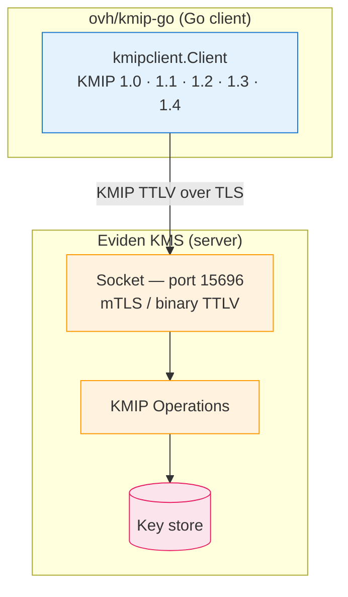
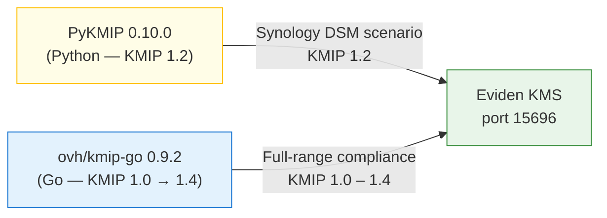
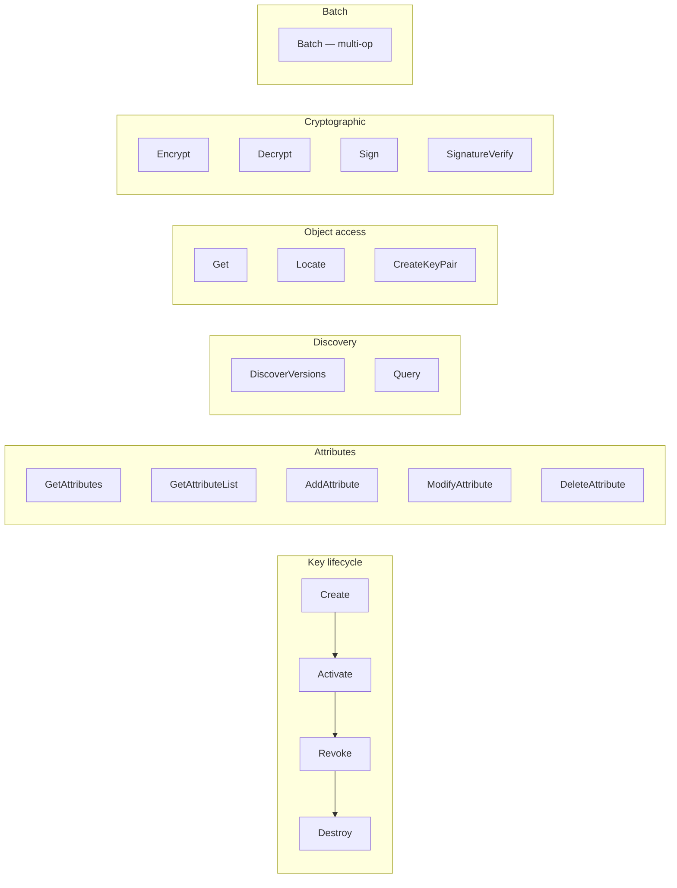
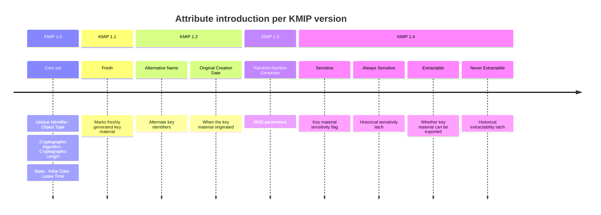
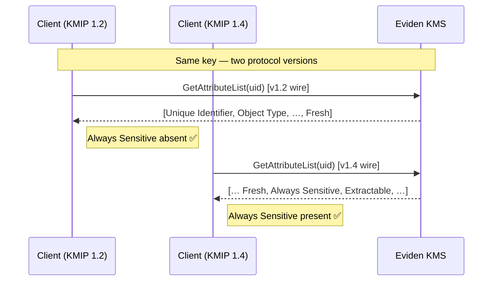
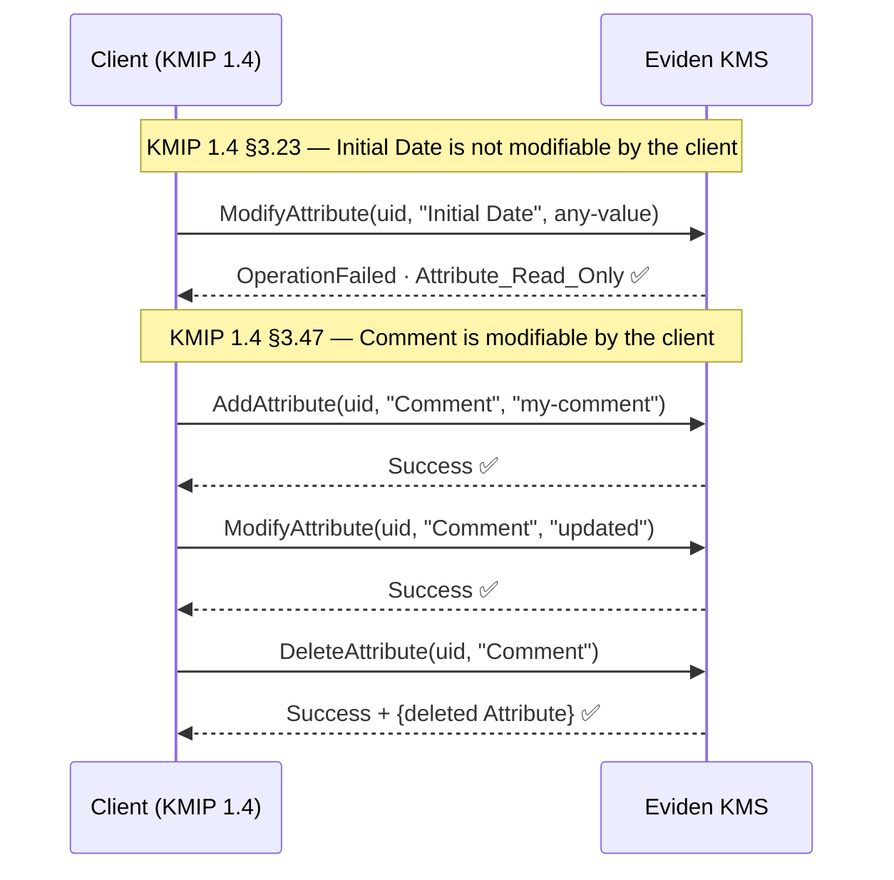
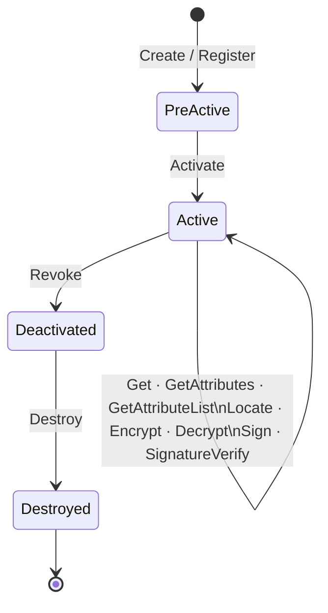
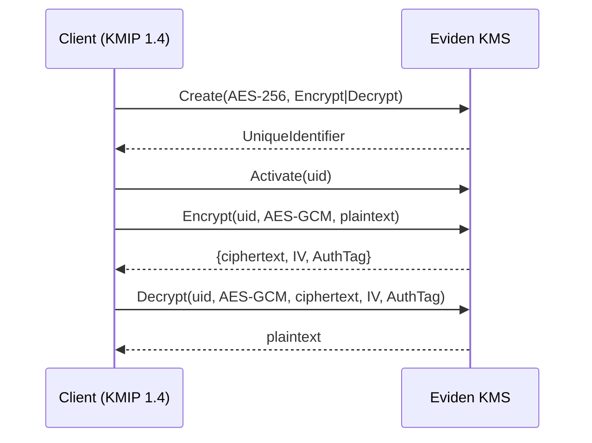
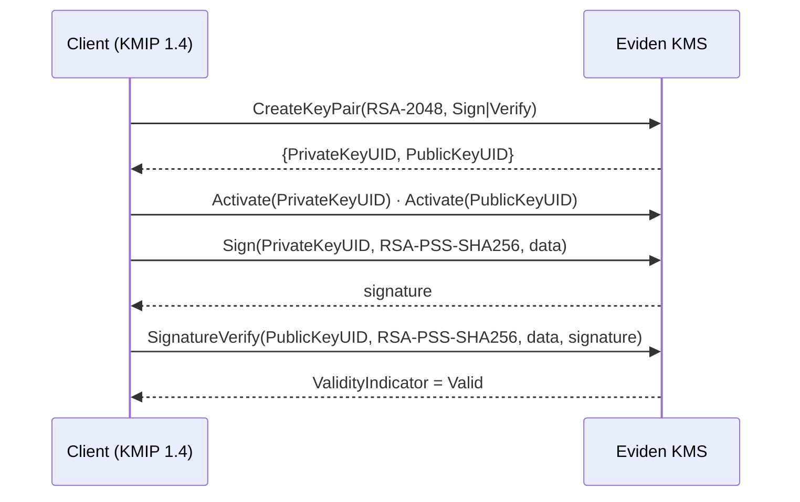

# KMIP Compliance with ovh/kmip-go

The Eviden KMS server is validated against
**[ovh/kmip-go](https://github.com/ovh/kmip-go)**, an independent, production-grade Go
implementation of the KMIP 1.0–1.4 protocol developed and maintained by
[OVHcloud](https://www.ovhcloud.com). The library is production-tested against the
OVHcloud KMS, making it a meaningful independent reference for verifying Eviden KMS
protocol conformance.

## Client / server roles



| Component | Role |
|-----------|------|
| **Eviden KMS** | **KMIP Server** — socket on port 15696, mTLS |
| **ovh/kmip-go** | **KMIP Client** — sends requests, validates responses against the spec |

The client connects to a live KMS instance with a pinned protocol version
(`kmipclient.EnforceVersion`), so the same binary validates all five wire-format
versions in the same run.

## Relationship with PyKMIP



Both suites exercise the server as independent KMIP clients. PyKMIP covers a specific
device integration scenario; ovh/kmip-go covers all supported protocol versions
systematically.

---

## KMIP operations supported

The table below lists the KMIP operations the server exposes, the protocol versions at
which they are exercised, and the key objects or algorithms involved.



| Operation | KMIP versions | Key objects / algorithms |
|-----------|---------------|--------------------------|
| `Create` | 1.0 · 1.1 · 1.2 · 1.3 · 1.4 | AES-256 symmetric key |
| `Activate` | 1.0 · 1.1 · 1.2 · 1.3 · 1.4 | Transitions Pre-Active → Active |
| `Revoke` | 1.0 · 1.1 · 1.2 · 1.3 · 1.4 | Key compromise reason |
| `Destroy` | 1.0 · 1.1 · 1.2 · 1.3 · 1.4 | Permanent deletion |
| `Get` | 1.0 · 1.1 · 1.2 · 1.3 · 1.4 | Returns the managed object |
| `GetAttributes` | 1.0 · 1.1 · 1.2 · 1.3 · 1.4 | Version-filtered attribute set |
| `GetAttributeList` | 1.0 · 1.1 · 1.2 · 1.3 · 1.4 | Version-filtered attribute names |
| `AddAttribute` | 1.4 | Standard and `x-` custom attributes |
| `ModifyAttribute` | 1.4 | Enforces read-only rules per spec |
| `DeleteAttribute` | 1.4 | Response carries the deleted attribute |
| `Locate` | 1.4 | By UniqueIdentifier, Name, Object Group, Algorithm |
| `CreateKeyPair` | 1.4 | RSA-2048, EC P-256 |
| `DiscoverVersions` | 1.4 | Enumerates supported versions |
| `Query` | 1.4 | Reports supported operations |
| `Encrypt` | 1.2 · 1.4 | AES-256-GCM |
| `Decrypt` | 1.2 · 1.4 | AES-256-GCM round-trip |
| `Sign` | 1.4 | RSA-2048-PSS / SHA-256 |
| `SignatureVerify` | 1.4 | RSA-2048-PSS / SHA-256 |
| Batch | 1.4 | Multiple operations in one KMIP message |

---

## Attribute version-gating

The OASIS KMIP specification introduces attributes progressively. The server returns
only the attributes defined for the client's declared protocol version — returning a
newer attribute to an older client would violate the spec and break real-world clients
that have no decoder for it.





| Attribute | Not returned before | Returned from |
|-----------|-------------------|---------------|
| `Fresh` | KMIP 1.0 | KMIP 1.1 |
| `Alternative Name`, `Original Creation Date` | KMIP 1.0–1.1 | KMIP 1.2 |
| `Random Number Generator` | KMIP 1.0–1.2 | KMIP 1.3 |
| `Sensitive`, `Always Sensitive`, `Extractable`, `Never Extractable` | KMIP 1.0–1.3 | KMIP 1.4 |

---

## Attribute mutability

The KMIP specification defines, for every attribute, whether a client may modify or
delete it. The server enforces these rules.



Server-managed attributes — `Always Sensitive`, `Initial Date`, `Cryptographic Length`,
and others — are protected from client writes.
Client-managed attributes — `Name`, `Comment`, `Description`, custom `x-` attributes,
and others — support the full add / modify / delete lifecycle.

---

## Key lifecycle



---

## Cryptographic operations

### Symmetric — AES-256-GCM



### Asymmetric — RSA-2048-PSS and EC P-256



---

## Running

```bash
# MISE task — builds KMS, starts server, runs tests, cleans up
mise run test:kmip-go

# Manual (KMS already running on port 15696)
cd .mise/scripts/kmip-go
KMIP_GO_REPO_ROOT=$(git rev-parse --show-toplevel) \
  go test -v -count=1 -timeout 120s ./...
```

The tests share the KMS configuration and test certificates used by the PyKMIP suite
(`kms.toml` and `test_data/certificates/client_server/`).
