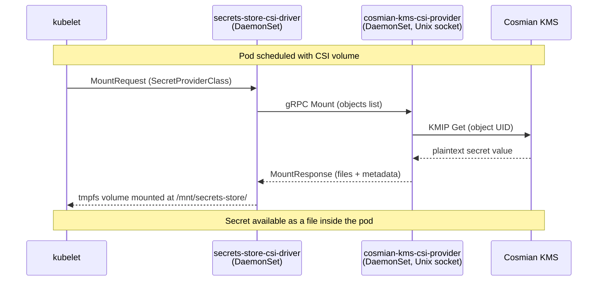

# Secrets Store CSI Driver Provider

The Cosmian KMS CSI provider (`cosmian-kms-csi-provider`) implements the
[Kubernetes Secrets Store CSI Driver](https://secrets-store-csi-driver.sigs.k8s.io/) provider
interface. It allows pods to **mount KMS-managed secrets as files** in their filesystem
without ever storing those secrets in a Kubernetes `Secret` object.

!!! note "Worker-node DaemonSet"
    Unlike the [KMS Provider Plugin](kms-provider-plugin.md), this component runs as a gRPC
    server on **worker nodes** (as a DaemonSet), not on control-plane nodes. It is called by
    the CSI driver whenever a pod is scheduled that references a `SecretProviderClass`.



---

## Prerequisites

| Requirement | Details |
|---|---|
| Cosmian KMS ≥ 5.23.0 | Running and reachable from every worker node |
| Kubernetes ≥ 1.25 | Secrets Store CSI Driver stable API |
| Helm ≥ 3.8 | Used to install the CSI driver and the provider |
| Secrets Store CSI Driver | Installed via Helm (see below) |

### Install the Secrets Store CSI Driver

```bash
helm repo add secrets-store-csi-driver \
  https://kubernetes-sigs.github.io/secrets-store-csi-driver/charts

helm install csi-secrets-store \
  secrets-store-csi-driver/secrets-store-csi-driver \
  --namespace kube-system \
  --set syncSecret.enabled=false \
  --set enableSecretRotation=true \
  --set rotationPollInterval=1m
```

Enable `enableSecretRotation` if you want in-place file updates when a secret is rotated
in the KMS.

---

## Installation

=== "Helm (recommended)"

    The CSI provider is packaged together with the Cosmian KMS Helm chart.
    Install the provider DaemonSet alongside the KMS server:

    ```bash
    helm repo add cosmian https://cosmian.github.io/kms
    helm repo update

    helm install cosmian-kms cosmian/kms \
      --namespace cosmian-kms --create-namespace \
      --set csiProvider.enabled=true
    ```

    To install **only** the provider (KMS server is deployed elsewhere):

    ```bash
    helm install cosmian-kms-csi cosmian/kms \
      --namespace cosmian-kms --create-namespace \
      --set server.enabled=false \
      --set csiProvider.enabled=true \
      --set csiProvider.kmsUrl=https://kms.example.com:9998
    ```

=== "Manual (binary)"

    ```bash
    ARCH=$(uname -m)   # x86_64 or aarch64
    VERSION=<VERSION>
    curl -fsSL \
      "https://package.cosmian.com/kms/${VERSION}/cosmian-kms-csi-provider-linux-${ARCH}.tar.gz" \
      | sudo tar -xz -C /usr/local/bin/
    sudo chmod +x /usr/local/bin/cosmian-kms-csi-provider
    ```

    Then deploy the `DaemonSet` YAML from
    `crate/clients/k8s/csi_provider/deploy/daemonset.yaml` in the KMS repository.

=== "Build from source"

    ```bash
    cargo build --release -p cosmian_kms_csi_provider
    sudo install -m 755 target/release/cosmian-kms-csi-provider /usr/local/bin/
    ```

---

## Configuration

Create the configuration file at `/etc/cosmian-kms-csi/config.yaml` on every worker node
(or mount it via a `ConfigMap` in the DaemonSet):

```yaml
cosmian_kms:
  # URL of the Cosmian KMS server
  server_url: "https://kms.example.com:9998"

  # Optional: API key authentication
  # api_key: "YOUR_API_KEY"

  # Optional: mutual TLS
  # tls_cert: "/etc/cosmian-kms-csi/client.crt"
  # tls_key:  "/etc/cosmian-kms-csi/client.key"
  # ca_cert:  "/etc/cosmian-kms-csi/ca.crt"

  # Unix socket path (must match the DaemonSet hostPath)
  socket_path: "/var/run/cosmian-kms-provider.sock"
```

Only `server_url` is required. `socket_path` defaults to `/var/run/cosmian-kms-provider.sock`.

---

## Usage

### 1. Pre-create a secret in the KMS

```bash
# Create a symmetric key (or any KMS object)
ckms sym keys create \
  --algorithm aes \
  --number-of-bits 256 \
  --tag db-password
# Note the UID returned — e.g. "5f3a1b2c-4d56-..."
```

You can also create arbitrary secret data (e.g. passwords, API keys) using the `ckms`
CLI or the KMS web UI.

### 2. Create a `SecretProviderClass`

```yaml
apiVersion: secrets-store.csi.x-k8s.io/v1
kind: SecretProviderClass
metadata:
  name: db-password
  namespace: default
spec:
  provider: cosmian-kms
  parameters:
    objects: |
      - objectName: "db-password"
        objectUID: "5f3a1b2c-4d56-..."   # UID of the KMS object
```

The `objects` list can reference multiple KMS objects. Each produces a separate file
inside the pod at `<mountPath>/<objectName>`.

### 3. Mount the `SecretProviderClass` in a Pod

```yaml
apiVersion: v1
kind: Pod
metadata:
  name: app
  namespace: default
spec:
  containers:
    - name: app
      image: nginx
      volumeMounts:
        - name: secrets
          mountPath: /mnt/secrets
          readOnly: true
  volumes:
    - name: secrets
      csi:
        driver: secrets-store.csi.k8s.io
        readOnly: true
        volumeAttributes:
          secretProviderClass: db-password
```

The secret value is available inside the container at `/mnt/secrets/db-password`.

---

## Secret rotation

When `enableSecretRotation=true` is set on the CSI driver, it re-calls the provider at
the configured `rotationPollInterval`. If the KMS object value has changed (the provider
detects this via a SHA-256 hash of the returned bytes), the CSI driver updates the
in-memory `tmpfs` mount atomically. The pod sees the new file content without a restart.

To rotate a secret:

1. In the KMS, update the object (e.g. replace the key material or secret value).
2. Wait for `rotationPollInterval` — the file inside the running pod will be updated
   automatically.

---

## Security considerations

- The Unix socket (`/var/run/cosmian-kms-provider.sock`) must only be accessible by the
  CSI driver. Kubernetes `hostPath` volumes enforce this via file permissions.
- The configuration file containing the `api_key` or TLS key must be mode `0600` and
  owned by the provider process user.
- Secret data is held in a `tmpfs` (in-memory) volume in the pod — it is never written
  to the node's disk.
- Use mutual TLS (`tls_cert`, `tls_key`, `ca_cert`) in production to authenticate the
  provider to the KMS server.

---

## Troubleshooting

| Symptom | Likely cause | Fix |
|---|---|---|
| `pod has unbound immediate PersistentVolumeClaims` | CSI driver not installed | Install `secrets-store-csi-driver` via Helm |
| `provider not found: cosmian-kms` | Provider DaemonSet not running on the node | Check `kubectl get pods -n kube-system -l app=cosmian-kms-csi-provider` |
| `connection refused` to KMS | Wrong `server_url` or KMS unreachable | Verify `server_url` from inside the node |
| `object not found` in mount | Wrong `objectUID` in `SecretProviderClass` | Verify the UID with `ckms objects get <uid>` |
| File not updating on rotation | `enableSecretRotation` not enabled | Reinstall CSI driver with `--set enableSecretRotation=true` |

### Inspect provider logs

```bash
# Find the provider pod on the same node as your failing pod
kubectl get pods -n kube-system -l app=cosmian-kms-csi-provider -o wide

# Tail provider logs
kubectl logs -n kube-system <provider-pod> -f
```
