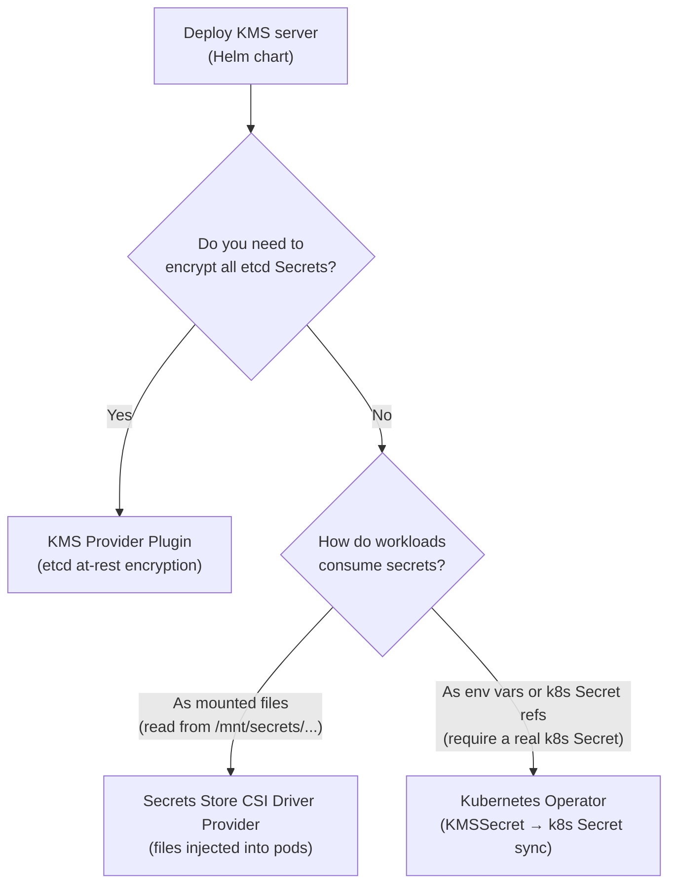

# Kubernetes Integrations

Cosmian KMS provides a complete suite of Kubernetes integrations, from deploying the KMS
server itself to deep integration with the Kubernetes secrets management ecosystem:

| Page | Description |
|---|---|
| [Helm Chart Deployment](helm.md) | Deploy the Cosmian KMS server on Kubernetes using the bundled Helm chart |
| [KMS Provider Plugin](kms-provider-plugin.md) | Encrypt Kubernetes Secrets at rest in etcd using the KMS v2 API |
| [Secrets Store CSI Driver Provider](csi-provider.md) | Mount KMS-managed secrets as files inside pods |
| [Kubernetes Operator](operator.md) | Sync KMS secrets into native `Secret` objects via a `KMSSecret` CRD |

---

## Deployment first

All integrations assume a running Cosmian KMS server. The recommended way to run the KMS
on Kubernetes is the [Helm chart](helm.md). Once the server is up, choose the integration
that matches your workload needs:

| Criterion | KMS Provider Plugin | CSI Driver Provider | Operator |
|---|---|---|---|
| Encryption scope | Whole cluster (all Secrets in etcd) | Per-pod, opt-in | Per-pod, opt-in |
| Secret consumption | Transparent (kubectl / existing code) | Files mounted in pod | Native `Secret` object |
| Control-plane access required | Yes (runs on every control-plane node) | No | No |
| Kubernetes Secrets created | Existing ones | No | Yes (`KMSSecret` CRD) |
| Key rotation support | Re-encrypt with `kubectl replace` | Automatic (CSI rotation) | Automatic (controller loop) |
