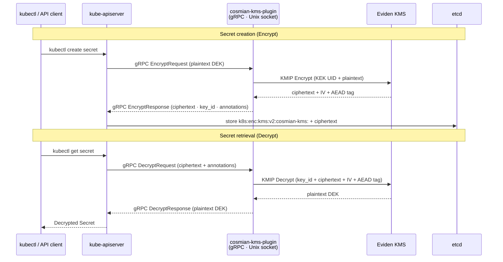

# Kubernetes KMS Provider Plugin

The Eviden KMS Kubernetes plugin (`cosmian-kms-plugin`) is a standalone binary that
implements the [Kubernetes KMS v2 provider API](https://kubernetes.io/docs/tasks/administer-cluster/kms-provider/).
It allows Kubernetes to encrypt **etcd Secrets at rest** using AES-256-GCM keys stored and
managed by the Eviden KMS.

!!! note "Control-plane only"
    The plugin runs **on every Kubernetes control-plane node**. It communicates with the
    `kube-apiserver` through a Unix domain socket — it never needs to be deployed as a Pod.
    Kubernetes control-plane nodes are always Linux regardless of the OS used by worker nodes.



---

## Prerequisites

| Requirement | Details |
|---|---|
| Eviden KMS ≥ 5.26.0 | Running and reachable from every control-plane node |
| Kubernetes ≥ 1.29 | KMS v2 API is stable from 1.29 |
| AES-256 KEK | Pre-created in the KMS; record its UID |
| Linux on control-plane | The plugin uses a Unix socket; Windows and macOS are development-only |

### Create the KEK

On the machine running (or managing) the KMS, create a wrapping key:

```bash
ckms sym keys create \
  --algorithm aes \
  --number-of-bits 256 \
  --tag kms-wrapping-key
# Note the returned UID — you will need it in the plugin config.
```

---

## Installation

=== "Ubuntu / Debian"

    ```bash
    ARCH=$(dpkg --print-architecture)   # amd64 or arm64
    VERSION=<VERSION>
    curl -fsSL \
      "https://package.cosmian.com/kms/${VERSION}/deb/${ARCH}/cosmian-kms-plugin_${VERSION}_${ARCH}.deb" \
      -o cosmian-kms-plugin.deb
    sudo dpkg -i cosmian-kms-plugin.deb
    # Binary:        /usr/local/bin/cosmian-kms-plugin
    # Systemd unit:  /lib/systemd/system/cosmian-kms-plugin.service
    # Config dir:    /etc/cosmian-kms-plugin/  (write config.yaml before starting)
    ```

=== "RHEL / CentOS / Rocky / AlmaLinux"

    ```bash
    RPM_ARCH=$(uname -m)   # x86_64 or aarch64
    CPU_ARCH=$([ "$RPM_ARCH" = "x86_64" ] && echo "amd64" || echo "arm64")
    VERSION=<VERSION>
    curl -fsSL \
      "https://package.cosmian.com/kms/${VERSION}/rpm/${CPU_ARCH}/cosmian-kms-plugin_${VERSION}_${RPM_ARCH}.rpm" \
      -o cosmian-kms-plugin.rpm
    sudo rpm -i cosmian-kms-plugin.rpm
    # Binary:        /usr/local/bin/cosmian-kms-plugin
    # Systemd unit:  /lib/systemd/system/cosmian-kms-plugin.service
    # Config dir:    /etc/cosmian-kms-plugin/  (write config.yaml before starting)
    ```

=== "Generic Linux (tarball)"

    Suitable for Alpine, Arch, NixOS, or any distribution with systemd.

    ```bash
    ARCH=$(uname -m)   # x86_64 or aarch64
    VERSION=<VERSION>
    curl -fsSL \
      "https://package.cosmian.com/kms/${VERSION}/cosmian-kms-plugin-linux-${ARCH}.tar.gz" \
      | sudo tar -xz -C /usr/local/bin/
    sudo chmod +x /usr/local/bin/cosmian-kms-plugin
    ```

    For **Alpine** (musl libc), use the `-musl` variant:

    ```bash
    curl -fsSL \
      "https://package.cosmian.com/kms/${VERSION}/cosmian-kms-plugin-linux-${ARCH}-musl.tar.gz" \
      | sudo tar -xz -C /usr/local/bin/
    ```

=== "macOS (local dev — minikube / kind)"

    On macOS, the plugin runs **inside the minikube or kind Linux VM** — not on your Mac.
    Download the pre-built Linux binary from the release server and copy it into the VM:

    ```bash
    # minikube with the Docker driver uses x86_64;
    # use aarch64 if your minikube runs under QEMU on Apple Silicon.
    ARCH=x86_64
    VERSION=<VERSION>
    curl -fsSL \
      "https://package.cosmian.com/kms/${VERSION}/cosmian-kms-plugin-linux-${ARCH}.tar.gz" \
      | tar -xz
    # Extracts: cosmian-kms-plugin (ELF x86-64 or aarch64)
    ```

    #### Copy into minikube

    ```bash
    minikube cp cosmian-kms-plugin \
      <profile>:/usr/local/bin/cosmian-kms-plugin -p <profile>
    minikube ssh -p <profile> "sudo chmod +x /usr/local/bin/cosmian-kms-plugin"
    ```

    #### Copy into kind

    ```bash
    NODE=$(kind get nodes --name <cluster>)
    docker cp cosmian-kms-plugin "${NODE}:/usr/local/bin/"
    docker exec "${NODE}" chmod +x /usr/local/bin/cosmian-kms-plugin
    ```

=== "Windows (local dev — WSL2 + minikube)"

    Kubernetes control-plane nodes always run Linux. On Windows, enable WSL2, install Ubuntu
    from the Microsoft Store, and follow the **Ubuntu / Debian** tab inside WSL2. The plugin
    is installed inside the minikube VM, not in Windows itself — the rest of the setup is
    identical to the Ubuntu instructions.

---

## Configuration

Create the configuration directory and file on **each control-plane node**:

```bash
sudo mkdir -p /etc/cosmian-kms-plugin
sudo tee /etc/cosmian-kms-plugin/config.yaml > /dev/null << 'EOF'
cosmian_kms:
  # URL of the Eviden KMS server
  server_url: "https://kms.example.com:9998"

  # Optional: API key authentication
  # api_key: "YOUR_API_KEY"

  # Optional: mutual TLS
  # tls_cert: "/etc/cosmian-kms-plugin/client.crt"
  # tls_key:  "/etc/cosmian-kms-plugin/client.key"
  # ca_cert:  "/etc/cosmian-kms-plugin/ca.crt"

  # UID of the AES-256-GCM wrapping key (KEK) stored in the KMS
  wrapping_key_uid: "YOUR_KEK_UID"

  # Unix socket path exposed to the kube-apiserver
  socket_path: "/var/run/cosmian-kms-plugin/kms.sock"
EOF
sudo chmod 600 /etc/cosmian-kms-plugin/config.yaml
```

Only `server_url` and `wrapping_key_uid` are required. `socket_path` defaults to
`/var/run/cosmian-kms-plugin/kms.sock`.

### KMS reachability

The control-plane nodes must be able to reach the KMS server over the network:

| Setup | Typical `server_url` |
|---|---|
| KMS on the same host | `http://127.0.0.1:9998` |
| KMS on another server | `https://kms.internal:9998` |
| KMS on macOS host (minikube Docker) | `http://host.docker.internal:9998` |
| KMS on macOS host (minikube QEMU) | `http://192.168.64.1:9998` |
| KMS in a Kubernetes service | `http://cosmian-kms.kms-ns.svc.cluster.local:9998` |

---

## Running the plugin

### Systemd (Ubuntu / Debian / RHEL)

The `deb` and `rpm` packages install a production-hardened systemd unit to
`/lib/systemd/system/cosmian-kms-plugin.service`. Once you have written the
[configuration file](#configuration), enable and start the service:

```bash
sudo systemctl enable --now cosmian-kms-plugin
sudo systemctl status cosmian-kms-plugin
```

Expected output:

```text
Active: active (running)
...cosmian_kms_k8s_plugin: gRPC server listening on Unix socket \
  socket=/var/run/cosmian-kms-plugin/kms.sock
```

### Alpine (OpenRC)

For tarball installations on Alpine Linux, register an OpenRC service:

```bash
cat > /etc/init.d/cosmian-kms-plugin << 'EOF'
#!/sbin/openrc-run
description="Eviden KMS Kubernetes Plugin"
command=/usr/local/bin/cosmian-kms-plugin
command_args="--config /etc/cosmian-kms-plugin/config.yaml"
command_background=true
pidfile=/run/cosmian-kms-plugin.pid
EOF

chmod +x /etc/init.d/cosmian-kms-plugin
mkdir -p /run/cosmian-kms-plugin
rc-update add cosmian-kms-plugin default
rc-service cosmian-kms-plugin start
```

---

## Kubernetes API server configuration

### kubeadm clusters (Ubuntu / Debian / RHEL)

1. Copy the EncryptionConfiguration to **every control-plane node**:

    ```bash
    sudo tee /etc/kubernetes/encryption-config.yaml > /dev/null << 'EOF'
    apiVersion: apiserver.config.k8s.io/v1
    kind: EncryptionConfiguration
    resources:
      - resources:
          - secrets
        providers:
          - kms:
              apiVersion: v2
              name: cosmian-kms
              endpoint: unix:///var/run/cosmian-kms-plugin/kms.sock
              timeout: 5s
          - identity: {}   # fallback: decrypts pre-existing unencrypted secrets
    EOF
    ```

2. Edit `/etc/kubernetes/manifests/kube-apiserver.yaml` and add:

    ```yaml
    spec:
      containers:
      - command:
        - kube-apiserver
        # --- add this flag ---
        - --encryption-provider-config=/etc/kubernetes/encryption-config.yaml
        # ...existing flags...
        volumeMounts:
        # --- add this mount ---
        - mountPath: /etc/kubernetes/encryption-config.yaml
          name: enc-config
          readOnly: true
        - mountPath: /var/run/cosmian-kms-plugin
          name: kms-sock
      volumes:
      # --- add these volumes ---
      - hostPath:
          path: /etc/kubernetes/encryption-config.yaml
          type: File
        name: enc-config
      - hostPath:
          path: /var/run/cosmian-kms-plugin
          type: DirectoryOrCreate
        name: kms-sock
    ```

    The `kubelet` static pod controller detects the manifest change and restarts the
    apiserver automatically (usually within 30 seconds).

3. Re-encrypt existing Secrets (run once per cluster, not per node):

    ```bash
    kubectl get secrets --all-namespaces -o json | kubectl replace -f -
    ```

### minikube

```bash
# Write encryption config inside the minikube VM
docker exec <profile> tee /etc/kubernetes/encryption-config.yaml > /dev/null << 'EOF'
apiVersion: apiserver.config.k8s.io/v1
kind: EncryptionConfiguration
resources:
  - resources:
      - secrets
    providers:
      - kms:
          apiVersion: v2
          name: cosmian-kms
          endpoint: unix:///var/run/cosmian-kms-plugin/kms.sock
          timeout: 5s
      - identity: {}
EOF

# Patch the apiserver manifest (adds flag + volumeMounts + volumes via sed or direct edit)
# See the kubeadm section above for the exact YAML structure.
# minikube certs live at /var/lib/minikube/certs/etcd/ (not /etc/kubernetes/pki/).

# Wait for apiserver to restart
until kubectl get nodes --context <profile> 2>/dev/null | grep -q Ready; do
  echo "Waiting..."; sleep 5
done
```

### k3s

```bash
# k3s uses a single binary; pass the flag via the config file
sudo tee -a /etc/rancher/k3s/config.yaml > /dev/null << 'EOF'
kube-apiserver-arg:
  - "encryption-provider-config=/etc/kubernetes/encryption-config.yaml"
EOF

# Mount the socket directory and config (add volumes to /etc/rancher/k3s/config.yaml)
# Then restart k3s:
sudo systemctl restart k3s
```

### kind

```bash
# kind uses a kubeadm config — add the flag at cluster creation time
cat > kind-config.yaml << 'EOF'
kind: Cluster
apiVersion: kind.x-k8s.io/v1alpha4
nodes:
  - role: control-plane
    kubeadmConfigPatches:
      - |
        kind: ClusterConfiguration
        apiServer:
          extraArgs:
            encryption-provider-config: /etc/kubernetes/encryption-config.yaml
          extraVolumes:
            - name: enc-config
              hostPath: /etc/kubernetes/encryption-config.yaml
              mountPath: /etc/kubernetes/encryption-config.yaml
              readOnly: true
            - name: kms-sock
              hostPath: /var/run/cosmian-kms-plugin
              mountPath: /var/run/cosmian-kms-plugin
    extraMounts:
      - hostPath: /path/to/encryption-config.yaml
        containerPath: /etc/kubernetes/encryption-config.yaml
      - hostPath: /var/run/cosmian-kms-plugin
        containerPath: /var/run/cosmian-kms-plugin
EOF

kind create cluster --config kind-config.yaml
```

---

## How encryption works

For each **Encrypt** call the plugin:

1. Sends a KMIP `Encrypt` request to the KMS using the configured KEK UID.
2. The KMS returns `ciphertext`, `iv` (nonce), and `aead_tag`.
3. The IV and AEAD tag are stored in the KMSv2 `annotations` map under:
   - `iv.k8s-kms.cosmian.com`
   - `aead-tag.k8s-kms.cosmian.com`
4. The `key_id` returned equals the KEK UID, which Kubernetes stores alongside the ciphertext.

For each **Decrypt** call:

1. The plugin uses the `key_id` provided by kube-apiserver (stored alongside the ciphertext in etcd) to select the KEK for the KMIP `Decrypt` call. This supports decrypting data encrypted with an older KEK after key rotation.
2. It extracts the IV and AEAD tag from annotations.
3. It sends a KMIP `Decrypt` request to the KMS and returns the plaintext.

---

## Manual testing

### 1. Verify the plugin is running

=== "systemd (Linux)"

    ```bash
    sudo systemctl status cosmian-kms-plugin
    # Expected: Active: active (running)
    sudo journalctl -u cosmian-kms-plugin -n 20 --no-pager
    # Expected log line:
    # cosmian_kms_k8s_plugin: gRPC server listening on Unix socket
    #   socket=/var/run/cosmian-kms-plugin/kms.sock
    ```

=== "minikube"

    ```bash
    minikube ssh -p <profile> \
      "sudo systemctl status cosmian-kms-plugin"
    minikube ssh -p <profile> \
      "sudo journalctl -u cosmian-kms-plugin -n 20 --no-pager"
    ```

=== "kind / kubeadm"

    ```bash
    docker exec <node-container> \
      journalctl -u cosmian-kms-plugin -n 20 --no-pager
    ```

### 2. Create a test Secret

```bash
kubectl create secret generic kms-test \
  --from-literal=password=supersecret \
  -n default
```

### 3. Verify ciphertext in etcd

The `etcd-<node>` pod in `kube-system` exposes `etcdctl`.
Cert paths differ by distribution:

| Distribution | Cert path in the etcd pod |
|---|---|
| kubeadm | `/etc/kubernetes/pki/etcd/` |
| minikube | `/var/lib/minikube/certs/etcd/` |
| k3s | `/var/lib/rancher/k3s/server/tls/etcd/` |
| kind | `/etc/kubernetes/pki/etcd/` |

```bash
NODE_NAME=$(kubectl get node -o jsonpath='{.items[0].metadata.name}')
CERT_DIR=/etc/kubernetes/pki/etcd   # adjust per table above

kubectl exec -n kube-system "etcd-${NODE_NAME}" -- \
  etcdctl \
    --endpoints=https://127.0.0.1:2379 \
    --cacert="${CERT_DIR}/ca.crt" \
    --cert="${CERT_DIR}/server.crt" \
    --key="${CERT_DIR}/server.key" \
    get /registry/secrets/default/kms-test \
  | head -c 120
```

Expected output begins with:

```text
/registry/secrets/default/kms-test
k8s:enc:kms:v2:cosmian-kms:
<binary ciphertext>
```

The `k8s:enc:kms:v2:cosmian-kms:` prefix confirms the KMS plugin is encrypting the Secret.

### 4. Verify round-trip decryption

```bash
kubectl get secret kms-test -n default \
  -o jsonpath='{.data.password}' | base64 -d
# Expected: supersecret
```

If the KMS server is unreachable the apiserver refuses to serve the Secret — confirming
that data at rest is truly protected by the KMS.

---

## Troubleshooting

### Plugin fails to start

| Symptom | Likely cause | Fix |
|---|---|---|
| `connection refused` to KMS | Wrong `server_url` or KMS not running | Check `server_url` and KMS status |
| `permission denied` on socket | Socket directory not writable | Check `RuntimeDirectory` permissions |
| `config file not found` | Wrong path | Use `--config /etc/cosmian-kms-plugin/config.yaml` |
| `wrapping_key_uid not found` | KEK does not exist in KMS | Re-create the KEK with `ckms sym keys create` |

### Apiserver crashloops after enabling encryption

The apiserver starts before the plugin socket exists. Ensure:

1. The `cosmian-kms-plugin` service is **enabled** (`systemctl enable`) and already
   running before the apiserver reads the manifest.
2. The socket directory exists: `sudo mkdir -p /var/run/cosmian-kms-plugin`.
3. The `identity: {}` fallback provider is present in `EncryptionConfiguration` — this
   allows the apiserver to decrypt pre-existing unencrypted Secrets on startup.

### etcdctl: command not found

`etcdctl` is only available inside the `etcd-<node>` pod. Access it via:

```bash
kubectl exec -n kube-system etcd-<node> -- etcdctl ...
```

It is **not** available via `minikube ssh` or as a system binary on most distributions.

---

## Security considerations

- The Unix socket must be readable only by the `kube-apiserver` process (mode `0600`).
- The `config.yaml` must be readable only by the plugin process (mode `0600`).
- The KEK should be created with restricted access controls in the KMS.
- Rotate the KEK regularly and re-encrypt Secrets after rotation with:

  ```bash
  kubectl get secrets --all-namespaces -o json | kubectl replace -f -
  ```

- In high-availability clusters, install and configure the plugin on **every**
  control-plane node before enabling encryption.
