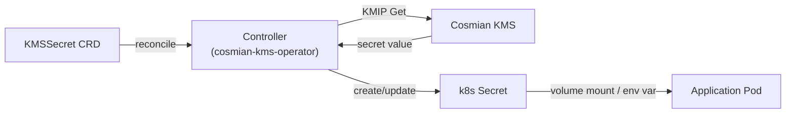

# Kubernetes Operator

The Cosmian KMS Kubernetes Operator (`cosmian-kms-operator`) manages `KMSSecret` custom
resources. Each `KMSSecret` object tells the operator to fetch a secret from the Cosmian
KMS and materialise it as a native Kubernetes `Secret`, keeping it in sync as the KMS
value changes.

The operator runs two components concurrently:

- **Controller** — reconciles `KMSSecret` CRD instances, creates/updates `Secret` objects,
  and optionally triggers rolling restarts of dependent `Deployment`/`StatefulSet` workloads.
- **Admission webhook** — mutates new `Pod` specs that carry the
  `kms.cosmian.com/inject: "true"` annotation, injecting an init-container that writes
  KMS secrets directly to a shared volume before the application container starts.



---

## Prerequisites

| Requirement | Details |
|---|---|
| Cosmian KMS ≥ 5.23.0 | Running and reachable from the operator pod |
| Kubernetes ≥ 1.25 | CRD v1 support |
| Helm ≥ 3.8 | Used to install the operator |
| cluster-admin access | Required to install CRDs and ClusterRoleBindings |

---

## Installation

=== "Helm (recommended)"

    ```bash
    helm repo add cosmian https://cosmian.github.io/kms
    helm repo update

    helm install cosmian-kms-operator cosmian/kms \
      --namespace cosmian-kms-operator --create-namespace \
      --set server.enabled=false \
      --set operator.enabled=true \
      --set operator.kmsUrl=https://kms.example.com:9998 \
      --set operator.kmsApiKey=YOUR_API_KEY
    ```

=== "Build from source"

    ```bash
    cargo build --release -p cosmian_kms_k8s_operator
    sudo install -m 755 target/release/cosmian-kms-operator /usr/local/bin/
    ```

---

## Configuration

```yaml
kms:
  server_url: "https://kms.example.com:9998"

  # Optional API key authentication
  api_key: "YOUR_API_KEY"

  # Optional API key injected from a Kubernetes Secret
  # api_token_secret_ref:
  #   name: kms-api-token
  #   key: token

  # Optional mutual TLS
  # tls_cert: "/etc/cosmian-kms-operator/client.crt"
  # tls_key:  "/etc/cosmian-kms-operator/client.key"
  # ca_cert:  "/etc/cosmian-kms-operator/ca.crt"

# How often each KMSSecret is re-fetched when no individual refreshInterval is set
default_refresh_interval: "1h"

webhook:
  # Port for the admission webhook HTTPS server
  port: 9443
  # TLS certificate and key for the webhook server (auto-generated if omitted)
  # tls_cert: "/etc/cosmian-kms-operator/webhook.crt"
  # tls_key:  "/etc/cosmian-kms-operator/webhook.key"
```

---

## `KMSSecret` CRD reference

```yaml
apiVersion: kms.cosmian.com/v1
kind: KMSSecret
metadata:
  name: postgres-credentials
  namespace: velo-infra
spec:
  # UID of the KMS object to fetch
  secretId: "5f3a1b2c-4d56-7890-abcd-ef1234567890"

  # Name of the Kubernetes Secret to create/update (same namespace)
  targetSecret: "postgres-credentials"

  # Key inside Secret.data (default: "value")
  key: "password"

  # Re-fetch interval (overrides default_refresh_interval)
  refreshInterval: "30m"

  # Extra labels added to the managed Secret
  labels:
    app: postgres

  # Deployments to rolling-restart when the value changes
  restartDeployments:
    - postgres

  # StatefulSets to rolling-restart when the value changes
  restartStatefulSets: []
```

### Status fields

```yaml
status:
  ready: "True"           # "True" | "False"
  message: "synced"       # human-readable last result
```

---

## Using the admission webhook (inject mode)

The webhook mutates pods annotated with `kms.cosmian.com/inject: "true"`. It injects an
init-container (`cosmian-kms-operator inject`) that:

1. Fetches the requested KMS objects by UID.
2. Writes each secret value as a file inside a shared `emptyDir` volume.
3. The main container finds the files at the configured mount path on startup.

### Example Pod annotation

```yaml
apiVersion: v1
kind: Pod
metadata:
  name: app
  annotations:
    kms.cosmian.com/inject: "true"
    kms.cosmian.com/secrets: |
      - name: db-password
        uid: "5f3a1b2c-4d56-7890-abcd-ef1234567890"
        path: /mnt/secrets/db-password
spec:
  containers:
    - name: app
      image: myapp:latest
      volumeMounts:
        - name: kms-secrets
          mountPath: /mnt/secrets
          readOnly: true
  volumes:
    - name: kms-secrets
      emptyDir:
        medium: Memory   # tmpfs — never written to disk
```

After the init-container completes, `/mnt/secrets/db-password` contains the plaintext
secret value.

---

## Security considerations

- Grant the operator only the RBAC permissions it needs: `get/list/watch` on `KMSSecret`
  CRDs, `create/update/delete` on `Secret` in the target namespaces.
- Use `api_token_secret_ref` to inject the KMS API key from a Kubernetes `Secret` rather
  than embedding it in the operator configuration file.
- The managed `Secret` objects are standard Kubernetes Secrets; apply
  [RBAC restrictions](https://kubernetes.io/docs/concepts/security/secrets-good-practices/)
  to limit which pods can read them.
- For etcd-at-rest encryption of the created Secrets, combine the operator with the
  [KMS Provider Plugin](kms-provider-plugin.md).

---

## Troubleshooting

| Symptom | Likely cause | Fix |
|---|---|---|
| `KMSSecret` stuck in `ready: "False"` | KMS unreachable or wrong `secretId` | Check operator logs and verify the UID with `ckms objects get <uid>` |
| Managed `Secret` not updated after rotation | `refreshInterval` not elapsed | Set a shorter `refreshInterval` or force reconcile by annotating the CRD |
| Webhook rejecting pods | Webhook TLS mismatch | Rotate the webhook certificate and update the `MutatingWebhookConfiguration` |
| Init-container crashloops | Invalid KMS URL or missing API key | Check init-container logs with `kubectl logs <pod> -c cosmian-kms-inject` |

### Inspect operator logs

```bash
kubectl logs -n cosmian-kms-operator \
  -l app=cosmian-kms-operator -f
```
