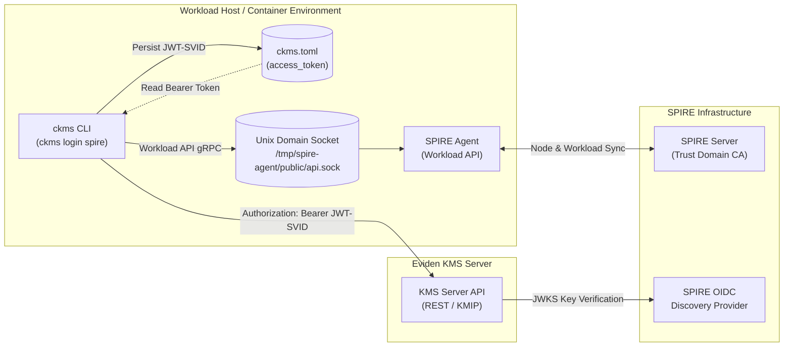
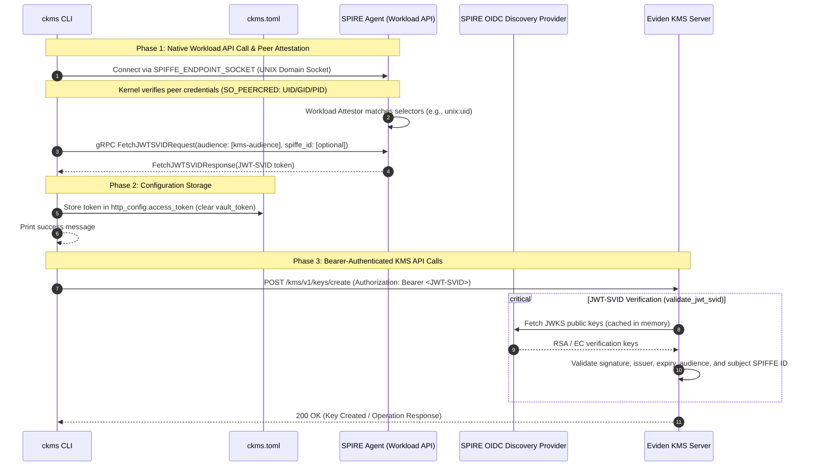

# CLI (`ckms`) SPIFFE Authentication Architecture

Eviden KMS supports native zero-trust workload identity for the CLI (`ckms`) through **SPIFFE** (Secure Production Identity Framework For Everyone) and the **SPIRE Agent Workload API**.

With `ckms login spire`, workloads, automated pipelines, and operators running alongside a SPIRE Agent can authenticate directly against the local agent's Workload API over a Unix Domain Socket (gRPC) to acquire a SPIFFE JWT-SVID, saving it into the CLI configuration without requiring external binaries (`spire-agent`), long-lived API keys, or hardcoded passwords.

---

## Architecture Overview



---

## Detailed Sequence Flow: Workload Attestation & JWT-SVID Transport

The authentication lifecycle consists of three distinct phases: Workload API connection and local attestation, token persistence, and subsequent authenticated KMS operations.



---

## Security & Architectural Invariants

### 1. Pure Native Workload API Transport

- **Protocol**: Standard SPIFFE Workload API over gRPC on a local Unix Domain Socket (UDS).
- **Socket Resolution**: Discovered via the standard `SPIFFE_ENDPOINT_SOCKET` environment variable (e.g. `unix:///tmp/spire-agent/public/api.sock`), or overridden using the `--socket-path` CLI option.
- **No External Binary Dependency**: Implemented using the pure-Rust `spiffe` crate (`WorkloadApiClient`). Does not shell out to the `spire-agent` CLI binary.
- **Kernel-Enforced Peer Attestation**: The SPIRE Agent attests the calling `ckms` process using kernel peer credentials (`SO_PEERCRED` on Linux, `LOCAL_PEERCRED` on macOS/BSD). Workload entries can restrict authorization by UID, GID, path, or container metadata.

### 2. Application Identity & Bearer Transport

- **Token Type**: SPIFFE JWT-SVID conforming to the SPIFFE specification.
    - `sub`: Workload SPIFFE ID (`spiffe://<trust-domain>/<path>`).
    - `aud`: Configured audience matching KMS server expectations.
- **Client Configuration Storage**:
    - Saved as `http_config.access_token` in `ckms.toml`.
    - Clears any conflicting Vault tokens (`http_config.vault_token = None`).
    - Seamlessly consumed by subsequent `ckms` subcommands (`ckms sym ...`, `ckms rsa ...`, `ckms kmip ...`).
- **Server-Side Validation**:
    - Verified by Actix-web middleware (`validate_jwt_svid`).
    - Cryptographically checked against the SPIRE OIDC Discovery Provider JWKS endpoint.
    - Flags: Requires `--jwt-auth-provider="<issuer>,<jwks_url>,<audience>"` and `--jwt-svid-auth`.

---

## CLI Usage Reference

### Command Syntax

```bash
ckms login spire --audience <AUDIENCE> [OPTIONS]
```

### Options

| Flag | Environment Variable | Required | Description |
|---|---|---|---|
| `--audience` | — | **Yes** | The expected JWT audience. Must match an audience configured in KMS `--jwt-auth-provider`. |
| `--spiffe-id` | — | No | Specific SPIFFE ID to request if the agent serves multiple identities to this workload. |
| `--socket-path` | `SPIFFE_ENDPOINT_SOCKET` | No | Path or URI to the SPIRE Agent Workload API socket (e.g. `unix:///tmp/spire-agent/public/api.sock`). |

### Example Workflow

```bash
# 1. Export the standard SPIFFE Workload API socket
export SPIFFE_ENDPOINT_SOCKET="unix:///tmp/spire-agent/public/api.sock"

# 2. Authenticate against the local SPIRE Agent
ckms login spire --audience dawn-kms

# 3. Perform cryptographic operations with the issued JWT-SVID
ckms sym keys create my-app-key
ckms sym encrypt my-app-key -p "Secret message"
```

---

## Server Configuration Reference

In `kms.toml`:

```toml
[idp_auth]
jwt_auth_provider = [
  "https://spire-oidc.spire.svc.cluster.local:8443,https://spire-oidc.spire.svc.cluster.local:8443/keys,dawn-kms"
]
jwt_svid_auth = true
```

Or via server command-line flags:

```bash
cosmian_kms_server \
  --jwt-auth-provider "https://spire-oidc.spire.svc.cluster.local:8443,https://spire-oidc.spire.svc.cluster.local:8443/keys,dawn-kms" \
  --jwt-svid-auth
```
