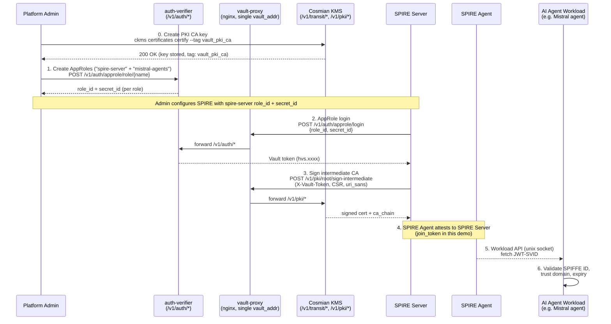
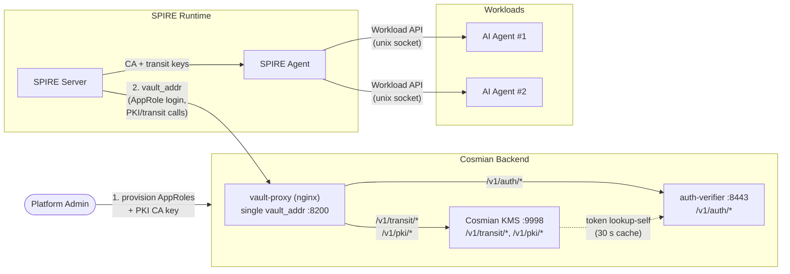
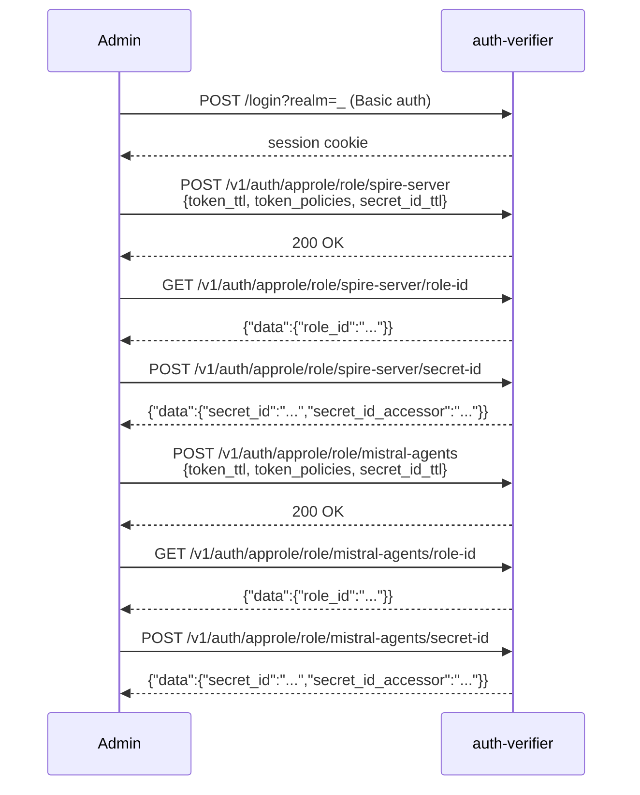
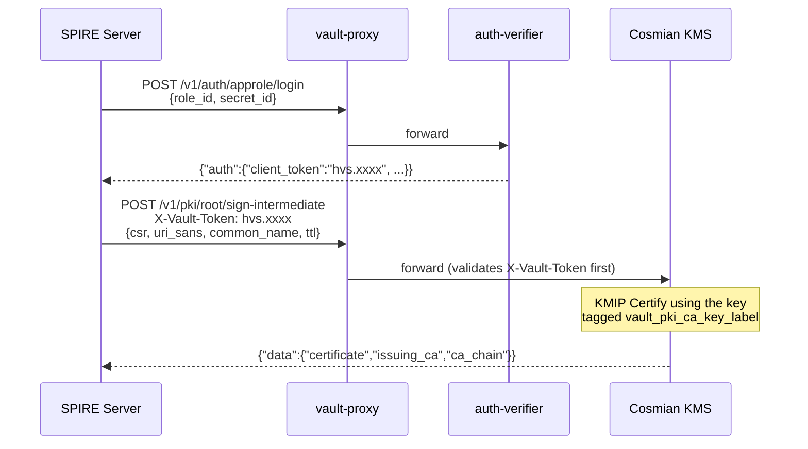
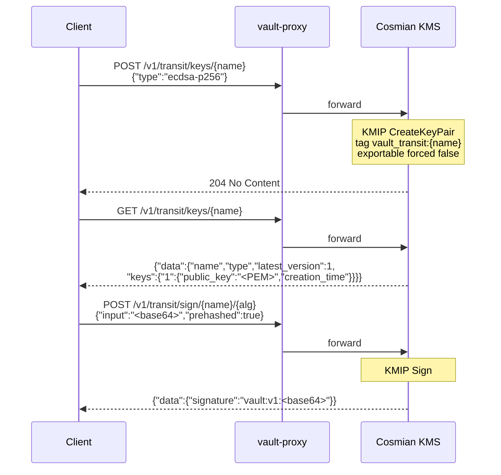
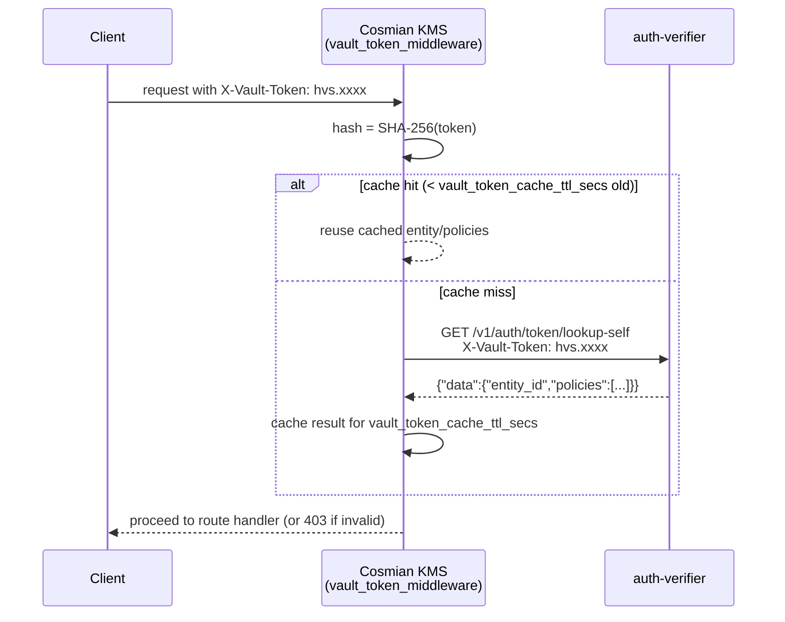
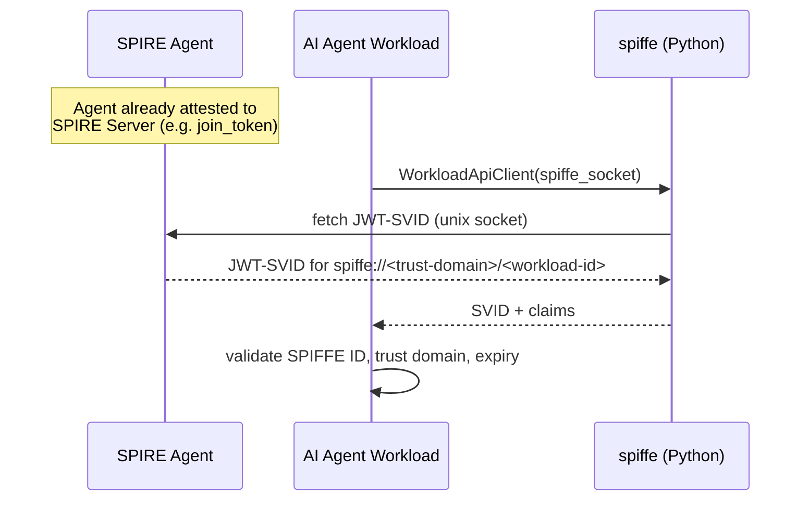

# SPIRE / SPIFFE — Workload Identity and FIPS-Backed PKI

> Cosmian KMS exposes the HTTP API
> expected by SPIRE's `upstreamauthority "vault"` and `keymanager "hashicorp_vault"` plugins
> (`/v1/transit/*`, `/v1/<pki_mount>/*`), while the Cosmian Authentication Server
> (auth-verifier) exposes the matching auth API (`/v1/auth/*`). Together they let
> [SPIRE](https://spiffe.io/docs/latest/spire-about/) (the SPIFFE Runtime Environment)
> use Cosmian's FIPS 140-3 KMS as its certificate authority and key custodian —
> **without requiring a separate secrets management cluster**.

## End-to-end flow



## What is it?

[SPIFFE](https://spiffe.io/) (Secure Production Identity Framework For Everyone) defines
a standard for issuing cryptographic identities — **SVIDs** (SPIFFE Verifiable
Identity Documents) — to software workloads, identified by a `spiffe://<trust-domain>/...`
URI. **SPIRE** is the reference runtime that issues and rotates these identities.

SPIRE needs two things from an external secrets/PKI backend:

- An **`UpstreamAuthority`** to sign its intermediate CA certificate.
- A **`KeyManager`** to store the private keys it uses internally.

Both of SPIRE's built-in `vault` plugins use a specific HTTP API for crypto operations and
authentication. Cosmian KMS implements the subset of that API SPIRE needs — the
**Transit engine** (`/v1/transit/*`) and the **PKI engine**
(`/v1/<pki_mount>/root/sign-intermediate`) — while the Cosmian Authentication Server
implements the **AppRole auth method** (`/v1/auth/*`). Point SPIRE's `vault_addr` at a
Cosmian deployment, and every private key SPIRE would normally manage itself is generated,
stored, and used exclusively inside the FIPS 140-3-validated KMS.

## Why use it?

| Need | How this integration addresses it |
|---|---|
| **Private-key custody** | SPIRE's CA and transit keys are generated and stored exclusively inside Cosmian KMS — never on the SPIRE server's local disk. |
| **FIPS 140-3 compliance** | All signing operations (CA rotation, transit `sign`) are executed by the FIPS-validated KMS, not by SPIRE's built-in `disk`/`memory` key manager. |
| **No additional cluster to operate** | Reuses infrastructure you already run (Cosmian KMS + auth-verifier) instead of standing up and hardening a separate secrets management cluster just for SPIRE. |
| **Centralized audit trail** | Every CA signature and transit `sign` call is a KMIP operation logged by the KMS with identity, timestamp, and key identifier. |
| **Post-quantum-ready transit keys** | Transit keys support `ml-dsa-65` (non-FIPS builds) alongside classical `ecdsa-p256/p384` and `rsa-2048/4096`. |
| **Drop-in `vault_addr`** | SPIRE's `UpstreamAuthority "vault"` and `KeyManager "vault"` plugins need no code changes — only configuration pointing at the Cosmian-fronted `vault_addr`. |

## Who should use it?

- **Platform/security teams** implementing machine-to-machine (M2M) workload authentication
  between services or AI agents, who already run (or plan to run) Cosmian KMS.
- **SPIRE operators** who want FIPS 140-3/HSM-backed key custody for SPIRE's CA and
  transit keys without deploying and operating a separate secrets management cluster.
- **Teams issuing identities to AI agent workloads** (e.g. LLM-backed autonomous agents)
  that need short-lived, verifiable SPIFFE identities (JWT-SVIDs or X.509-SVIDs) to
  authenticate to each other and to internal services.

## Architecture

The reference deployment (see `docker-compose.yml`, `spire` profile) fronts both Cosmian
servers with a single nginx reverse proxy so that SPIRE only needs one `vault_addr`:



nginx routes purely by path prefix: `/v1/auth/*` goes to auth-verifier, `/v1/transit/*`
and `/v1/pki/*` go to the KMS. Neither Cosmian service needs to know about the other's
existence beyond that split.

## Detailed flows

### 0. PKI CA key provisioning (prerequisite)

Before SPIRE can sign its intermediate CA, the KMS must hold a CA key with the tag
configured in `--vault-pki-ca-key-label` (default: `vault_pki_ca`). Create it once with
the `ckms` CLI:

```bash
# Generate a P-384 key pair and a self-signed root CA certificate in KMS.
# The --tag value must match vault_pki_ca_key_label in the KMS configuration.
ckms --accept-invalid-certs \
  certificates certify \
  --generate-key-pair \
  --algorithm nist-p384 \
  --certificate-id vault_pki_ca_cert \
  --subject-name "CN=My Root CA,O=Acme,C=FR" \
  --tag vault_pki_ca \
  --days 3650
```

> This step must complete **before** SPIRE server starts — the
> `POST /v1/pki/root/sign-intermediate` call (step 3 of the end-to-end flow) fails
> immediately if the key is absent.

### 1. AppRole provisioning (admin bootstrap)

An administrator provisions one `AppRole` per consumer: one for the SPIRE server itself
and one for the AI agent workloads that need direct transit signing.



### 2. SPIRE intermediate CA rotation (PKI engine)

SPIRE's `UpstreamAuthority "vault"` plugin logs in with its AppRole, then submits a CSR
to be signed as its intermediate CA.



`uri_sans` (at least one `spiffe://` URI) is mandatory — the KMS rejects a request with
an empty list with HTTP 400. The `ca_chain` in the response excludes the root and the
signed certificate itself (Vault ≥1.11 semantics).

### 3. Transit key lifecycle (KeyManager engine)

Whether used by SPIRE's `KeyManager "vault"` plugin or by an application calling the
Transit API directly, the lifecycle is the same:



### 4. Vault token validation (cross-service call, cached)

Every request into the KMS's `/v1/transit/*` and `/v1/pki/*` scopes carries an
`X-Vault-Token` header. The KMS validates it against auth-verifier and caches the result
for 30 seconds (configurable) to avoid a round-trip on every request:



### 5. Workload SVID issuance (AI agent identity)

Once SPIRE is running, workloads never talk to Cosmian directly — they fetch identities
from the local SPIRE Agent over the Workload API:



## Quick start (local demo stack)

The KMS repository ships a working end-to-end demo under `test_data/spire/` (used by the
project's own integration tests). It runs Cosmian KMS and auth-verifier as regular host
processes and everything else (nginx, SPIRE server/agent, AI agent workload containers)
via Docker Compose.

The fastest way to run the full stack from source:

```bash
mise run test:spire --variant non-fips
```

For a step-by-step breakdown (matching the numbered steps in the end-to-end flow diagram
above):

```bash
# 0. Generate local test TLS certificates (once)
bash test_data/spire/certs/generate-test-certs.sh

# Start auth-verifier and KMS as host processes (vault API enabled in kms.toml)
auth_verifier test_data/spire/config/auth_verifier.toml &
cosmian_kms --config test_data/spire/config/kms.toml &

# 0. Create the PKI CA key in KMS (must exist before SPIRE starts)
ckms --accept-invalid-certs \
  certificates certify --generate-key-pair --algorithm nist-p384 \
  --certificate-id vault_pki_ca_cert \
  --subject-name "CN=Cosmian KMS Root CA,O=Cosmian,C=FR" \
  --tag vault_pki_ca --days 3650

# Start vault-proxy (the single vault_addr SPIRE connects to)
docker compose --profile spire up -d vault-proxy

# 1. Provision AppRoles (spire-server + mistral-agents) and verify connectivity
AUTH_VERIFIER_URL=https://localhost:8443 \
  VAULT_ADDR=https://localhost:8200 \
  VAULT_CACERT=test_data/spire/certs/ca.crt \
  bash test_data/spire/setup/provision.sh

# 2–4. Start SPIRE server (injects APPROLE_* env from provision output),
#       generate join token, start SPIRE agent
docker compose --profile spire up -d spire-server
# ... (see .mise/tasks/test/spire for the full token-generation and agent-start sequence)
```

A successful run shows the SPIRE server signing its intermediate CA through the PKI
engine, then each workload container printing its issued SPIFFE ID and a passing identity
check.

> In a production deployment, Cosmian KMS and auth-verifier run as long-lived services
> (not `cargo run`/dev processes), and SPIRE Agent should use a stronger node attestor
> (e.g. `x509pop` or TPM-based attestation) instead of the `join_token` attestor used in
> this local demo.

## Configuration reference

Enable the SPIRE-compatible API on the KMS with these flags/environment variables
(`crate/server/src/config/command_line/vault_config.rs`):

| Flag | Environment variable | Default | Description |
|---|---|---|---|
| `--vault-api-enabled` | `KMS_VAULT_API_ENABLED` | `false` | Enables the `/v1/transit/*` and `/v1/<vault_pki_mount>/*` scopes. |
| `--vault-auth-verifier-url` | `KMS_VAULT_AUTH_VERIFIER_URL` | *(none)* | Base URL of the auth-verifier instance used to validate `X-Vault-Token` headers. Required when the API is enabled. |
| `--vault-auth-verifier-ca-cert` | `KMS_VAULT_AUTH_VERIFIER_CA_CERT` | *(none)* | PEM CA certificate used to verify auth-verifier's TLS certificate (for self-signed/private CAs). |
| `--vault-auth-verifier-accept-invalid-certs` | `KMS_VAULT_AUTH_VERIFIER_ACCEPT_INVALID_CERTS` | `false` | Skip TLS verification when calling auth-verifier. **Test/dev only** — use `--vault-auth-verifier-ca-cert` in production. |
| `--vault-transit-mount` | `KMS_VAULT_TRANSIT_MOUNT` | `transit` | Mount name served at `/v1/<mount>/keys/…`. |
| `--vault-pki-mount` | `KMS_VAULT_PKI_MOUNT` | `pki` | Mount name served at `/v1/<mount>/root/sign-intermediate`. |
| `--vault-pki-ca-key-label` | `KMS_VAULT_PKI_CA_KEY_LABEL` | `vault_pki_ca` | KMIP tag of the KMS key used as the PKI engine's signing key. Must already exist in the KMS. |
| `--vault-token-cache-ttl-secs` | `KMS_VAULT_TOKEN_CACHE_TTL_SECS` | `30` | Lifetime of cached `lookup-self` results. Set to `0` to disable caching. |

## CLI reference

`ckms vault approle` provisions and manages `AppRole` identities in auth-verifier
(`crate/clients/clap/src/actions/vault/approle.rs`):

| Subcommand | Auth required | Purpose |
|---|---|---|
| `login` | none | Exchange `role_id` + `secret_id` for a Vault token. |
| `create-role` | admin | Create or update a role (`token_ttl`, `token_policies`, `secret_id_ttl`). |
| `list-roles` | admin | List all roles. |
| `get-role-id` | admin | Retrieve a role's stable `role_id`. |
| `generate-secret-id` | admin | Generate a new `secret_id` for a role. |
| `destroy-secret-id` | admin | Invalidate a `secret_id` by its accessor. |
| `delete-role` | admin | Permanently delete a role. |

Admin subcommands take `--auth-verifier-url`/`CKMS_VAULT_AUTH_URL`,
`--admin-user`/`CKMS_VAULT_ADMIN_USER`, and `--admin-password`/`CKMS_VAULT_ADMIN_PASSWORD`.

## HTTP endpoint reference

**auth-verifier** (`/v1/auth/*`):

| Method | Path | Purpose |
|---|---|---|
| `POST` | `/v1/auth/approle/login` | Exchange `role_id`+`secret_id` for a Vault token (unauthenticated). |
| `POST` | `/v1/auth/approle/role/{name}` | Create/update a role (admin). |
| `GET` | `/v1/auth/approle/role/{name}/role-id` | Read a role's `role_id` (admin). |
| `POST` | `/v1/auth/approle/role/{name}/secret-id` | Generate a `secret_id` (admin). |
| `POST` | `/v1/auth/approle/role/{name}/secret-id/destroy` | Invalidate a `secret_id` (admin). |
| `DELETE` | `/v1/auth/approle/role/{name}` | Delete a role (admin). |
| `GET` | `/v1/auth/approle/role` | List roles (admin). |
| `GET` | `/v1/auth/token/lookup-self` | Validate the caller's own token (used by the KMS middleware). |
| `POST` | `/v1/auth/token/renew-self` | Renew the caller's own token. |
| `POST` | `/v1/auth/token/revoke-self` | Revoke the caller's own token. |

> `/v1/auth/kubernetes/*` is also available as an alternative login method (Kubernetes
> service-account JWT), for workloads running inside a Kubernetes cluster instead of
> using AppRole credentials.

**Cosmian KMS** (`/v1/transit/*`, `/v1/<pki_mount>/*`):

| Method | Path | Purpose |
|---|---|---|
| `POST` | `/v1/transit/keys/{name}` | Create a transit key. |
| `POST` | `/v1/transit/keys/{name}/config` | Update key config (`deletion_allowed`; accepted, no-op). |
| `GET` | `/v1/transit/keys/{name}` | Read key info (type, public key, version map). |
| `GET` | `/v1/transit/keys` | List transit keys. |
| `DELETE` | `/v1/transit/keys/{name}` | Delete a transit key. |
| `POST` | `/v1/transit/sign/{name}/{alg}` | Sign pre-hashed or raw data. |
| `POST`/`PUT` | `/v1/<pki_mount>/root/sign-intermediate` | Sign a CSR with the configured CA key. |

## Security notes

- `exportable` is always forced to `false` server-side, regardless of what a client
  requests — transit private keys can never leave the KMS.
- `ml-dsa-65` and `ed25519` transit key types require the KMS `non-fips` feature; they
  are unavailable in FIPS builds. `ecdsa-p256`, `ecdsa-p384`, `rsa-2048`, and `rsa-4096`
  are available in both FIPS and non-FIPS builds.
- The 30-second token validation cache means a revoked token can still be accepted for
  up to `vault_token_cache_ttl_secs` seconds. Lower this value (or set it to `0`) if your
  threat model requires faster revocation propagation.
- Prefer `--vault-auth-verifier-ca-cert` over `--vault-auth-verifier-accept-invalid-certs`
  in any non-throwaway environment — the latter disables TLS certificate verification
  entirely for calls to auth-verifier.
- The KMS's `/v1/transit/*` and `/v1/pki/*` scopes depend on auth-verifier being
  reachable: a cache-miss during an auth-verifier outage will cause new requests to those
  scopes to fail until connectivity is restored.

## Troubleshooting

| Symptom | Cause | Fix |
|---|---|---|
| SPIRE startup fails with "key not found" | AppRole credentials/PKI CA key not provisioned yet | Run the provisioning step (`provision.sh` or equivalent `ckms vault approle` calls) before starting SPIRE. |
| nginx `502 Bad Gateway` from vault-proxy | auth-verifier or KMS not yet healthy/reachable | Confirm both services are up and reachable at the addresses configured in the nginx proxy before starting SPIRE. |
| Workload can't obtain an SVID | SPIRE workload registration entry missing or selector mismatch | List registered entries on the SPIRE server and verify the workload's selector matches its registration. |
| `403 permission denied` calling `/v1/transit/*` or `/v1/pki/*` | Invalid, expired, or unrecognized `X-Vault-Token` | Re-run AppRole login to obtain a fresh token; confirm `vault_auth_verifier_url` on the KMS points to the correct auth-verifier instance. |

## See also

- [Architecture Decision Record: SPIRE/SPIFFE via Vault-Compatible API](../adr/2026-07-26-spire-spiffe-via-vault-api.md) — full design rationale, alternatives considered, and database schema.
- `crate/server/documentation/openapi.yaml` — OpenAPI schema for the `/v1/transit/*` and `/v1/<pki_mount>/*` paths.
- `ckms vault approle --help` — full CLI reference for AppRole provisioning.
