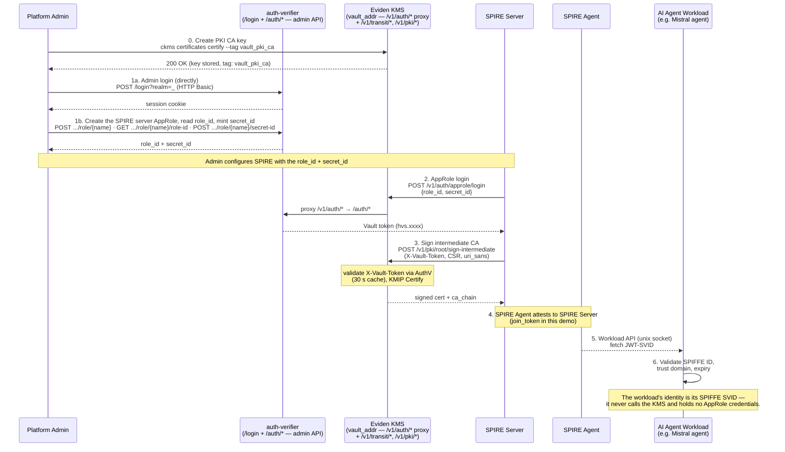
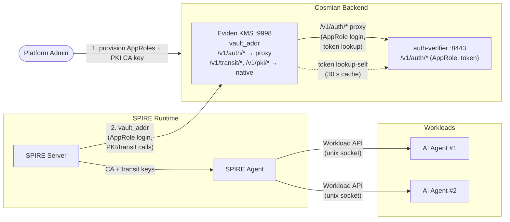
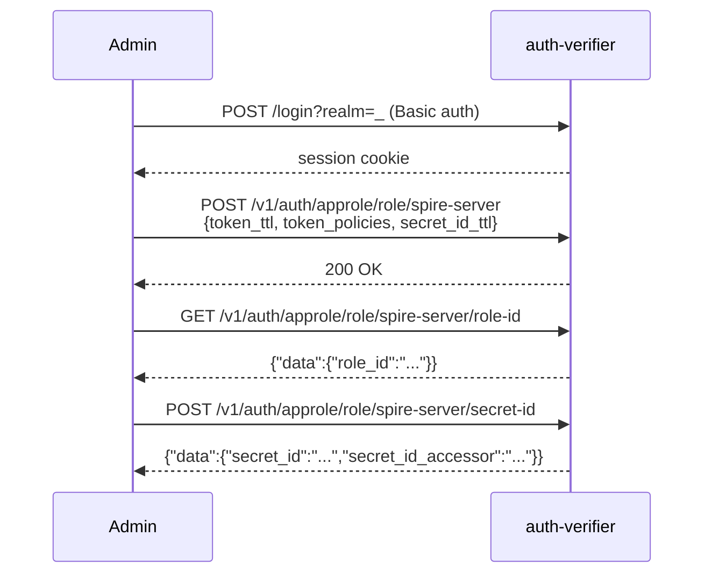
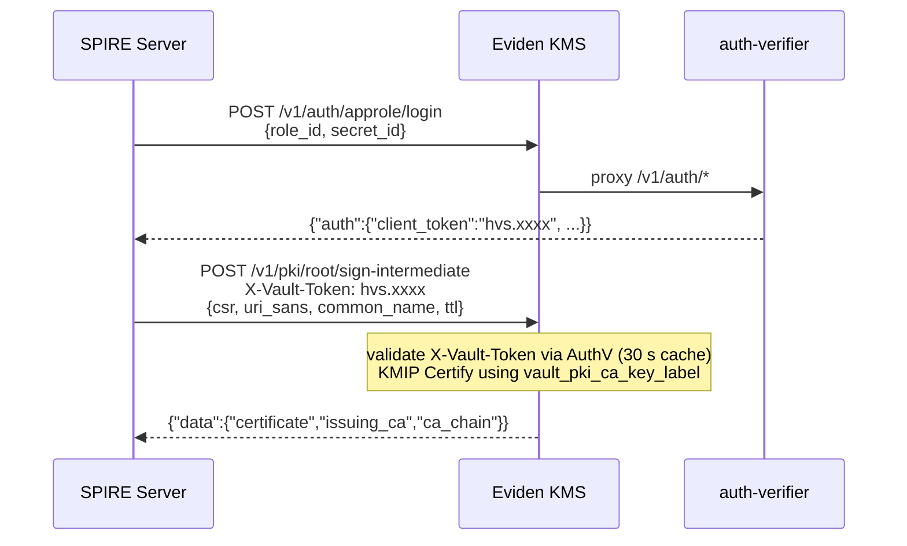
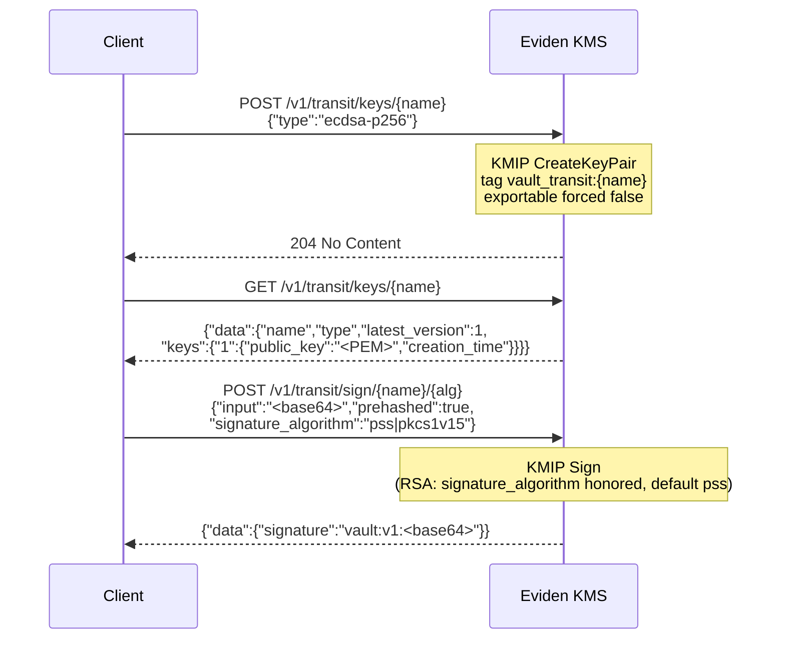
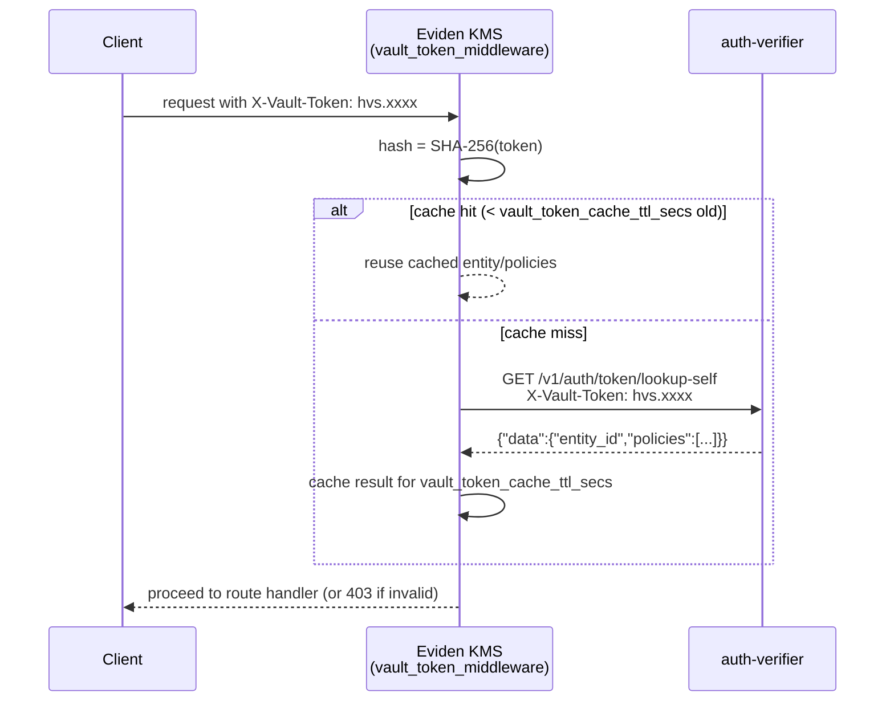
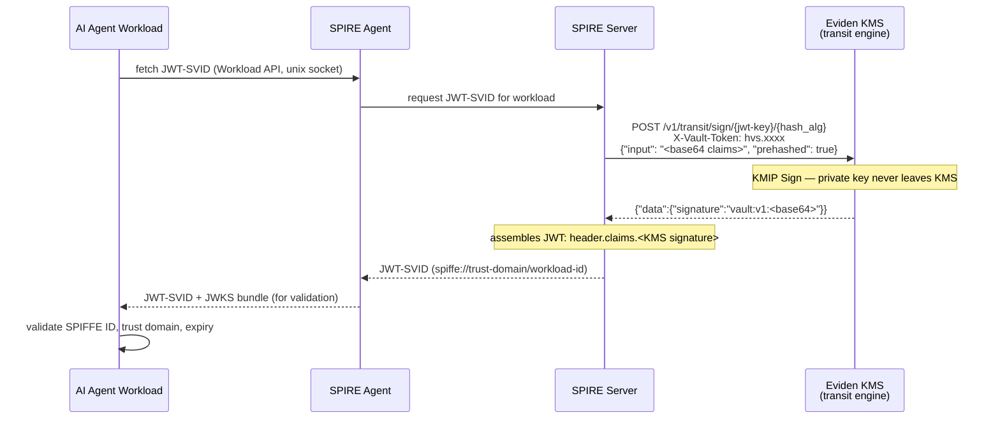
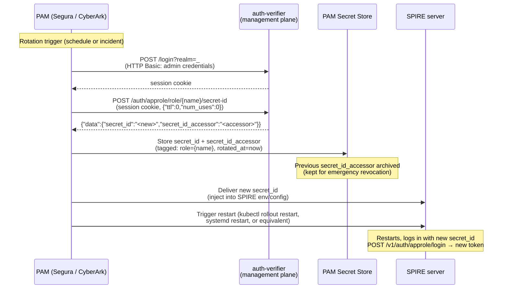

# SPIRE / SPIFFE — Workload Identity and FIPS-Backed PKI

> Eviden KMS serves as the single `vault_addr` for SPIRE: it implements the
> transit and PKI engines (`/v1/transit/*`, `/v1/{pki_mount}/*`) directly, and
> transparently proxies all auth requests (`/v1/auth/*`) to the Cosmian Authentication
> Server (auth-verifier), which handles AppRole login, token lifecycle, and
> Kubernetes auth. Together they let
> [SPIRE](https://spiffe.io/docs/latest/spire-about/) (the SPIFFE Runtime Environment)
> use Cosmian's FIPS 140-3 KMS as its certificate authority and key custodian —
> **without requiring a separate secrets management cluster or a reverse proxy**.

## End-to-end flow



Steps 1–4 are the SPIRE server's Vault-compatible flow: it logs in with its AppRole, then uses
the KMS PKI engine to sign its intermediate CA and (optionally) the transit engine to store and
use its own signing keys. Steps 5–6 are the **only** interaction the AI agent workload has with
SPIRE: it authenticates to the SPIRE Agent through the Workload API and receives a SPIFFE SVID
(JWT-SVID and/or X.509-SVID), which it uses to authenticate to *other* services. The workload
never talks to the KMS and holds **no** AppRole credentials — SPIFFE identity (5–6) and the KMS
AppRole (2–4) are two independent, non-overlapping capabilities: the former for the workload,
the latter for the SPIRE server.

## What is it?

[SPIFFE](https://spiffe.io/) (Secure Production Identity Framework For Everyone) defines
a standard for issuing cryptographic identities — **SVIDs** (SPIFFE Verifiable
Identity Documents) — to software workloads, identified by a `spiffe://<trust-domain>/...`
URI. **SPIRE** is the reference runtime that issues and rotates these identities.

SPIRE needs two things from an external secrets/PKI backend:

- An **`UpstreamAuthority`** to sign its intermediate CA certificate.
- A **`KeyManager`** to store the private keys it uses internally.

Both of SPIRE's built-in `vault` plugins use a specific HTTP API for crypto operations and
authentication. Eviden KMS implements the subset of that API SPIRE needs: it handles the
**Transit engine** (`/v1/transit/*`) and the **PKI engine**
(`/v1/{pki_mount}/root/sign-intermediate`) natively, and transparently proxies all
**AppRole auth** calls (`/v1/auth/*`) to the Cosmian Authentication Server. Point SPIRE's
`vault_addr` at the KMS, and every private key SPIRE would normally manage itself is
generated, stored, and used exclusively inside the FIPS 140-3-validated KMS.

## Why use it?

| Need                                 | How this integration addresses it                                                                                                                                                  |
| ------------------------------------ | ---------------------------------------------------------------------------------------------------------------------------------------------------------------------------------- |
| **Private-key custody**              | SPIRE's CA and transit keys are generated and stored exclusively inside Eviden KMS — never on the SPIRE server's local disk.                                                      |
| **FIPS 140-3 compliance**            | All signing operations (CA rotation, transit `sign`) are executed by the FIPS-validated KMS, not by SPIRE's built-in `disk`/`memory` key manager.                                  |
| **No additional cluster to operate** | Reuses infrastructure you already run (Eviden KMS + auth-verifier) instead of standing up and hardening a separate secrets management cluster just for SPIRE.                     |
| **Centralized audit trail**          | Every CA signature and transit `sign` call is a KMIP operation logged by the KMS with identity, timestamp, and key identifier.                                                     |
| **Post-quantum-ready transit keys**  | Transit keys support `ml-dsa-65` (non-FIPS builds) alongside classical `ecdsa-p256/p384` and `rsa-2048/4096`.                                                                      |
| **Drop-in `vault_addr`**             | SPIRE's `UpstreamAuthority "vault"` and `KeyManager "vault"` plugins need no code changes — only configuration pointing `vault_addr` at the KMS. No nginx or extra proxy required. |

## Who should use it?

- **Platform/security teams** implementing machine-to-machine (M2M) workload authentication
  between services or AI agents, who already run (or plan to run) Eviden KMS.
- **SPIRE operators** who want FIPS 140-3/HSM-backed key custody for SPIRE's CA and
  transit keys without deploying and operating a separate secrets management cluster.
- **Teams issuing identities to AI agent workloads** (e.g. LLM-backed autonomous agents)
  that need short-lived, verifiable SPIFFE identities (JWT-SVIDs or X.509-SVIDs) to
  authenticate to each other and to internal services.

## Architecture

KMS acts as the single `vault_addr` for the entire SPIRE deployment. Internally it routes
by path: `/v1/transit/*` and `/v1/pki/*` are handled directly, while `/v1/auth/*` is
transparently proxied to auth-verifier. SPIRE never needs to know about the two-service
split — it connects to one endpoint.



KMS proxies `/v1/auth/*` to the auth-verifier URL configured via
`vault_auth_verifier_url`. No nginx or additional reverse proxy is needed — the same
TLS client already used for token validation is reused for the proxy.

### KMS endpoint groups

The KMS exposes three distinct path groups under its `vault_addr`. Each group has a
different purpose, a different caller, and a different backend implementation.

| Path group | Handled by | Caller | Purpose | Output type |
|---|---|---|---|---|
| `/v1/auth/*` | auth-verifier *(proxied)* | SPIRE server | AppRole login, token validation, renewal, revocation — all HTTP methods forwarded transparently | Vault token (`hvs.*`) / 204 No Content |
| `/v1/{mount}/keys/*` | Eviden KMS *(native)* | SPIRE `KeyManager` | Create (`CreateKeyPair`), read (`Find`+`Get`), configure (no-op), list (`Find`), delete (`Revoke`+`Destroy`) asymmetric key pairs; private key `sensitive=true` (non-exportable) | `TransitKeyInfo` (name, type, public key PEM, version map) / 204 No Content |
| `/v1/{mount}/sign/{name}/{hash_alg}` | Eviden KMS *(native)* | SPIRE `KeyManager` | Server-side signing (`Sign`); private key never leaves the KMS | Signature string (`vault:v1:` prefix + base64) |
| `/v1/{mount}/root/sign-intermediate` | Eviden KMS *(native)* | SPIRE `UpstreamAuthority` | Sign a SPIRE intermediate CA CSR with the pre-provisioned Root CA key (`Find`→`Certify`→`Find`+`Get`) — **only** implemented PKI path | `SignIntermediateResult` (signed cert PEM, issuing CA PEM, CA chain PEMs) |

#### `/v1/auth/*` — Authentication proxy

Handled by **auth-verifier** (the KMS forwards all `/v1/auth/*` requests transparently).
The KMS never processes credentials itself.

| Method | Path | Caller | Purpose | Output type |
|---|---|---|---|---|
| `POST` | `/v1/auth/approle/login` | SPIRE server | Exchange `role_id`+`secret_id` for a Vault token | Vault token (`hvs.*` string + lease metadata) |
| `GET` | `/v1/auth/token/lookup-self` | KMS middleware (internal) | Validate an `X-Vault-Token` and retrieve `entity_id` (used as KMS owner) | Token metadata (`entity_id`, `expire_time`, policies) |
| `POST` | `/v1/auth/token/renew-self` | SPIRE server | Extend a token's TTL | Renewed Vault token (same `hvs.*` string, updated `lease_duration`) |
| `POST` | `/v1/auth/token/revoke-self` | SPIRE server | Immediately invalidate the caller's own token | 204 No Content |

All HTTP methods (`GET`, `POST`, `PUT`, `DELETE`) on any `/v1/auth/{path}` are forwarded
unchanged to auth-verifier — the KMS never inspects the body or response of auth requests.

> For admin operations (create/delete roles, mint `secret_id`), operators call the
> **auth-verifier directly** — those paths are not proxied by the KMS. See
> [Two planes](#two-planes-data-plane-vs-management-plane) below.

#### `/v1/{mount}/keys/*` and `/v1/{mount}/sign/*` — Transit engine

Handled **natively** by the KMS. Caller: SPIRE server (`KeyManager "vault"` plugin).
Requires `X-Vault-Token`; the `entity_id` from the token becomes
the KMIP object owner, enforcing per-AppRole isolation.

Each transit key is stored as a KMIP `PrivateKey`+`PublicKey` pair tagged
`vault_transit:{name}`, with `sensitive=true` set at creation time — the private key is
permanently non-exportable at every API surface.

| Method | Path | KMIP op | Purpose | Output type |
|---|---|---|---|---|
| `POST`/`PUT` | `/v1/{mount}/keys/{name}` | `CreateKeyPair` | Create a named key pair | `TransitKeyInfo` (name, type, version map with public key PEM) |
| `GET` | `/v1/{mount}/keys/{name}` | `Find`→`Get` | Read key metadata and public key PEM | `TransitKeyInfo` (same shape as create) |
| `GET` | `/v1/{mount}/keys` | `Find` | List all transit key names owned by the caller | Key name list |
| `POST` | `/v1/{mount}/keys/{name}/config` | *(no-op)* | Accept SPIRE's config call without error | 204 No Content |
| `DELETE` | `/v1/{mount}/keys/{name}` | `Revoke`+`Destroy` | Permanently delete key pair | 204 No Content |
| `POST`/`PUT` | `/v1/{mount}/sign/{name}/{hash_alg}` | `Sign` | Sign a pre-hashed input server-side (private key never leaves KMS) | Signature string (`vault:v1:` prefix + base64) |

#### `/v1/{mount}/root/sign-intermediate` — PKI engine (single endpoint)

> **Scope note**: The KMS implements **only** this one path from the full Vault PKI
> namespace. Other PKI paths (`/v1/{mount}/ca`, `/v1/{mount}/issue/*`,
> `/v1/{mount}/cert/*`, etc.) are **not** implemented and will return `404`. SPIRE's
> `UpstreamAuthority "vault"` plugin calls only `sign-intermediate`, so no other path
> is needed.

Handled **natively** by the KMS. Caller: SPIRE server (`UpstreamAuthority "vault"` plugin).
Requires `X-Vault-Token` (authentication only — the signing always executes as the server
admin, so the caller's AppRole does not need to own the CA key).

| Method | Path | KMIP ops | Purpose | Output type |
|---|---|---|---|---|
| `POST`/`PUT` | `/v1/{mount}/root/sign-intermediate` | `Find` → `Certify` → `Find`+`Get` (CA cert chain) | Sign a SPIRE intermediate CA CSR with the pre-provisioned Root CA key | `SignIntermediateResult` (signed intermediate certificate PEM, issuing CA certificate PEM, CA chain PEM list) |

The CA key is located by the tag configured in `vault_pki_ca_key_label` (default
`vault_pki_ca`). The Root CA key and its certificate **never leave the KMS** — only the
newly signed intermediate certificate is returned. Returns `HTTP 500` if the CA key or
its linked certificate is absent.

> **Authentication for `/v1/transit/*` and `/v1/pki/*`**: every request to these
> native KMS paths must carry a valid `X-Vault-Token` header. The KMS validates it by
> calling `/v1/auth/token/lookup-self` on the auth-verifier (results cached for 30 s).
> The token determines the **owner** of all KMS objects created or used during the
> request, ensuring strict multi-tenant isolation.

### Two planes: data plane vs management plane

This deployment has **two distinct access planes**, and conflating them is the most
common source of confusion:

| Plane                | Who                      | Reaches                        | Endpoints                                                                  |
| -------------------- | ------------------------ | ------------------------------ | -------------------------------------------------------------------------- |
| **Data plane**       | SPIRE servers            | the **KMS only**               | `/v1/auth/approle/login`, `/v1/auth/token/*`, `/v1/transit/*`, `/v1/pki/*` |
| **Management plane** | Platform operators       | the **auth-verifier directly** | `/login?realm=_` (admin), `/auth/approle/*` (role/secret-id CRUD)          |

Why AppRole **creation** is not on the data plane: creating a role or minting a
`secret_id` requires an **admin session cookie** obtained from the auth-verifier's
`POST /login?realm=_` (HTTP Basic admin credentials). The KMS proxy only forwards
`/v1/auth/*` and does **not** forward cookies or expose `/login`, so admin operations
**cannot** and **should not** traverse the KMS. This is deliberate: the public,
SPIRE-facing endpoint (the KMS) never carries privileged admin credentials.

**Consequence for deployment:** the auth-verifier's admin API is reached **directly** by
operators — it is a **separate endpoint** from the KMS, never proxied by it. Because that
admin API mints AppRoles (and therefore access to any tenant's keys), it is strongly
recommended to keep it on a limited-exposure endpoint (a private network, `localhost` on
the host, or an mTLS-gated ingress) rather than the open internet. The KMS remains the
only endpoint the SPIRE server ever touches.

### Provisioning AppRoles (operator, management plane)

An operator creates one AppRole per SPIRE tenant and hands the tenant its `role_id` +
`secret_id` out-of-band. Point `--auth-verifier-url` **directly at the auth-verifier**
(all `ckms vault approle` sub-commands are admin operations against it):

```bash
export CKMS_VAULT_AUTH_URL="https://auth-verifier.internal:8443"   # the auth-verifier
export CKMS_VAULT_ADMIN_USER="admin"
export CKMS_VAULT_ADMIN_PASSWORD="…"

# 1. Create a role for a SPIRE server (its NAME becomes the KMS object owner).
ckms vault approle create-role spire-prod --token-ttl 3600 --token-policies default

# 2. Read the stable role_id and mint a secret_id — give both to the SPIRE operator.
ckms vault approle get-role-id spire-prod
ckms vault approle generate-secret-id spire-prod
```

> SPIRE performs the data-plane AppRole *login* itself against the KMS `vault_addr`
> (`POST /v1/auth/approle/login`); there is no `login` sub-command in `ckms vault approle`.
>
> Keep the `secret_id_accessor` returned by `generate-secret-id` in a secure store —
> it is the only handle available to revoke the `secret_id` without deleting the entire
> role. See [Manage AppRole credentials](#4-manage-approle-credentials) for rotation and
> automation guidance.

Equivalent raw calls (used by the test harness `provision.sh`): `POST /login?realm=_`
for the admin cookie, then `POST /auth/approle/role/{name}` and
`POST /auth/approle/role/{name}/secret-id` against the auth-verifier.

## Setup (installation and configuration)

This section is the systematic, production-oriented checklist to stand up the full
stack. Each step links to the detailed reference for that component. In order:

| # | Step | What you do | Reference |
|---|------|-------------|-----------|
| 1 | **Install Eviden KMS** | Install and start the KMS (Docker, Linux packages, macOS, or Windows). | [KMS installation](../installation/installation_getting_started.md) |
| 2 | **Install the auth-verifier** | Deploy the Cosmian Authentication Server that the KMS proxies `/v1/auth/*` to. | `authentication/server/documentation/docs/installation.md` |
| 3 | **Enable the Vault API on the KMS** | Turn on the SPIRE-compatible API and point it at the auth-verifier. | [Configuration reference](#configuration-reference) |
| 4 | **Create the PKI CA key** | Create the KMS key the PKI engine signs intermediate CAs with. | [PKI CA key provisioning](#0-pki-ca-key-provisioning-prerequisite) |
| 5 | **Provision AppRoles** | Create one AppRole per SPIRE server and hand out its `role_id`/`secret_id`. | [Provisioning AppRoles](#provisioning-approles-operator-management-plane) |
| 6 | **Configure the SPIRE server** | Point SPIRE's `vault_addr` at the KMS and wire the `UpstreamAuthority`/`KeyManager` plugins. | [SPIRE server configuration](#spire-server-configuration) |
| 7 | **Start SPIRE and verify** | Start the SPIRE server/agent and confirm the intermediate CA is signed and SVIDs issue. | [Quick start](#quick-start-local-demo-stack) |

### Step 3 — Enable the Vault API on the KMS

Set at least these in the KMS configuration (full list in the
[Configuration reference](#configuration-reference)):

```toml
[vault]
vault_api_enabled          = true
# The auth-verifier from step 2 — reached internally by the KMS (server-to-server).
vault_auth_verifier_url    = "https://auth.example.com:8443"
vault_auth_verifier_ca_cert = "/etc/cosmian/certs/auth-verifier-ca.crt"
vault_transit_mount        = "transit"
vault_pki_mount            = "pki"
vault_pki_ca_key_label     = "vault_pki_ca"
```

### SPIRE server configuration

Point SPIRE's `vault_addr` at the **KMS** (not the auth-verifier — the KMS proxies
`/v1/auth/*` for you). A complete `server.conf`:

```hcl
server {
    bind_address = "0.0.0.0"
    bind_port    = "8081"

    # Trust domain — must match the SPIFFE IDs used by your workloads.
    trust_domain = "example.org"

    data_dir  = "/var/lib/spire/server"
    log_level = "INFO"

    ca_subject = {
        country      = ["FR"],
        organization = ["Example"],
        common_name  = "Example SPIRE Intermediate CA",
    }

    ca_ttl                = "24h"   # how often SPIRE rotates its intermediate CA
    default_x509_svid_ttl = "1h"    # workload SVID lifetime
}

plugins {
    # ── Upstream Authority: Eviden KMS PKI engine (Vault-compatible) ─────────
    # Signs SPIRE's intermediate CA CSR via the KMS. Built-in to SPIRE — no
    # plugin_cmd required. vault_addr points at the KMS; the KMS proxies
    # /v1/auth/* to the auth-verifier and handles /v1/pki/* natively.
    UpstreamAuthority "vault" {
        plugin_data {
            vault_addr   = "https://kms.example.com:9998"
            # CA cert that verifies the KMS TLS certificate.
            ca_cert_path = "/etc/spire/server/kms-ca.crt"

            # AppRole login — credentials are read from the environment variables
            # VAULT_APPROLE_ID and VAULT_APPROLE_SECRET_ID (the role_id/secret_id
            # you provisioned in step 5). Do not hard-code the secret here.
            approle_auth {
                approle_auth_mount_point = "approle"
            }

            # Must match vault_pki_mount on the KMS (default: "pki").
            pki_mount_point = "pki"
        }
    }

    # ── Key Manager ───────────────────────────────────────────────────────────
    # Stores SPIRE's own signing keys. "disk" is built-in and sufficient for most
    # deployments. SPIRE's Vault-backed KeyManager ("vault") is a separate,
    # externally-distributed plugin (not bundled in the SPIRE image); if you use
    # it, point transit_engine_path at the KMS transit mount.
    KeyManager "disk" {
        plugin_data {
            keys_path = "/var/lib/spire/server/keys.json"
        }
    }

    # ── Node Attestor ─────────────────────────────────────────────────────────
    # join_token is the simplest for a first bring-up; for production prefer a
    # stronger attestor such as x509pop or a platform-specific one (TPM, k8s_psat).
    NodeAttestor "join_token" {
        plugin_data {}
    }

    # ── Data Store ────────────────────────────────────────────────────────────
    DataStore "sql" {
        plugin_data {
            database_type     = "sqlite3"
            connection_string = "/var/lib/spire/server/datastore.sqlite3"
        }
    }
}
```

Provide the AppRole credentials from step 5 to the SPIRE server process via
environment variables (e.g. in the systemd unit or container env):

```bash
export VAULT_APPROLE_ID="<role_id>"
export VAULT_APPROLE_SECRET_ID="<secret_id>"
```

> The AppRole **name** (e.g. `spire-prod`) becomes the KMS object owner, so each
> SPIRE server gets an isolated key namespace on the shared KMS. See
> [Cross-AppRole isolation](#cross-approle-isolation).

## Detailed flows

### 0. PKI CA key provisioning (prerequisite)

Before SPIRE can sign its intermediate CA, the KMS must hold a CA key with the tag
configured in `--vault-pki-ca-key-label` (default: `vault_pki_ca`). Create it once with
the `ckms` CLI:

```bash
# Generate a P-384 key pair and a self-signed root CA certificate in KMS.
# The --tag value must match vault_pki_ca_key_label in the KMS configuration.
ckms --accept-invalid-certs \
  certificates certify \
  --generate-key-pair \
  --algorithm nist-p384 \
  --certificate-id vault_pki_ca_cert \
  --subject-name "CN=My Root CA,O=Acme,C=FR" \
  --tag vault_pki_ca \
  --days 3650
```

> This step must complete **before** SPIRE server starts — the
> `POST /v1/pki/root/sign-intermediate` call (step 3 of the end-to-end flow) fails
> immediately if the key is absent.

### 1. AppRole provisioning (admin bootstrap)

An administrator provisions one `AppRole` per SPIRE server. AI agent workloads do **not**
need a KMS AppRole — they authenticate to SPIRE (and, through it, to other services) via
their SPIFFE SVID, not via the KMS. See [Workload SVID issuance](#5-workload-svid-issuance-ai-agent-identity).



#### AppRole credentials — what `role_id` and `secret_id` mean

Two distinct kinds of "admin" appear in this integration — do not confuse them:

| Term                    | What it is                                                                                                  | Used for                                                                                 |
| ----------------------- | ----------------------------------------------------------------------------------------------------------- | ---------------------------------------------------------------------------------------- |
| **Auth-verifier admin** | A **human** administrator account (`Admin` struct) authenticated with username + password in the `_` realm. | Calling `POST /v1/auth/approle/role/{name}` and other role-management endpoints.         |
| **AppRole**             | A **machine** identity with `role_id` + `secret_id` credentials. No relationship to the `Admin` concept.    | Used by the SPIRE server to obtain `hvs.*` tokens from auth-verifier.                   |

An AppRole has three credentials, each with a distinct purpose and lifecycle:

| Credential           | What it is                                                                | Analogy              | Stability                                                                                                   |
| -------------------- | ------------------------------------------------------------------------- | -------------------- | ----------------------------------------------------------------------------------------------------------- |
| `role_id`            | Stable UUID auto-assigned by auth-verifier when the AppRole is created.   | Machine *username*.  | **Permanent.** Changing it requires reconfiguring all consumers (SPIRE config, agent config).               |
| `secret_id`          | A one-time or time-limited random secret generated on demand by an admin. | Machine *password*.  | **Ephemeral.** Rotate freely via `generate-secret-id`; invalidate the old one via its `secret_id_accessor`. |
| `secret_id_accessor` | Opaque UUID returned alongside `secret_id`.                               | *Revocation handle.* | Never given to SPIRE — kept by the human admin for rotation and revocation only.                            |

##### From AppRole credentials to KMS object ownership — the exact chain

The `role_id` UUID is only used at login time to look up the AppRole record.
What the KMS ultimately uses as the object owner is the AppRole **name** — a
human-readable string like `"spire-server"` (or, per tenant, `"spire-server-a"`/`"spire-server-b"`).

```text
① SPIRE sends login:
     POST /v1/auth/approle/login  →  { role_id: "<UUID>", secret_id: "<one-time-secret>" }

② auth-verifier looks up AppRole by role_id → finds AppRole with name = "spire-server"
   Issues token:  hvs.xxxxx   carrying   entity = "spire-server"   (the NAME, not the UUID)

③ KMS spire_token_middleware validates the token:
     GET /auth/token/lookup-self  →  { data: { entity_id: "spire-server", ... } }

④ KMS sets:  AuthenticatedUser { username: "spire-server" }
   → every KMS object created under this token is owned by "spire-server"
```

The mapping from AppRole name to KMS owner is therefore 1-to-1:

| AppRole name       | KMS `username`     | KMS objects owned                                                                 |
| ------------------ | ------------------ | --------------------------------------------------------------------------------- |
| `spire-server-a`   | `spire-server-a`   | Signed intermediate certificates and transit key pairs owned by tenant A's server  |
| `spire-server-b`   | `spire-server-b`   | Signed intermediate certificates and transit key pairs owned by tenant B's server  |

`spire-server-a` cannot read, sign with, or delete objects owned by `spire-server-b`,
and vice versa — each AppRole has a **fully isolated KMS object namespace**.

> **PKI root CA exception.**
> The root CA `PrivateKey` (tagged `vault_pki_ca`) is owned by the **server admin**
> (`default_username`), not by any AppRole.
> The `sign-intermediate` handler always looks up the CA key as the server admin,
> regardless of which AppRole token the caller presents.
> This is intentional: the root CA is shared infrastructure, not a per-tenant resource.
> AppRole authentication on the PKI endpoint only proves *who is requesting* the
> signature — it does not grant ownership of the CA key.

### 2. SPIRE intermediate CA rotation (PKI engine)

SPIRE's `UpstreamAuthority "vault"` plugin logs in with its AppRole, then submits a CSR
to be signed as its intermediate CA.



`uri_sans` (at least one `spiffe://` URI) is mandatory — the KMS rejects a request with
an empty list with HTTP 400. The `ca_chain` in the response excludes the root and the
signed certificate itself (Vault ≥1.11 semantics).

### 3. Transit key lifecycle (KeyManager engine)

SPIRE's `KeyManager "vault"` plugin drives this engine. The lifecycle of a transit key
is the same regardless of which AppRole-authenticated client (in practice, SPIRE's
`KeyManager "vault"` plugin) calls it:



### 4. Vault token validation (cross-service call, cached)

Every request into the KMS's `/v1/transit/*` and `/v1/pki/*` scopes carries an
`X-Vault-Token` header. The KMS validates it against auth-verifier and caches the result
for 30 seconds (configurable) to avoid a round-trip on every request:



### 5. Workload SVID issuance (AI agent identity)

JWT-SVIDs are signed by the **SPIRE Server** using its JWT signing key. When the
`KeyManager "vault"` plugin is configured, that signing key lives exclusively in the KMS
transit engine — the SPIRE Server calls `/v1/transit/sign/{name}/{hash_alg}` every time it
mints a SVID. The KMS performs the cryptographic operation server-side and returns the
signature; the private key never leaves the KMS.

The workload itself only needs the SPIRE Agent unix socket — it never talks to the KMS
directly for SVID issuance:



The JWKS bundle (public key) used to **verify** the JWT-SVID is fetched from the SPIRE
Server's trust bundle endpoint — which serves the public key corresponding to the transit
key pair stored in the KMS. Only the KMS holds the private half.

> **Why this matters for security:** even if the SPIRE Server process is compromised, the
> attacker cannot extract the JWT signing key — it exists only as a KMIP `PrivateKey`
> object with `sensitive=true` inside the KMS. They can call `/v1/transit/sign` while
> their token is valid, but that window is bounded by `vault_token_ttl_secs` and closed
> by revoking the AppRole `secret_id` (see [Incident response](#incident-response)).

## Quick start (local demo stack)

The KMS repository ships a working end-to-end demo under `test_data/spire/` (used by the
project's own integration tests). It runs Eviden KMS and auth-verifier as regular host
processes and the SPIRE server, SPIRE agent, and AI agent workload containers via Docker
Compose.

The fastest way to run the full stack from source:

```bash
mise run test:spire --variant non-fips
```

For a step-by-step breakdown (matching the numbered steps in the end-to-end flow diagram
above):

```bash
# 0. Generate local test TLS certificates (once)
bash test_data/spire/certs/generate-test-certs.sh

# Start auth-verifier and KMS as host processes (vault API enabled in kms.toml)
auth_verifier test_data/spire/config/auth_verifier.toml &
cosmian_kms --config test_data/spire/config/kms.toml &

# 0. Create the PKI CA key in KMS (must exist before SPIRE starts)
ckms --accept-invalid-certs \
  certificates certify --generate-key-pair --algorithm nist-p384 \
  --certificate-id vault_pki_ca_cert \
  --subject-name "CN=Eviden KMS Root CA,O=Cosmian,C=FR" \
  --tag vault_pki_ca --days 3650

# 1. Provision AppRoles (one per SPIRE server tenant; the harness also mints a
#    throwaway "mistral-agents" AppRole purely to smoke-test the transit engine)
#    Admin API calls go directly to auth-verifier (port 8443).
#    The smoke-test login uses the KMS vault_addr (port 9998), which proxies to auth-verifier.
AUTH_VERIFIER_URL=https://localhost:8443 \
  VAULT_ADDR=https://localhost:9998 \
  VAULT_CACERT=test_data/spire/certs/ca.crt \
  bash test_data/spire/setup/provision.sh

# 2–4. Start SPIRE server (injects APPROLE_* env from provision output),
#       generate join token, start SPIRE agent
docker compose --profile spire up -d spire-server
# ... (see .mise/tasks/test/spire for the full token-generation and agent-start sequence)
```

A successful run shows the SPIRE server signing its intermediate CA through the PKI
engine, then each workload container printing its issued SPIFFE ID and a passing identity
check.

> In a production deployment, Eviden KMS and auth-verifier run as long-lived services
> (not `cargo run`/dev processes), and SPIRE Agent should use a stronger node attestor
> (e.g. `x509pop` or TPM-based attestation) instead of the `join_token` attestor used in
> this local demo.

## Getting started (customer/operator guide)

This section is the day-one checklist for customers who operate their own SPIRE server
against a Cosmian-managed KMS deployment. It covers:

1. **Provision your AppRole** (you are the administrator — `kms.example.com:8443`)
2. **Configure SPIRE** to use the KMS as its Vault-compatible backend
3. **Verify** end-to-end connectivity before starting SPIRE

```text
                                ┌──────────────────────────────────────┐
                                │         kms.example.com              │
  SPIRE server ──vault_addr──▶  │  KMS :443  (/v1/transit, /v1/pki)   │
  Admin ops   ──:8443──────▶    │  Auth-verifier :8443  (AppRoles)     │
                                └──────────────────────────────────────┘
```

- **KMS** (`https://kms.example.com`) handles cryptographic operations (transit keys,
  PKI signing) and proxies AppRole **login** requests.
- **Auth-verifier** (`https://kms.example.com:8443`) manages identities (AppRole CRUD).
  You connect to it **directly** to create and manage AppRoles.

### Prerequisites — download the auth-verifier CA certificate

The auth-verifier uses a private CA. Extract it from the TLS handshake:

```bash
openssl s_client -connect kms.example.com:8443 -showcerts </dev/null 2>/dev/null \
  | python3 -c "
import sys, re
certs = re.findall(r'(-----BEGIN CERTIFICATE-----.*?-----END CERTIFICATE-----)',
                   sys.stdin.read(), re.DOTALL)
print(certs[1])
" > auth-ca.pem

# Verify
openssl x509 -in auth-ca.pem -noout -subject
```

> The auth-verifier sends its CA certificate as the second certificate in the TLS
> handshake chain. This command extracts it and saves it to `auth-ca.pem`.

### 1. Create your AppRole

AppRoles are managed **directly** on the auth-verifier. Authenticate as admin (HTTP Basic
Auth) to get a session cookie, then use that cookie for all management operations.

#### Option A — using `ckms` (recommended)

Install `ckms` from the [Cosmian releases page](https://github.com/Cosmian/kms/releases), then:

```bash
export CKMS_VAULT_AUTH_URL="https://kms.example.com:8443"
export CKMS_VAULT_AUTH_CA_CERT="auth-ca.pem"
export CKMS_VAULT_ADMIN_USER="admin"
export CKMS_VAULT_ADMIN_PASSWORD="change_me"

# Create the role (1-hour token TTL)
ckms vault approle create-role spire-prod --token-ttl 3600

# Read the stable role_id
export VAULT_APPROLE_ID=$(ckms vault approle get-role-id spire-prod)
echo "role_id: $VAULT_APPROLE_ID"

# Mint a secret_id — see §"Manage AppRole credentials" for rotation and automation guidance
export VAULT_APPROLE_SECRET_ID=$(
  ckms vault approle generate-secret-id spire-prod \
    | awk '/^secret_id:/{print $2}')
echo "secret_id: $VAULT_APPROLE_SECRET_ID"
```

#### Option B — using `curl` only (no `ckms` required)

```bash
AUTH_URL="https://kms.example.com:8443"
AUTH_CA="auth-ca.pem"
ADMIN_USER="admin"
ADMIN_PASSWORD="change_me"
ROLE_NAME="spire-prod"
COOKIE_JAR="/tmp/auth-admin-cookies.txt"

# Step 1 — Get an admin session cookie
curl -s -c "$COOKIE_JAR" --cacert "$AUTH_CA" \
  -X POST -u "$ADMIN_USER:$ADMIN_PASSWORD" \
  -H "Content-Type: application/json" -d "{}" \
  "$AUTH_URL/login?realm=_"
echo ""

# Step 2 — Create the AppRole
curl -s -b "$COOKIE_JAR" --cacert "$AUTH_CA" \
  -X POST -H "Content-Type: application/json" \
  -d '{"token_ttl":3600,"secret_id_ttl":0,"token_policies":["default"],"bind_secret_id":true}' \
  "$AUTH_URL/auth/approle/role/$ROLE_NAME"
echo ""

# Step 3 — Read the stable role_id
export VAULT_APPROLE_ID=$(curl -s -b "$COOKIE_JAR" --cacert "$AUTH_CA" \
  "$AUTH_URL/auth/approle/role/$ROLE_NAME/role-id" \
  | python3 -c "import sys,json; print(json.load(sys.stdin)['data']['role_id'])")
echo "role_id: $VAULT_APPROLE_ID"

# Step 4 — Generate a secret_id
SECRET_RESP=$(curl -s -b "$COOKIE_JAR" --cacert "$AUTH_CA" \
  -X POST -H "Content-Type: application/json" -d '{"ttl":0,"num_uses":0}' \
  "$AUTH_URL/auth/approle/role/$ROLE_NAME/secret-id")
export VAULT_APPROLE_SECRET_ID=$(echo "$SECRET_RESP" \
  | python3 -c "import sys,json; print(json.load(sys.stdin)['data']['secret_id'])")
echo "secret_id: $VAULT_APPROLE_SECRET_ID"
```

> **Session duration**: the `_ea_` admin cookie is valid for the session duration
> configured on the auth-verifier (default: several hours). Rerun Step 1 if subsequent
> calls return `401 Session error`.
>
> **Key isolation**: the AppRole name (`spire-prod`) becomes your isolated namespace on
> the KMS. Another tenant's AppRole can never read, sign with, or delete your transit
> keys or PKI certificates.
>
> **One-shot script**: `test_data/spire/setup/kms_setup.sh` runs all four steps above
> end-to-end (`ROLE_NAME=my-spire bash test_data/spire/setup/kms_setup.sh`).

### 2. Verify your AppRole credentials

Before configuring SPIRE, confirm the credentials work end-to-end:

```bash
KMS_URL="https://kms.example.com"

# Exchange AppRole credentials for a KMS token
TOKEN=$(curl -s \
  -X POST -H "Content-Type: application/json" \
  -d "{\"role_id\":\"$VAULT_APPROLE_ID\",\"secret_id\":\"$VAULT_APPROLE_SECRET_ID\"}" \
  "$KMS_URL/v1/auth/approle/login" \
  | python3 -c "import sys,json; print(json.load(sys.stdin)['auth']['client_token'])")
echo "Token: $TOKEN"

# Validate the token and inspect your identity
curl -s -H "X-Vault-Token: $TOKEN" "$KMS_URL/v1/auth/token/lookup-self"
echo ""

# List transit keys owned by your AppRole (empty on first use)
curl -s -H "X-Vault-Token: $TOKEN" "$KMS_URL/v1/transit/keys"
echo ""
```

A `200` response with `"entity_id": "spire-prod"` confirms credentials and KMS
connectivity are working.

### 3. Configure your SPIRE server

Add a `vault` upstream authority to `server.conf` (point `vault_addr` at the **KMS**,
not the auth-verifier — the KMS proxies `/v1/auth/*` for you):

```hcl
UpstreamAuthority "vault" {
    plugin_data {
        # KMS base URL — not the auth-verifier URL.
        vault_addr = "https://kms.example.com"

        # KMS uses a Let's Encrypt certificate — trusted by default.
        # Provide ca_cert_path only if using a private CA.
        # ca_cert_path = "/etc/spire/server/kms-ca.crt"

        # Credentials are read from environment variables:
        #   VAULT_APPROLE_ID / VAULT_APPROLE_SECRET_ID
        approle_auth {
            approle_auth_mount_point = "approle"
        }

        # PKI mount (default: "pki").
        pki_mount_point = "pki"
    }
}
```

#### Optional: store SPIRE's own keys in the KMS (Transit KeyManager)

```hcl
KeyManager "vault" {
    plugin_data {
        vault_addr = "https://kms.example.com"
        approle_auth {
            approle_auth_mount_point = "approle"
        }
        transit_engine_path = "transit"
        key_name            = "spire-server-key"
    }
}
```

Set the environment variables, then start SPIRE:

```bash
export VAULT_APPROLE_ID="<role_id from step 1>"
export VAULT_APPROLE_SECRET_ID="<secret_id from step 1>"
spire-server run -config /etc/spire/server/server.conf
```

### 4. Manage AppRole credentials

#### Why rotate `secret_id`

There are three distinct reasons, each with different urgency:

| Trigger | When it bites | Action |
|---------|--------------|--------|
| **`secret_id_ttl` expiry** | The `secret_id` becomes invalid after the configured TTL. A running SPIRE server is unaffected (its Vault token is independent), but the *next restart* silently fails to log in — a time-bomb that strikes at the worst moment. | Rotate before the TTL expires **or** set `secret_id_ttl = 0` (no expiry). |
| **Security hygiene / rotation policy** | Even with `secret_id_ttl = 0`, a leaked `secret_id` lets an attacker obtain tokens. Rotating it periodically limits the window during which a compromised credential is usable. | Rotate before every deployment, or on a schedule (e.g., 30 days). |
| **Incident response** | If a `secret_id` is suspected to have leaked, revoking it via its `secret_id_accessor` immediately prevents any future login. The running SPIRE server's current token remains valid until it expires. | Revoke via `secret_id_accessor`; see [Incident response](#incident-response). |

> **Production recommendation** — set `secret_id_ttl = 0` (no expiry) to eliminate the
> time-bomb scenario. Rotate `secret_id` only on deployment and on security incidents.
> Never set `num_uses = 1` for a long-lived SPIRE server: if SPIRE restarts unexpectedly
> before a new `secret_id` is provisioned, it will fail to come back.

#### Who rotates `secret_id`

Only a **platform operator** with **management-plane** admin access to the auth-verifier
can mint a new `secret_id`. The SPIRE server itself holds only data-plane credentials:
it can log in and obtain tokens, but it cannot create roles or generate new secret_ids.
This separation is intentional — but it means credential renewal requires an
out-of-band administrative step that must be integrated into your deployment process.

```text
Platform operator  →  auth-verifier management API  →  new secret_id
                       (POST /auth/approle/role/{name}/secret-id)

Operator  →  injects new secret_id into SPIRE env  →  SPIRE restarts
```

The `secret_id_accessor` returned when the `secret_id` was minted is the only handle
available to revoke it. **Store the accessor securely** — it is required for the
incident-response procedure and has no other purpose.

#### Rotate `secret_id` (CLI)

```bash
# Option A — ckms
export VAULT_APPROLE_SECRET_ID=$(
  ckms vault approle generate-secret-id spire-prod \
    | awk '/^secret_id:/{print $2}')

# Option B — curl (reuse cookie jar from Step 1)
SECRET_RESP=$(curl -s -b "$COOKIE_JAR" --cacert "$AUTH_CA" \
  -X POST -H "Content-Type: application/json" -d '{"ttl":0,"num_uses":0}' \
  "$AUTH_URL/auth/approle/role/$ROLE_NAME/secret-id")
export VAULT_APPROLE_SECRET_ID=$(echo "$SECRET_RESP" \
  | python3 -c "import sys,json; print(json.load(sys.stdin)['data']['secret_id'])")
```

After generating the new `secret_id`, update SPIRE's configuration or environment
variable and restart the SPIRE server. The old `secret_id` remains valid until
explicitly revoked via its accessor.

#### Automation patterns

Because the SPIRE server cannot mint its own `secret_id`, renewal requires operator
tooling. Choose the pattern that fits your infrastructure:

| Pattern | How | When to use |
|---------|-----|------------|
| **`secret_id_ttl = 0`, manual rotation** | Never expire the `secret_id`; rotate only on deployment or incident. | Simplest; acceptable when deploy frequency is high relative to any rotation policy. |
| **Pre-deployment CI pipeline** | Pipeline step calls `generate-secret-id`, writes result to a Kubernetes Secret or encrypted store, then restarts SPIRE. | Best fit for GitOps-style deployments where SPIRE is redeployed on every release. |
| **Kubernetes Operator (recommended)** | The [Cosmian KMS Kubernetes Operator](kubernetes/operator.md) calls `generate-secret-id`, materialises the result as a `Secret`, and triggers a rolling restart — all declaratively. | Best for Kubernetes-native teams; no imperative scripts. |
| **External Secrets Operator (ESO)** | ESO `PushSecret` or a custom generator calls `POST /auth/approle/role/{name}/secret-id` on the auth-verifier and writes the result to a K8s Secret. | Kubernetes teams already running ESO; requires a custom generator since the auth-verifier is not a vanilla Vault. |
| **PAM-orchestrated rotation (Segura, CyberArk, etc.)** | The PAM's rotation workflow calls `POST /auth/approle/role/{name}/secret-id` on the auth-verifier, vaults the result, then delivers the new `secret_id` to SPIRE and triggers a restart. | Enterprise environments where a PAM already owns credential lifecycle and audit trails. Full TISAX-compliant session recording. |
| **`num_uses = 1` (one-shot)** | Mint a single-use `secret_id` immediately before each restart; SPIRE consumes it at login. | Strongest security posture; requires tight coupling between the operator and restart orchestration. Not suitable if SPIRE may restart unexpectedly. |

---

#### PAM integration (Segura, CyberArk, and equivalents)

A Privileged Access Manager (PAM) such as Segura is a natural fit for AppRole credential
lifecycle management: it already owns privileged account inventory, rotation schedules,
and full audit recording (required for TISAX). The integration is **entirely on the PAM
configuration side** — no KMS code changes are required.

##### How it works

The PAM takes on the role that the Kubernetes Operator plays in simpler deployments: it
calls the auth-verifier management API on a schedule (or on demand), vaults the result,
and delivers it to SPIRE.



##### What the PAM must store

| Item | Where in PAM | Purpose |
|---|---|---|
| `role_id` | PAM account record for `spire-{name}` | Stable — never changes; used at every login |
| `secret_id` | PAM secret (rotated on schedule) | Delivered to SPIRE env before each restart |
| `secret_id_accessor` | PAM secret, archived with timestamp | Emergency revocation handle — `POST /auth/approle/role/{name}/secret-id-accessor/destroy` |
| auth-verifier admin credential | PAM account (privileged) | Required to call the management API; must be a strong credential, session-recorded |

##### Required API calls (in order)

The PAM needs to make exactly two HTTP calls to the **auth-verifier** (not the KMS):

**Step 1 — Admin login** (once per rotation workflow execution):

```http
POST /login?realm=_
Host: auth-verifier.internal:8443
Authorization: Basic <base64(admin_user:admin_password)>
Content-Type: application/json

{}
```

Response: `Set-Cookie: session=<cookie>` — valid for the duration of the rotation session.

**Step 2 — Generate new `secret_id`** (once per AppRole being rotated):

```http
POST /auth/approle/role/{name}/secret-id
Host: auth-verifier.internal:8443
Cookie: session=<cookie>
Content-Type: application/json

{"ttl": 0, "num_uses": 0}
```

Response:

```json
{
  "data": {
    "secret_id": "b4a3c2d1-...",
    "secret_id_accessor": "f9e8d7c6-..."
  }
}
```

The **accessor** is the only handle available to revoke this specific `secret_id` without
deleting the entire AppRole. Store it in the PAM alongside the `secret_id` it identifies.

##### Delivering the `secret_id` to SPIRE

After vaulting the new credentials, the PAM must update SPIRE's configuration.
The exact mechanism depends on the deployment:

| Deployment | Delivery method |
|---|---|
| Kubernetes | Patch the `Secret` that SPIRE reads via `secretKeyRef`, then `kubectl rollout restart deployment/spire-server` |
| Systemd on VM | Write to the env file that `ExecStart` sources (e.g. `/etc/spire/approle.env`), then `systemctl restart spire-server` |
| Docker Compose | Update the `.env` file, then `docker compose restart spire-server` |

> **Important**: the SPIRE server **must be restarted** after the credential is updated.
> A running SPIRE server holds a live Vault token — it does not re-read `secret_id` from
> disk until the next login, which only happens on restart. The restart is therefore
> **part of the rotation**, not optional cleanup.

##### PAM session recording and TISAX audit

Every rotation workflow execution runs as a PAM-brokered privileged session:

- The admin credential used to call the auth-verifier is vaulted in the PAM — operators
  never see it in plaintext.
- The session is recorded end-to-end: which PAM user triggered the rotation, at what time,
  what responses were received.
- The `secret_id_accessor` provides a correlation handle: if a `secret_id` is later found
  to have been misused, the accessor links the credential back to the rotation session that
  created it.

This satisfies TISAX's non-repudiation requirements for privileged access to identity
infrastructure without requiring any custom audit hook in the KMS or auth-verifier.

---

**Kubernetes Operator (recommended):**

The [Cosmian KMS Kubernetes Operator](kubernetes/operator.md) is the recommended approach
for Kubernetes deployments. It handles the full lifecycle declaratively — no imperative
scripts, no image pinning, no RBAC for `kubectl` inside a Job:

1. The Operator's `KMSSecret` custom resource calls `POST /auth/approle/role/{name}/secret-id`
   on the auth-verifier on the configured schedule and materialises the result as a
   Kubernetes `Secret`.
2. An `AppRoleRotation` annotation on the SPIRE `Deployment` tells the Operator to trigger
   a rolling restart automatically once the `Secret` is updated.
3. The previous `secret_id_accessor` is archived in the Operator's own state for emergency
   revocation.

See [Cosmian KMS Kubernetes Operator — AppRole rotation](kubernetes/operator.md#approle-rotation)
for the full configuration reference.

> **Non-Kubernetes environments** (VMs, bare-metal): use the PAM-orchestrated pattern
> described above, or a CI/CD pipeline step that calls `ckms vault approle generate-secret-id`
> and injects the result before restarting the workload identity server process.

#### List and delete roles

```bash
# List all AppRoles
ckms vault approle list-roles

# curl equivalent
curl -s -b "$COOKIE_JAR" --cacert "$AUTH_CA" \
  "$AUTH_URL/auth/approle/role?list=true"

# Delete a role (destroys all its secret_ids and revokes any outstanding tokens)
ckms vault approle delete-role spire-prod

# curl equivalent
curl -s -b "$COOKIE_JAR" --cacert "$AUTH_CA" -X DELETE \
  "$AUTH_URL/auth/approle/role/spire-prod"
```

## Configuration reference

Enable the SPIRE-compatible API on the KMS with these flags/environment variables
(`crate/server/src/config/command_line/vault_config.rs`):

| Flag                                         | Environment variable                           | Default        | Description                                                                                                                                                                   |
| -------------------------------------------- | ---------------------------------------------- | -------------- | ----------------------------------------------------------------------------------------------------------------------------------------------------------------------------- |
| `--vault-api-enabled`                        | `KMS_VAULT_API_ENABLED`                        | `false`        | Enables the `/v1/transit/*`, `/v1/<vault_pki_mount>/*`, and `/v1/auth/*` (proxy) scopes.                                                                                      |
| `--vault-auth-verifier-url`                  | `KMS_VAULT_AUTH_VERIFIER_URL`                  | *(none)*       | Base URL of auth-verifier. Used for both `X-Vault-Token` validation (middleware) **and** as the upstream target for the `/v1/auth/*` proxy. Required when the API is enabled. |
| `--vault-auth-verifier-ca-cert`              | `KMS_VAULT_AUTH_VERIFIER_CA_CERT`              | *(none)*       | PEM CA certificate used to verify auth-verifier's TLS certificate (for self-signed/private CAs).                                                                              |
| `--vault-auth-verifier-accept-invalid-certs` | `KMS_VAULT_AUTH_VERIFIER_ACCEPT_INVALID_CERTS` | `false`        | Skip TLS verification when calling auth-verifier. **Test/dev only** — use `--vault-auth-verifier-ca-cert` in production.                                                      |
| `--vault-transit-mount`                      | `KMS_VAULT_TRANSIT_MOUNT`                      | `transit`      | Mount name served at `/v1/<mount>/keys/…`.                                                                                                                                    |
| `--vault-pki-mount`                          | `KMS_VAULT_PKI_MOUNT`                          | `pki`          | Mount name served at `/v1/<mount>/root/sign-intermediate`.                                                                                                                    |
| `--vault-pki-ca-key-label`                   | `KMS_VAULT_PKI_CA_KEY_LABEL`                   | `vault_pki_ca` | KMIP tag of the KMS key used as the PKI engine's signing key. Must already exist in the KMS.                                                                                  |
| `--vault-token-cache-ttl-secs`               | `KMS_VAULT_TOKEN_CACHE_TTL_SECS`               | `30`           | Lifetime of cached `lookup-self` results. Set to `0` to disable caching.                                                                                                      |

> **No extra proxy configuration is needed.** The `/v1/auth/*` proxy reuses
> `vault_auth_verifier_url` and the same TLS client built from
> `vault_auth_verifier_ca_cert` (or `vault_auth_verifier_accept_invalid_certs`).
> Set SPIRE's `vault_addr` to the KMS HTTPS address (e.g. `https://kms.example.com:9998`).

## CLI reference

`ckms vault approle` provisions and manages `AppRole` identities in auth-verifier
(`crate/clients/clap/src/actions/vault/approle.rs`):

| Subcommand           | Auth required        | Purpose                                                                   |
| -------------------- | -------------------- | ------------------------------------------------------------------------- |
| `create-role`        | auth-verifier admin¹ | Create or update a role (`token_ttl`, `token_policies`, `secret_id_ttl`). |
| `list-roles`         | auth-verifier admin¹ | List all roles.                                                           |
| `get-role-id`        | auth-verifier admin¹ | Retrieve a role's stable `role_id`.                                       |
| `generate-secret-id` | auth-verifier admin¹ | Generate a new `secret_id` for a role.                                    |
| `destroy-secret-id`  | auth-verifier admin¹ | Invalidate a `secret_id` by its accessor.                                 |
| `delete-role`        | auth-verifier admin¹ | Permanently delete a role.                                                |

¹ "auth-verifier admin" means a **human administrator account** (`Admin` struct) in the
`_` realm of the Cosmian Authentication Server — not an AppRole.
These subcommands authenticate to auth-verifier with
`--admin-user`/`CKMS_VAULT_ADMIN_USER` and `--admin-password`/`CKMS_VAULT_ADMIN_PASSWORD`
(plain username + password, distinct from the `role_id`/`secret_id` machine credentials).
The `--auth-verifier-url`/`CKMS_VAULT_AUTH_URL` flag points directly at auth-verifier,
bypassing the KMS proxy. Add `--accept-invalid-certs` (or `--auth-verifier-ca-cert <pem>`)
when the auth-verifier uses a self-signed/private CA. SPIRE performs the data-plane AppRole
*login* itself against the KMS `vault_addr`, so there is no `login` subcommand here.

## HTTP endpoint reference

**auth-verifier** (`/v1/auth/*`):

| Method   | Path                                             | Purpose                                                             |
| -------- | ------------------------------------------------ | ------------------------------------------------------------------- |
| `POST`   | `/v1/auth/approle/login`                         | Exchange `role_id`+`secret_id` for a Vault token (unauthenticated). |
| `POST`   | `/v1/auth/approle/role/{name}`                   | Create/update a role (admin).                                       |
| `GET`    | `/v1/auth/approle/role/{name}/role-id`           | Read a role's `role_id` (admin).                                    |
| `POST`   | `/v1/auth/approle/role/{name}/secret-id`         | Generate a `secret_id` (admin).                                     |
| `POST`   | `/v1/auth/approle/role/{name}/secret-id/destroy` | Invalidate a `secret_id` (admin).                                   |
| `DELETE` | `/v1/auth/approle/role/{name}`                   | Delete a role (admin).                                              |
| `GET`    | `/v1/auth/approle/role`                          | List roles (admin).                                                 |
| `GET`    | `/v1/auth/token/lookup-self`                     | Validate the caller's own token (used by the KMS middleware).       |
| `POST`   | `/v1/auth/token/renew-self`                      | Renew the caller's own token.                                       |
| `POST`   | `/v1/auth/token/revoke-self`                     | Revoke the caller's own token.                                      |

> `/v1/auth/kubernetes/*` is also available as an alternative login method (Kubernetes
> service-account JWT), for workloads running inside a Kubernetes cluster instead of
> using AppRole credentials.

**Eviden KMS — Transit engine** (mount: `{vault_transit_mount}`, default `transit`):

Each transit key is stored as an asymmetric **key pair** (`PrivateKey` + `PublicKey`) in
the KMS.
Both objects carry the tag `vault_transit:{name}`.
`sensitive=true` is set at creation time so the private key is permanently non-exportable
at every API surface (Vault HTTP, KMIP, `ckms`).
Signing is always performed server-side.

| Method   | Path                             | KMIP operation                                          | KMS object(s)                                                                             | Tag / identifier                       | Key types                                                                                                    |
| -------- | -------------------------------- | ------------------------------------------------------- | ----------------------------------------------------------------------------------------- | -------------------------------------- | ------------------------------------------------------------------------------------------------------------ |
| `POST`   | `/v1/{mount}/keys/{name}`        | `CreateKeyPair`                                         | `PrivateKey` + `PublicKey` **created**; `sensitive=true`                                  | `vault_transit:{name}` on both objects | `ecdsa-p256`, `ecdsa-p384`, `rsa-2048`, `rsa-4096` (FIPS + non-FIPS); `ed25519`, `ml-dsa-65` (non-FIPS only) |
| `GET`    | `/v1/{mount}/keys/{name}`        | `Find` → `Get`                                          | `PrivateKey` **read** (by tag) → follows `PublicKeyLink` → `PublicKey` **read** (for PEM) | `vault_transit:{name}`                 | —                                                                                                            |
| `GET`    | `/v1/{mount}/keys`               | `Find` (all `PrivateKey`)                               | All `PrivateKey` objects **read**, filtered by tag prefix                                 | prefix `vault_transit:`                | —                                                                                                            |
| `POST`   | `/v1/{mount}/keys/{name}/config` | *(no-op)*                                               | none                                                                                      | —                                      | —                                                                                                            |
| `DELETE` | `/v1/{mount}/keys/{name}`        | `Revoke` (cascade) + `Destroy` (cascade, `remove=true`) | `PrivateKey` + linked `PublicKey` **permanently deleted**                                 | `vault_transit:{name}`                 | —                                                                                                            |
| `POST`   | `/v1/{mount}/sign/{name}/{alg}`  | `Sign`                                                  | `PrivateKey` **used** (never exported); signature prefixed `vault:v1:`                    | `vault_transit:{name}`                 | —                                                                                                            |

**Eviden KMS — PKI engine** (mount: `{vault_pki_mount}`, default `pki`):

The PKI CA key is a server-level resource owned by the server admin (`default_username`).
All three steps of the sign-intermediate flow execute as the server admin, regardless of
which AppRole token the caller presents — the token is validated for authentication only.

| Method         | Path                                 | KMIP operation(s)                                                                                           | KMS object(s)                                                                                                                                                                                                                         | Tag / identifier                                                                                                                               |
| -------------- | ------------------------------------ | ----------------------------------------------------------------------------------------------------------- | ------------------------------------------------------------------------------------------------------------------------------------------------------------------------------------------------------------------------------------- | ---------------------------------------------------------------------------------------------------------------------------------------------- |
| `POST` / `PUT` | `/v1/{mount}/root/sign-intermediate` | ① `Find` (CA `PrivateKey`) → ② `Certify` (creates signed `Certificate`) → ③ `Find`+`Get` (CA `Certificate`) | ① CA `PrivateKey` **read** as server admin; ② signed `Certificate` **created** in KMS (returned in response); ③ CA `Certificate` **read** via link chain: CA `PrivateKey → PublicKeyLink → PublicKey → CertificateLink → Certificate` | CA key tag: `vault_pki_ca_key_label` config (default `vault_pki_ca`); signed cert: auto-assigned UID; CA cert: resolved by KMIP link traversal |

> **Provisioning prerequisite**: the CA `PrivateKey` and its linked CA `Certificate` must
> be created **before** SPIRE starts.
> Use `ckms certificates certify --generate-key-pair --tag vault_pki_ca ...` (see the
> [PKI CA key provisioning](#0-pki-ca-key-provisioning-prerequisite) section above).
> The endpoint returns HTTP 500 if the CA key is absent.

## Security notes

### Cross-AppRole isolation

**Auth-verifier alone is sufficient to enforce per-AppRole object isolation in the KMS.**
No additional access-control configuration is required.

The guarantee holds because:

1. Auth-verifier maps `role_id` → AppRole `name` and embeds it as `entity_id` in the issued token.
2. The KMS `spire_token_middleware` reads `entity_id` from the `lookup-self` response and
   sets `AuthenticatedUser { username: entity_id }`.
3. Every `Find`, `Get`, `Sign`, `Revoke`, and `Destroy` call in the transit handler passes
   this `username` to the KMS database, which enforces:

   ```sql
   WHERE (objects.owner = :username OR read_access.userid = :username)
   ```

A token for `"spire-server-b"` therefore returns an empty result set for any object owned
by `"spire-server-a"` — not a 403, but a 404 (object not found).
This is enforced at the database layer and cannot be circumvented by manipulating HTTP headers.

> **⚠ Do not set `KMS_FORCE_DEFAULT_USERNAME=true`** (or `--force-default-username`) on a
> KMS instance used with this integration.
> That option replaces every authenticated identity — including AppRole tokens — with the
> server's `default_username`, collapsing all AppRoles into a single shared owner and
> eliminating all cross-tenant isolation.
> Its default is `false`; the SPIRE integration requires it stays that way.

### Other security notes

- `exportable` is always forced to `false` server-side, regardless of what a client
  requests — transit private keys can never leave the KMS.
- `ml-dsa-65` and `ed25519` transit key types require the KMS `non-fips` feature; they
  are unavailable in FIPS builds. `ecdsa-p256`, `ecdsa-p384`, `rsa-2048`, and `rsa-4096`
  are available in both FIPS and non-FIPS builds.
- The 30-second token validation cache means a revoked token can still be accepted for
  up to `vault_token_cache_ttl_secs` seconds. Lower this value (or set it to `0`) if your
  threat model requires faster revocation propagation.
- Prefer `--vault-auth-verifier-ca-cert` over `--vault-auth-verifier-accept-invalid-certs`
  in any non-throwaway environment — the latter disables TLS certificate verification
  entirely for calls to auth-verifier.
- The KMS's `/v1/transit/*` and `/v1/pki/*` scopes depend on auth-verifier being
  reachable: a cache-miss during an auth-verifier outage will cause new requests to those
  scopes to fail until connectivity is restored. When `vault_api_enabled = true`, this
  dependency extends to **all** scopes that accept `X-Vault-Token` (KMIP, `/v1/crypto`,
  MS-DKE, tokenize): any request carrying an `X-Vault-Token` header that is not in the
  cache will also fail during an auth-verifier outage. Clients that present an `X-Vault-Token`
  but fall back to native auth on failure should not — the optional middleware rejects
  invalid/unresolvable tokens with `403` rather than falling through, to prevent a
  compromised token from being retried with a different identity.
- **Single authentication — `X-Vault-Token` accepted on all scopes**: when
  `vault_api_enabled = true`, a client that authenticates via AppRole does not need
  a separate native KMS credential (TLS client cert, JWT/OIDC, API token) to access
  KMIP or other endpoints. A valid `X-Vault-Token` is sufficient for any KMS scope.
  Native auth methods continue to work unchanged for clients that do not send
  `X-Vault-Token`. If a request carries an `X-Vault-Token` that cannot be validated
  (cache miss and auth-verifier unreachable or rejects the token), the request is
  rejected with `403` — it does **not** fall through to native auth.
- Transit `creation_time` has whole-second precision (KMIP `InitialDate` is POSIX
  seconds), unlike Vault's nanosecond timestamps. In a fast rotation-retry loop where two
  keys for the same logical SPIRE key id are created within the same wall-clock second,
  SPIRE's newest-key tiebreak may be non-deterministic. Operators should avoid sub-second
  rotation cycles until this is resolved.

### Incident response

This section answers the two most critical security questions for operators:
**what happens when a SPIRE server is compromised**, and **how to bound
the damage while waiting for a revoked certificate to expire**.

#### Background: what a compromised SPIRE server can do

A SPIRE server holds:

1. **AppRole credentials** (`role_id` + `secret_id`) — used to authenticate to the KMS
   and request a fresh intermediate CA certificate.
2. **A live `X-Vault-Token`** — valid for `vault_token_ttl_secs` seconds (default: 1 hour).
3. **The ability to issue SVIDs** to any workload whose SPIRE registration entry it controls.

An attacker who controls the SPIRE server process can therefore:

- Request new intermediate CA certificates (until the AppRole is revoked).
- Issue SVIDs to any registered workload identity — allowing impersonation.
- Perform transit operations (sign, encrypt) under the `spire-server` AppRole — but **only on objects it owns**.
  It cannot touch transit keys of other tenants' AppRoles (e.g. `spire-server-b`).

It **cannot**:

- Extract or export the KMS CA private key (KMIP `Sensitive` attribute blocks all export).
- Access objects owned by other AppRoles — the KMS database enforces strict per-owner isolation.
- Forge a token for a different AppRole — the auth-verifier issues tokens, not the SPIRE server.

---

#### Step-by-step: responding to a compromised SPIRE server

##### Step 1 — Cut access immediately (revoke the `secret_id`)

The `secret_id_accessor` is the revocation handle you saved when you created the AppRole.
Revoking it means the SPIRE server cannot log in again once its current token expires.

```bash
# ckms
ckms vault approle destroy-secret-id spire-prod \
  --accessor <accessor-uuid>

# curl
curl -s -b "$COOKIE_JAR" --cacert "$AUTH_CA" \
  -X POST -H "Content-Type: application/json" \
  -d '{"secret_id_accessor":"<accessor-uuid>"}' \
  "$AUTH_URL/auth/approle/role/spire-prod/secret-id-accessor/destroy"
```

> **If you did not save the accessor**, delete and re-create the entire AppRole.
> This is more disruptive but equally effective.

```bash
ckms vault approle delete-role spire-prod
ckms vault approle create-role spire-prod   # then re-provision SPIRE
```

##### Step 2 — Wait for the live token to expire (or force-revoke it)

Revoking the `secret_id` stops *future* logins. The token the attacker already holds
remains valid for up to `vault_token_ttl_secs` seconds (default 1 h, configurable).

If you know the token value, revoke it immediately:

```bash
# The compromised SPIRE server's token
curl -s -H "X-Vault-Token: hvs.ATTACKER_TOKEN" \
  -X POST https://<kms>:9998/v1/auth/token/revoke-self
```

If you do not know the token, lower `vault_token_cache_ttl_secs` to `0` in `kms.toml`
and restart the KMS. This forces a live lookup on every request — any token already
invalidated by the auth-verifier will be rejected immediately instead of being served
from cache.

##### Step 3 — Rotate the intermediate CA key

Even if the attacker never extracted the CA private key (they cannot — the KMS blocks
export), SPIRE may have signed intermediate certificates under that key. Rotating the
key label invalidates all trust chains that reference the old intermediate.

```bash
# 1. Create a new CA key pair with a new label
ckms certificates certify \
  --generate-key-pair --algorithm nist-p384 \
  --tag vault_pki_ca_new \
  --subject-name "CN=Cosmian KMS Root CA v2,O=Cosmian,C=FR" \
  --days 3650

# 2. Update kms.toml: vault_pki_ca_key_label = "vault_pki_ca_new"
# 3. Restart the KMS
```

After the restart, the old label (`vault_pki_ca`) is orphaned in the KMS database but
no longer reachable via the PKI endpoint.

##### Step 4 — Re-provision the legitimate SPIRE server

```bash
# Generate a new secret_id for the legitimate SPIRE server
ckms vault approle generate-secret-id spire-prod

# Update SPIRE server config with the new secret_id and the new CA label, then restart
```

##### Step 5 — Re-attest all SPIRE agents

SPIRE agents that were attested to the compromised SPIRE server must be re-attested to
the new server. The fastest path is to:

1. Restart the SPIRE server with a fresh join token.
2. Clear each agent's data directory (`/var/lib/spire/agent` or wherever `data_dir` points).
3. Restart each agent — it will re-attest and fetch a fresh SVID.

---

#### Certificate revocation and blast-radius control

SVIDs are short-lived X.509 certificates issued by the SPIRE agent to workloads.
A workload that already holds an SVID from a compromised SPIRE server will
**continue to present that SVID successfully until it expires** — even after you
have revoked the SPIRE server's AppRole and rotated the CA key.

The blast radius is therefore bounded by the **SVID TTL**, not by the revocation event.

| SVID TTL (`svid_ttl` in SPIRE agent config) | Maximum post-revocation exposure |
|----|---|
| 1 hour (SPIRE default) | Up to 1 hour |
| 24 hours | Up to 24 hours |
| 1 hour with SPIFFE federation rotation | Until trust bundle propagates (minutes) |

**Operational recommendation: keep SVIDs short-lived.**

Set `svid_ttl` in your SPIRE agent configuration to the shortest value your workloads
can tolerate. One hour is a reasonable default for most services. For high-security
workloads, 5–15 minutes is achievable with modern SPIRE versions without meaningful
overhead.

```hcl
# spire-agent.conf
agent {
  svid_ttl = "1h"   # ← keep this short; it is your blast-radius ceiling
  ...
}
```

**Why rotating the CA key (Step 3) does help, eventually:**

When the KMS CA key label changes, the *new* intermediate CA certificate issued by
the re-provisioned SPIRE server has a different issuer chain. Validators that refresh
their trust bundle from SPIRE (which they do on every SVID renewal) will eventually
only trust the new chain. Old SVIDs signed under the old intermediate will stop being
accepted once:

- The validator re-fetches its trust bundle from SPIRE (happens on SVID renewal), **and**
- The old SVID's TTL expires (the validator may cache the old bundle for one renewal cycle).

---

#### Summary: the three knobs that control blast radius

| Knob | Where to set it | Effect |
|---|---|---|
| `svid_ttl` | SPIRE agent `agent.conf` | Caps how long a stolen SVID remains valid |
| `vault_token_ttl_secs` | KMS `kms.toml` | Caps how long a stolen AppRole token lets the attacker sign new intermediates |
| `vault_token_cache_ttl_secs` | KMS `kms.toml` | Caps revocation propagation delay (set to `0` during an incident for immediate effect) |

All three are configurable without code changes. Keep them as short as your workloads
and network latency allow.

## Adversarial test coverage

The integration harness (`mise run test:spire --variant non-fips`) does not stop at the
happy path. After the multi-tenant end-to-end flow (two independent SPIRE servers, four
Mistral workloads) and a SPIRE-server log gate, it runs a suite of **adversarial /
negative-path** tests that attack the auth, PKI, and transit surfaces. Each maps to a
numbered scenario; all are asserted **live** against a running KMS + auth-verifier stack.

| #   | Attack / edge case                                                                                         | Expected behaviour                                                                        | Where it runs                     |
| --- | ---------------------------------------------------------------------------------------------------------- | ----------------------------------------------------------------------------------------- | --------------------------------- |
| 1   | `secret_id` created with `num_uses=1`, 10 concurrent logins                                                | Exactly **one** login succeeds (`BEGIN IMMEDIATE` + `rows_affected` guard)                | `test_negative_scenarios.sh`      |
| 2   | auth-verifier killed, then a proxied `/v1/auth/*` call                                                     | KMS returns **502 Bad Gateway**; recovers after restart                                   | `.mise/tasks/test/spire` (inline) |
| 3   | Token self-revoked, then replayed                                                                          | Rejected (**403**); the `vault_token_cache_ttl_secs` window is the theoretical worst case | `test_negative_scenarios.sh`      |
| 4   | `sign-intermediate` with empty/missing `uri_sans`, malformed CSR, or no token                              | **4xx** (SPIFFE URI SAN mandatory; auth required)                                         | `test_negative_scenarios.sh`      |
| 5   | Transit key requested with `exportable:true`; unwrapped export of a sensitive key                          | `exportable` forced **false**; unwrapped export **DENIED** (`ResultReason=Sensitive`)     | `test_negative_scenarios.sh`      |
| 6   | Unsupported transit key type (FIPS algorithm rejection is a documented SKIP here)                          | Unknown type → **4xx** (no 5xx / panic)                                                   | `.mise/tasks/test/spire` (inline) |
| 7   | Kubernetes login with unknown role, `alg:none` forged JWT, or missing fields                               | **4xx** — never a 5xx                                                                     | `test_negative_scenarios.sh`      |
| 8   | AppRole login fuzzing: empty / non-JSON / wrong types / deeply nested / 1 MB body / wrong method           | **4xx** (413 for oversize); auth path healthy afterwards                                  | `test_negative_scenarios.sh`      |
| 9   | Proxy path traversal `/v1/auth/../admins`, `%2e%2e`, nested `..`; unauthenticated admin CRUD via the proxy | Dot-segments → **400**; unauth admin CRUD → **401**                                       | `test_negative_scenarios.sh`      |
| 10  | KMS started with a non-existent `vault_pki_ca_key_label`                                                   | `sign-intermediate` fails fast with **500** naming the missing label (no hang/panic)      | `.mise/tasks/test/spire` (inline) |
| 11  | Cross-tenant: one tenant's token used to get / sign / delete / list another tenant's transit key           | **404** on every cross-tenant access; key stays isolated and intact                       | `test_negative_scenarios.sh`      |
| 12  | Two-step delete, then recreate a key with the same name                                                    | Delete → `GET` **404**; recreate → **200** and usable (no orphaned KMIP object)           | `test_negative_scenarios.sh`      |

> **Cross-tenant isolation (scenario 11)** is the strongest guarantee here: because the KMS
> object owner is the AppRole *name* (see [AppRole credentials](#approle-credentials--what-role_id-and-secret_id-mean)),
> two SPIRE servers with distinct AppRoles cannot see or touch each other's transit keys.
> The PKI **root CA is intentionally shared** — it is loaded as the server admin so that any
> authenticated tenant can chain to the same root, by design.

## Troubleshooting

| Symptom                                                        | Cause                                                          | Fix                                                                                                                                      |
| -------------------------------------------------------------- | -------------------------------------------------------------- | ---------------------------------------------------------------------------------------------------------------------------------------- |
| SPIRE startup fails with "key not found"                       | AppRole credentials/PKI CA key not provisioned yet             | Run the provisioning step (`provision.sh` or equivalent `ckms vault approle` calls) before starting SPIRE.                               |
| KMS returns `502 Bad Gateway` on `/v1/auth/*` calls            | auth-verifier not reachable by KMS                             | Confirm auth-verifier is up and `vault_auth_verifier_url` is correctly set in the KMS config.                                            |
| Workload can't obtain an SVID                                  | SPIRE workload registration entry missing or selector mismatch | List registered entries on the SPIRE server and verify the workload's selector matches its registration.                                 |
| `403 permission denied` calling `/v1/transit/*` or `/v1/pki/*` | Invalid, expired, or unrecognized `X-Vault-Token`              | Re-run AppRole login to obtain a fresh token; confirm `vault_auth_verifier_url` on the KMS points to the correct auth-verifier instance. |
| `403 permission denied` calling `/v1/auth/approle/login`       | Invalid `role_id` or `secret_id`                               | Verify the AppRole was provisioned via the auth-verifier admin API; re-run `provision.sh` if credentials were lost.                      |

## See also

- [Eviden KMS installation](../installation/installation_getting_started.md) — install and run the KMS (Docker, Linux packages, macOS, Windows).
- **auth-verifier installation** — `authentication/server/documentation/docs/installation.md` — deploy the Cosmian Authentication Server that backs the KMS `/v1/auth/*` proxy.
- `test_data/spire/setup/kms_setup.sh` — Bash script that runs all provisioning steps in one shot (`ROLE_NAME=my-spire bash test_data/spire/setup/kms_setup.sh`).
- `crate/server/documentation/openapi.yaml` — OpenAPI schema for the `/v1/transit/*` and `/v1/<pki_mount>/*` paths.
- `ckms vault approle --help` — full CLI reference for AppRole provisioning.
