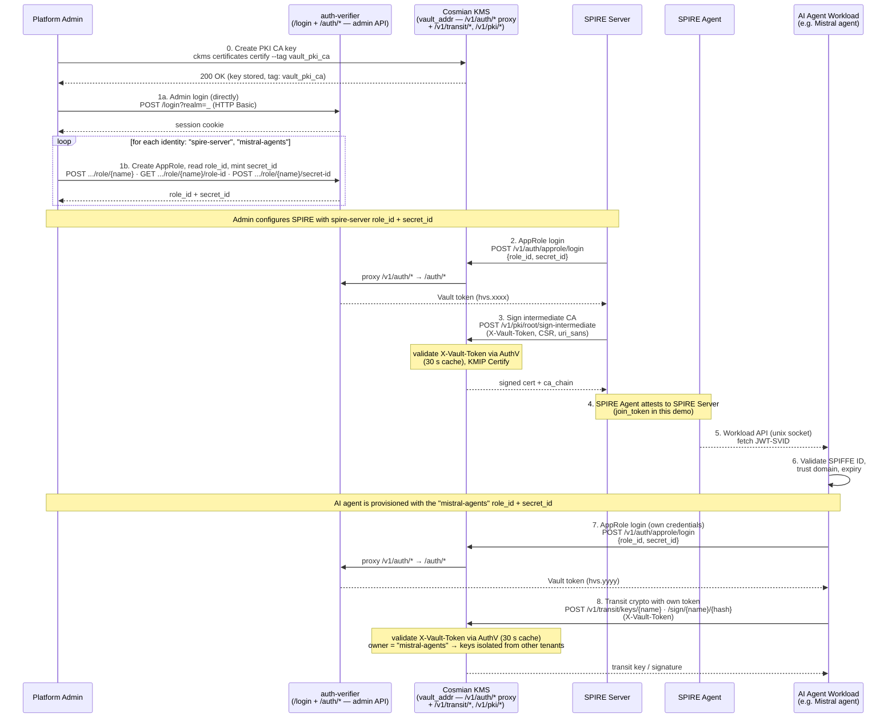
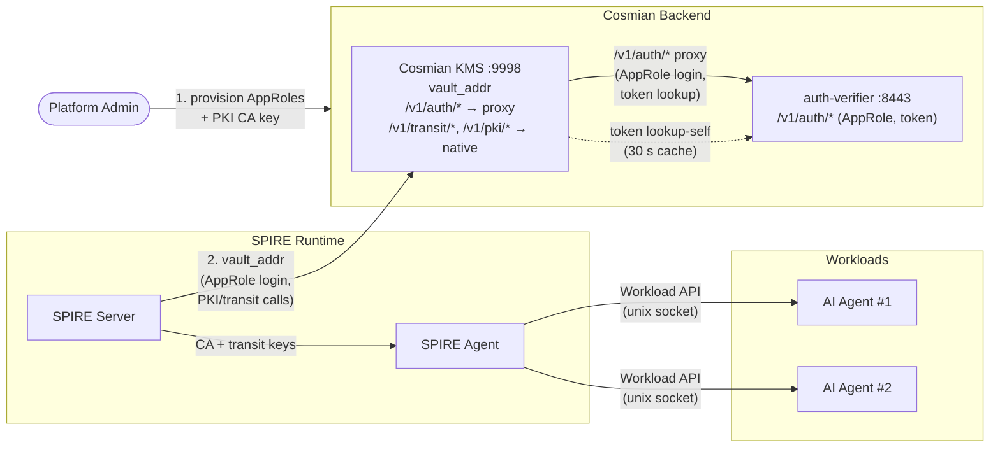
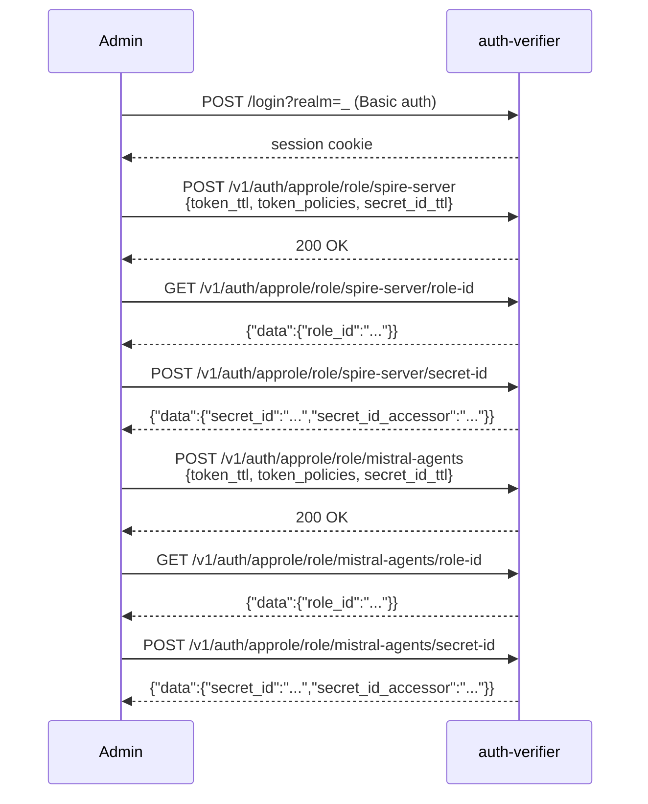
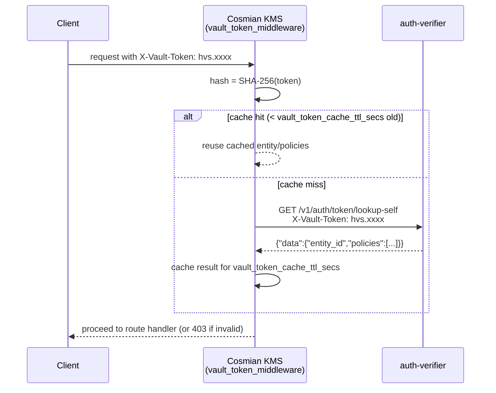
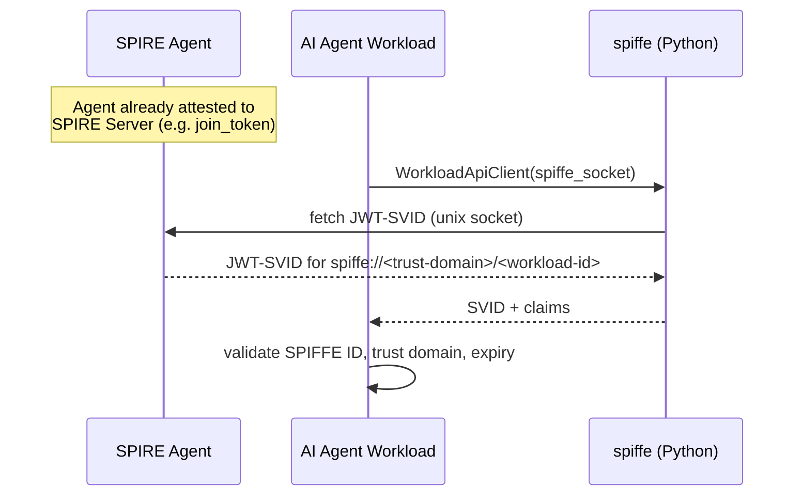

# SPIRE / SPIFFE — Workload Identity and FIPS-Backed PKI

> Cosmian KMS serves as the single `vault_addr` for SPIRE: it implements the
> transit and PKI engines (`/v1/transit/*`, `/v1/{pki_mount}/*`) directly, and
> transparently proxies all auth requests (`/v1/auth/*`) to the Cosmian Authentication
> Server (auth-verifier), which handles AppRole login, token lifecycle, and
> Kubernetes auth. Together they let
> [SPIRE](https://spiffe.io/docs/latest/spire-about/) (the SPIFFE Runtime Environment)
> use Cosmian's FIPS 140-3 KMS as its certificate authority and key custodian —
> **without requiring a separate secrets management cluster or a reverse proxy**.

## End-to-end flow



Steps 1–6 establish SPIFFE identity (the SPIRE server chains its CA to the KMS PKI engine,
and the AI agent workload receives a SPIFFE SVID). Steps 7–8 are where the **`mistral-agents`
AppRole** (created in 1b) is used: the AI agent authenticates to the KMS's Vault-compatible
**transit** engine with its *own* AppRole token to create/use keys — which the KMS scopes to
the `mistral-agents` owner, keeping them isolated from the SPIRE server's (and any other
tenant's) objects. The two are independent capabilities: SPIFFE identity (5–6) is for the
agent to authenticate to *other* services, while the transit flow (7–8) is the agent using the
KMS as its FIPS-backed crypto backend.

## What is it?

[SPIFFE](https://spiffe.io/) (Secure Production Identity Framework For Everyone) defines
a standard for issuing cryptographic identities — **SVIDs** (SPIFFE Verifiable
Identity Documents) — to software workloads, identified by a `spiffe://<trust-domain>/...`
URI. **SPIRE** is the reference runtime that issues and rotates these identities.

SPIRE needs two things from an external secrets/PKI backend:

- An **`UpstreamAuthority`** to sign its intermediate CA certificate.
- A **`KeyManager`** to store the private keys it uses internally.

Both of SPIRE's built-in `vault` plugins use a specific HTTP API for crypto operations and
authentication. Cosmian KMS implements the subset of that API SPIRE needs: it handles the
**Transit engine** (`/v1/transit/*`) and the **PKI engine**
(`/v1/{pki_mount}/root/sign-intermediate`) natively, and transparently proxies all
**AppRole auth** calls (`/v1/auth/*`) to the Cosmian Authentication Server. Point SPIRE's
`vault_addr` at the KMS, and every private key SPIRE would normally manage itself is
generated, stored, and used exclusively inside the FIPS 140-3-validated KMS.

## Why use it?

| Need                                 | How this integration addresses it                                                                                                                                                  |
| ------------------------------------ | ---------------------------------------------------------------------------------------------------------------------------------------------------------------------------------- |
| **Private-key custody**              | SPIRE's CA and transit keys are generated and stored exclusively inside Cosmian KMS — never on the SPIRE server's local disk.                                                      |
| **FIPS 140-3 compliance**            | All signing operations (CA rotation, transit `sign`) are executed by the FIPS-validated KMS, not by SPIRE's built-in `disk`/`memory` key manager.                                  |
| **No additional cluster to operate** | Reuses infrastructure you already run (Cosmian KMS + auth-verifier) instead of standing up and hardening a separate secrets management cluster just for SPIRE.                     |
| **Centralized audit trail**          | Every CA signature and transit `sign` call is a KMIP operation logged by the KMS with identity, timestamp, and key identifier.                                                     |
| **Post-quantum-ready transit keys**  | Transit keys support `ml-dsa-65` (non-FIPS builds) alongside classical `ecdsa-p256/p384` and `rsa-2048/4096`.                                                                      |
| **Drop-in `vault_addr`**             | SPIRE's `UpstreamAuthority "vault"` and `KeyManager "vault"` plugins need no code changes — only configuration pointing `vault_addr` at the KMS. No nginx or extra proxy required. |

## Who should use it?

- **Platform/security teams** implementing machine-to-machine (M2M) workload authentication
  between services or AI agents, who already run (or plan to run) Cosmian KMS.
- **SPIRE operators** who want FIPS 140-3/HSM-backed key custody for SPIRE's CA and
  transit keys without deploying and operating a separate secrets management cluster.
- **Teams issuing identities to AI agent workloads** (e.g. LLM-backed autonomous agents)
  that need short-lived, verifiable SPIFFE identities (JWT-SVIDs or X.509-SVIDs) to
  authenticate to each other and to internal services.

## Architecture

KMS acts as the single `vault_addr` for the entire SPIRE deployment. Internally it routes
by path: `/v1/transit/*` and `/v1/pki/*` are handled directly, while `/v1/auth/*` is
transparently proxied to auth-verifier. SPIRE never needs to know about the two-service
split — it connects to one endpoint.



KMS proxies `/v1/auth/*` to the auth-verifier URL configured via
`vault_auth_verifier_url`. No nginx or additional reverse proxy is needed — the same
TLS client already used for token validation is reused for the proxy.

### Two planes: data plane vs management plane

This deployment has **two distinct access planes**, and conflating them is the most
common source of confusion:

| Plane                | Who                      | Reaches                        | Endpoints                                                                  |
| -------------------- | ------------------------ | ------------------------------ | -------------------------------------------------------------------------- |
| **Data plane**       | SPIRE servers, workloads | the **KMS only**               | `/v1/auth/approle/login`, `/v1/auth/token/*`, `/v1/transit/*`, `/v1/pki/*` |
| **Management plane** | Platform operators       | the **auth-verifier directly** | `/login?realm=_` (admin), `/auth/approle/*` (role/secret-id CRUD)          |

Why AppRole **creation** is not on the data plane: creating a role or minting a
`secret_id` requires an **admin session cookie** obtained from the auth-verifier's
`POST /login?realm=_` (HTTP Basic admin credentials). The KMS proxy only forwards
`/v1/auth/*` and does **not** forward cookies or expose `/login`, so admin operations
**cannot** and **should not** traverse the KMS. This is deliberate: the public,
SPIRE-facing endpoint (the KMS) never carries privileged admin credentials.

**Consequence for deployment:** the auth-verifier's admin API is reached **directly** by
operators — it is a **separate endpoint** from the KMS, never proxied by it. Because that
admin API mints AppRoles (and therefore access to any tenant's keys), it is strongly
recommended to keep it on a limited-exposure endpoint (a private network, `localhost` on
the host, or an mTLS-gated ingress) rather than the open internet. The KMS remains the
only endpoint SPIRE workloads ever touch.

### Provisioning AppRoles (operator, management plane)

An operator creates one AppRole per SPIRE tenant and hands the tenant its `role_id` +
`secret_id` out-of-band. Point `--auth-verifier-url` **directly at the auth-verifier**
(all `ckms vault approle` sub-commands are admin operations against it):

```bash
export CKMS_VAULT_AUTH_URL="https://auth-verifier.internal:8443"   # the auth-verifier
export CKMS_VAULT_ADMIN_USER="admin"
export CKMS_VAULT_ADMIN_PASSWORD="…"

# 1. Create a role for a SPIRE server (its NAME becomes the KMS object owner).
ckms vault approle create-role spire-prod --token-ttl 3600 --token-policies default

# 2. Read the stable role_id and mint a secret_id — give both to the SPIRE operator.
ckms vault approle get-role-id spire-prod
ckms vault approle generate-secret-id spire-prod
```

> SPIRE performs the data-plane AppRole *login* itself against the KMS `vault_addr`
> (`POST /v1/auth/approle/login`); there is no `login` sub-command in `ckms vault approle`.

Equivalent raw calls (used by the test harness `provision.sh`): `POST /login?realm=_`
for the admin cookie, then `POST /auth/approle/role/{name}` and
`POST /auth/approle/role/{name}/secret-id` against the auth-verifier.

## Setup (installation and configuration)

This section is the systematic, production-oriented checklist to stand up the full
stack. Each step links to the detailed reference for that component. In order:

| # | Step | What you do | Reference |
|---|------|-------------|-----------|
| 1 | **Install Cosmian KMS** | Install and start the KMS (Docker, Linux packages, macOS, or Windows). | [KMS installation](../installation/installation_getting_started.md) |
| 2 | **Install the auth-verifier** | Deploy the Cosmian Authentication Server that the KMS proxies `/v1/auth/*` to. | `authentication/server/documentation/docs/installation.md` |
| 3 | **Enable the Vault API on the KMS** | Turn on the SPIRE-compatible API and point it at the auth-verifier. | [Configuration reference](#configuration-reference) |
| 4 | **Create the PKI CA key** | Create the KMS key the PKI engine signs intermediate CAs with. | [PKI CA key provisioning](#0-pki-ca-key-provisioning-prerequisite) |
| 5 | **Provision AppRoles** | Create one AppRole per SPIRE server (and per workload group) and hand out `role_id`/`secret_id`. | [Provisioning AppRoles](#provisioning-approles-operator-management-plane) |
| 6 | **Configure the SPIRE server** | Point SPIRE's `vault_addr` at the KMS and wire the `UpstreamAuthority`/`KeyManager` plugins. | [SPIRE server configuration](#spire-server-configuration) |
| 7 | **Start SPIRE and verify** | Start the SPIRE server/agent and confirm the intermediate CA is signed and SVIDs issue. | [Quick start](#quick-start-local-demo-stack) |

### Step 3 — Enable the Vault API on the KMS

Set at least these in the KMS configuration (full list in the
[Configuration reference](#configuration-reference)):

```toml
[vault]
vault_api_enabled          = true
# The auth-verifier from step 2 — reached internally by the KMS (server-to-server).
vault_auth_verifier_url    = "https://auth.example.com:8443"
vault_auth_verifier_ca_cert = "/etc/cosmian/certs/auth-verifier-ca.crt"
vault_transit_mount        = "transit"
vault_pki_mount            = "pki"
vault_pki_ca_key_label     = "vault_pki_ca"
```

### SPIRE server configuration

Point SPIRE's `vault_addr` at the **KMS** (not the auth-verifier — the KMS proxies
`/v1/auth/*` for you). A complete `server.conf`:

```hcl
server {
    bind_address = "0.0.0.0"
    bind_port    = "8081"

    # Trust domain — must match the SPIFFE IDs used by your workloads.
    trust_domain = "example.org"

    data_dir  = "/var/lib/spire/server"
    log_level = "INFO"

    ca_subject = {
        country      = ["FR"],
        organization = ["Example"],
        common_name  = "Example SPIRE Intermediate CA",
    }

    ca_ttl                = "24h"   # how often SPIRE rotates its intermediate CA
    default_x509_svid_ttl = "1h"    # workload SVID lifetime
}

plugins {
    # ── Upstream Authority: Cosmian KMS PKI engine (Vault-compatible) ─────────
    # Signs SPIRE's intermediate CA CSR via the KMS. Built-in to SPIRE — no
    # plugin_cmd required. vault_addr points at the KMS; the KMS proxies
    # /v1/auth/* to the auth-verifier and handles /v1/pki/* natively.
    UpstreamAuthority "vault" {
        plugin_data {
            vault_addr   = "https://kms.example.com:9998"
            # CA cert that verifies the KMS TLS certificate.
            ca_cert_path = "/etc/spire/server/kms-ca.crt"

            # AppRole login — credentials are read from the environment variables
            # VAULT_APPROLE_ID and VAULT_APPROLE_SECRET_ID (the role_id/secret_id
            # you provisioned in step 5). Do not hard-code the secret here.
            approle_auth {
                approle_auth_mount_point = "approle"
            }

            # Must match vault_pki_mount on the KMS (default: "pki").
            pki_mount_point = "pki"
        }
    }

    # ── Key Manager ───────────────────────────────────────────────────────────
    # Stores SPIRE's own signing keys. "disk" is built-in and sufficient for most
    # deployments. SPIRE's Vault-backed KeyManager ("vault") is a separate,
    # externally-distributed plugin (not bundled in the SPIRE image); if you use
    # it, point transit_engine_path at the KMS transit mount.
    KeyManager "disk" {
        plugin_data {
            keys_path = "/var/lib/spire/server/keys.json"
        }
    }

    # ── Node Attestor ─────────────────────────────────────────────────────────
    # join_token is the simplest for a first bring-up; for production prefer a
    # stronger attestor such as x509pop or a platform-specific one (TPM, k8s_psat).
    NodeAttestor "join_token" {
        plugin_data {}
    }

    # ── Data Store ────────────────────────────────────────────────────────────
    DataStore "sql" {
        plugin_data {
            database_type     = "sqlite3"
            connection_string = "/var/lib/spire/server/datastore.sqlite3"
        }
    }
}
```

Provide the AppRole credentials from step 5 to the SPIRE server process via
environment variables (e.g. in the systemd unit or container env):

```bash
export VAULT_APPROLE_ID="<role_id>"
export VAULT_APPROLE_SECRET_ID="<secret_id>"
```

> The AppRole **name** (e.g. `spire-prod`) becomes the KMS object owner, so each
> SPIRE server gets an isolated key namespace on the shared KMS. See
> [Cross-AppRole isolation](#cross-approle-isolation).

## Detailed flows

### 0. PKI CA key provisioning (prerequisite)

Before SPIRE can sign its intermediate CA, the KMS must hold a CA key with the tag
configured in `--vault-pki-ca-key-label` (default: `vault_pki_ca`). Create it once with
the `ckms` CLI:

```bash
# Generate a P-384 key pair and a self-signed root CA certificate in KMS.
# The --tag value must match vault_pki_ca_key_label in the KMS configuration.
ckms --accept-invalid-certs \
  certificates certify \
  --generate-key-pair \
  --algorithm nist-p384 \
  --certificate-id vault_pki_ca_cert \
  --subject-name "CN=My Root CA,O=Acme,C=FR" \
  --tag vault_pki_ca \
  --days 3650
```

> This step must complete **before** SPIRE server starts — the
> `POST /v1/pki/root/sign-intermediate` call (step 3 of the end-to-end flow) fails
> immediately if the key is absent.

### 1. AppRole provisioning (admin bootstrap)

An administrator provisions one `AppRole` per consumer: one for the SPIRE server itself
and one for the AI agent workloads that need direct transit signing.



#### AppRole credentials — what `role_id` and `secret_id` mean

Two distinct kinds of "admin" appear in this integration — do not confuse them:

| Term                    | What it is                                                                                                  | Used for                                                                                 |
| ----------------------- | ----------------------------------------------------------------------------------------------------------- | ---------------------------------------------------------------------------------------- |
| **Auth-verifier admin** | A **human** administrator account (`Admin` struct) authenticated with username + password in the `_` realm. | Calling `POST /v1/auth/approle/role/{name}` and other role-management endpoints.         |
| **AppRole**             | A **machine** identity with `role_id` + `secret_id` credentials. No relationship to the `Admin` concept.    | Used by SPIRE server and AI-agent workloads to obtain `hvs.*` tokens from auth-verifier. |

An AppRole has three credentials, each with a distinct purpose and lifecycle:

| Credential           | What it is                                                                | Analogy              | Stability                                                                                                   |
| -------------------- | ------------------------------------------------------------------------- | -------------------- | ----------------------------------------------------------------------------------------------------------- |
| `role_id`            | Stable UUID auto-assigned by auth-verifier when the AppRole is created.   | Machine *username*.  | **Permanent.** Changing it requires reconfiguring all consumers (SPIRE config, agent config).               |
| `secret_id`          | A one-time or time-limited random secret generated on demand by an admin. | Machine *password*.  | **Ephemeral.** Rotate freely via `generate-secret-id`; invalidate the old one via its `secret_id_accessor`. |
| `secret_id_accessor` | Opaque UUID returned alongside `secret_id`.                               | *Revocation handle.* | Never given to SPIRE — kept by the human admin for rotation and revocation only.                            |

##### From AppRole credentials to KMS object ownership — the exact chain

The `role_id` UUID is only used at login time to look up the AppRole record.
What the KMS ultimately uses as the object owner is the AppRole **name** — a
human-readable string like `"spire-server"` or `"mistral-agents"`.

```text
① SPIRE sends login:
     POST /v1/auth/approle/login  →  { role_id: "<UUID>", secret_id: "<one-time-secret>" }

② auth-verifier looks up AppRole by role_id → finds AppRole with name = "spire-server"
   Issues token:  hvs.xxxxx   carrying   entity = "spire-server"   (the NAME, not the UUID)

③ KMS spire_token_middleware validates the token:
     GET /auth/token/lookup-self  →  { data: { entity_id: "spire-server", ... } }

④ KMS sets:  AuthenticatedUser { username: "spire-server" }
   → every KMS object created under this token is owned by "spire-server"
```

The mapping from AppRole name to KMS owner is therefore 1-to-1:

| AppRole name     | KMS `username`   | KMS objects owned                                                |
| ---------------- | ---------------- | ---------------------------------------------------------------- |
| `spire-server`   | `spire-server`   | Signed intermediate certificates (stored in KMS after `Certify`) |
| `mistral-agents` | `mistral-agents` | Transit key pairs tagged `vault_transit:{name}`                  |

`mistral-agents` cannot read, sign with, or delete objects owned by `spire-server`,
and vice versa — each AppRole has a **fully isolated KMS object namespace**.

> **PKI root CA exception.**
> The root CA `PrivateKey` (tagged `vault_pki_ca`) is owned by the **server admin**
> (`default_username`), not by any AppRole.
> The `sign-intermediate` handler always looks up the CA key as the server admin,
> regardless of which AppRole token the caller presents.
> This is intentional: the root CA is shared infrastructure, not a per-tenant resource.
> AppRole authentication on the PKI endpoint only proves *who is requesting* the
> signature — it does not grant ownership of the CA key.

### 2. SPIRE intermediate CA rotation (PKI engine)

SPIRE's `UpstreamAuthority "vault"` plugin logs in with its AppRole, then submits a CSR
to be signed as its intermediate CA.


`uri_sans` (at least one `spiffe://` URI) is mandatory — the KMS rejects a request with
an empty list with HTTP 400. The `ca_chain` in the response excludes the root and the
signed certificate itself (Vault ≥1.11 semantics).

### 3. Transit key lifecycle (KeyManager engine)

Whether used by SPIRE's `KeyManager "vault"` plugin or by an application calling the
Transit API directly, the lifecycle is the same:


### 4. Vault token validation (cross-service call, cached)

Every request into the KMS's `/v1/transit/*` and `/v1/pki/*` scopes carries an
`X-Vault-Token` header. The KMS validates it against auth-verifier and caches the result
for 30 seconds (configurable) to avoid a round-trip on every request:



### 5. Workload SVID issuance (AI agent identity)

Once SPIRE is running, workloads never talk to Cosmian directly — they fetch identities
from the local SPIRE Agent over the Workload API:



## Quick start (local demo stack)

The KMS repository ships a working end-to-end demo under `test_data/spire/` (used by the
project's own integration tests). It runs Cosmian KMS and auth-verifier as regular host
processes and the SPIRE server, SPIRE agent, and AI agent workload containers via Docker
Compose.

The fastest way to run the full stack from source:

```bash
mise run test:spire --variant non-fips
```

For a step-by-step breakdown (matching the numbered steps in the end-to-end flow diagram
above):

```bash
# 0. Generate local test TLS certificates (once)
bash test_data/spire/certs/generate-test-certs.sh

# Start auth-verifier and KMS as host processes (vault API enabled in kms.toml)
auth_verifier test_data/spire/config/auth_verifier.toml &
cosmian_kms --config test_data/spire/config/kms.toml &

# 0. Create the PKI CA key in KMS (must exist before SPIRE starts)
ckms --accept-invalid-certs \
  certificates certify --generate-key-pair --algorithm nist-p384 \
  --certificate-id vault_pki_ca_cert \
  --subject-name "CN=Cosmian KMS Root CA,O=Cosmian,C=FR" \
  --tag vault_pki_ca --days 3650

# 1. Provision AppRoles (spire-server + mistral-agents)
#    Admin API calls go directly to auth-verifier (port 8443).
#    The smoke-test login uses the KMS vault_addr (port 9998), which proxies to auth-verifier.
AUTH_VERIFIER_URL=https://localhost:8443 \
  VAULT_ADDR=https://localhost:9998 \
  VAULT_CACERT=test_data/spire/certs/ca.crt \
  bash test_data/spire/setup/provision.sh

# 2–4. Start SPIRE server (injects APPROLE_* env from provision output),
#       generate join token, start SPIRE agent
docker compose --profile spire up -d spire-server
# ... (see .mise/tasks/test/spire for the full token-generation and agent-start sequence)
```

A successful run shows the SPIRE server signing its intermediate CA through the PKI
engine, then each workload container printing its issued SPIFFE ID and a passing identity
check.

> In a production deployment, Cosmian KMS and auth-verifier run as long-lived services
> (not `cargo run`/dev processes), and SPIRE Agent should use a stronger node attestor
> (e.g. `x509pop` or TPM-based attestation) instead of the `join_token` attestor used in
> this local demo.

## Getting started (customer/operator guide)

This section is the day-one checklist for customers who operate their own SPIRE server
against a Cosmian-managed KMS deployment. It covers:

1. **Provision your AppRole** (you are the administrator — `kms.example.com:8443`)
2. **Configure SPIRE** to use the KMS as its Vault-compatible backend
3. **Verify** end-to-end connectivity before starting SPIRE

```text
                                ┌──────────────────────────────────────┐
                                │         kms.example.com              │
  SPIRE server ──vault_addr──▶  │  KMS :443  (/v1/transit, /v1/pki)   │
  Admin ops   ──:8443──────▶    │  Auth-verifier :8443  (AppRoles)     │
                                └──────────────────────────────────────┘
```

- **KMS** (`https://kms.example.com`) handles cryptographic operations (transit keys,
  PKI signing) and proxies AppRole **login** requests.
- **Auth-verifier** (`https://kms.example.com:8443`) manages identities (AppRole CRUD).
  You connect to it **directly** to create and manage AppRoles.

### Prerequisites — download the auth-verifier CA certificate

The auth-verifier uses a private CA. Extract it from the TLS handshake:

```bash
openssl s_client -connect kms.example.com:8443 -showcerts </dev/null 2>/dev/null \
  | python3 -c "
import sys, re
certs = re.findall(r'(-----BEGIN CERTIFICATE-----.*?-----END CERTIFICATE-----)',
                   sys.stdin.read(), re.DOTALL)
print(certs[1])
" > auth-ca.pem

# Verify
openssl x509 -in auth-ca.pem -noout -subject
```

> The auth-verifier sends its CA certificate as the second certificate in the TLS
> handshake chain. This command extracts it and saves it to `auth-ca.pem`.

### 1. Create your AppRole

AppRoles are managed **directly** on the auth-verifier. Authenticate as admin (HTTP Basic
Auth) to get a session cookie, then use that cookie for all management operations.

#### Option A — using `ckms` (recommended)

Install `ckms` from the [Cosmian releases page](https://github.com/Cosmian/kms/releases), then:

```bash
export CKMS_VAULT_AUTH_URL="https://kms.example.com:8443"
export CKMS_VAULT_AUTH_CA_CERT="auth-ca.pem"
export CKMS_VAULT_ADMIN_USER="admin"
export CKMS_VAULT_ADMIN_PASSWORD="change_me"

# Create the role (1-hour token TTL)
ckms vault approle create-role spire-prod --token-ttl 3600

# Read the stable role_id
export VAULT_APPROLE_ID=$(ckms vault approle get-role-id spire-prod)
echo "role_id: $VAULT_APPROLE_ID"

# Mint a secret_id — regenerate this each time SPIRE restarts
export VAULT_APPROLE_SECRET_ID=$(
  ckms vault approle generate-secret-id spire-prod \
    | awk '/^secret_id:/{print $2}')
echo "secret_id: $VAULT_APPROLE_SECRET_ID"
```

#### Option B — using `curl` only (no `ckms` required)

```bash
AUTH_URL="https://kms.example.com:8443"
AUTH_CA="auth-ca.pem"
ADMIN_USER="admin"
ADMIN_PASSWORD="change_me"
ROLE_NAME="spire-prod"
COOKIE_JAR="/tmp/auth-admin-cookies.txt"

# Step 1 — Get an admin session cookie
curl -s -c "$COOKIE_JAR" --cacert "$AUTH_CA" \
  -X POST -u "$ADMIN_USER:$ADMIN_PASSWORD" \
  -H "Content-Type: application/json" -d "{}" \
  "$AUTH_URL/login?realm=_"
echo ""

# Step 2 — Create the AppRole
curl -s -b "$COOKIE_JAR" --cacert "$AUTH_CA" \
  -X POST -H "Content-Type: application/json" \
  -d '{"token_ttl":3600,"secret_id_ttl":0,"token_policies":["default"],"bind_secret_id":true}' \
  "$AUTH_URL/auth/approle/role/$ROLE_NAME"
echo ""

# Step 3 — Read the stable role_id
export VAULT_APPROLE_ID=$(curl -s -b "$COOKIE_JAR" --cacert "$AUTH_CA" \
  "$AUTH_URL/auth/approle/role/$ROLE_NAME/role-id" \
  | python3 -c "import sys,json; print(json.load(sys.stdin)['data']['role_id'])")
echo "role_id: $VAULT_APPROLE_ID"

# Step 4 — Generate a secret_id
SECRET_RESP=$(curl -s -b "$COOKIE_JAR" --cacert "$AUTH_CA" \
  -X POST -H "Content-Type: application/json" -d '{"ttl":0,"num_uses":0}' \
  "$AUTH_URL/auth/approle/role/$ROLE_NAME/secret-id")
export VAULT_APPROLE_SECRET_ID=$(echo "$SECRET_RESP" \
  | python3 -c "import sys,json; print(json.load(sys.stdin)['data']['secret_id'])")
echo "secret_id: $VAULT_APPROLE_SECRET_ID"
```

> **Session duration**: the `_ea_` admin cookie is valid for the session duration
> configured on the auth-verifier (default: several hours). Rerun Step 1 if subsequent
> calls return `401 Session error`.
>
> **Key isolation**: the AppRole name (`spire-prod`) becomes your isolated namespace on
> the KMS. Another tenant's AppRole can never read, sign with, or delete your transit
> keys or PKI certificates.
>
> **One-shot script**: `test_data/spire/setup/kms_setup.sh` runs all four steps above
> end-to-end (`ROLE_NAME=my-spire bash test_data/spire/setup/kms_setup.sh`).

### 2. Verify your AppRole credentials

Before configuring SPIRE, confirm the credentials work end-to-end:

```bash
KMS_URL="https://kms.example.com"

# Exchange AppRole credentials for a KMS token
TOKEN=$(curl -s \
  -X POST -H "Content-Type: application/json" \
  -d "{\"role_id\":\"$VAULT_APPROLE_ID\",\"secret_id\":\"$VAULT_APPROLE_SECRET_ID\"}" \
  "$KMS_URL/v1/auth/approle/login" \
  | python3 -c "import sys,json; print(json.load(sys.stdin)['auth']['client_token'])")
echo "Token: $TOKEN"

# Validate the token and inspect your identity
curl -s -H "X-Vault-Token: $TOKEN" "$KMS_URL/v1/auth/token/lookup-self"
echo ""

# List transit keys owned by your AppRole (empty on first use)
curl -s -H "X-Vault-Token: $TOKEN" "$KMS_URL/v1/transit/keys"
echo ""
```

A `200` response with `"entity_id": "spire-prod"` confirms credentials and KMS
connectivity are working.

### 3. Configure your SPIRE server

Add a `vault` upstream authority to `server.conf` (point `vault_addr` at the **KMS**,
not the auth-verifier — the KMS proxies `/v1/auth/*` for you):

```hcl
UpstreamAuthority "vault" {
    plugin_data {
        # KMS base URL — not the auth-verifier URL.
        vault_addr = "https://kms.example.com"

        # KMS uses a Let's Encrypt certificate — trusted by default.
        # Provide ca_cert_path only if using a private CA.
        # ca_cert_path = "/etc/spire/server/kms-ca.crt"

        # Credentials are read from environment variables:
        #   VAULT_APPROLE_ID / VAULT_APPROLE_SECRET_ID
        approle_auth {
            approle_auth_mount_point = "approle"
        }

        # PKI mount (default: "pki").
        pki_mount_point = "pki"
    }
}
```

#### Optional: store SPIRE's own keys in the KMS (Transit KeyManager)

```hcl
KeyManager "vault" {
    plugin_data {
        vault_addr = "https://kms.example.com"
        approle_auth {
            approle_auth_mount_point = "approle"
        }
        transit_engine_path = "transit"
        key_name            = "spire-server-key"
    }
}
```

Set the environment variables, then start SPIRE:

```bash
export VAULT_APPROLE_ID="<role_id from step 1>"
export VAULT_APPROLE_SECRET_ID="<secret_id from step 1>"
spire-server run -config /etc/spire/server/server.conf
```

### 4. Manage AppRole credentials

#### Rotate secret_id (before each SPIRE restart)

```bash
# Option A — ckms
export VAULT_APPROLE_SECRET_ID=$(
  ckms vault approle generate-secret-id spire-prod \
    | awk '/^secret_id:/{print $2}')

# Option B — curl (reuse cookie jar from Step 1)
SECRET_RESP=$(curl -s -b "$COOKIE_JAR" --cacert "$AUTH_CA" \
  -X POST -H "Content-Type: application/json" -d '{"ttl":0,"num_uses":0}' \
  "$AUTH_URL/auth/approle/role/$ROLE_NAME/secret-id")
export VAULT_APPROLE_SECRET_ID=$(echo "$SECRET_RESP" \
  | python3 -c "import sys,json; print(json.load(sys.stdin)['data']['secret_id'])")
```

#### List roles

```bash
# Option A — ckms
ckms vault approle list-roles

# Option B — curl
curl -s -b "$COOKIE_JAR" --cacert "$AUTH_CA" \
  "$AUTH_URL/auth/approle/role?list=true"
```

#### Delete a role

```bash
# Option A — ckms
ckms vault approle delete-role spire-prod

# Option B — curl
curl -s -b "$COOKIE_JAR" --cacert "$AUTH_CA" -X DELETE \
  "$AUTH_URL/auth/approle/role/spire-prod"
```

## Configuration reference

Enable the SPIRE-compatible API on the KMS with these flags/environment variables
(`crate/server/src/config/command_line/vault_config.rs`):

| Flag                                         | Environment variable                           | Default        | Description                                                                                                                                                                   |
| -------------------------------------------- | ---------------------------------------------- | -------------- | ----------------------------------------------------------------------------------------------------------------------------------------------------------------------------- |
| `--vault-api-enabled`                        | `KMS_VAULT_API_ENABLED`                        | `false`        | Enables the `/v1/transit/*`, `/v1/<vault_pki_mount>/*`, and `/v1/auth/*` (proxy) scopes.                                                                                      |
| `--vault-auth-verifier-url`                  | `KMS_VAULT_AUTH_VERIFIER_URL`                  | *(none)*       | Base URL of auth-verifier. Used for both `X-Vault-Token` validation (middleware) **and** as the upstream target for the `/v1/auth/*` proxy. Required when the API is enabled. |
| `--vault-auth-verifier-ca-cert`              | `KMS_VAULT_AUTH_VERIFIER_CA_CERT`              | *(none)*       | PEM CA certificate used to verify auth-verifier's TLS certificate (for self-signed/private CAs).                                                                              |
| `--vault-auth-verifier-accept-invalid-certs` | `KMS_VAULT_AUTH_VERIFIER_ACCEPT_INVALID_CERTS` | `false`        | Skip TLS verification when calling auth-verifier. **Test/dev only** — use `--vault-auth-verifier-ca-cert` in production.                                                      |
| `--vault-transit-mount`                      | `KMS_VAULT_TRANSIT_MOUNT`                      | `transit`      | Mount name served at `/v1/<mount>/keys/…`.                                                                                                                                    |
| `--vault-pki-mount`                          | `KMS_VAULT_PKI_MOUNT`                          | `pki`          | Mount name served at `/v1/<mount>/root/sign-intermediate`.                                                                                                                    |
| `--vault-pki-ca-key-label`                   | `KMS_VAULT_PKI_CA_KEY_LABEL`                   | `vault_pki_ca` | KMIP tag of the KMS key used as the PKI engine's signing key. Must already exist in the KMS.                                                                                  |
| `--vault-token-cache-ttl-secs`               | `KMS_VAULT_TOKEN_CACHE_TTL_SECS`               | `30`           | Lifetime of cached `lookup-self` results. Set to `0` to disable caching.                                                                                                      |

> **No extra proxy configuration is needed.** The `/v1/auth/*` proxy reuses
> `vault_auth_verifier_url` and the same TLS client built from
> `vault_auth_verifier_ca_cert` (or `vault_auth_verifier_accept_invalid_certs`).
> Set SPIRE's `vault_addr` to the KMS HTTPS address (e.g. `https://kms.example.com:9998`).

## CLI reference

`ckms vault approle` provisions and manages `AppRole` identities in auth-verifier
(`crate/clients/clap/src/actions/vault/approle.rs`):

| Subcommand           | Auth required        | Purpose                                                                   |
| -------------------- | -------------------- | ------------------------------------------------------------------------- |
| `create-role`        | auth-verifier admin¹ | Create or update a role (`token_ttl`, `token_policies`, `secret_id_ttl`). |
| `list-roles`         | auth-verifier admin¹ | List all roles.                                                           |
| `get-role-id`        | auth-verifier admin¹ | Retrieve a role's stable `role_id`.                                       |
| `generate-secret-id` | auth-verifier admin¹ | Generate a new `secret_id` for a role.                                    |
| `destroy-secret-id`  | auth-verifier admin¹ | Invalidate a `secret_id` by its accessor.                                 |
| `delete-role`        | auth-verifier admin¹ | Permanently delete a role.                                                |

¹ "auth-verifier admin" means a **human administrator account** (`Admin` struct) in the
`_` realm of the Cosmian Authentication Server — not an AppRole.
These subcommands authenticate to auth-verifier with
`--admin-user`/`CKMS_VAULT_ADMIN_USER` and `--admin-password`/`CKMS_VAULT_ADMIN_PASSWORD`
(plain username + password, distinct from the `role_id`/`secret_id` machine credentials).
The `--auth-verifier-url`/`CKMS_VAULT_AUTH_URL` flag points directly at auth-verifier,
bypassing the KMS proxy. Add `--accept-invalid-certs` (or `--auth-verifier-ca-cert <pem>`)
when the auth-verifier uses a self-signed/private CA. SPIRE performs the data-plane AppRole
*login* itself against the KMS `vault_addr`, so there is no `login` subcommand here.

## HTTP endpoint reference

**auth-verifier** (`/v1/auth/*`):

| Method   | Path                                             | Purpose                                                             |
| -------- | ------------------------------------------------ | ------------------------------------------------------------------- |
| `POST`   | `/v1/auth/approle/login`                         | Exchange `role_id`+`secret_id` for a Vault token (unauthenticated). |
| `POST`   | `/v1/auth/approle/role/{name}`                   | Create/update a role (admin).                                       |
| `GET`    | `/v1/auth/approle/role/{name}/role-id`           | Read a role's `role_id` (admin).                                    |
| `POST`   | `/v1/auth/approle/role/{name}/secret-id`         | Generate a `secret_id` (admin).                                     |
| `POST`   | `/v1/auth/approle/role/{name}/secret-id/destroy` | Invalidate a `secret_id` (admin).                                   |
| `DELETE` | `/v1/auth/approle/role/{name}`                   | Delete a role (admin).                                              |
| `GET`    | `/v1/auth/approle/role`                          | List roles (admin).                                                 |
| `GET`    | `/v1/auth/token/lookup-self`                     | Validate the caller's own token (used by the KMS middleware).       |
| `POST`   | `/v1/auth/token/renew-self`                      | Renew the caller's own token.                                       |
| `POST`   | `/v1/auth/token/revoke-self`                     | Revoke the caller's own token.                                      |

> `/v1/auth/kubernetes/*` is also available as an alternative login method (Kubernetes
> service-account JWT), for workloads running inside a Kubernetes cluster instead of
> using AppRole credentials.

**Cosmian KMS — Transit engine** (mount: `{vault_transit_mount}`, default `transit`):

Each transit key is stored as an asymmetric **key pair** (`PrivateKey` + `PublicKey`) in
the KMS.
Both objects carry the tag `vault_transit:{name}`.
`sensitive=true` is set at creation time so the private key is permanently non-exportable
at every API surface (Vault HTTP, KMIP, `ckms`).
Signing is always performed server-side.

| Method   | Path                             | KMIP operation                                          | KMS object(s)                                                                             | Tag / identifier                       | Key types                                                                                                    |
| -------- | -------------------------------- | ------------------------------------------------------- | ----------------------------------------------------------------------------------------- | -------------------------------------- | ------------------------------------------------------------------------------------------------------------ |
| `POST`   | `/v1/{mount}/keys/{name}`        | `CreateKeyPair`                                         | `PrivateKey` + `PublicKey` **created**; `sensitive=true`                                  | `vault_transit:{name}` on both objects | `ecdsa-p256`, `ecdsa-p384`, `rsa-2048`, `rsa-4096` (FIPS + non-FIPS); `ed25519`, `ml-dsa-65` (non-FIPS only) |
| `GET`    | `/v1/{mount}/keys/{name}`        | `Find` → `Get`                                          | `PrivateKey` **read** (by tag) → follows `PublicKeyLink` → `PublicKey` **read** (for PEM) | `vault_transit:{name}`                 | —                                                                                                            |
| `GET`    | `/v1/{mount}/keys`               | `Find` (all `PrivateKey`)                               | All `PrivateKey` objects **read**, filtered by tag prefix                                 | prefix `vault_transit:`                | —                                                                                                            |
| `POST`   | `/v1/{mount}/keys/{name}/config` | *(no-op)*                                               | none                                                                                      | —                                      | —                                                                                                            |
| `DELETE` | `/v1/{mount}/keys/{name}`        | `Revoke` (cascade) + `Destroy` (cascade, `remove=true`) | `PrivateKey` + linked `PublicKey` **permanently deleted**                                 | `vault_transit:{name}`                 | —                                                                                                            |
| `POST`   | `/v1/{mount}/sign/{name}/{alg}`  | `Sign`                                                  | `PrivateKey` **used** (never exported); signature prefixed `vault:v1:`                    | `vault_transit:{name}`                 | —                                                                                                            |

**Cosmian KMS — PKI engine** (mount: `{vault_pki_mount}`, default `pki`):

The PKI CA key is a server-level resource owned by the server admin (`default_username`).
All three steps of the sign-intermediate flow execute as the server admin, regardless of
which AppRole token the caller presents — the token is validated for authentication only.

| Method         | Path                                 | KMIP operation(s)                                                                                           | KMS object(s)                                                                                                                                                                                                                         | Tag / identifier                                                                                                                               |
| -------------- | ------------------------------------ | ----------------------------------------------------------------------------------------------------------- | ------------------------------------------------------------------------------------------------------------------------------------------------------------------------------------------------------------------------------------- | ---------------------------------------------------------------------------------------------------------------------------------------------- |
| `POST` / `PUT` | `/v1/{mount}/root/sign-intermediate` | ① `Find` (CA `PrivateKey`) → ② `Certify` (creates signed `Certificate`) → ③ `Find`+`Get` (CA `Certificate`) | ① CA `PrivateKey` **read** as server admin; ② signed `Certificate` **created** in KMS (returned in response); ③ CA `Certificate` **read** via link chain: CA `PrivateKey → PublicKeyLink → PublicKey → CertificateLink → Certificate` | CA key tag: `vault_pki_ca_key_label` config (default `vault_pki_ca`); signed cert: auto-assigned UID; CA cert: resolved by KMIP link traversal |

> **Provisioning prerequisite**: the CA `PrivateKey` and its linked CA `Certificate` must
> be created **before** SPIRE starts.
> Use `ckms certificates certify --generate-key-pair --tag vault_pki_ca ...` (see the
> [PKI CA key provisioning](#0-pki-ca-key-provisioning-prerequisite) section above).
> The endpoint returns HTTP 500 if the CA key is absent.

## Security notes

### Cross-AppRole isolation

**Auth-verifier alone is sufficient to enforce per-AppRole object isolation in the KMS.**
No additional access-control configuration is required.

The guarantee holds because:

1. Auth-verifier maps `role_id` → AppRole `name` and embeds it as `entity_id` in the issued token.
2. The KMS `spire_token_middleware` reads `entity_id` from the `lookup-self` response and
   sets `AuthenticatedUser { username: entity_id }`.
3. Every `Find`, `Get`, `Sign`, `Revoke`, and `Destroy` call in the transit handler passes
   this `username` to the KMS database, which enforces:

   ```sql
   WHERE (objects.owner = :username OR read_access.userid = :username)
   ```

A token for `"mistral-agents"` therefore returns an empty result set for any object owned
by `"spire-server"` — not a 403, but a 404 (object not found).
This is enforced at the database layer and cannot be circumvented by manipulating HTTP headers.

> **⚠ Do not set `KMS_FORCE_DEFAULT_USERNAME=true`** (or `--force-default-username`) on a
> KMS instance used with this integration.
> That option replaces every authenticated identity — including AppRole tokens — with the
> server's `default_username`, collapsing all AppRoles into a single shared owner and
> eliminating all cross-tenant isolation.
> Its default is `false`; the SPIRE integration requires it stays that way.

### Other security notes

- `exportable` is always forced to `false` server-side, regardless of what a client
  requests — transit private keys can never leave the KMS.
- `ml-dsa-65` and `ed25519` transit key types require the KMS `non-fips` feature; they
  are unavailable in FIPS builds. `ecdsa-p256`, `ecdsa-p384`, `rsa-2048`, and `rsa-4096`
  are available in both FIPS and non-FIPS builds.
- The 30-second token validation cache means a revoked token can still be accepted for
  up to `vault_token_cache_ttl_secs` seconds. Lower this value (or set it to `0`) if your
  threat model requires faster revocation propagation.
- Prefer `--vault-auth-verifier-ca-cert` over `--vault-auth-verifier-accept-invalid-certs`
  in any non-throwaway environment — the latter disables TLS certificate verification
  entirely for calls to auth-verifier.
- The KMS's `/v1/transit/*` and `/v1/pki/*` scopes depend on auth-verifier being
  reachable: a cache-miss during an auth-verifier outage will cause new requests to those
  scopes to fail until connectivity is restored.
- Transit `creation_time` has whole-second precision (KMIP `InitialDate` is POSIX
  seconds), unlike Vault's nanosecond timestamps. In a fast rotation-retry loop where two
  keys for the same logical SPIRE key id are created within the same wall-clock second,
  SPIRE's newest-key tiebreak may be non-deterministic. Operators should avoid sub-second
  rotation cycles until this is resolved.

## Adversarial test coverage

The integration harness (`mise run test:spire --variant non-fips`) does not stop at the
happy path. After the multi-tenant end-to-end flow (two independent SPIRE servers, four
Mistral workloads) and a SPIRE-server log gate, it runs a suite of **adversarial /
negative-path** tests that attack the auth, PKI, and transit surfaces. Each maps to a
numbered scenario; all are asserted **live** against a running KMS + auth-verifier stack.

| #   | Attack / edge case                                                                                         | Expected behaviour                                                                        | Where it runs                     |
| --- | ---------------------------------------------------------------------------------------------------------- | ----------------------------------------------------------------------------------------- | --------------------------------- |
| 1   | `secret_id` created with `num_uses=1`, 10 concurrent logins                                                | Exactly **one** login succeeds (`BEGIN IMMEDIATE` + `rows_affected` guard)                | `test_negative_scenarios.sh`      |
| 2   | auth-verifier killed, then a proxied `/v1/auth/*` call                                                     | KMS returns **502 Bad Gateway**; recovers after restart                                   | `.mise/tasks/test/spire` (inline) |
| 3   | Token self-revoked, then replayed                                                                          | Rejected (**403**); the `vault_token_cache_ttl_secs` window is the theoretical worst case | `test_negative_scenarios.sh`      |
| 4   | `sign-intermediate` with empty/missing `uri_sans`, malformed CSR, or no token                              | **4xx** (SPIFFE URI SAN mandatory; auth required)                                         | `test_negative_scenarios.sh`      |
| 5   | Transit key requested with `exportable:true`; unwrapped export of a sensitive key                          | `exportable` forced **false**; unwrapped export **DENIED** (`ResultReason=Sensitive`)     | `test_negative_scenarios.sh`      |
| 6   | Unsupported transit key type (FIPS algorithm rejection is a documented SKIP here)                          | Unknown type → **4xx** (no 5xx / panic)                                                   | `.mise/tasks/test/spire` (inline) |
| 7   | Kubernetes login with unknown role, `alg:none` forged JWT, or missing fields                               | **4xx** — never a 5xx                                                                     | `test_negative_scenarios.sh`      |
| 8   | AppRole login fuzzing: empty / non-JSON / wrong types / deeply nested / 1 MB body / wrong method           | **4xx** (413 for oversize); auth path healthy afterwards                                  | `test_negative_scenarios.sh`      |
| 9   | Proxy path traversal `/v1/auth/../admins`, `%2e%2e`, nested `..`; unauthenticated admin CRUD via the proxy | Dot-segments → **400**; unauth admin CRUD → **401**                                       | `test_negative_scenarios.sh`      |
| 10  | KMS started with a non-existent `vault_pki_ca_key_label`                                                   | `sign-intermediate` fails fast with **500** naming the missing label (no hang/panic)      | `.mise/tasks/test/spire` (inline) |
| 11  | Cross-tenant: one tenant's token used to get / sign / delete / list another tenant's transit key           | **404** on every cross-tenant access; key stays isolated and intact                       | `test_negative_scenarios.sh`      |
| 12  | Two-step delete, then recreate a key with the same name                                                    | Delete → `GET` **404**; recreate → **200** and usable (no orphaned KMIP object)           | `test_negative_scenarios.sh`      |

> **Cross-tenant isolation (scenario 11)** is the strongest guarantee here: because the KMS
> object owner is the AppRole *name* (see [AppRole credentials](#approle-credentials--what-role_id-and-secret_id-mean)),
> two SPIRE servers with distinct AppRoles cannot see or touch each other's transit keys.
> The PKI **root CA is intentionally shared** — it is loaded as the server admin so that any
> authenticated tenant can chain to the same root, by design.

## Troubleshooting

| Symptom                                                        | Cause                                                          | Fix                                                                                                                                      |
| -------------------------------------------------------------- | -------------------------------------------------------------- | ---------------------------------------------------------------------------------------------------------------------------------------- |
| SPIRE startup fails with "key not found"                       | AppRole credentials/PKI CA key not provisioned yet             | Run the provisioning step (`provision.sh` or equivalent `ckms vault approle` calls) before starting SPIRE.                               |
| KMS returns `502 Bad Gateway` on `/v1/auth/*` calls            | auth-verifier not reachable by KMS                             | Confirm auth-verifier is up and `vault_auth_verifier_url` is correctly set in the KMS config.                                            |
| Workload can't obtain an SVID                                  | SPIRE workload registration entry missing or selector mismatch | List registered entries on the SPIRE server and verify the workload's selector matches its registration.                                 |
| `403 permission denied` calling `/v1/transit/*` or `/v1/pki/*` | Invalid, expired, or unrecognized `X-Vault-Token`              | Re-run AppRole login to obtain a fresh token; confirm `vault_auth_verifier_url` on the KMS points to the correct auth-verifier instance. |
| `403 permission denied` calling `/v1/auth/approle/login`       | Invalid `role_id` or `secret_id`                               | Verify the AppRole was provisioned via the auth-verifier admin API; re-run `provision.sh` if credentials were lost.                      |

## See also

- [Cosmian KMS installation](../installation/installation_getting_started.md) — install and run the KMS (Docker, Linux packages, macOS, Windows).
- **auth-verifier installation** — `authentication/server/documentation/docs/installation.md` — deploy the Cosmian Authentication Server that backs the KMS `/v1/auth/*` proxy.
- [Architecture Decision Record: SPIRE/SPIFFE via Vault-Compatible API](../adr/2026-07-26-spire-spiffe-via-vault-api.md) — full design rationale, alternatives considered, and database schema.
- `test_data/spire/setup/kms_setup.sh` — Bash script that runs all provisioning steps in one shot (`ROLE_NAME=my-spire bash test_data/spire/setup/kms_setup.sh`).
- `crate/server/documentation/openapi.yaml` — OpenAPI schema for the `/v1/transit/*` and `/v1/<pki_mount>/*` paths.
- `ckms vault approle --help` — full CLI reference for AppRole provisioning.
