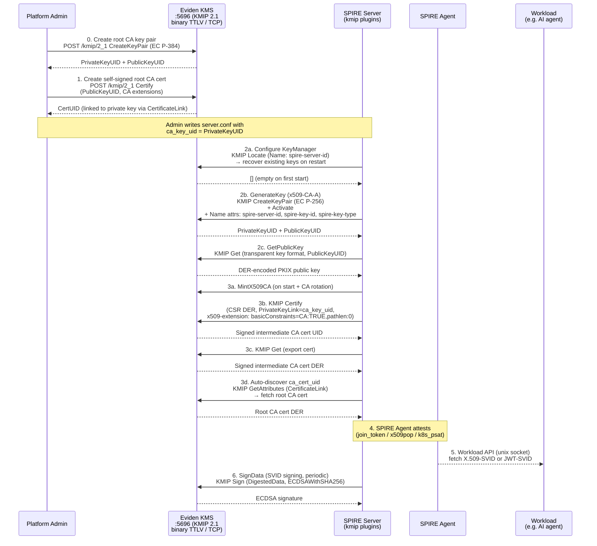
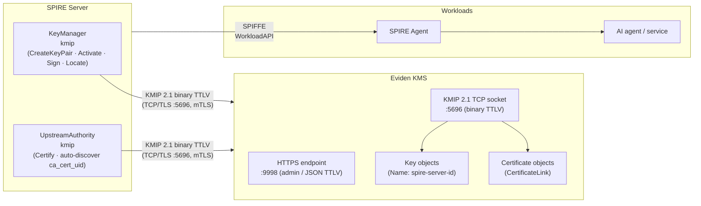
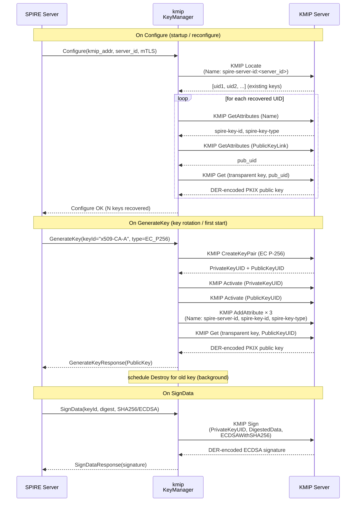
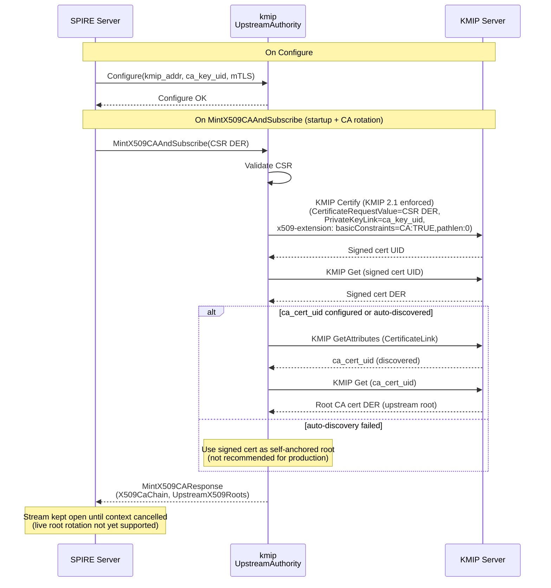
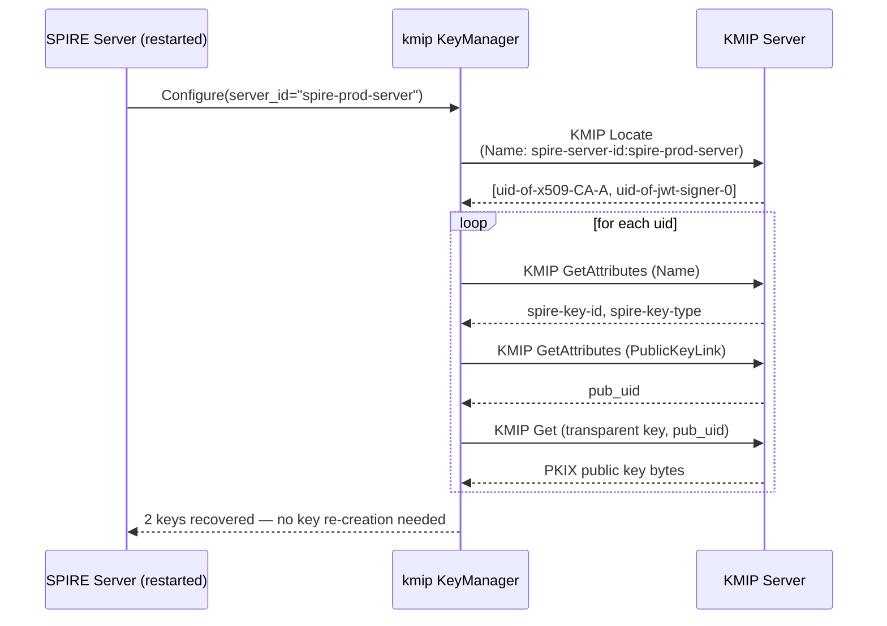

# SPIRE / SPIFFE — Native KMIP 2.1 Integration

> The `kmip` built-in plugins let SPIRE speak **KMIP 2.1 directly** to any
> standards-compliant KMIP server — including Eviden KMS — over the standard
> **binary TTLV / TCP/TLS** transport (port 5696).
> No Vault-compatible layer, no auth-verifier proxy, no AppRole tokens.
> SPIRE's own signing keys and its intermediate CA are both stored and used exclusively
> inside the KMIP server, which executes all cryptographic operations using FIPS-approved
> algorithms.
>
> **SPIRE fork**: the plugin sources live in the Cosmian SPIRE fork:
>
> - [KeyManager `kmip`](https://github.com/Cosmian/spire/tree/feature/eviden-kms-plugins) — branch `feature/eviden-kms-plugins` (tracking [spiffe/spire#7235](https://github.com/spiffe/spire/pull/7235))
> - [UpstreamAuthority `kmip`](https://github.com/Cosmian/spire/tree/feature/kmip-upstream-authority) — branch `feature/kmip-upstream-authority`
>
> The plugins use
> [`ovh/kmip-go`](https://github.com/ovh/kmip-go) as the Go KMIP client library
> and work with any KMIP 2.1-compliant server.
>
> **E2E test**: the KMS repo contains `mise run test:spire-kmip` which builds
> spire-server from the SPIRE fork, starts KMS with the binary KMIP TCP socket,
> and validates the full SPIRE + KMS stack end-to-end with mTLS.

## End-to-end flow



Steps 0–1 are a one-time operator setup. Steps 2–3 happen automatically every time the SPIRE
server starts or rotates its CA. Steps 4–6 are the ongoing SVID issuance lifecycle.

## What it is

[SPIFFE](https://spiffe.io/) defines a standard for issuing cryptographic identities —
**SVIDs** (SPIFFE Verifiable Identity Documents) — to software workloads. **SPIRE** is
the reference runtime that issues and rotates these identities.

SPIRE requires two external capabilities from a backend:

- A **`KeyManager`** that stores and uses the signing keys SPIRE uses internally.
- An **`UpstreamAuthority`** that signs SPIRE's intermediate CA certificate.

The `kmip` plugins provide both, speaking **KMIP 2.1 binary TTLV over TCP/TLS** (port 5696)
directly to any standards-compliant KMIP server. No Vault-compatible API layer, no separate
authentication service, no AppRole tokens.

## Why use it?

| Need | How this integration addresses it |
|---|---|
| **Private-key custody** | SPIRE's CA and signing keys are generated, stored, and used exclusively inside the KMIP server — never on the SPIRE server's local disk |
| **Compliance-ready crypto** | All signing operations use FIPS-approved algorithms (EC P-256/P-384, RSA-2048/4096, SHA-256/384) |
| **Minimal infrastructure** | Only a KMIP 2.1 server is required — no auth-verifier, no separate secrets management cluster, no proxy |
| **Native protocol** | Speaks KMIP 2.1 binary TTLV over TCP/TLS — the canonical KMIP transport — rather than a compatibility shim |
| **Vendor-neutral** | Works with any KMIP 2.1-compliant server (Eviden KMS, PyKMIP, OpenBao) using standard KMIP Name attributes for key metadata |
| **Centralized audit trail** | Every `Sign`, `CreateKeyPair`, and `Certify` call is a KMIP operation logged by the server with identity, timestamp, and key identifier |
| **Key recovery** | On SPIRE server restart, the `kmip` KeyManager recovers all existing keys via a KMIP `Locate` on the `spire-server-id` Name attribute — no local state needed |

## Architecture



Both plugins authenticate to the KMIP server with **mTLS** (client certificate).
No AppRole, no Vault tokens, no static bearer tokens.

## Comparison with the Vault-compatible integration

| Aspect | `kmip` plugins (native KMIP) | `vault` plugins via KMS Vault API |
|---|---|---|
| KMS API used | KMIP 2.1 binary TTLV over TCP/TLS (`:5696`) | Vault-compatible REST (`/v1/transit/`, `/v1/pki/`) |
| Authentication | mTLS client certificate | AppRole (role_id + secret_id) via auth-verifier |
| Additional services | None | auth-verifier required |
| SPIRE config namespace | `KeyManager "kmip"` / `UpstreamAuthority "kmip"` | SPIRE built-in Vault plugins |
| Key discovery on restart | KMIP `Locate` by `spire-server-id` Name attribute | Key identifier file on disk |
| Compatible KMIP servers | Any KMIP 2.1 server (Eviden KMS, PyKMIP, OpenBao) | Eviden KMS only |
| SPIRE version required | `Cosmian/spire` branches `feature/eviden-kms-plugins` (KeyManager) and `feature/kmip-upstream-authority` (UpstreamAuthority) — tracking issue [#7233](https://github.com/spiffe/spire/issues/7233) | Built-in to SPIRE ≥ 1.9 |

Choose the `kmip` plugins when you want a direct, minimal, vendor-neutral integration.
Choose the `vault` plugins with the KMS Vault-compatible API when you need
AppRole-based multi-tenant isolation or Vault token lifecycle features.

---

## Prerequisites

### KMS configuration

The KMIP server must expose a **binary TTLV TCP socket** in addition to (or instead of)
the HTTPS endpoint. For Eviden KMS, enable the `[socket_server]` section in `kms.toml`:

```toml
# kms.toml
default_username = "spire-server"

[http]
port = 9998

# Binary KMIP 2.1 TCP socket — required for the kmip SPIRE plugins.
[socket_server]
socket_server_start    = true
socket_server_port     = 5696
socket_server_hostname = "0.0.0.0"

# mTLS: trust client certificates signed by this CA.
[tls]
tls_cert_file        = "/etc/kms/certs/kms.crt"
tls_key_file         = "/etc/kms/certs/kms.key"
clients_ca_cert_file = "/etc/kms/certs/ca.crt"
```

The `socket_server` enables the standard KMIP TCP port (5696) alongside the HTTPS
endpoint. The SPIRE plugins connect to this TCP socket using binary TTLV encoding.

### 0. Create the root CA key pair

Before SPIRE starts, create an EC P-384 key pair and its self-signed CA certificate in
the KMS. The private key UID is what you put in `ca_key_uid` in `server.conf`.

#### Using `ckms`

```bash
# Create EC P-384 key pair with a predictable UID.
ckms --accept-invalid-certs ec keys create \
  --curve nist-p384 \
  --private-key-id spire-root-ca-key

# Create the self-signed root CA certificate.
# The --x509-extension-file sets basicConstraints=CA:TRUE so the cert is a valid signer.
# Note: cRLSign is omitted — Eviden KMS FIPS mode does not support it.
cat > /tmp/ca_ext.cnf <<'EOF'
[v3_ca]
basicConstraints=critical,CA:TRUE,pathlen:0
keyUsage=critical,keyCertSign,digitalSignature
EOF

ckms --accept-invalid-certs certificates certify \
  --public-key-id spire-root-ca-key_pk \
  --subject-name "CN=SPIRE Root CA,O=SPIFFE,C=US" \
  --x509-extension-file /tmp/ca_ext.cnf
```

The KMS automatically stores a `CertificateLink` attribute on the public key pointing
to the new certificate. The `kmip` UpstreamAuthority plugin auto-discovers this
link after the first `Certify` call — you do not need to configure `ca_cert_uid`
explicitly.

#### Using `curl` (KMIP JSON TTLV via HTTPS)

```bash
KMS="https://kms.example.com:9998"

# Create EC P-384 key pair.
curl -s -X POST "$KMS/kmip/2_1" \
  --cacert /etc/kms/ca.crt \
  --cert /etc/kms/spire-client.crt \
  --key  /etc/kms/spire-client.key \
  -H "Content-Type: application/json" -d '{
  "tag": "CreateKeyPair",
  "value": [
    {"tag": "CommonAttributes", "value": [
      {"tag": "CryptographicAlgorithm", "type": "Enumeration", "value": "EC"},
      {"tag": "CryptographicDomainParameters", "value": [
        {"tag": "RecommendedCurve", "type": "Enumeration", "value": "P384"}
      ]},
      {"tag": "KeyFormatType", "type": "Enumeration", "value": "ECPrivateKey"},
      {"tag": "ActivationDate", "type": "DateTime", "value": "2024-01-01T00:00:00Z"}
    ]},
    {"tag": "PrivateKeyAttributes", "value": [
      {"tag": "UniqueIdentifier", "type": "TextString", "value": "spire-root-ca-key"},
      {"tag": "CryptographicUsageMask", "type": "Integer", "value": 1063425}
    ]},
    {"tag": "PublicKeyAttributes", "value": [
      {"tag": "CryptographicUsageMask", "type": "Integer", "value": 1051138}
    ]}
  ]
}'

# Create self-signed CA certificate (sets CertificateLink → enables auto-discovery).
# x509-extension is hex-encoded OpenSSL extension file content.
CA_EXT="[v3_ca]\nbasicConstraints=critical,CA:TRUE,pathlen:0\nkeyUsage=critical,keyCertSign,digitalSignature\n"
CA_EXT_HEX=$(printf "$CA_EXT" | xxd -p | tr -d '\n' | tr '[:lower:]' '[:upper:]')

curl -s -X POST "$KMS/kmip/2_1" \
  --cacert /etc/kms/ca.crt \
  --cert /etc/kms/spire-client.crt \
  --key  /etc/kms/spire-client.key \
  -H "Content-Type: application/json" -d "{
  \"tag\": \"Certify\",
  \"value\": [
    {\"tag\": \"UniqueIdentifier\", \"type\": \"TextString\", \"value\": \"spire-root-ca-key_pk\"},
    {\"tag\": \"Attributes\", \"value\": [
      {\"tag\": \"CertificateType\", \"type\": \"Enumeration\", \"value\": \"X509\"},
      {\"tag\": \"CertificateAttributes\", \"value\": [
        {\"tag\": \"CertificateSubjectCn\", \"type\": \"TextString\", \"value\": \"SPIRE Root CA\"},
        {\"tag\": \"CertificateSubjectO\", \"type\": \"TextString\", \"value\": \"SPIFFE\"},
        ...
      ]},
      {\"tag\": \"Attribute\", \"value\": [
        {\"tag\": \"VendorIdentification\", \"type\": \"TextString\", \"value\": \"cosmian\"},
        {\"tag\": \"AttributeName\", \"type\": \"TextString\", \"value\": \"x509-extension\"},
        {\"tag\": \"AttributeValue\", \"type\": \"ByteString\", \"value\": \"$CA_EXT_HEX\"}
      ]}
    ]}
  ]
}"
```

---

## SPIRE server configuration

Add the two `kmip` plugins to `server.conf`. Both use the same `kmip_addr` and
mTLS certificate paths.

```hcl
server {
  bind_address = "0.0.0.0"
  bind_port    = "8081"
  trust_domain = "example.org"
  data_dir     = "/var/lib/spire/server"
  log_level    = "INFO"

  ca_ttl               = "24h"
  default_x509_svid_ttl = "1h"
  ca_subject {
    country      = ["US"]
    organization = ["SPIFFE"]
    common_name  = ""
  }
}

plugins {
  DataStore "sql" {
    plugin_data {
      database_type     = "sqlite3"
      connection_string = "/var/lib/spire/server/datastore.sqlite3"
    }
  }

  NodeAttestor "join_token" {
    plugin_data {}
  }

  # ── KeyManager: SPIRE's own signing keys stored in the KMIP server ─────────
  # The plugin creates asymmetric key pairs via KMIP CreateKeyPair, activates them,
  # and tags them with standard KMIP Name attributes (spire-server-id, spire-key-id,
  # spire-key-type). On restart, it recovers existing keys via KMIP Locate.
  KeyManager "kmip" {
    plugin_data {
      # TCP address of the KMIP binary TTLV socket (standard port 5696).
      kmip_addr = "kmip.example.com:5696"

      # PEM CA cert that verifies the KMIP server TLS certificate.
      # Omit if the server uses a publicly-trusted certificate.
      ca_cert_path = "/etc/spire/kmip-ca.crt"

      # mTLS client certificate (required for authentication).
      client_cert_path = "/etc/spire/kmip-client.crt"
      client_key_path  = "/etc/spire/kmip-client.key"

      # A stable identifier for this SPIRE server instance.
      # All keys are tagged with Name "spire-server-id:<server_id>".
      server_id = "spire-prod-server"

      # Optional: skip TLS verification (test environments only).
      # insecure_skip_verify = false
    }
  }

  # ── UpstreamAuthority: SPIRE's intermediate CA signed by the KMIP server ────
  # On startup the plugin sends the CSR via KMIP Certify with a PrivateKeyLink
  # pointing to ca_key_uid. After signing, it auto-discovers the root CA certificate
  # via the CertificateLink on the signed intermediate.
  # Optionally set ca_cert_uid explicitly to skip auto-discovery.
  UpstreamAuthority "kmip" {
    plugin_data {
      kmip_addr        = "kmip.example.com:5696"
      ca_cert_path     = "/etc/spire/kmip-ca.crt"
      client_cert_path = "/etc/spire/kmip-client.crt"
      client_key_path  = "/etc/spire/kmip-client.key"

      # KMIP UniqueIdentifier of the root CA private key (set in step 0).
      ca_key_uid = "spire-root-ca-key"

      # Optional: KMIP UID of the root CA certificate.
      # Auto-discovered from CertificateLink when omitted.
      # ca_cert_uid = "..."
    }
  }
}
```

Start the SPIRE server:

```bash
spire-server run -config /etc/spire/server.conf
```

---

## Detailed flows

### KeyManager — key creation and recovery



### UpstreamAuthority — intermediate CA signing



### Key recovery after SPIRE server restart



---

## Quick start (local demo)

### From the KMS repository

The KMS repo contains `mise run test:spire-kmip` — a full end-to-end test that
builds both KMS and SPIRE from source, provisions the CA, and validates the
`kmip` plugins over binary KMIP TCP/TLS with mTLS:

```bash
# From the KMS repository root
mise run test:spire-kmip
```

The `test:spire-kmip` task orchestrates two independent sub-tasks sequentially — one
per plugin, each on its own SPIRE fork branch:

1. Builds the KMS server and `ckms` CLI from source (non-FIPS)
2. **KeyManager sub-task** (`test:spire-kmip-key-manager`):
   clones `Cosmian/spire` branch `feature/eviden-kms-plugins`, builds `spire-server`,
   starts KMS with binary KMIP TCP socket (port 5696), and validates key creation via join token
3. **UpstreamAuthority sub-task** (`test:spire-kmip-upstream-authority`):
   clones `Cosmian/spire` branch `feature/kmip-upstream-authority`, builds `spire-server`,
   provisions the root CA key pair via `ckms`, starts KMS with binary KMIP TCP socket (port 5697),
   and validates CA signing via join token
4. Both sub-tasks generate mTLS test certificates (CA, KMS server, SPIRE client)
5. Both sub-tasks run `spire-server healthcheck` and generate a join token to confirm plugin operation

### From the SPIRE fork

The Cosmian SPIRE fork also contains Kind-based integration test suites that start their
own KMS Docker container:

```bash
# Clone the SPIRE fork (KeyManager plugin)
git clone --branch feature/eviden-kms-plugins https://github.com/Cosmian/spire
cd spire

# Kind-based integration tests (start KMS Docker, deploy SPIRE into Kind)
test/integration/suites/key-manager-kmip/

# Clone the SPIRE fork (UpstreamAuthority plugin)
git clone --branch feature/kmip-upstream-authority https://github.com/Cosmian/spire
test/integration/suites/upstream-authority-kmip/
```

### KMIP 1.x compliance tests (KMS repo)

The KMS repository also includes KMIP 1.x protocol compliance tests using the
`ovh/kmip-go` library, which can be run independently:

```bash
# From the KMS repository root — KMIP 1.0–1.4 compliance (not SPIRE-related)
mise run test:kmip-go
```

---

## Plugin configuration reference

### `KeyManager "kmip"`

| Field | Type | Required | Default | Description |
|---|---|---|---|---|
| `kmip_addr` | string | ✅ | — | TCP address of the KMIP binary TTLV socket (e.g. `kmip.example.com:5696`) |
| `server_id` | string | ✅ | — | Stable identifier for this SPIRE server. Used as the `spire-server-id` Name attribute on all key pairs. Must be unique per SPIRE instance. |
| `ca_cert_path` | string | — | system pool | PEM file to verify the KMIP server TLS certificate. Omit for publicly-trusted certs. |
| `client_cert_path` | string | — | — | PEM client certificate for mTLS authentication. If set, `client_key_path` is also required. |
| `client_key_path` | string | — | — | PEM client private key for mTLS authentication. |
| `insecure_skip_verify` | bool | — | `false` | Skip TLS verification. **Test environments only.** |

!!! note "Authentication"
    mTLS is the only authentication method supported by the `kmip` plugins. If
    `client_cert_path` and `client_key_path` are both set, the plugin presents
    the client certificate during the TLS handshake. If neither is set, the
    plugin connects without a client certificate (anonymous TLS).

### `UpstreamAuthority "kmip"`

| Field | Type | Required | Default | Description |
|---|---|---|---|---|
| `kmip_addr` | string | ✅ | — | TCP address of the KMIP binary TTLV socket. |
| `ca_key_uid` | string | ✅ | — | KMIP UniqueIdentifier of the root CA private key. Created in step 0. |
| `ca_cert_uid` | string | — | auto-discovered | KMIP UID of the root CA certificate. When omitted, the plugin follows the `CertificateLink` attribute on the signed intermediate certificate. If discovery fails, the signed cert is used as a self-anchored root (not recommended for production). |
| `ca_cert_path` | string | — | system pool | PEM file to verify the KMIP server TLS certificate. |
| `client_cert_path` | string | — | — | PEM client certificate for mTLS. |
| `client_key_path` | string | — | — | PEM client private key for mTLS. |
| `insecure_skip_verify` | bool | — | `false` | Skip TLS verification. **Test environments only.** |

---

## KMIP operations reference

### KeyManager operations

| SPIRE gRPC method | KMIP operation | Key details |
|---|---|---|
| `Configure` | `Locate` | Finds all `PrivateKey` objects with Name `spire-server-id:<server_id>` to rebuild the key map on restart. |
| `GenerateKey` | `CreateKeyPair` | Creates EC P-256/P-384 or RSA-2048/4096 key pair. |
| `GenerateKey` | `Activate` | Activates both private and public keys (KMIP keys start in PreActive state; Sign requires Active). |
| `GenerateKey` | `AddAttribute` | Adds three standard KMIP Name attributes: `spire-server-id:<id>`, `spire-key-id:<keyId>`, `spire-key-type:<type>`. |
| `GenerateKey` | `Get(transparent)` | Fetches the DER-encoded PKIX public key using transparent key format (fallback: unqualified Get). |
| `SignData` | `Sign(DigestedData)` | Signs a pre-hashed digest using `ECDSAWithSHA256/384/512`, `SHA256/384/512WithRSAEncryption`, or `RSASSAPSS`. |
| `GetPublicKey` | In-memory | Served from the local key map (populated at `Configure` + `GenerateKey` time). |
| `GetPublicKeys` | In-memory | Returns all public keys in the local key map. |
| _(key cleanup)_ | `Destroy` | Called in the background after key rotation. |

### UpstreamAuthority operations

| SPIRE gRPC method | KMIP operation | Details |
|---|---|---|
| `Configure` | — | Stores `ca_key_uid` and optional `ca_cert_uid`. |
| `MintX509CAAndSubscribe` | `Certify` | Sends the DER-encoded CSR with `PrivateKeyLink=ca_key_uid` and `x509-extension` vendor attribute (`basicConstraints=critical,CA:TRUE,pathlen:0`). Enforces KMIP 2.1 (tag `0x420140` CertificateRequestValue). |
| `MintX509CAAndSubscribe` | `Get` | Exports the signed intermediate certificate (DER) and the root CA certificate for the upstream X.509 roots bundle. |
| `MintX509CAAndSubscribe` | `GetAttributes(Link)` | Auto-discovery: follows `CertificateLink` on the signed intermediate to find the root CA certificate UID. |

### KMIP cryptographic usage masks

The KeyManager plugin sets FIPS-compliant `CryptographicUsageMask` values on every key:

| Key type | Object | Flags |
|---|---|---|
| EC P-256/P-384 | Private key | Sign, CertSign, CRLSign |
| EC P-256/P-384 | Public key | Verify |
| RSA 2048/4096 | Private key | Sign, Decrypt, UnwrapKey |
| RSA 2048/4096 | Public key | Verify, Encrypt, WrapKey |

---

## Security notes

### Key isolation

Each SPIRE server instance uses a unique `server_id` Name attribute. Keys tagged with
one server-id can be distinguished from another's — the KMIP server enforces object
ownership via the authenticated connection identity.

### mTLS authentication

mTLS is the only authentication method supported by the `kmip` plugins. The KMIP server
validates the client certificate at the TLS layer, before any KMIP message is processed.

| | mTLS (`client_cert_path` + `client_key_path`) |
|---|---|
| **Credential type** | X.509 client certificate + private key |
| **Expiry** | Hard `NotAfter` date — **causes live failures when expired** |
| **Revocation** | Revoke via CRL/OCSP or delete from the KMIP server's trust CA |
| **Who rotates** | PKI operator (same team who owns the server cert CA) |
| **Rotation trigger** | Certificate expiry; security incident |
| **Automation** | cert-manager, ACME, cron + `openssl` |

### Managing mTLS client certificate lifecycle

The SPIRE plugins authenticate to the KMIP server using a client certificate
(`client_cert_path` / `client_key_path`). This certificate has a hard expiry date.
When it expires, **every KMIP call fails immediately** — including the periodic
`Sign` calls during normal operation, not only on restart.

**Why rotate:**

| Trigger | Impact | Action |
|---------|--------|--------|
| Certificate expiry (`NotAfter` reached) | All KMIP operations fail with a TLS handshake error. SPIRE cannot sign SVIDs or rotate its CA. | Renew certificate **before** expiry. Monitor `notAfter` proactively. |
| Private key compromise | An attacker holding the key can authenticate as the SPIRE server to the KMIP server and access its signing keys. | Revoke the old certificate; issue a new one immediately. |

**Who rotates:** The platform operator who owns the PKI (Certificate Authority) that
issued the KMIP server's client certificate. This is typically the same team that manages
the KMIP server certificate. The SPIRE server itself has no authority to renew its own
credential.

**Production recommendation:** Issue client certificates with a **1-year validity** and
set up automated renewal at the 80% mark (after ~10 months). The KMIP server trusts all
certificates issued by its configured `clients_ca_cert_file` CA, so you only need
to replace the leaf certificate — the trust anchor does not change.

**Automation patterns:**

| Pattern | How | When to use |
|---------|-----|------------|
| **cert-manager (Kubernetes)** | `Certificate` resource issues a client cert; cert-manager renews automatically before expiry. Mount as a K8s Secret; SPIRE reads it from disk. | Best for Kubernetes deployments. |
| **ACME / Let's Encrypt** | Certbot or equivalent renews the cert, runs a post-renewal hook to restart SPIRE. | Suitable if your mTLS CA is ACME-compatible. |
| **Cron + OpenSSL** | Weekly cron checks `openssl x509 -noout -checkend 2592000 -in /etc/spire/kmip-client.crt` (30-day threshold); renews if close to expiry and restarts SPIRE. | Simple; no additional tooling. |
| **SPIFFE-issued client cert (meta-SPIRE)** | A separate SPIRE instance issues the KMIP client identity as a short-lived X.509-SVID. Requires the KMIP server to trust the meta-SPIRE CA. | Advanced; eliminates long-lived certs entirely. |

**Minimal cron example:**

```bash
#!/usr/bin/env bash
# /etc/cron.weekly/renew-kmip-client-cert
set -euo pipefail

CERT=/etc/spire/kmip-client.crt
KEY=/etc/spire/kmip-client.key
CA_KEY=/etc/pki/kmip-ca.key
CA_CERT=/etc/pki/kmip-ca.crt
DAYS_BEFORE_EXPIRY=30

if openssl x509 -noout -checkend $((DAYS_BEFORE_EXPIRY * 86400)) -in "$CERT" 2>/dev/null; then
  echo "Client cert valid for more than ${DAYS_BEFORE_EXPIRY} days — no renewal needed."
  exit 0
fi

echo "Renewing KMIP mTLS client certificate..."
openssl req -new -key "$KEY" -subj "/CN=spire-server" \
  | openssl x509 -req -CA "$CA_CERT" -CAkey "$CA_KEY" \
      -CAcreateserial -days 365 -out "$CERT"

# Restart SPIRE to pick up the new certificate.
systemctl restart spire-server
echo "Certificate renewed and SPIRE restarted."
```

> If SPIRE is containerised, update the Secret holding the cert and roll the
> Deployment: `kubectl rollout restart deployment/spire-server -n spire`.

### CA key custody

The root CA private key (`ca_key_uid`) never leaves the KMIP server. The `Certify`
operation is a server-side signing operation — only the resulting certificate is
returned. The root CA key is marked non-exportable at creation time.

### Root CA single-tier limitation

The current UpstreamAuthority implementation only supports a **single-tier CA hierarchy**
(root CA directly signing SPIRE's intermediate CA). Multi-tier hierarchies (root → intermediate
CA → SPIRE intermediate) require an additional `ca_cert_uid` pointing to the signing
intermediate rather than the root, and the root must be a trust anchor in SPIRE's bundle.

### No live root rotation

`MintX509CAAndSubscribe` sends a single response on the stream and then blocks until
the context is cancelled. SPIRE's CA rotation is driven by SPIRE itself re-calling
`MintX509CAAndSubscribe` on schedule. Live upstream root rotation (the plugin proactively
pushing a new root) is not yet supported.

---

## Go KMIP client libraries

### SPIRE plugins: `ovh/kmip-go` (binary TTLV / TCP)

The `kmip` SPIRE plugins use [`ovh/kmip-go`](https://github.com/ovh/kmip-go)
(`kmipclient` package) as the Go KMIP client library. This library speaks
**binary TTLV over TCP/TLS** — the standard KMIP transport — and works with any
KMIP 2.1-compliant server.

| Package | Purpose |
|---|---|
| `kmipclient.Dial(addr, opts...)` | Connect to a KMIP server over TCP/TLS |
| `client.CreateKeyPair().ECDSA(curve, ...)` | KMIP CreateKeyPair |
| `client.Activate(uid)` | KMIP Activate (PreActive → Active) |
| `client.Get(uid).WithKeyFormat(fmt)` | KMIP Get (transparent key, certificate, etc.) |
| `client.Locate().WithAttribute(...)` | KMIP Locate by Name attribute |
| `client.Sign(uid).WithCryptographicParameters(...)` | KMIP Sign (DigestedData) |
| `client.AddAttribute(uid, name, value)` | KMIP AddAttribute (Name attributes) |
| `client.Destroy(uid)` | KMIP Destroy |
| `client.Request(ctx, payload)` | Raw KMIP operation (used for Certify) |

### General-purpose: `github.com/Cosmian/kmip-go` (JSON TTLV / HTTPS)

The [`Cosmian/kmip-go`](https://github.com/Cosmian/kmip-go) module provides a
minimal, zero-external-dependency KMIP 2.1 **JSON TTLV over HTTPS** client for
Eviden KMS. It is used by the KMS integration tests and by applications that
prefer the HTTP transport.

| Package symbol | Purpose |
|---|---|
| `NewClient(cfg)` | Build an HTTPS client with mTLS (`cert_auth`) or Bearer token (`token_auth`) |
| `CreateKeyPair(ctx, KeyType, tags)` | KMIP CreateKeyPair with FIPS-compliant usage masks |
| `GetPublicKey(ctx, publicKeyUID)` | KMIP Get (PKCS8) → DER-encoded PKIX |
| `Locate(ctx, tags)` | KMIP Locate by cosmian vendor tag |
| `Sign(ctx, uid, data, hash, sig)` | KMIP Sign (DigestedData, pre-hashed) |
| `Destroy(ctx, uid)` | KMIP Revoke + Destroy (KMIP lifecycle) |
| `Certify(ctx, csr, caKey, caCert, ext)` | KMIP Certify (CSR signing) |
| `CreateSelfSignedCertificate(ctx, pubKeyUID, cn, ext)` | KMIP Certify (self-signed) |
| `FakeKMS` | Exported in-process `httptest.Server` for unit testing |

The `kmip-go` repository also contains:

- Test data as a **git submodule** (`test_data/`) with mTLS certs and configs
- `docker-compose.yml` with pinned `ghcr.io/cosmian/kms:5.26.0` (plain HTTP + mTLS services)

Run integration tests against a live KMS Docker container:

```bash
# From the kmip-go repository root
mise run test:live           # no-auth HTTP (ghcr.io/cosmian/kms:5.26.0)
mise run test:live --mtls    # mTLS HTTPS (ghcr.io/cosmian/kms:5.26.0)
```

---

## Troubleshooting

### `plugin not configured` (codes.FailedPrecondition)

The `Configure` RPC was not called before the first operation. This typically happens if
`BuiltIn()` creates two separate `Plugin` instances (a known bug fixed in the
`feature/eviden-kms-plugins` branch — ensure you are on the correct branch).

### `basic constraints are not valid`

The signed intermediate CA certificate does not have `basicConstraints=CA:TRUE`. Ensure:

1. The `x509-extension` vendor attribute is included in the `Certify` request (the plugin
   sets this automatically with `basicConstraints=critical,CA:TRUE,pathlen:0`).
2. The root CA certificate itself was created with the CA extension
   (`basicConstraints=critical,CA:TRUE,pathlen:0,keyUsage=critical,keyCertSign,digitalSignature`).

### `no CertificateLink found`

Auto-discovery of `ca_cert_uid` failed because the signed intermediate certificate does
not have a `CertificateLink` attribute pointing to the root CA certificate. Ensure
step 0 (create the self-signed CA certificate) was completed before starting SPIRE,
and that the KMIP server creates `CertificateLink` attributes on `Certify` responses.

Alternatively, set `ca_cert_uid` explicitly in the UpstreamAuthority configuration.

### `x509: certificate signed by unknown authority`

The root CA certificate lacks the `keyCertSign` key usage. Recreate the root CA
certificate with the correct extensions:

```ini
[v3_ca]
basicConstraints=critical,CA:TRUE,pathlen:0
keyUsage=critical,keyCertSign,digitalSignature
```

### `failed to connect to KMIP server: dial tcp: connection refused`

The KMIP binary TTLV TCP socket is not listening. Ensure the `[socket_server]` section
is present in `kms.toml` and `socket_server_start = true`:

```toml
[socket_server]
socket_server_start    = true
socket_server_port     = 5696
socket_server_hostname = "0.0.0.0"
```

### `KMIP server returned error: operation not supported`

The `Certify` operation uses KMIP 2.1 tag `0x420140` (`CertificateRequestValue`).
If the KMIP server negotiates KMIP 1.4, this tag is rejected as unknown. The
UpstreamAuthority plugin enforces KMIP 2.1 (`kmipclient.EnforceVersion(ovh.V2_1)`),
so this error indicates the KMIP server does not support KMIP 2.1. Upgrade the
server or use a compatible KMIP version.

---

## See also

- [SPIRE / SPIFFE — Vault-compatible integration](./spire_spiffe.md) — the
  Vault-compatible approach using AppRole authentication and auth-verifier
- [KMIP Go integration](./kmip_go.md) — other Go clients for Eviden KMS
- SPIRE tracking issue [#7233](https://github.com/spiffe/spire/issues/7233) — feature
  request thread for native KMIP plugins in SPIRE
- [SPIRE fork — `feature/eviden-kms-plugins`](https://github.com/Cosmian/spire/tree/feature/eviden-kms-plugins) —
  KeyManager `kmip` plugin source (PR [spiffe/spire#7235](https://github.com/spiffe/spire/pull/7235))
- [SPIRE fork — `feature/kmip-upstream-authority`](https://github.com/Cosmian/spire/tree/feature/kmip-upstream-authority) —
  UpstreamAuthority `kmip` plugin source
- [`github.com/Cosmian/kmip-go`](https://github.com/Cosmian/kmip-go) — the Go HTTPS
  JSON TTLV client library for Eviden KMS
- [`ovh/kmip-go`](https://github.com/ovh/kmip-go) — the Go KMIP client library used
  by the SPIRE plugins (binary TTLV / TCP)
- KMIP 2.1 specification — `crate/kmip/src/` (local copy)
