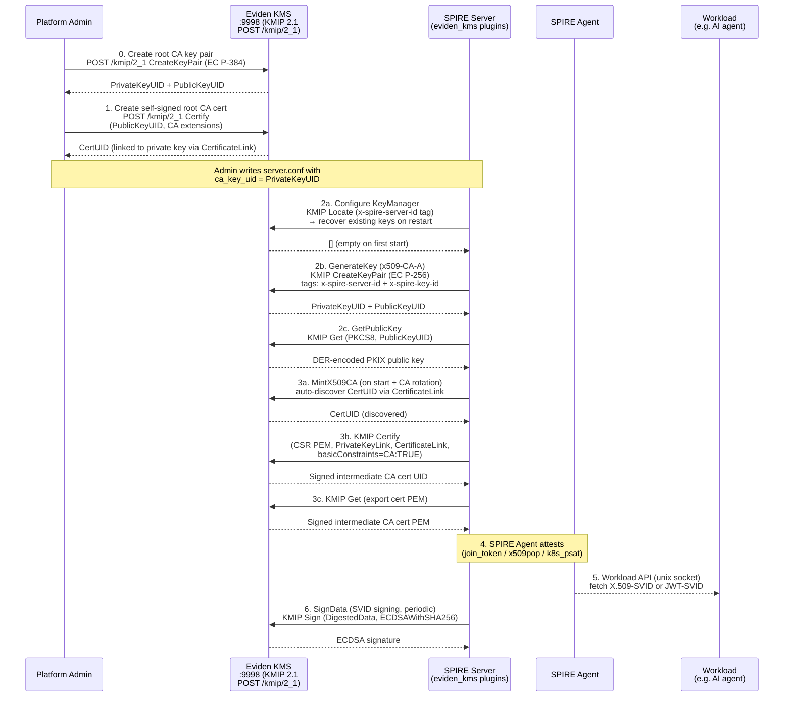
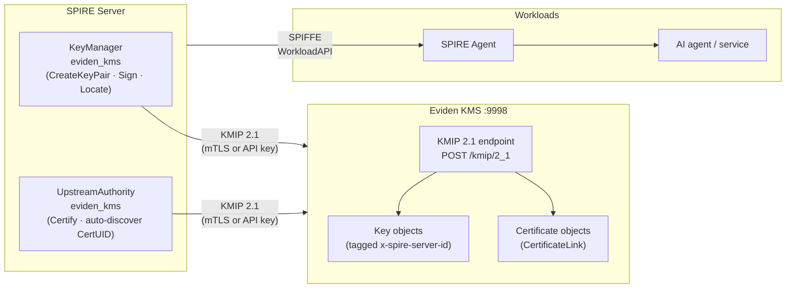
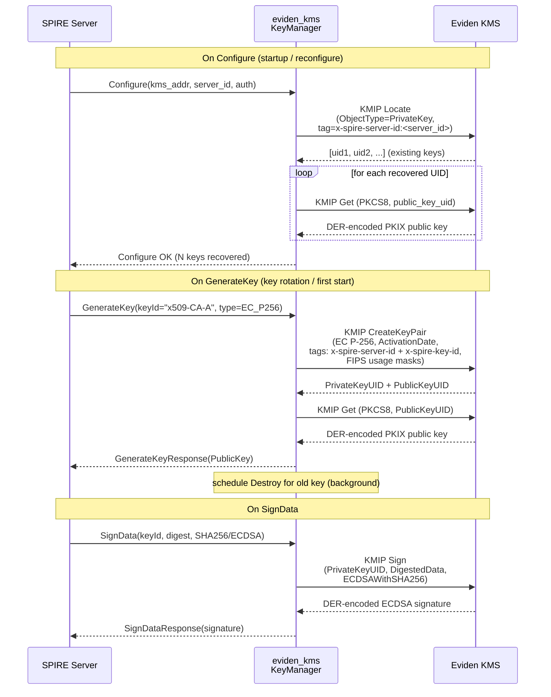
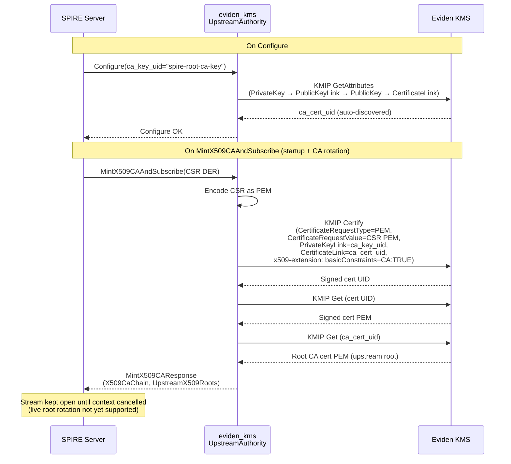
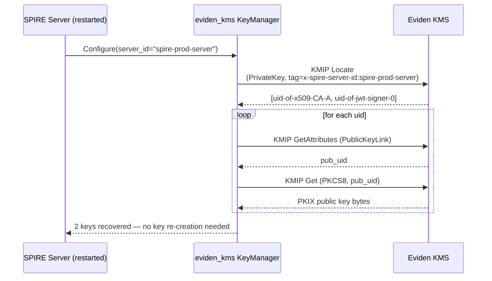

# SPIRE / SPIFFE — Native KMIP 2.1 Integration

> The `eviden_kms` built-in plugins let SPIRE speak **KMIP 2.1 directly** to Eviden KMS —
> no Vault-compatible layer, no auth-verifier proxy, no AppRole tokens.
> SPIRE's own signing keys and its intermediate CA are both stored and used exclusively
> inside Eviden KMS, which executes all cryptographic operations using OpenSSL's
> FIPS-approved provider.
>
> **Go module**: the KMIP 2.1 client library used by these plugins lives in its own
> standalone repository — [`github.com/Cosmian/kmip-go`](https://github.com/Cosmian/kmip-go).
> That repo also contains the SPIRE plugin source (as a git submodule), integration tests
> against `ghcr.io/cosmian/kms:5.26.0`, and the `mise run test:spire-e2e` task that
> validates the full SPIRE + KMS stack end-to-end with mTLS.

## End-to-end flow



Steps 0–1 are a one-time operator setup. Steps 2–3 happen automatically every time the SPIRE
server starts or rotates its CA. Steps 4–6 are the ongoing SVID issuance lifecycle.

## What it is

[SPIFFE](https://spiffe.io/) defines a standard for issuing cryptographic identities —
**SVIDs** (SPIFFE Verifiable Identity Documents) — to software workloads. **SPIRE** is
the reference runtime that issues and rotates these identities.

SPIRE requires two external capabilities from a backend:

- A **`KeyManager`** that stores and uses the signing keys SPIRE uses internally.
- An **`UpstreamAuthority`** that signs SPIRE's intermediate CA certificate.

The `eviden_kms` plugins provide both, speaking **KMIP 2.1 JSON TTLV** (`POST /kmip/2_1`)
directly to Eviden KMS. No Vault-compatible API layer, no separate authentication service,
no AppRole tokens.

## Why use it?

| Need | How this integration addresses it |
|---|---|
| **Private-key custody** | SPIRE's CA and signing keys are generated, stored, and used exclusively inside Eviden KMS — never on the SPIRE server's local disk |
| **Compliance-ready crypto** | All signing operations use FIPS-approved algorithms (EC P-256/P-384, RSA-2048/4096, SHA-256/384) via OpenSSL's FIPS provider |
| **Minimal infrastructure** | Only Eviden KMS is required — no auth-verifier, no separate secrets management cluster, no proxy |
| **Native protocol** | Speaks KMIP 2.1 directly — the canonical KMS protocol — rather than a compatibility shim |
| **Centralized audit trail** | Every `Sign`, `CreateKeyPair`, and `Certify` call is a KMIP operation logged by the KMS with identity, timestamp, and key identifier |
| **Key recovery** | On SPIRE server restart, the `eviden_kms` KeyManager recovers all existing keys from the KMS via a KMIP `Locate` on the server-id tag — no local state needed |

## Architecture



Both plugins authenticate to the KMS with either **mTLS** (client certificate) or a
**static Bearer token / API key**. No AppRole, no Vault tokens, no periodic renewal.

## Comparison with the Vault-compatible integration

| Aspect | `eviden_kms` (native KMIP) | `vault` plugins via KMS Vault API |
|---|---|---|
| KMS API used | KMIP 2.1 JSON TTLV (`/kmip/2_1`) | Vault-compatible REST (`/v1/transit/`, `/v1/pki/`) |
| Authentication | mTLS or static API key | AppRole (role_id + secret_id) via auth-verifier |
| Additional services | None | auth-verifier required |
| SPIRE config namespace | `KeyManager "eviden_kms"` / `UpstreamAuthority "eviden_kms"` | `KeyManager "hashicorp_vault"` / `UpstreamAuthority "vault"` |
| Key discovery on restart | KMIP `Locate` by server-id tag | Key identifier file on disk |
| SPIRE version required | Branch `feature/eviden-kms-plugins` (PR [#7235](https://github.com/spiffe/spire/pull/7235), tracking issue [#7233](https://github.com/spiffe/spire/issues/7233)) | Built-in to SPIRE ≥ 1.9 |

Choose the `eviden_kms` plugins when you want a direct, minimal integration.
Choose the `vault` plugins with the KMS Vault-compatible API when you need
AppRole-based multi-tenant isolation or Vault token lifecycle features.

---

## Prerequisites

### KMS configuration

No special server-side configuration is required. The standard KMS `default_username`
(no-auth mode) or a static API key both work. For production:

```toml
# kms.toml — no Vault API needed
default_username = "spire-server"

[http]
port = 9998
# Optional: API token authentication
# api_token_id = "<kmip-uid-of-a-symmetric-key>"
```

### 0. Create the root CA key pair

Before SPIRE starts, create an EC P-384 key pair and its self-signed CA certificate in
the KMS. The private key UID is what you put in `ca_key_uid` in `server.conf`.

#### Using `ckms`

```bash
# Create EC P-384 key pair with a predictable UID.
ckms --accept-invalid-certs ec keys create \
  --curve nist-p384 \
  --private-key-id spire-root-ca-key

# Create the self-signed root CA certificate.
# The --x509-extension-file sets basicConstraints=CA:TRUE so the cert is a valid signer.
cat > /tmp/ca_ext.cnf <<'EOF'
[v3_ca]
basicConstraints=critical,CA:TRUE
keyUsage=critical,keyCertSign,crlSign,digitalSignature
EOF

ckms --accept-invalid-certs certificates certify \
  --public-key-id spire-root-ca-key_pk \
  --subject-name "CN=SPIRE Root CA,O=SPIFFE,C=US" \
  --x509-extension-file /tmp/ca_ext.cnf
```

The KMS automatically stores a `CertificateLink` attribute on the public key pointing
to the new certificate. The `eviden_kms` UpstreamAuthority plugin auto-discovers this
link at startup — you do not need to configure `ca_cert_uid` explicitly.

#### Using `curl` (KMIP JSON TTLV directly)

```bash
KMS="http://kms.example.com:9998"

# Create EC P-384 key pair.
curl -s -X POST "$KMS/kmip/2_1" -H "Content-Type: application/json" -d '{
  "tag": "CreateKeyPair",
  "value": [
    {"tag": "CommonAttributes", "value": [
      {"tag": "CryptographicAlgorithm", "type": "Enumeration", "value": "EC"},
      {"tag": "CryptographicDomainParameters", "value": [
        {"tag": "RecommendedCurve", "type": "Enumeration", "value": "P384"}
      ]},
      {"tag": "KeyFormatType", "type": "Enumeration", "value": "ECPrivateKey"},
      {"tag": "ActivationDate", "type": "DateTime", "value": "2024-01-01T00:00:00Z"}
    ]},
    {"tag": "PrivateKeyAttributes", "value": [
      {"tag": "UniqueIdentifier", "type": "TextString", "value": "spire-root-ca-key"},
      {"tag": "CryptographicUsageMask", "type": "Integer", "value": 1063425}
    ]},
    {"tag": "PublicKeyAttributes", "value": [
      {"tag": "CryptographicUsageMask", "type": "Integer", "value": 1051138}
    ]}
  ]
}'

# Create self-signed CA certificate (sets CertificateLink → enables auto-discovery).
# x509-extension is hex-encoded OpenSSL extension file content.
CA_EXT="[v3_ca]\nbasicConstraints=critical,CA:TRUE\nkeyUsage=critical,keyCertSign,crlSign,digitalSignature\n"
CA_EXT_HEX=$(printf "$CA_EXT" | xxd -p | tr -d '\n' | tr '[:lower:]' '[:upper:]')

curl -s -X POST "$KMS/kmip/2_1" -H "Content-Type: application/json" -d "{
  \"tag\": \"Certify\",
  \"value\": [
    {\"tag\": \"UniqueIdentifier\", \"type\": \"TextString\", \"value\": \"spire-root-ca-key_pk\"},
    {\"tag\": \"Attributes\", \"value\": [
      {\"tag\": \"CertificateType\", \"type\": \"Enumeration\", \"value\": \"X509\"},
      {\"tag\": \"CertificateAttributes\", \"value\": [
        {\"tag\": \"CertificateSubjectCn\", \"type\": \"TextString\", \"value\": \"SPIRE Root CA\"},
        {\"tag\": \"CertificateSubjectO\", \"type\": \"TextString\", \"value\": \"SPIFFE\"},
        ...
      ]},
      {\"tag\": \"Attribute\", \"value\": [
        {\"tag\": \"VendorIdentification\", \"type\": \"TextString\", \"value\": \"cosmian\"},
        {\"tag\": \"AttributeName\", \"type\": \"TextString\", \"value\": \"x509-extension\"},
        {\"tag\": \"AttributeValue\", \"type\": \"ByteString\", \"value\": \"$CA_EXT_HEX\"}
      ]}
    ]}
  ]
}"
```

---

## SPIRE server configuration

Add the two `eviden_kms` plugins to `server.conf`. Both use the same `kms_addr` and
authentication block.

```hcl
server {
  bind_address = "0.0.0.0"
  bind_port    = "8081"
  trust_domain = "example.org"
  data_dir     = "/var/lib/spire/server"
  log_level    = "INFO"

  ca_ttl               = "24h"
  default_x509_svid_ttl = "1h"
  ca_subject {
    country      = ["US"]
    organization = ["SPIFFE"]
    common_name  = ""
  }
}

plugins {
  DataStore "sql" {
    plugin_data {
      database_type     = "sqlite3"
      connection_string = "/var/lib/spire/server/datastore.sqlite3"
    }
  }

  NodeAttestor "join_token" {
    plugin_data {}
  }

  # ── KeyManager: SPIRE's own signing keys stored in Eviden KMS ────────────
  # The plugin creates asymmetric key pairs in the KMS on first use and
  # recovers them on restart via a KMIP Locate (x-spire-server-id tag).
  KeyManager "eviden_kms" {
    plugin_data {
      kms_addr  = "https://kms.example.com:9998"
      # PEM CA cert that verifies the KMS TLS certificate.
      # Omit if the KMS uses a publicly-trusted certificate.
      ca_cert_path = "/etc/spire/kms-ca.crt"
      # A stable identifier for this SPIRE server instance.
      # All keys are tagged with x-spire-server-id:<server_id>.
      server_id = "spire-prod-server"

      # Authentication: choose cert_auth (mTLS) or token_auth.
      token_auth {
        # Read from KMS_API_TOKEN env var if empty.
        token = ""
      }
      # cert_auth {
      #   client_cert_path = "/etc/spire/kms-client.crt"
      #   client_key_path  = "/etc/spire/kms-client.key"
      # }
    }
  }

  # ── UpstreamAuthority: SPIRE's intermediate CA signed by Eviden KMS ──────
  # On startup the plugin auto-discovers the CA certificate UID by following
  # the CertificateLink stored on the CA private key's public counterpart.
  # Optionally set ca_cert_uid explicitly to skip auto-discovery.
  UpstreamAuthority "eviden_kms" {
    plugin_data {
      kms_addr     = "https://kms.example.com:9998"
      ca_cert_path = "/etc/spire/kms-ca.crt"
      # KMIP UniqueIdentifier of the root CA private key (set in step 0).
      ca_key_uid   = "spire-root-ca-key"
      # Optional: KMIP UID of the root CA certificate.
      # Auto-discovered from CertificateLink when omitted.
      # ca_cert_uid = "..."

      token_auth {
        token = ""
      }
    }
  }
}
```

Set the API token via environment variable:

```bash
export KMS_API_TOKEN="<your-api-token>"
spire-server run -config /etc/spire/server.conf
```

---

## Detailed flows

### KeyManager — key creation and recovery



### UpstreamAuthority — intermediate CA signing



### Key recovery after SPIRE server restart



---

## Quick start (local demo)

The end-to-end test for the `eviden_kms` plugins lives in the
**[`kmip-go`](https://github.com/Cosmian/kmip-go)** repository — not in this KMS repo.
This is intentional: the plugins are Go code that import `github.com/Cosmian/kmip-go`,
and the tests run against a pinned released KMS Docker image
(`ghcr.io/cosmian/kms:5.26.0`) rather than a locally-compiled binary.

!!! note "Why the tests live in `kmip-go`, not here"
    - The SPIRE plugin source is a **git submodule** of `kmip-go` and requires Go tooling.
    - The KMS Rust workspace has no Go build chain; adding one would bloat CI for no gain.
    - Integration tests target a **released** KMS image — the right contract for a separate
      consumer repository.
    - `kmip-go` already contains `FakeKMS` (unit tests, no KMS needed), docker-compose
      (live no-auth + mTLS), and `mise run test:spire-e2e` (full stack). The test
      infrastructure is self-contained.

```bash
# Clone the kmip-go repository
git clone --recurse-submodules https://github.com/Cosmian/kmip-go
cd kmip-go

# Unit tests only (no KMS required — uses FakeKMS in-process server)
go test ./...

# Live integration tests against ghcr.io/cosmian/kms:5.26.0 (no-auth HTTP)
mise run test:live

# Live integration tests with mTLS
mise run test:live --mtls

# Full SPIRE + KMS end-to-end with mTLS
mise run test:spire-e2e
```

The `test:spire-e2e` task:

1. Builds `spire-server` from the `spire/` git submodule (`feature/eviden-kms-plugins`)
2. Starts the KMS Docker container with mTLS (`clients_ca_cert_file`)
3. Provisions the root CA key pair and self-signed certificate via KMIP
4. Writes a `server.conf` wiring both `eviden_kms` plugins with `cert_auth`
5. Starts the SPIRE server and waits for its API socket
6. Runs `spire-server healthcheck` — expects `Server is healthy.`
7. Runs KMIP `Locate` to verify SPIRE created its signing keys in the KMS

Expected output:

```text
[OK] spire-server built
[OK] KMS (mTLS) ready at https://127.0.0.1:9998
[OK] CA key pair + self-signed cert provisioned
[OK] SPIRE server is healthy — eviden_kms KeyManager + UpstreamAuthority with mTLS verified.
[OK] Found 2 key(s) in KMS for SPIRE server 'spire-e2e-server' — mTLS KeyManager verified.
[OK] All checks passed.
```

The KMS repository does include KMIP 1.x protocol compliance tests using the
`ovh/kmip-go` library, which can be run independently:

```bash
# From the KMS repository root — KMIP 1.0–1.4 compliance (not SPIRE-related)
mise run test:kmip-go
```

---

## Plugin configuration reference

### `KeyManager "eviden_kms"`

| Field | Type | Required | Default | Description |
|---|---|---|---|---|
| `kms_addr` | string | ✅ | — | Base URL of Eviden KMS (e.g. `https://kms.example.com:9998`) |
| `server_id` | string | ✅ | — | Stable identifier for this SPIRE server. Used as the `x-spire-server-id` tag on all key pairs. Must be unique per SPIRE instance. |
| `ca_cert_path` | string | — | system pool | PEM file to verify the KMS TLS certificate. Omit for publicly-trusted certs. |
| `insecure_skip_verify` | bool | — | `false` | Skip TLS verification. **Test environments only.** |
| `cert_auth.client_cert_path` | string | ⚠️¹ | — | PEM client certificate for mTLS authentication. |
| `cert_auth.client_key_path` | string | ⚠️¹ | — | PEM client private key for mTLS authentication. |
| `token_auth.token` | string | ⚠️¹ | `KMS_API_TOKEN` env | Static Bearer token / API key. Read from `KMS_API_TOKEN` env var if empty. |

¹ Exactly one of `cert_auth` or `token_auth` must be configured.

### `UpstreamAuthority "eviden_kms"`

| Field | Type | Required | Default | Description |
|---|---|---|---|---|
| `kms_addr` | string | ✅ | — | Base URL of Eviden KMS. |
| `ca_key_uid` | string | ✅ | — | KMIP UniqueIdentifier of the root CA private key. Created in step 0. |
| `ca_cert_uid` | string | — | auto-discovered | KMIP UID of the root CA certificate. When omitted, the plugin follows the `CertificateLink` attribute on `ca_key_uid`'s public key. If no link exists, the signed intermediate cert is used as a self-anchored root (not recommended for production). |
| `ca_cert_path` | string | — | system pool | PEM file to verify the KMS TLS certificate. |
| `insecure_skip_verify` | bool | — | `false` | Skip TLS verification. **Test environments only.** |
| `cert_auth.client_cert_path` | string | ⚠️¹ | — | PEM client certificate for mTLS. |
| `cert_auth.client_key_path` | string | ⚠️¹ | — | PEM client private key for mTLS. |
| `token_auth.token` | string | ⚠️¹ | `KMS_API_TOKEN` env | Static Bearer token / API key. |

¹ Exactly one of `cert_auth` or `token_auth` must be configured.

---

## KMIP operations reference

### KeyManager operations

| SPIRE gRPC method | KMIP operation | Key details |
|---|---|---|
| `Configure` | `Locate` | Finds all `PrivateKey` objects tagged `x-spire-server-id:<server_id>` to rebuild the key map on restart. |
| `GenerateKey` | `CreateKeyPair` | Creates EC P-256/P-384 or RSA-2048/4096 key pair. Sets vendor attributes `x-spire-server-id` and `x-spire-key-id`. Schedules destruction of the previously-mapped key. |
| `GenerateKey` | `Get(PKCS8)` | Fetches the DER-encoded PKIX public key of the newly created public key object. |
| `SignData` | `Sign(DigestedData)` | Signs a pre-hashed digest using `ECDSAWithSHA256/384/512`, `SHA256WithRSAEncryption`, or `RSASSAPSS`. |
| `GetPublicKey` | In-memory | Served from the local key map (populated at `Configure` + `GenerateKey` time). |
| `GetPublicKeys` | In-memory | Returns all public keys in the local key map. |
| _(key cleanup)_ | `Revoke` + `Destroy` | Called in the background after key rotation. KMIP requires Revoke before Destroy for Active objects. |

### UpstreamAuthority operations

| SPIRE gRPC method | KMIP operation | Details |
|---|---|---|
| `Configure` | `GetAttributes(Link)` | Two-step link traversal: `ca_key_uid` → `PublicKeyLink` → public key → `CertificateLink` = `ca_cert_uid`. |
| `MintX509CAAndSubscribe` | `Certify` | Sends the DER-encoded CSR as PEM with `PrivateKeyLink`, `CertificateLink`, and `x509-extension` (`basicConstraints=critical,CA:TRUE,pathlen:0`). |
| `MintX509CAAndSubscribe` | `Get` | Exports the signed intermediate certificate and the root CA certificate for the upstream X.509 roots bundle. |

### KMIP FIPS usage masks

The plugins set FIPS-compliant `CryptographicUsageMask` values on every key:

| Key type | Object | Mask (decimal) | Mask (hex) | Flags |
|---|---|---|---|---|
| EC P-256/P-384 | Private key | 1063425 | `0x00103A01` | Sign, CertSign, CRLSign, Authenticate, DeriveKey, KeyAgreement |
| EC P-256/P-384 | Public key | 1051138 | `0x00100A02` | Verify, Authenticate, DeriveKey, KeyAgreement |
| RSA 2048/4096 | Private key | 2601 | `0x00000A29` | Sign, Decrypt, UnwrapKey, DeriveKey, KeyAgreement |
| RSA 2048/4096 | Public key | 2582 | `0x00000A16` | Verify, Encrypt, WrapKey, DeriveKey, KeyAgreement |

---

## Security notes

### Key isolation

Each SPIRE server instance uses a unique `server_id` tag. Keys tagged with one server-id
cannot be read, signed with, or destroyed by another server-id — the KMS enforces
object ownership via the `default_username` of the authenticated connection.

### mTLS vs static token

mTLS is the recommended authentication method in production: the KMS validates the
client certificate at the TLS layer, before any KMIP message is processed. Static
tokens are suitable for test environments or when mTLS key management adds operational
complexity.

### CA key custody

The root CA private key (`ca_key_uid`) never leaves Eviden KMS. The `Certify` operation
is a server-side signing operation — only the resulting certificate is returned. The root
CA key is marked non-exportable at creation time.

### Root CA single-tier limitation

The current UpstreamAuthority implementation only supports a **single-tier CA hierarchy**
(root CA directly signing SPIRE's intermediate CA). Multi-tier hierarchies (root → intermediate
CA → SPIRE intermediate) require an additional `ca_cert_uid` pointing to the signing
intermediate rather than the root, and the root must be a trust anchor in SPIRE's bundle.

### No live root rotation

`MintX509CAAndSubscribe` sends a single response on the stream and then blocks until
the context is cancelled. SPIRE's CA rotation is driven by SPIRE itself re-calling
`MintX509CAAndSubscribe` on schedule. Live upstream root rotation (the plugin proactively
pushing a new root) is not yet supported.

---

## Go KMIP client library

The `eviden_kms` plugins depend on **[`github.com/Cosmian/kmip-go`](https://github.com/Cosmian/kmip-go)**
— a standalone Go module maintained in its own repository. It provides a minimal,
zero-external-dependency KMIP 2.1 JSON TTLV client with mTLS support.

> The module was previously `github.com/Cosmian/kms/clients/go/kmip` (inside the KMS repo).
> It has been moved to its own repository to be independently importable and testable.

| Package symbol | Purpose |
|---|---|
| `NewClient(cfg)` | Build an HTTPS client with mTLS (`cert_auth`) or Bearer token (`token_auth`) |
| `CreateKeyPair(ctx, KeyType, tags)` | KMIP CreateKeyPair with FIPS-compliant usage masks |
| `GetPublicKey(ctx, publicKeyUID)` | KMIP Get (PKCS8) → DER-encoded PKIX |
| `Locate(ctx, tags)` | KMIP Locate by cosmian vendor tag |
| `Sign(ctx, uid, data, hash, sig)` | KMIP Sign (DigestedData, pre-hashed) |
| `Destroy(ctx, uid)` | KMIP Revoke + Destroy (KMIP lifecycle) |
| `Certify(ctx, csrPEM, caKeyUID, caCertUID, x509Ext)` | KMIP Certify (CSR signing) |
| `CreateSelfSignedCertificate(ctx, pubKeyUID, cn, x509Ext)` | KMIP Certify (self-signed) |
| `ExportCertificate(ctx, certUID)` | KMIP Get (certificate PEM) |
| `GetLinkedCertificateUID(ctx, privKeyUID)` | Two-step link traversal: priv → pub → cert |
| `GetLinkedPublicKeyUID(ctx, privKeyUID)` | KMIP GetAttributes (PublicKeyLink) |
| `GetVendorTags(ctx, uid)` | Read cosmian vendor tag array from a KMS object |
| `CAExtension` | `[]byte` constant for CA x509 extensions (`basicConstraints=CA:TRUE`) |
| `FakeKMS` | Exported in-process `httptest.Server` for SPIRE plugin unit tests |

The `kmip-go` repository also contains:

- The SPIRE repo as a **git submodule** (`spire/`) at branch `feature/eviden-kms-plugins`
- Test data as a **git submodule** (`test_data/`) with mTLS certs and SPIRE configs
- `docker-compose.yml` with pinned `ghcr.io/cosmian/kms:5.26.0` (plain HTTP + mTLS services)

Run integration tests against a live KMS Docker container:

```bash
# From the kmip-go repository root
mise run test:live           # no-auth HTTP (ghcr.io/cosmian/kms:5.26.0)
mise run test:live --mtls    # mTLS HTTPS (ghcr.io/cosmian/kms:5.26.0)
mise run test:spire-e2e      # full SPIRE + KMS e2e with mTLS
```

---

## Troubleshooting

### `plugin not configured` (codes.FailedPrecondition)

The `Configure` RPC was not called before the first operation. This typically happens if
`BuiltIn()` creates two separate `Plugin` instances (a known bug fixed in the
`feature/eviden-kms-plugins` branch — ensure you are on the correct branch).

### `basic constraints are not valid`

The signed intermediate CA certificate does not have `basicConstraints=CA:TRUE`. Ensure:

1. The `x509-extension` vendor attribute is included in the `Certify` request (the plugin
   sets this automatically).
2. The root CA certificate itself was created with `CAExtension`
   (`basicConstraints=critical,CA:TRUE,keyUsage=critical,keyCertSign,...`).

### `no CertificateLink found`

Auto-discovery of `ca_cert_uid` failed because the root CA private key's public
counterpart does not have a `CertificateLink` attribute. Run step 0 (create the
self-signed CA certificate) before starting SPIRE.

### `x509: certificate signed by unknown authority`

The root CA certificate lacks the `keyCertSign` key usage. Recreate the root CA
certificate using `CreateSelfSignedCertificate(..., CAExtension)` or the equivalent
`ckms certificates certify --x509-extension-file` invocation.

### `KMS returned HTTP 401: No authentication provided`

The `api_token_id` in the KMS config points to a symmetric key that must exist in the
KMS database before the first request. For no-auth deployments (test/dev), omit
`api_token_id` from `kms.toml` entirely — the KMS uses `default_username` for all
unauthenticated requests.

---

## See also

- [SPIRE / SPIFFE — Vault-compatible integration](./spire_spiffe.md) — the
  Vault-compatible approach using AppRole authentication and auth-verifier
- [KMIP Go integration](./kmip_go.md) — other Go clients for Eviden KMS
- SPIRE pull request [#7235](https://github.com/spiffe/spire/pull/7235) — the upstream PR
  adding the `eviden_kms` built-in plugins to SPIRE
- SPIRE tracking issue [#7233](https://github.com/spiffe/spire/issues/7233) — feature
  request thread for the `eviden_kms` plugins
- [`github.com/Cosmian/kmip-go`](https://github.com/Cosmian/kmip-go) — the Go KMIP 2.1
  client library used by the plugins, with SPIRE submodule and integration tests
- KMIP 2.1 specification — `crate/kmip/src/` (local copy)
