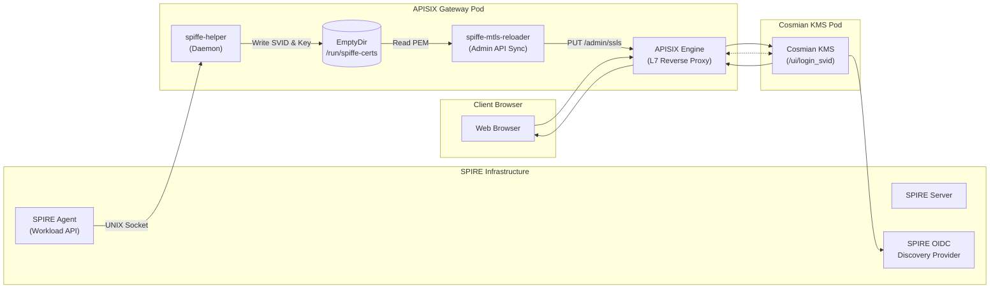
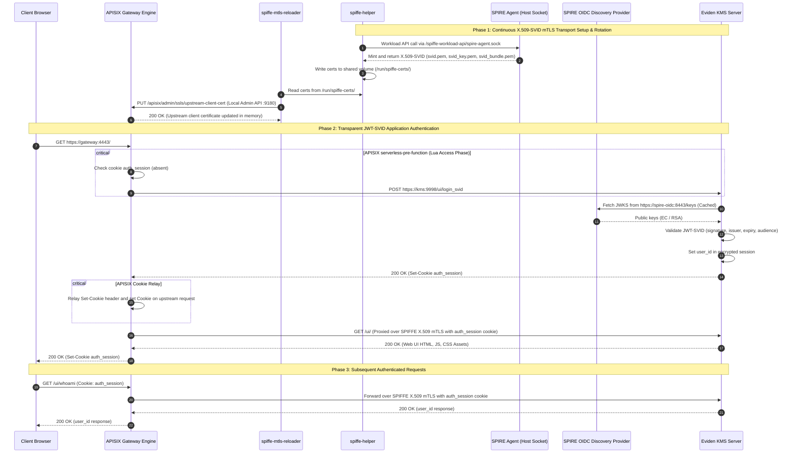

# Web UI SPIFFE Authentication & Ingress Gateway Architecture

Eviden KMS provides native zero-trust support for **SPIFFE** (Secure Production Identity Framework For Everyone) within browser and gateway environments. This architecture combines two distinct SPIFFE credentials to achieve end-to-end security without requiring individual user credential provisioning or local password databases:

1. **Hop Transport Security (X.509-SVID mTLS)**: Guarantees mutual cryptographic authentication and attestation between the Ingress Gateway (e.g., Apache APISIX or Envoy) and the KMS upstream.
2. **Workload / Application Identity (JWT-SVID)**: Establishes a verified, cookie-backed KMS session (`auth_session`) tied to a SPIFFE identity via the native `POST /ui/login_svid` endpoint.

---

## Architecture Overview



---

## Detailed Sequence Flow: X.509-SVID & JWT-SVID Transport

The lifecycle consists of three distinct phases: background X.509 rotation, initial transparent JWT-SVID session bootstrap, and subsequent authenticated browser requests.



---

## Security & Architectural Invariants

### 1. Transport-Layer Isolation (mTLS)

- **Credential**: X.509-SVID with SAN `spiffe://<trust-domain>/<gateway-service>`.
- **Rotation**: `spiffe-helper` acts as a sidecar alongside the ingress gateway, interacting with the SPIRE Agent through the Workload API UNIX domain socket.
- **Zero Reload**: Certificates are pushed to the APISIX Admin API dynamically, eliminating proxy downtime or connection drops during rotation.
- **Upstream Validation**: Cosmian KMS validates the client certificate against its trust bundle (`clients_ca_cert_file = "/etc/kms/certs/spire-bundle.crt"`).

### 2. Application-Layer Identity (JWT-SVID)

- **Credential**: JWT-SVID with `sub: spiffe://<trust-domain>/<gateway-identity>` and `aud: <kms-audience>`.
- **Validation**: KMS validates the token using its `--jwt-auth-provider` configuration pointed at the SPIRE OIDC Discovery Provider (`https://<spire-oidc>:<port>/keys`).
- **Session Boundary (BFF)**: The browser never receives or stores the raw JWT-SVID. The KMS issues an encrypted, `HttpOnly`, `SameSite=Lax` session cookie (`auth_session`).

### 3. Server Configuration Reference

In `kms.toml`:

```toml
[ui_config]
enable = true

[idp_auth]
jwt_auth_provider = [
  "https://<spire-oidc>:<port>,https://<spire-oidc>:<port>/keys,<kms-audience>"
]
jwt_svid_auth = true

[tls]
tls_cert_file = "/etc/kms/certs/tls.crt"
tls_key_file = "/etc/kms/certs/tls.key"
clients_ca_cert_file = "/etc/kms/certs/spire-bundle.crt"
```
