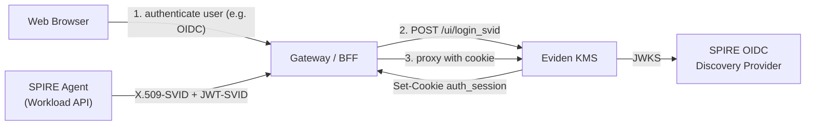

# Web UI SPIFFE Authentication via a Gateway/BFF

Eviden KMS can establish a Web UI session from a **SPIFFE JWT-SVID** posted by a trusted
gateway (or backend-for-frontend, BFF) to `POST /ui/login_svid`. Browsers cannot reach the SPIRE
Workload API, so the gateway is the component that holds SPIFFE credentials; the browser never
sees the JWT-SVID.

There is **no** login form or paste box for an SVID in the Web UI. A browser without a
session sees only an informational notice that the deployment uses SPIFFE sessions
established by a gateway.

!!! warning "A session is only as specific as the identity behind it"

    The session identity is the `sub` (`spiffe://<trust-domain>/<path>`) of the JWT-SVID that
    the gateway posts. If the gateway posts **its own** JWT-SVID whenever a browser has no
    cookie, every anonymous browser receives a session as **one shared SPIFFE identity**:
    there is no per-user authentication, authorization or audit. This is the same anti-pattern
    as forcing every client onto a single `admin` account (rejected in
    [ADR-2026-09-19](../adr/2026-09-19-spiffe-jwt-svid-authentication.md), ALT-003/ALT-004).
    The gateway **must authenticate the end user first** (for example OIDC at the gateway)
    and only then relay a session, ideally with an identity scoped to that user or group.

---

## Server behaviour

| Aspect | Behaviour |
|---|---|
| Enablement | `--jwt-svid-auth` (`[idp_auth] jwt_svid_auth = true`), global to all `--jwt-auth-provider` entries |
| Audience | Mandatory on every `--jwt-auth-provider` entry (server refuses to start otherwise); the SVID must carry a non-empty `aud` |
| Advertisement | `GET /ui/auth_method` lists `"SPIFFE"` in `auth_methods` (priority JWT > SPIFFE > AUTH_VERIFIER > CERT) |
| Session identity | Read by the UI via `GET /ui/whoami` |
| No session | The browser shows an informational notice, no form |

### `POST /ui/login_svid`

Request body:

```json
{ "jwt_svid": "<token>" }
```

| Status | Meaning |
|---|---|
| `200` | `{"next_step":"Authenticated"}`; the `auth_session` cookie is set |
| `401` | The SVID is invalid (bad signature, issuer, expiry, audience, or not a SPIFFE subject) |
| `500` | `--jwt-svid-auth` is not enabled, or the session could not be stored |

Rules applied by the endpoint:

- Only tokens whose `sub` starts with `spiffe://` are accepted. A token with an `email` claim
  but a non-SPIFFE `sub` is rejected.
- If validation fails, the JWKS is refreshed once and validation is retried, to cope with
  SPIRE key rotation.
- The full SPIFFE ID becomes the session `user_id`. The cookie (`auth_session`) is encrypted,
  `HttpOnly` and `SameSite=Lax`.

---

## Reference design (illustrative)

!!! note

    The components below (Apache APISIX, `spiffe-helper`, `spiffe-mtls-reloader`) are an
    **illustrative** deployment. They are not shipped or tested in this repository; only the
    KMS side (`/ui/login_svid`, `/ui/whoami`, `/ui/auth_method`) is implemented and covered here.
    Any gateway able to authenticate users and call the endpoint can be used.



```mermaid
sequenceDiagram
    autonumber
    participant Browser
    participant GW as Gateway / BFF
    participant OIDC as SPIRE OIDC Discovery Provider
    participant KMS as Eviden KMS

    Browser->>GW: GET / (no auth_session cookie)
    GW->>Browser: Authenticate the end user (e.g. OIDC login)
    Browser-->>GW: User authenticated
    GW->>KMS: POST /ui/login_svid {"jwt_svid": "..."}
    KMS->>OIDC: Fetch JWKS (cached; refreshed once on failure)
    OIDC-->>KMS: Public keys
    KMS->>KMS: Validate signature, issuer, expiry, audience, spiffe:// sub
    KMS-->>GW: 200 {"next_step":"Authenticated"} + Set-Cookie auth_session
    GW->>KMS: GET /ui/ (auth_session cookie)
    KMS-->>GW: Web UI assets
    GW-->>Browser: Web UI
    Browser->>GW: GET /ui/whoami
    GW->>KMS: Forward with cookie
    KMS-->>Browser: 200 {"user_id": "spiffe://..."}
```

### Transport (optional mTLS)

The gateway may connect to the KMS with an X.509-SVID
(`clients_ca_cert_file = "/etc/kms/certs/spire-bundle.crt"`). Client-certificate
authentication runs **before** the JWT middleware: if the presented certificate has a CN,
the request is authenticated as that CN and any JWT-SVID or session cookie is ignored. Use
CN-less client certificates, or separate listeners, if the SPIFFE session identity must win.

### Server configuration

```toml
[ui_config]
enable = true

[idp_auth]
jwt_auth_provider = [
  "https://<spire-oidc>:<port>,https://<spire-oidc>:<port>/keys,<kms-audience>"
]
jwt_svid_auth = true

[tls]
tls_cert_file = "/etc/kms/certs/tls.crt"
tls_key_file = "/etc/kms/certs/tls.key"
```
