# VMware vSphere VM Encryption with an External KMS

This guide explains how to protect your VMware vSphere infrastructure using **Cosmian KMS** as an external **Key Management Server (KMS)**, and walks you through the full setup:

1. [Why use an external KMS with vSphere?](#why-use-an-external-kms-with-vsphere)
2. [Architecture and security principles](#architecture-and-security-principles)
3. [What gets protected](#what-gets-protected)
4. [Setting up certificates](#1-generate-your-ca)
5. [Configuring the KMS server](#6-configure-the-kms-server-kmstoml)
6. [Connecting vCenter](#vcenter-integration)

---

## Why Use an External KMS with vSphere?

VMware vSphere supports three key provider types (since vSphere 6.5/7.0):

| Key Provider | Available Since | External KMS Required |
|---|---|---|
| **Standard Key Provider** | vSphere 6.5 | **Yes** (KMIP) |
| **Trusted Key Provider** | vSphere 7.0 | **Yes** (KMIP + vSphere Trust Authority) |
| **Native Key Provider** | vSphere 7.0 U2 | No (built-in, keys stored in vCenter) |

Using a **Standard Key Provider** backed by an external, dedicated KMS is the recommended approach for production environments and regulated industries because it provides:

- **Separation of duties**: encryption keys are stored in a dedicated, hardened system — completely separate from the compute infrastructure they protect. A compromised ESXi host or vCenter cannot expose the master keys.
- **Centralised key lifecycle management**: key creation, rotation, revocation, and auditing are managed in one place across all workloads.
- **Compliance readiness**: many frameworks (PCI-DSS, HIPAA, GDPR, SOC 2, FedRAMP) explicitly require that encryption keys be managed independently from the data they protect.
- **FIPS 140-3 compliance**: Cosmian KMS operates in FIPS 140-3 validated mode, satisfying the cryptographic requirements of the most demanding regulatory environments.
- **Zero-trust posture**: even with physical access to a storage array or datastore, data remains unintelligible without authorised key access from the KMS.

> **References**
>
> - [vSphere Security — Virtual Machine Encryption (Broadcom TechDocs, vSphere 7.0)](https://techdocs.broadcom.com/us/en/vmware-cis/vsphere/vsphere/7-0/vsphere-security-7-0/virtual-machine-encryption.html)
> - [Configuring and Managing a Standard Key Provider (vSphere 7.0)](https://techdocs.broadcom.com/us/en/vmware-cis/vsphere/vsphere/7-0/vsphere-security-7-0/virtual-machine-encryption/configuring-and-managing-a-standard-key-provider.html)
> - [vSphere Security Configuration Guide](https://core.vmware.com/security)
> - [KMIP 2.1 Specification (OASIS)](https://docs.oasis-open.org/kmip/kmip-spec/v2.1/os/kmip-spec-v2.1-os.html)

---

## Architecture and Security Principles

### Key Hierarchy

vSphere VM encryption uses a **two-level key hierarchy** to minimize key exposure:

| Key | Generated by | Stored | Purpose |
|---|---|---|---|
| **Key Encryption Key (KEK)** | External KMS (Cosmian) | KMS only | Wraps (encrypts) the DEK |
| **Data Encryption Key (DEK)** | ESXi host | With the VM (wrapped by KEK) | Encrypts VM disk I/O |

The KEK **never leaves the KMS in plaintext**. ESXi hosts receive the KEK transiently in memory to unwrap the DEK; neither key is ever persisted unprotected on the hypervisor or storage.

### Communication Flow

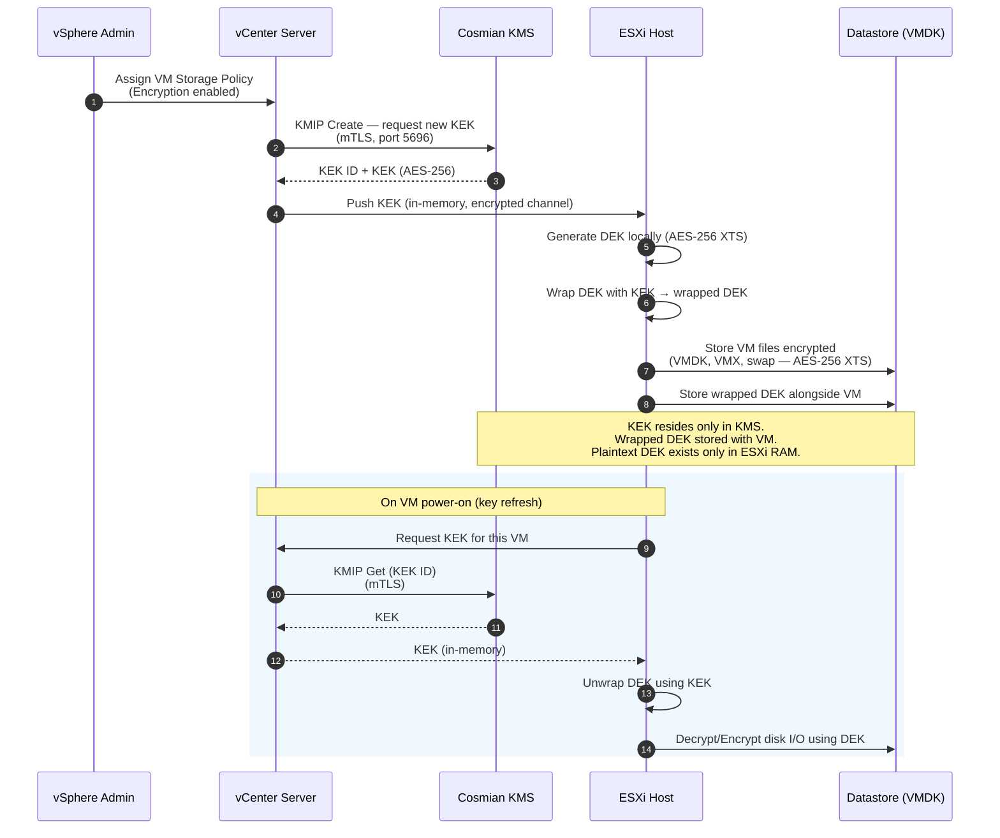

### Network Architecture

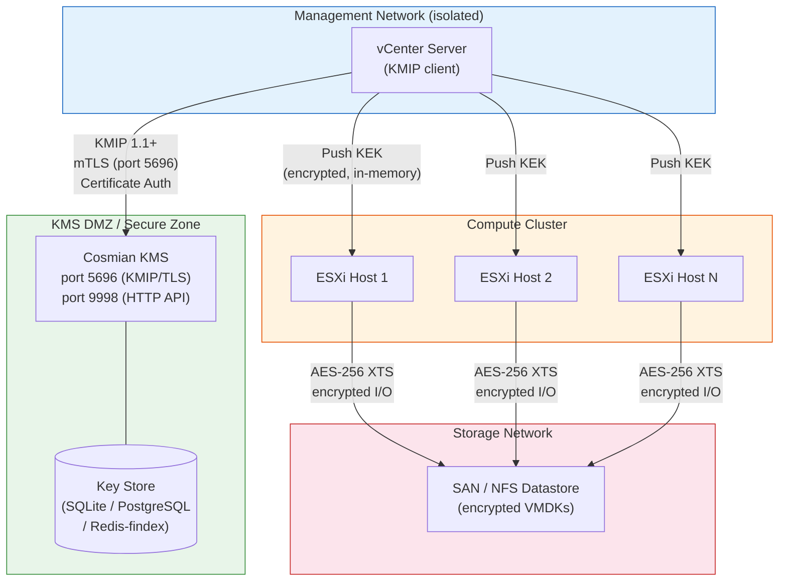

### Security Properties

| Property | How it is enforced |
|---|---|
| **Encryption at rest** | All VMDK files, VM swap files, VM core dumps, and the VM configuration (VMX) are encrypted with AES-256 XTS on the ESXi host before any write to the datastore |
| **Key separation** | KEK lives only inside Cosmian KMS; the ESXi host holds the plaintext DEK in RAM only for the duration of active I/O |
| **Mutual TLS (mTLS)** | Both vCenter and Cosmian KMS authenticate each other with X.509 certificates over every KMIP connection; no unauthenticated key request can succeed |
| **No keys on storage** | The datastore contains only the wrapped DEK (ciphertext); raw key material is never written to disk outside the KMS |
| **Audit trail** | Every KMIP operation (Create, Get, Activate, Revoke, Destroy) is logged by Cosmian KMS with timestamp, caller identity, and key ID |
| **Key rotation** | VMware supports re-keying VMs (shallow re-key: new KEK; deep re-key: new DEK + new KEK) without downtime on vSphere 7.0+ |
| **FIPS 140-3** | Cosmian KMS uses a FIPS 140-3 validated OpenSSL 3.x provider; all symmetric keys use AES-256; all asymmetric operations use NIST-approved curves |
| **Revocation / disaster recovery** | Revoking the KEK in Cosmian KMS immediately prevents any new VM power-on or vMotion, enabling a cryptographic kill-switch |

---

## What Gets Protected

### Encryption at Rest

When a VM Storage Policy with encryption is applied, the following objects are transparently encrypted:

- **VMDK files** (flat and sparse) — all disk data via AES-256 XTS
- **VM configuration file** (`.vmx`)
- **VM swap file** (`.vswp`) — prevents memory snooping via storage
- **VM core dump files** (`.vmss`, `.vmem`) — prevents key material leakage in snapshots and crash dumps
- **Snapshot delta disks** (`.vmdk` delta files created during snapshot)

> Items **not** encrypted by VM encryption: vSphere log files, NVRAM state, and the vSphere datastore catalogue itself. Use datastore-level encryption (vSAN Encryption or storage-array encryption) as a complement for full coverage.

### Encryption in Transit

All key material travels over **mutually authenticated TLS**:

- **vCenter ↔ KMS**: KMIP 1.1+ over TLS 1.2+, enforced by certificate pinning on both sides
- **vCenter ↔ ESXi**: key distribution uses the internal vSphere encrypted management channel
- **KMS API**: Cosmian KMS exposes its management API over HTTPS (TLS 1.2+); the KMIP socket server runs on a dedicated port (default 5696)

### Access Control

- Only vCenter Server (identified by its client certificate) can request keys from the KMS
- ESXi hosts never communicate directly with the KMS; they receive KEKs from vCenter through the authenticated management plane
- Cosmian KMS access control enforces per-key and per-user permissions; the vCenter service account should be granted the minimum set of KMIP operations (`Create`, `Get`, `Activate`, `Revoke`, `Locate`)

---

## Prerequisites

- OpenSSL (≥ 1.1.1) installed and on your PATH
- A working copy of `openssl.cnf` with a `[ v3_ca ]` section
- UNIX shell (bash, zsh, etc.)
- A directory to store your certificates, e.g., `/etc/ssl/{{ORG_NAME}}_certs`
- VMware vSphere: 6.5 or higher

---

## 1. Generate Your CA

Create a 2048-bit RSA private key for your CA, then issue a self-signed root certificate:

```bash
# 1. Generate CA private key
openssl genrsa -out ca.key 2048

# 2. Create self-signed CA certificate (10 year validity)
openssl req -x509 -nodes -days 3650 \
  -new -key ca.key \
  -out ca.crt \
  -config openssl.cnf \
  -extensions v3_ca \
  -subj "/C=<COUNTRY>/ST=<STATE>/L=<CITY>/O=<ORG_NAME>/OU=<UNIT>/CN=<CA_COMMON_NAME>"
```

- **`ca.key`**: CA private key (keep this highly secure!)
- **`ca.crt`**: Public root certificate, used to sign and verify downstream certificates

---

## 2. Generate Server Key & CSR

Create a new 2048-bit RSA key for your KMS server and a CSR including EKU extensions:

```bash
openssl req -newkey rsa:2048 -nodes \
  -keyout server.key \
  -out server.csr \
  -subj "/CN=<SERVER_COMMON_NAME>/O=<ORG_NAME>/C=<COUNTRY>" \
  -addext "keyUsage = digitalSignature, keyEncipherment" \
  -addext "extendedKeyUsage = clientAuth, serverAuth"
```

- **`server.key`**: Server's private key
- **`server.csr`**: Certificate Signing Request, with `clientAuth` & `serverAuth` EKUs

---

## 3. Sign the Server Certificate

Use your CA to sign the CSR, embedding the same EKU settings in the issued certificate:

```bash
openssl x509 -req \
  -in server.csr \
  -CA ca.crt -CAkey ca.key -CAcreateserial \
  -out server.crt \
  -days 365 \
  -extfile <(printf "[req_ext]\n\
keyUsage = digitalSignature,keyEncipherment\n\
extendedKeyUsage = clientAuth,serverAuth\n") \
  -extensions req_ext
```

- **`server.crt`**: The signed certificate, valid for 1 year

---

## 4. Verify the Certificate Extensions

Confirm that your certificate contains the correct EKU fields:

```bash
openssl x509 -in server.crt -text -noout | grep -A1 "Extended Key Usage"
```

Expected output:

```sh
            X509v3 Extended Key Usage:
                TLS Web Server Authentication, TLS Web Client Authentication
```

---

## 5. Export to PKCS#12

Bundle your server certificate, private key, and CA chain into a single `.p12` archive:

```bash
openssl pkcs12 -export \
  -in server.crt \
  -inkey server.key \
  -certfile ca.crt \
  -out server.p12 \
  -name "{{SERVER_ALIAS}}" \
  -passout pass:<P12_PASSWORD>
```

- **`server.p12`**: PKCS#12 archive containing your key and certificates
- **`<P12_PASSWORD>`**: Password to unlock the archive — use a strong secret!

---

## 6. Configure the KMS Server (`kms.toml`)

Below is a template `kms.toml`. Update file paths, usernames, and passwords as required:

```toml
# General Configuration
default_username = "<USERNAME>"
force_default_username = false
socket_server_start = true

[http]
port = 9998
hostname = "0.0.0.0"
# TLS configuration moved to [tls] section
# See the [tls] section below for certificate configuration
authority_cert_file = "/etc/ssl/{{ORG_NAME}}_certs/ca.crt"
```

Start the KMS with:

```bash
systemctl start cosmian_kms
```

---

## vCenter Integration

### Step 1: Go on your vCenter UI and add a Key Provider

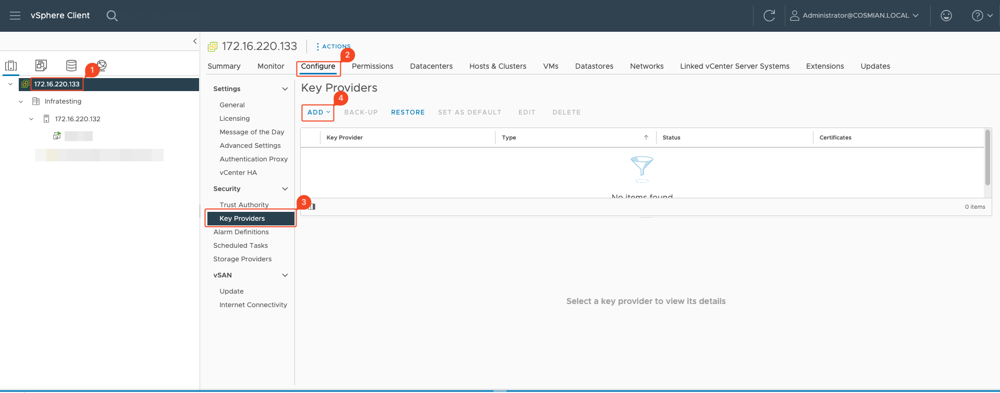

### Step 2: Add new Standard KMS Provider

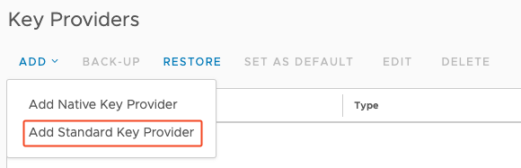

### Step 3: Set up your Standard Key Provider

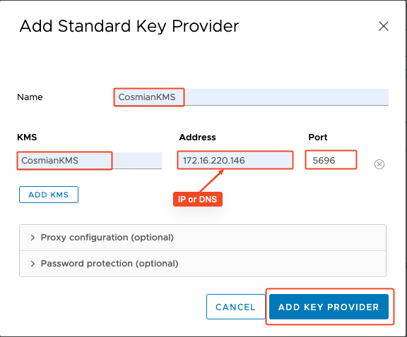

### Step 4: Trust the newly added Cosmian KMS

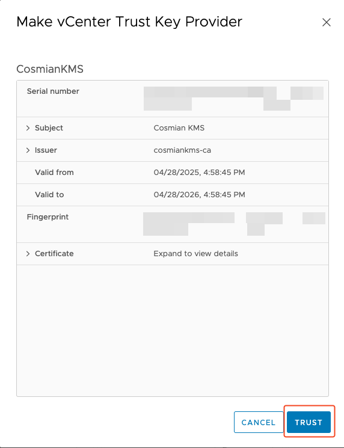

### Step 5: Establish Trust with the Cosmian KMS

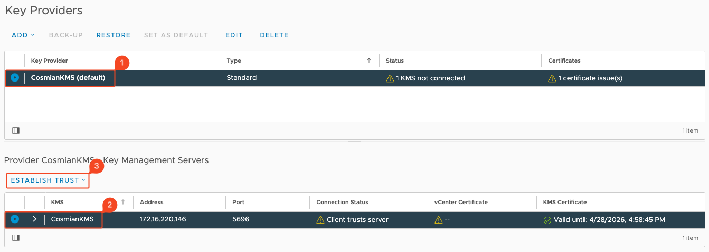

---

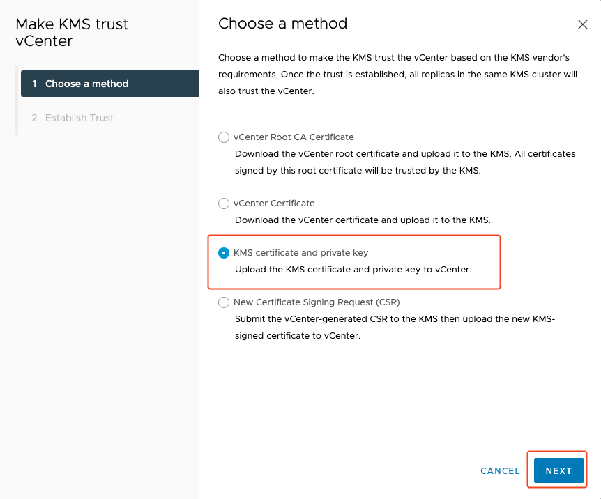

---
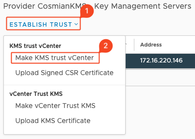

### Step 6: Go on the KMS server and get .crt and .key certificates

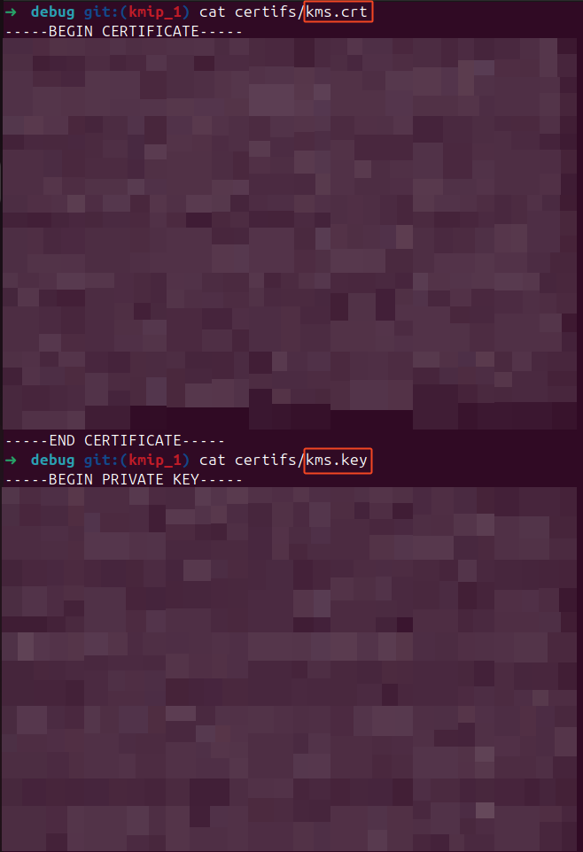

### Step 7: Upload KMS Credentials and establish trust

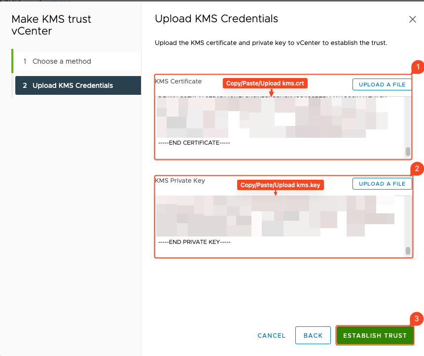

### Step 8: Your KMS is connected

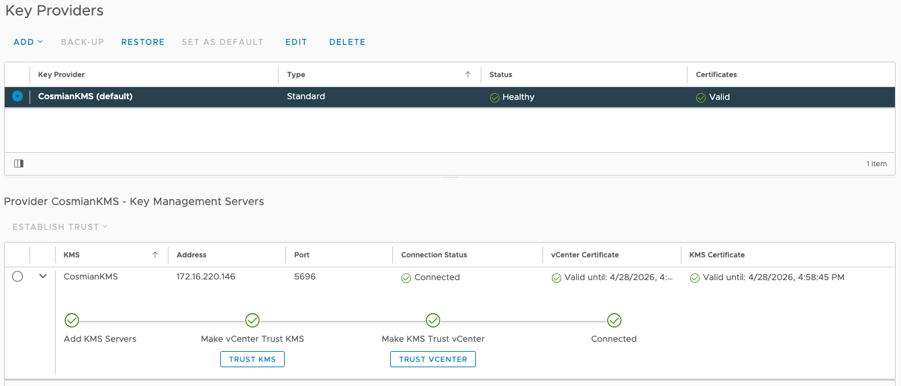

### Bonus: Encrypt your Virtual Machine

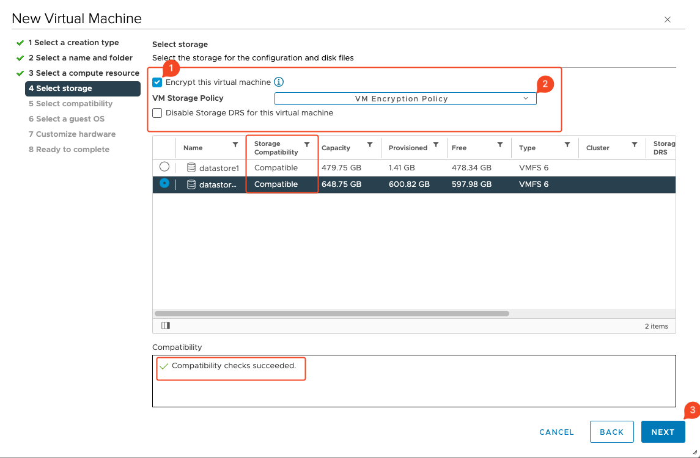

---

> _Keep all private keys secure and back up your CA key (`ca.key`) offline in an encrypted vault._
