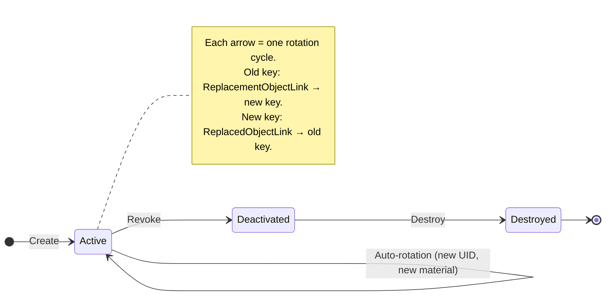
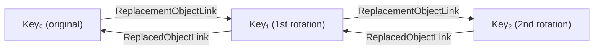
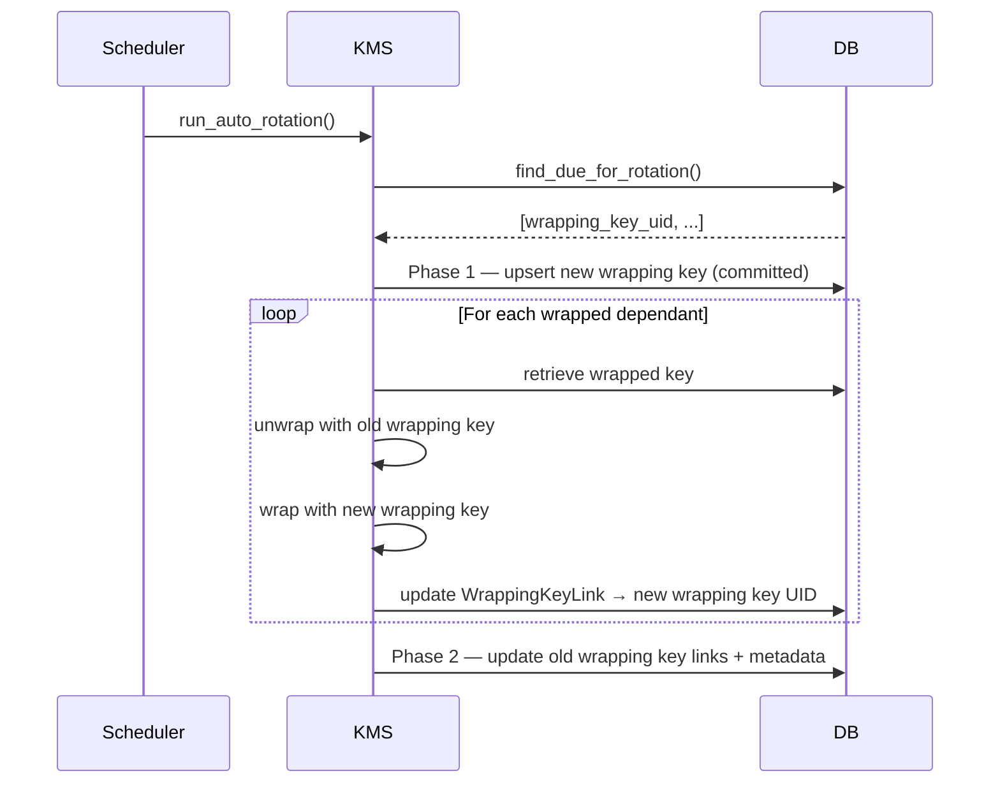
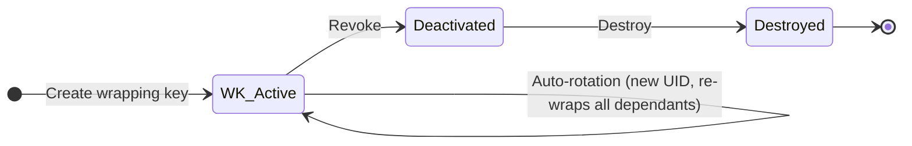
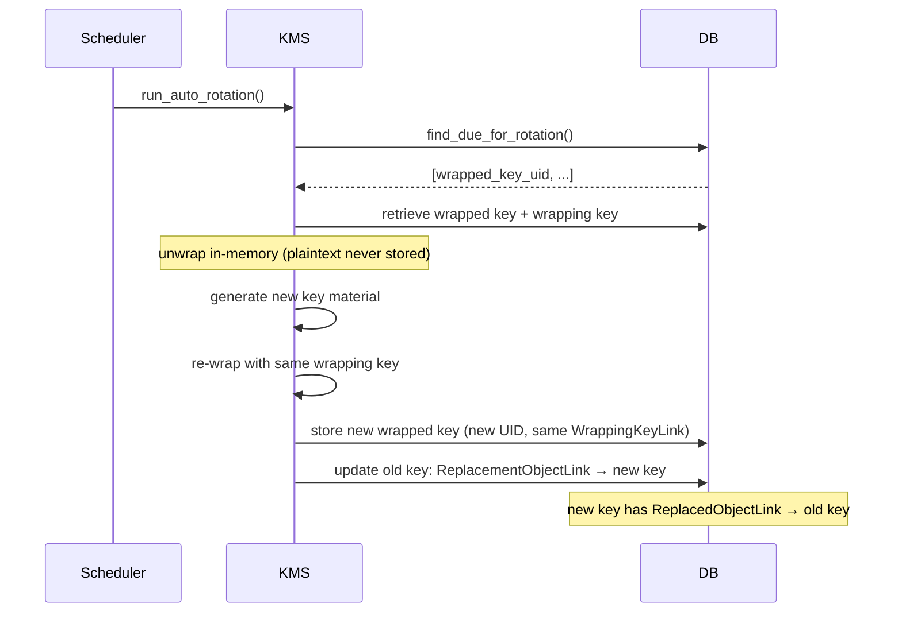
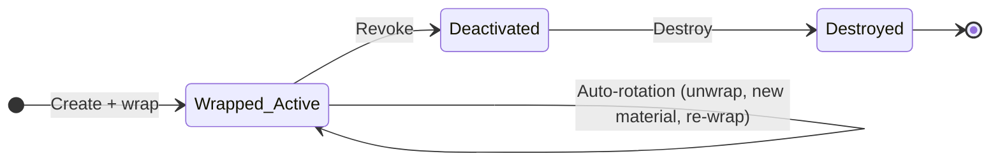
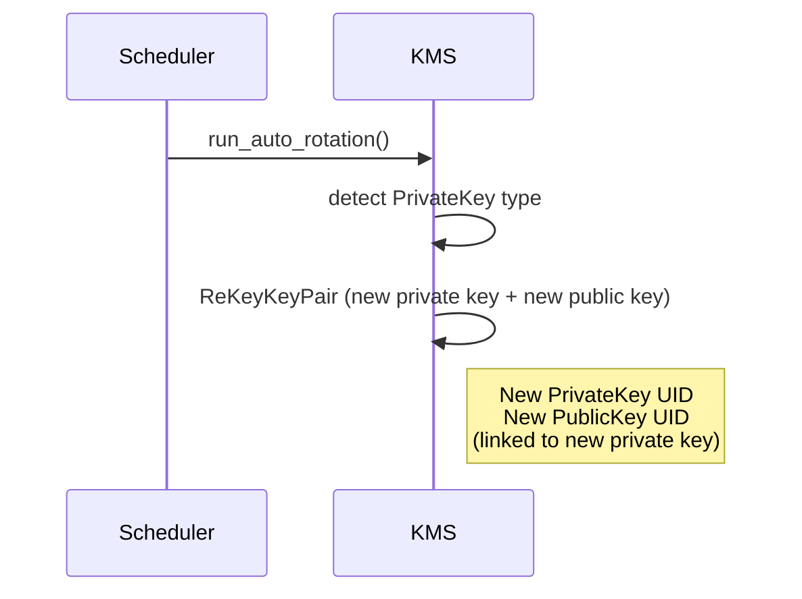
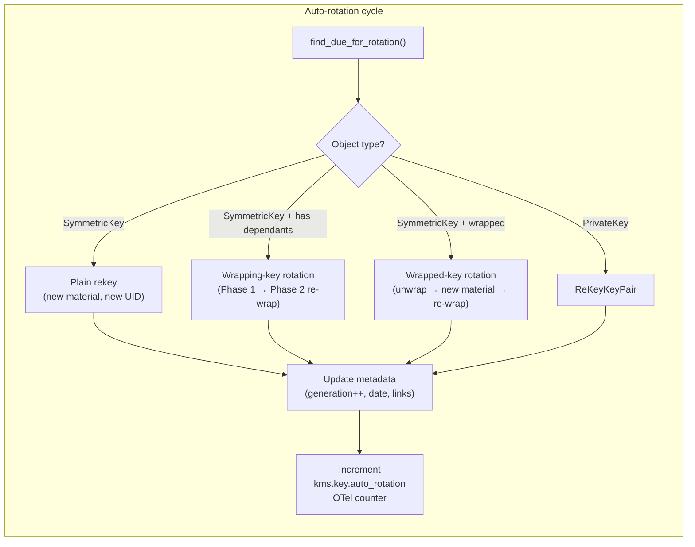

# Key Auto-Rotation Policy

Cosmian KMS supports **scheduled, policy-driven key rotation** for symmetric
keys and asymmetric key pairs.  Instead of requiring an operator to call the
`Re-Key` or `Re-Key Key Pair` KMIP operations manually, a per-key *rotation
policy* can be attached to any key object.  A background task then checks
periodically which keys are overdue and rotates them automatically.

---

## Rotation policy attributes

All rotation-policy state is stored as vendor-extension KMIP attributes on
the key object itself.  The following attributes are available:

| Attribute | Type | Description |
|---|---|---|
| `x-rotate-interval` | `u32` (seconds) | How often this key should be rotated. `0` disables auto-rotation. |
| `x-rotate-name` | `String` | Optional human-readable label for the policy (e.g. `"daily"`, `"annual"`). |
| `x-rotate-offset` | `u32` (seconds) | Shift the first rotation trigger by this many seconds after `Initial Date`. |
| `x-rotate-generation` | `u64` | Incremented on every rotation; `0` for never-rotated keys. |
| `x-rotate-date` | `datetime` | Timestamp of the last rotation; populated automatically after each rotation. |

Use the `SetAttribute` KMIP operation (or the `ckms sym keys set-rotation-policy`
CLI command) to configure these attributes on an existing key.

```bash
# Rotate the key every hour starting from its Initial Date
ckms sym keys set-rotation-policy \
    --key-id  <KEY_UID> \
    --interval 3600 \
    --name    "hourly"
```

---

> **⚠️ HSM-resident keys cannot be auto-rotated**
>
> Keys whose UID starts with `hsm::` are stored entirely inside the Hardware
> Security Module. The KMS has no ability to generate new key material inside
> the HSM, replace an existing HSM key, or migrate key material to a new UID.
> As a result:
>
> - `find_due_for_rotation` never returns HSM UIDs (they are not in the KMS
>   database), so the scheduler will never attempt to rotate them.
> - Calling `Re-Key` manually on an `hsm::` UID will fail.
> - Setting `x-rotate-interval` on an HSM key is unsupported and has no effect.
>
> To rotate an HSM key, use the vendor's own key-management tools
> (e.g. `softhsm2-util`, the Utimaco administration console, `pkcs11-tool`,
> etc.) and re-register the new key with the KMS server if needed.

---

## Server-side scheduler

The server's background cron thread runs an auto-rotation check at the
interval configured by the `--auto-rotation-check-interval-secs` server flag
(default: `0`, meaning disabled).

```bash
cosmian_kms --auto-rotation-check-interval-secs 300  # check every 5 minutes
```

On each check, the server queries all **Active** symmetric keys and private
keys owned by any user whose `x-rotate-interval` has elapsed since either
`x-rotate-date` (for previously-rotated keys) or `Initial Date + x-rotate-offset`
(for never-rotated keys with an initial date).

---

## Key types and rotation flows

The behaviour differs according to whether the key is plain, a wrapping key,
or a wrapped key.  Each case is described below with a lifecycle diagram.

---

### 1. Plain symmetric key (no wrapping)

A plain symmetric key carries only its own policy.  On rotation:

1. Fresh key material is generated (same algorithm and length).
2. The new key is assigned a new UUID.
3. A `ReplacedObjectLink` on the new key points back to the old key.
4. A `ReplacementObjectLink` on the old key points forward to the new key.
5. `x-rotate-generation` is incremented; `x-rotate-date` is set.



**KMIP link chain after two successive rotations:**



---

### 2. Wrapping key

A *wrapping key* is a symmetric key (or asymmetric public key) whose
`WrappingKeyLink` points to it from one or more *wrapped* keys.

When the wrapping key is rotated:

1. A new wrapping key is created (Phase 1 — committed immediately so it is
   available in the database).
2. Every **Active** key that references the old wrapping key via a
   `WrappingKeyLink` is re-wrapped with the new wrapping key (Phase 2).
3. Each wrapped key's `WrappingKeyLink` is updated to the new wrapping key
   UUID.
4. All standard rotation metadata (`ReplacementObjectLink`, generation counter,
   date) are applied to both the old and new wrapping key.



**State view:**



---

### 3. Wrapped key

A *wrapped key* is any key whose key block contains `KeyWrappingData`.  It
cannot simply be re-keyed in place because the new plaintext bytes must be
re-wrapped before storage.

Rotation flow:

1. The wrapped key is exported from the database and **unwrapped** in
   memory using the current wrapping key.
2. Fresh plaintext key material is generated from the unwrapped attributes.
3. The new key material is **re-wrapped** with the same wrapping key.
4. The resulting ciphertext is stored under a new UUID; the new key entry
   carries an active `WrappingKeyLink` pointing to the original wrapping key.
5. Standard rotation metadata is applied.



**State view:**



---

### 4. Asymmetric key pair (private key — plain)

For asymmetric keys managed via `Re-Key Key Pair`, the rotation target is the
**private key**.  The associated public key UID is carried in the private key's
`PublicKeyLink` attribute and is preserved in the new private key.



---

### 5. Wrapped private key (CoverCrypt)

A **CoverCrypt** private key that has been wrapped follows the same flow as any
other `PrivateKey` rotation: the `ReKeyKeyPair` (`rekey_keypair`) operation
unwraps the key in memory, rekeys the CoverCrypt partition, and stores a new
wrapped private key under a fresh UID.

> **Note on RSA / EC private keys**: auto-rotation of RSA and EC private keys
> via `ReKeyKeyPair` is not yet supported.  If a rotation policy is set on an
> RSA or EC private key, the scheduler will attempt rotation and log a warning
> instead of failing.

Setting a rotation policy attribute on a wrapped private key works in all
cases: the attribute is stored in the metadata column (not in the ciphertext
key block) and does not require the key to be unwrapped first.

```bash
# Works even when the private key is stored wrapped
ckms sym keys set-rotation-policy \
    --key-id <WRAPPED_PRIVATE_KEY_UID> \
    --interval 86400 \
    --name "nightly"
```

---

### 6. Server-wide key-encryption key (KEK)

The KMS server can be configured with a **key-encryption key** (`--key-encryption-key`
CLI flag or `key_encryption_key` in `kms.toml`).  When this option is set,
**every object stored in the KMS database is transparently wrapped** by the KEK
before being persisted.  The KEK is typically held in an HSM (SoftHSM2,
Utimaco, Proteccio, …).

Auto-rotation works exactly the same as for plain or wrapped keys: the scheduler
detects objects whose `x-rotate-interval` has elapsed, unwraps them using the
server KEK, generates fresh key material, re-wraps the new key, and stores it.
The operator **does not need to do anything special** to rotate a key stored in
a KEK-protected server.

Example server startup with SoftHSM2 and a KEK:

```bash
cosmian_kms \
  --database-type sqlite \
  --hsm-model softhsm2 \
  --hsm-slot 0 \
  --hsm-password 12345678 \
  --key-encryption-key "hsm::softhsm2::0::my-kek" \
  --auto-rotation-check-interval-secs 300
```

Setting a rotation policy on a wrapped key is identical to a plain key:

```bash
ckms sym keys set-rotation-policy \
    --key-id <KEY_UID> \
    --interval 3600 \
    --name "hourly"
```

The `SetAttribute` call succeeds even when the target key is wrapped (the
attribute is stored separately in the metadata column, not inside the
ciphertext).

---

## Interaction between key types during rotation



---

## Configuring auto-rotation end-to-end

### Step 1 — Set the rotation policy on a key

```bash
# Enable hourly rotation with a 60-second initial offset
ckms sym keys set-rotation-policy \
    --key-id  <KEY_UID>   \
    --interval 3600       \
    --offset   60         \
    --name     "hourly"
```

### Step 2 — Enable the server scheduler

In `kms.toml` (or on the command line):

```toml
auto_rotation_check_interval_secs = 300   # check every 5 minutes
```

### Step 3 — Observe rotations

The server emits an OpenTelemetry counter `kms.key.auto_rotation` labelled
with the `uid` and `algorithm` on every successful rotation.  Use your
OTel-compatible backend (Prometheus + Grafana, Datadog, …) to alert on
unexpected gaps in rotation activity.

---

## Disabling auto-rotation on a key

Set `x-rotate-interval` to `0`:

```bash
ckms sym keys set-rotation-policy --key-id <KEY_UID> --interval 0
```

---

## Revoking superseded (old) keys

After a rotation — whether triggered automatically by the scheduler or manually
via `Re-Key` — **the old key is not revoked automatically**.  Its state remains
`Active` so that any in-flight operations that still reference the old UID can
complete gracefully.  However, once all consumers have migrated to the new key,
the old key should be revoked to prevent further use and to accurately reflect
its lifecycle state.

> **How to find the old key UID**: the new key always carries a
> `ReplacedObjectLink` attribute pointing back to the old key UID.  Use
> `ckms objects get-attributes --key-id <NEW_KEY_UID>` or the *Attributes → Get*
> page in the Web UI to read that link.

### Using the CLI

The revoke sub-command lives under each key-type group and takes a free-text
revocation reason as its first positional argument:

```bash
# Symmetric key (old key superseded by rotation)
ckms sym keys revoke -k <OLD_KEY_UID> "Superseded"

# RSA or EC key pair (revokes both the private key and its linked public key)
ckms rsa keys revoke -k <OLD_KEY_UID> "Superseded"
ckms ec  keys revoke -k <OLD_KEY_UID> "Superseded"

# Post-quantum key pair
ckms pqc keys revoke -k <OLD_KEY_UID> "Superseded"

# Certificate
ckms certificates revoke -c <OLD_CERT_UID> "Superseded"
```

Once a key is in the `Deactivated` state it can still be exported by its owner
(with `--allow-revoked`), but it will be refused for all cryptographic
operations by any other user.

### Using the Web UI

1. Navigate to **Objects → Revoke** in the left-hand menu.
2. Enter the old key UID in the *Object ID* field.
3. Type a reason (e.g. `Superseded`) in the *Revocation Reason* field.
4. Click **Revoke**.

The object's state will change to `Deactivated` immediately.

---

## Interaction with KMIP attributes

The table below summarises which KMIP attributes are **added** or **updated**
when a key is rotated.

### Auto-rotation (cron-triggered)

| Attribute | Old key | New key |
|---|---|---|
| `Unique Identifier` | unchanged | fresh UUID |
| `Link[ReplacementObjectLink]` | → new key UID | — |
| `Link[ReplacedObjectLink]` | — | → old key UID |
| `Link[WrappingKeyLink]` | unchanged | copied from old key |
| `x-rotate-generation` | unchanged | old value + 1 |
| `x-rotate-date` | unchanged | timestamp of rotation |
| `x-rotate-interval` | **set to `0`** (disabled, so cron skips the old key in future runs) | **inherited** from old key (policy continues on the new key) |
| `x-rotate-name` | unchanged | inherited from old key |
| `x-rotate-offset` | unchanged | inherited from old key |
| `x-initial-date` | cleared | set to now (resets the baseline for the next rotation deadline) |
| `State` | Active | Active |
| `Cryptographic Algorithm` | unchanged | copied from old key |
| `Cryptographic Length` | unchanged | copied from old key |

### Manual rekey (user-triggered via `Re-Key` / `re-key` CLI)

When a user explicitly calls `Re-Key` (e.g. `ckms sym keys re-key --key-id <UID>`),
the semantics deliberately differ from auto-rotation:

| Attribute | Old key | New key |
|---|---|---|
| `x-rotate-interval` | **set to `0`** (disabled) | **`0`** (not inherited — user must re-arm the new key explicitly) |
| `x-rotate-generation` | unchanged | old value + 1 |
| `Link[ReplacementObjectLink]` | → new key UID | — |
| `Link[ReplacedObjectLink]` | — | → old key UID |

This asymmetry is intentional: a manual rekey is an out-of-cycle operator action
(e.g. for incident response), so the operator is expected to re-evaluate the
rotation policy for the new key rather than blindly inheriting the old schedule.

```bash
# After a manual rekey, re-arm the rotation policy on the new key:
ckms sym keys set-rotation-policy \
    --key-id  <NEW_KEY_UID> \
    --interval 3600 \
    --name    "hourly"
```
