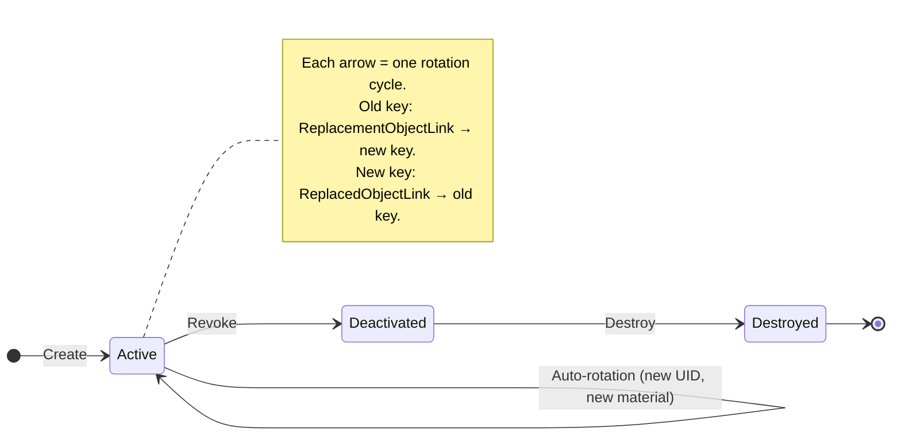
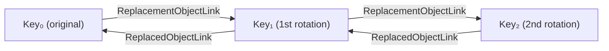
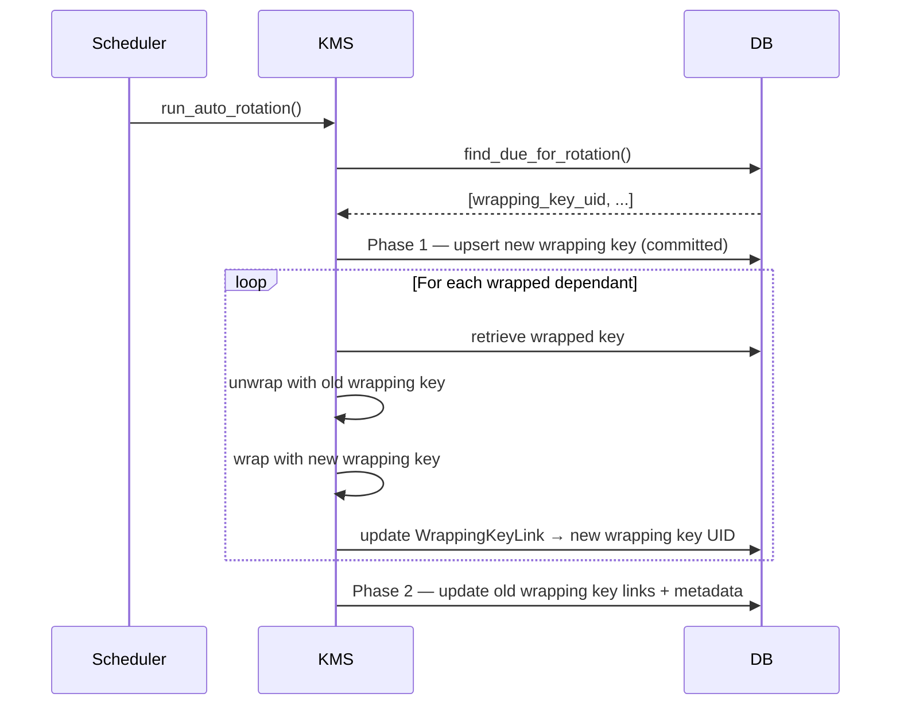
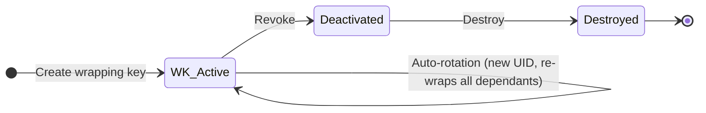
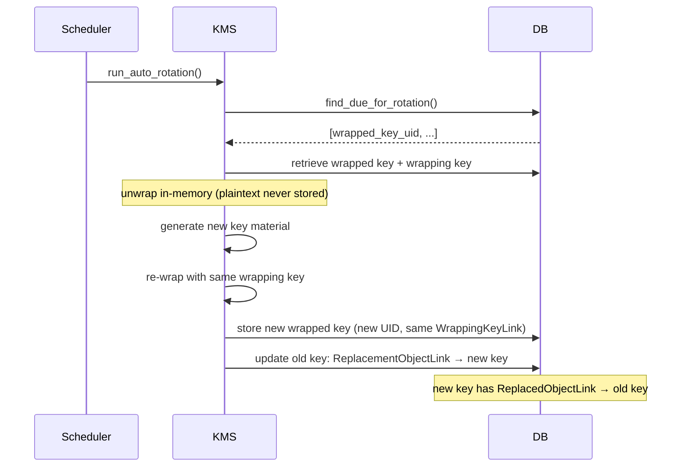
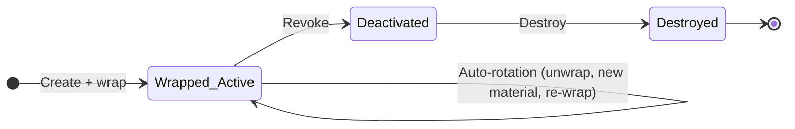
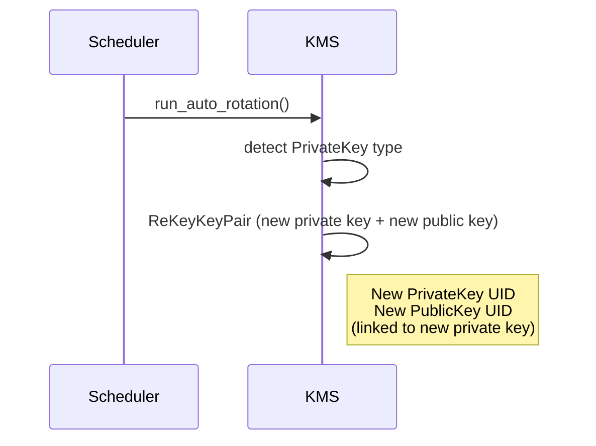
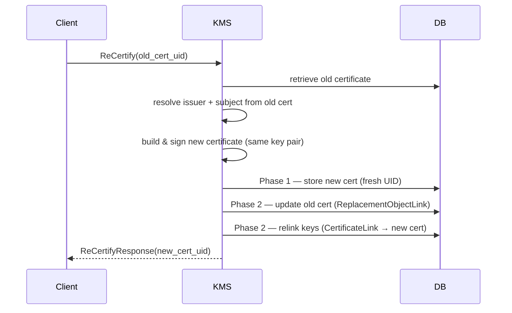
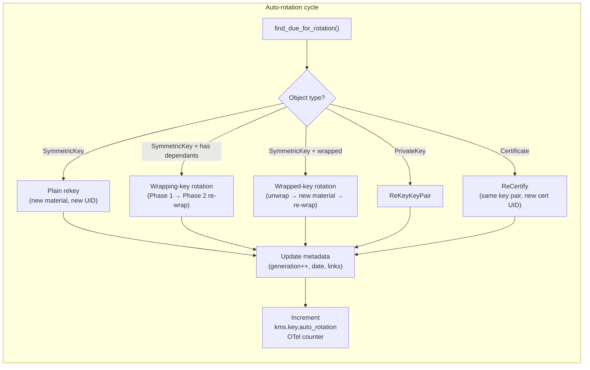

# Key Auto-Rotation Policy

Cosmian KMS supports **scheduled, policy-driven key rotation** for symmetric
keys and asymmetric key pairs.  Instead of requiring an operator to call the
`Re-Key`, `Re-Key Key Pair` or `ReCertify` KMIP operations manually, a per-key *rotation
policy* can be attached to any key object.  A background task then checks
periodically which keys are overdue and rotates them automatically.

---

## Rotation policy attributes

All rotation-policy state is stored as vendor-extension KMIP attributes on
the key object itself.  The following attributes are available:

| Attribute             | Type            | Description                                                                                                 | Mutable |
| --------------------- | --------------- | ----------------------------------------------------------------------------------------------------------- | ------- |
| `x-rotate-interval`   | `i64` (seconds) | How often this key should be rotated. `0` disables auto-rotation.                                           | Yes     |
| `x-rotate-name`       | `String`        | Name of the keyset this key belongs to (see [Keysets](#keysets)).                                           | Yes     |
| `x-rotate-offset`     | `i64` (seconds) | Shift the first rotation trigger by this many seconds after `Initial Date`.                                 | Yes     |
| `x-rotate-generation` | `i32`           | Incremented on every rotation; `0` for never-rotated keys. **Server-managed, read-only.**                   | No      |
| `x-rotate-date`       | `datetime`      | Timestamp of the last rotation; populated automatically after each rotation. **Server-managed, read-only.** | No      |
| `x-rotate-latest`     | `bool`          | `true` on the most-recent member of a keyset; `false` on all older (retired) members. **Server-managed, read-only.** | No |

> **Read-only attributes:** `x-rotate-generation` and `x-rotate-date` are set
> exclusively by the server during the `Re-Key` operation.  Any attempt to
> modify them via `AddAttribute`, `SetAttribute`, `ModifyAttribute`, or
> `DeleteAttribute` will be rejected with `Attribute_Read_Only`.
>
> These restrictions preserve two invariants that the scheduler and the
> rotation link-chain logic rely on:
>
> - **Monotonically increasing counter** — `x-rotate-generation` starts at `0`
>   for a never-rotated key and is incremented by exactly `1` on each successful
>   rotation.  Within a key-set (keys linked via `ReplacedObjectLink` /
>   `ReplacementObjectLink`), the generation number is therefore unique and
>   strictly increasing, which lets the scheduler and client tooling identify
>   the *current* key in a chain without inspecting every member.
> - **Authoritative last-rotation timestamp** — `x-rotate-date` is the only
>   reliable source for "when was this key last rotated".  The scheduler's
>   `is_due_for_rotation` function computes the next trigger as
>   `x-rotate-date + x-rotate-interval` (for previously-rotated keys) or as
>   `initial_date + x-rotate-offset + x-rotate-interval` (for never-rotated
>   keys with an initial date).  Any external modification to `x-rotate-date`
>   would cause the scheduler to fire too early, skip a scheduled rotation, or
>   produce an inconsistent link chain.

Use the `SetAttribute` KMIP operation (or the `ckms sym keys set-rotation-policy`
CLI command) to configure the mutable attributes on an existing key.

```bash
# Rotate the key every hour starting from its Initial Date
ckms sym keys set-rotation-policy \
    --key-id  <KEY_UID> \
    --interval 3600 \
    --name    "hourly"
```

---

> **ℹ️ HSM-resident keys support manual rotation but not auto-rotation**
>
> Keys whose UID starts with `hsm::` (e.g. `hsm::softhsm2::473094471::my-kek`)
> are managed by a PKCS#11-capable Hardware Security Module.
>
> | Capability | Supported | Notes |
> |---|---|---|
> | Manual `Re-Key` via KMIP | ✅ Yes | Calls `C_GenerateKey` on the same HSM slot; see [HSM key rotation and keysets](#hsm-key-rotation-and-keysets) |
> | Keyset membership (`x-rotate-name`) | ✅ Yes | Stored in `CKA_LABEL`; supports bare-name and `name@version` addressing |
> | Auto-rotation scheduler | ❌ No | `find_due_for_rotation` never returns HSM UIDs; the scheduler skips them |
> | `x-rotate-interval` | ✅ Yes | Writes `CKA_START_DATE` / `CKA_END_DATE` for validity tracking |
> | `x-rotate-offset` | ❌ No | Not applicable to PKCS#11 scheduling; rejected with `NotSupported` |

---

## Keysets

A **keyset** is a named group of related key generations.  Each generation is
a distinct cryptographic key (different key material, different UID for SQL
keys or different `key_id` suffix for HSM keys) produced by successive
`Re-Key` operations.  Keysets are supported for both SQL-backed and
HSM-resident keys.

### Assigning a key to a keyset

Set `x-rotate-name` via `SetAttribute` (or the CLI):

```bash
# SQL key
ckms sym keys set-rotation-policy --key-id <UID> --name "my-keyset"

# HSM key (same command — writes CKA_LABEL on the PKCS#11 object)
ckms sym keys set-rotation-policy --key-id "hsm::softhsm2::473094471::my-key" --name "my-keyset"
```

The first `SetAttribute` marks the key as generation `0` and `x-rotate-latest = true`.
Every subsequent `Re-Key` increments the generation, sets `x-rotate-latest = true`
on the new key, and sets `x-rotate-latest = false` on the old key.

### Keyset addressing syntax

A keyset can be referenced by name instead of a specific UID:

| Syntax | Resolves to |
|---|---|
| `my-keyset` (bare name) | Latest generation (`x-rotate-latest = true`) |
| `my-keyset@latest` | Latest generation (explicit) |
| `my-keyset@first` or `my-keyset@0` | Generation 0 (the original key) |
| `my-keyset@N` | Generation N |

Keyset names are accepted wherever a `UniqueIdentifier` is expected: `Encrypt`,
`Decrypt`, `Sign`, `Verify`, `Get`, `GetAttributes`, `Re-Key`, etc.

**Encrypt / Sign** resolves to the latest generation.
**Decrypt / Verify** walks the chain newest-to-oldest, trying each generation
until one succeeds.  This lets in-flight ciphertexts produced with an older
key continue to decrypt after rotation.

### Non-latest guard

Only the **latest generation** of a keyset can be rotated via `Re-Key`.  Attempting
to re-key a retired (non-latest) member is rejected:

```text
Invalid Request: ReKey: key '<uid>' is not the latest in its keyset —
only the latest generation can be rotated
```

This prevents accidentally branching the rotation chain.  Keys that do not
belong to any keyset (no `x-rotate-name`) are not subject to this restriction.

### SQL keyset internals

For SQL-backed keys the keyset state is stored as KMIP vendor attributes in the
database:

- `x-rotate-name` — the keyset name (set once, inherited by each successive generation)
- `x-rotate-generation` — integer, starts at `0`, incremented per `Re-Key`
- `x-rotate-latest` — `true` on the current key; `false` on all older keys

The rotation chain is also reflected in KMIP link attributes:
`ReplacementObjectLink` (old → new) and `ReplacedObjectLink` (new → old).
These back-pointers allow clients to traverse the full history.

---

## HSM key rotation and keysets

HSM-resident keys **fully support manual rotation via the `Re-Key` KMIP
operation** and the keyset feature.  The background auto-rotation scheduler
does not apply to HSM keys (see note above).

### CKA_LABEL convention

HSM keyset metadata is stored entirely in the PKCS#11 `CKA_LABEL` attribute —
no SQL shadow rows are written.

| CKA_LABEL value                   | Meaning                            |
| --------------------------------- | ---------------------------------- |
| `{name}::{gen}::{base_id}::latest` | Current (newest) key in the keyset |
| `{name}::{gen}::{base_id}`        | Retired (older) key in the keyset  |
| *(anything else)*                 | Key does not belong to a keyset    |

- `name` — the value set via `SetAttribute x-rotate-name`
- `gen` — integer starting at `0`, incremented on every `Re-Key`
- `base_id` — the original PKCS#11 `CKA_ID` of the gen-0 key

### UID generation scheme

```text
hsm::<slot_id>::<key_id>        ← gen 0 (original key)
hsm::<slot_id>::<key_id>::1     ← gen 1 (after first Re-Key)
hsm::<slot_id>::<key_id>::2     ← gen 2 (after second Re-Key)
```

The numeric suffix is appended to the original `key_id`; the base name is
never changed.  The full chain can therefore be discovered by inspecting
`CKA_LABEL` on the HSM slot.

### Keyset resolution for HSM keys

When a bare keyset name (e.g. `my-hsm-keyset`) or `name@version` syntax is
used, the server calls `find_by_rotate_name` which scans PKCS#11 objects in the
HSM slot and filters by `CKA_LABEL` prefix.  Results are sorted by generation
(descending).  For `Decrypt`, each generation is tried in order until one
succeeds.

Unlike SQL-backed keys, HSM keysets do **not** use
`ReplacedObjectLink`/`ReplacementObjectLink` back-pointers; all state lives in
PKCS#11 attributes.

### Example workflow

```bash
# 1. Create an AES-256 key directly on the HSM (legacy UID format)
ckms sym keys create \
    --key-id "hsm::473094471::my-hsm-key" \
    --algorithm aes --length 256

# 2. Register the key in a keyset (writes CKA_LABEL = "my-keyset::0::my-hsm-key::latest")
ckms sym keys set-rotation-policy \
    --key-id "hsm::473094471::my-hsm-key" \
    --name   "my-hsm-keyset"

# 3. Encrypt using the keyset bare name (resolves to the latest key)
ckms sym encrypt --key-id "my-hsm-keyset" plaintext.bin

# 4. Rotate: C_GenerateKey on the same HSM slot; updates CKA_LABEL on both keys
ckms sym keys rekey --key-id "hsm::473094471::my-hsm-key"
# → new UID: hsm::473094471::my-hsm-key::1
# CKA_LABEL (gen-0): "my-keyset::0::my-hsm-key"          (retired)
# CKA_LABEL (gen-1): "my-keyset::1::my-hsm-key::latest"  (current)

# 5. Decrypt old ciphertext: keyset tries gen-1 then gen-0 automatically
ckms sym decrypt --key-id "my-hsm-keyset" ciphertext.enc

# 6. Second rotation
ckms sym keys rekey --key-id "hsm::473094471::my-hsm-key::1"
# → new UID: hsm::473094471::my-hsm-key::2

# Attempting to re-key a retired generation is rejected:
ckms sym keys rekey --key-id "hsm::473094471::my-hsm-key"   # gen-0 — REJECTED
# Error: not the latest in its keyset
```

---

## Server-side scheduler

The server's background cron thread runs an auto-rotation check at the
interval configured by the `--auto-rotation-check-interval-secs` server flag
(default: `0`, meaning disabled).

```bash
cosmian_kms --auto-rotation-check-interval-secs 300  # check every 5 minutes
```

On each check, the server queries all **Active** symmetric keys and private
keys owned by any user whose `x-rotate-interval` has elapsed since either
`x-rotate-date` (for previously-rotated keys) or `Initial Date + x-rotate-offset`
(for never-rotated keys with an initial date).

---

## State restrictions

Only keys (or certificates) in the **Active** or **Deactivated** state can be
rotated.  Attempting to call `Re-Key`, `Re-Key Key Pair`, or `ReCertify` on an
object in any other state will produce an error:

| State                     | Rotation allowed? | Rationale                                                                                             |
| ------------------------- | ----------------- | ----------------------------------------------------------------------------------------------------- |
| **Active**                | ✅ Yes             | The primary valid source state for rotation.                                                          |
| **Deactivated**           | ✅ Yes             | KMIP §6.1.46 does not list `Wrong_Key_Lifecycle_State` — a deactivated key may produce a replacement. |
| **Pre-Active**            | ❌ No              | The key has never been activated — rotating unused material is premature.                             |
| **Compromised**           | ❌ No              | Rotating a compromised key would create confusion about trust lineage.                                |
| **Destroyed**             | ❌ No              | The object no longer exists.                                                                          |
| **Destroyed_Compromised** | ❌ No              | The object no longer exists.                                                                          |

> **Note:** This restriction applies to the **source** key only.  The *output*
> of a rotation operation can still enter the `Pre-Active` state when an
> `Offset > 0` is supplied in the request (the new key's `Activation Date` is
> computed as `Initial Date + Offset`, scheduling future activation).

---

## Auto-deactivation (KMIP §4.57 transition 6)

Per KMIP §4.57 state transition 6, the server **automatically transitions** an
Active key to the Deactivated state when its `Deactivation Date` is reached.
This happens on retrieval (the same mechanism as PreActive → Active
auto-activation).  There is no need for an explicit `Revoke` call — setting a
`Deactivation Date` in the future schedules the deactivation.

---

## Key types and rotation flows

The behaviour differs according to whether the key is plain, a wrapping key,
or a wrapped key.  Each case is described below with a lifecycle diagram.

---

### 1. Plain symmetric key (no wrapping)

A plain symmetric key carries only its own policy.  On rotation:

1. Fresh key material is generated (same algorithm and length).
2. The new key is assigned a new UUID.
3. A `ReplacedObjectLink` on the new key points back to the old key.
4. A `ReplacementObjectLink` on the old key points forward to the new key.
5. `x-rotate-generation` is incremented; `x-rotate-date` is set.


```mermaid
stateDiagram-v2
    direction LR
    [*] --> Active : Create
    Active --> Active : Auto-rotation (new UID, new material)
    Active --> Deactivated : Revoke
    Deactivated --> Destroyed : Destroy
    Destroyed --> [*]

    note right of Active
        Each arrow = one rotation cycle.
        Old key: ReplacementObjectLink → new key.
        New key: ReplacedObjectLink → old key.
    end note
```

**KMIP link chain after two successive rotations:**


```mermaid
flowchart LR
    K0["Key₀ (original)"] -->|ReplacementObjectLink| K1["Key₁ (1st rotation)"]
    K1 -->|ReplacementObjectLink| K2["Key₂ (2nd rotation)"]
    K2 -->|ReplacedObjectLink| K1
    K1 -->|ReplacedObjectLink| K0
```

---

### 2. Wrapping key

A *wrapping key* is a symmetric key (or asymmetric public key) whose
`WrappingKeyLink` points to it from one or more *wrapped* keys.

When the wrapping key is rotated:

1. A new wrapping key is created (Phase 1 — committed immediately so it is
   available in the database).
2. Every **Active** key that references the old wrapping key via a
   `WrappingKeyLink` is re-wrapped with the new wrapping key (Phase 2).
3. Each wrapped key's `WrappingKeyLink` is updated to the new wrapping key
   UUID.
4. All standard rotation metadata (`ReplacementObjectLink`, generation counter,
   date) are applied to both the old and new wrapping key.


```mermaid
sequenceDiagram
    participant Scheduler
    participant KMS
    participant DB

    Scheduler->>KMS: run_auto_rotation()
    KMS->>DB: find_due_for_rotation()
    DB-->>KMS: [wrapping_key_uid, ...]
    KMS->>DB: Phase 1 — upsert new wrapping key (committed)
    loop For each wrapped dependant
        KMS->>DB: retrieve wrapped key
        KMS->>KMS: unwrap with old wrapping key
        KMS->>KMS: wrap with new wrapping key
        KMS->>DB: update WrappingKeyLink → new wrapping key UID
    end
    KMS->>DB: Phase 2 — update old wrapping key links + metadata
```

**State view:**


```mermaid
stateDiagram-v2
    direction LR
    [*] --> WK_Active : Create wrapping key
    WK_Active --> WK_Active : Auto-rotation (new UID, re-wraps all dependants)
    WK_Active --> Deactivated : Revoke
    Deactivated --> Destroyed : Destroy
    Destroyed --> [*]
```

---

### 3. Wrapped key

A *wrapped key* is any key whose key block contains `KeyWrappingData`.  It
cannot simply be re-keyed in place because the new plaintext bytes must be
re-wrapped before storage.

Rotation flow:

1. The wrapped key is exported from the database and **unwrapped** in
   memory using the current wrapping key.
2. Fresh plaintext key material is generated from the unwrapped attributes.
3. The new key material is **re-wrapped** with the same wrapping key.
4. The resulting ciphertext is stored under a new UUID; the new key entry
   carries an active `WrappingKeyLink` pointing to the original wrapping key.
5. Standard rotation metadata is applied.


```mermaid
sequenceDiagram
    participant Scheduler
    participant KMS
    participant DB

    Scheduler->>KMS: run_auto_rotation()
    KMS->>DB: find_due_for_rotation()
    DB-->>KMS: [wrapped_key_uid, ...]
    KMS->>DB: retrieve wrapped key + wrapping key

    Note over KMS: unwrap in-memory (plaintext never stored)
    KMS->>KMS: generate new key material
    KMS->>KMS: re-wrap with same wrapping key

    KMS->>DB: store new wrapped key (new UID, same WrappingKeyLink)
    KMS->>DB: update old key: ReplacementObjectLink → new key
    Note over DB: new key has ReplacedObjectLink → old key
```

**State view:**


```mermaid
stateDiagram-v2
    direction LR
    [*] --> Wrapped_Active : Create + wrap
    Wrapped_Active --> Wrapped_Active : Auto-rotation (unwrap, new material, re-wrap)
    Wrapped_Active --> Deactivated : Revoke
    Deactivated --> Destroyed : Destroy
    Destroyed --> [*]
```

---

### 4. Asymmetric key pair (private key — plain)

For asymmetric keys managed via `Re-Key Key Pair`, the rotation target is the
**private key**.  The associated public key UID is carried in the private key's
`PublicKeyLink` attribute and is preserved in the new private key.


```mermaid
sequenceDiagram
    participant Scheduler
    participant KMS

    Scheduler->>KMS: run_auto_rotation()
    KMS->>KMS: detect PrivateKey type
    KMS->>KMS: ReKeyKeyPair (new private key + new public key)
    note right of KMS: New PrivateKey UID<br/>New PublicKey UID<br/>(linked to new private key)
```

---

### 5. Wrapped private key (Covercrypt)

A **Covercrypt** master private key and user decryption key that have been wrapped follows the same flow as any
other `PrivateKey` rotation: the `ReKeyKeyPair` (`rekey_keypair`) operation
unwraps the key in memory, rekeys the Covercrypt partition, and stores a new
wrapped private key under a fresh UID.

Setting a rotation policy attribute on a wrapped private key works in all
cases: the attribute is stored in the metadata column (not in the ciphertext
key block) and does not require the key to be unwrapped first.

```bash
# Works even when the private key is stored wrapped
ckms sym keys set-rotation-policy \
    --key-id <WRAPPED_PRIVATE_KEY_UID> \
    --interval 86400 \
    --name "nightly"
```

---

### 6. Certificate renewal (`ReCertify`)

Certificate renewal creates a **new certificate for the same key pair** — no
new key material is generated.  The KMIP `ReCertify` operation (§6.1.45)
assigns a fresh UID to the renewed certificate and links old → new via the
standard `ReplacementObjectLink` / `ReplacedObjectLink` pair.

#### Standards and RFCs

| Standard                                                                                                   | Title                                                      | Relevance                                                                                                                                                                |
| ---------------------------------------------------------------------------------------------------------- | ---------------------------------------------------------- | ------------------------------------------------------------------------------------------------------------------------------------------------------------------------ |
| [KMIP 2.1 §6.1.45](https://docs.oasis-open.org/kmip/kmip-spec/v2.1/os/kmip-spec-v2.1-os.html#_Toc57115677) | Re-certify operation                                       | Normative definition: request/response payload, attribute handling, link semantics                                                                                       |
| [RFC 4210](https://www.rfc-editor.org/rfc/rfc4210.html)                                                    | Internet X.509 PKI — Certificate Management Protocol (CMP) | Defines `kur` (Key Update Request, §5.3.5) / `kup` (Key Update Response, §5.3.6) for certificate renewal over the wire. KMIP `ReCertify` is the KMS-internal equivalent. |
| [RFC 4211](https://www.rfc-editor.org/rfc/rfc4211.html)                                                    | Internet X.509 CRMF (Certificate Request Message Format)   | §6.5 "OldCert ID Control" — identifies the certificate being renewed in a CMP request                                                                                    |
| [RFC 5280](https://www.rfc-editor.org/rfc/rfc5280.html)                                                    | Internet X.509 PKI — Certificate and CRL Profile           | Defines X.509v3 certificate structure, extensions, validity periods                                                                                                      |
| [RFC 2986](https://www.rfc-editor.org/rfc/rfc2986.html)                                                    | PKCS#10: Certification Request Syntax                      | CSR format supported by KMIP `CertificateRequestType`                                                                                                                    |
| [RFC 5272](https://www.rfc-editor.org/rfc/rfc5272.html)                                                    | Certificate Management over CMS (CMC)                      | Alternative certificate lifecycle protocol                                                                                                                               |

#### Relationship between CMP and KMIP ReCertify

In the CMP protocol (RFC 4210), a client sends a **Key Update Request** (`kur`,
body tag [7]) to a CA to obtain a renewed certificate for an existing key pair.
The CA responds with a **Key Update Response** (`kup`, body tag [8]) containing
the new certificate.

In Cosmian KMS, the server acts as both the CA and the key/certificate store.
The `ReCertify` KMIP operation performs the equivalent of a CMP `kur`/`kup`
exchange locally: it re-signs the certificate for the same subject and key pair,
assigns a fresh UID, and manages replacement links — all in a single atomic
database transaction.

#### Rotation flow

1. The existing certificate is retrieved and its issuer/subject are resolved.
2. A new certificate is built and signed (same key pair, same issuer).
3. The new certificate is assigned a fresh UID.
4. `ReplacedObjectLink` on the new certificate → old certificate.
5. `ReplacementObjectLink` on the old certificate → new certificate.
6. Keys linked to the old certificate have their `CertificateLink` updated
   to point to the new certificate.
7. Rotation metadata (`x-rotate-generation`, `x-rotate-date`) is set.


```mermaid
sequenceDiagram
    participant Client
    participant KMS
    participant DB

    Client->>KMS: ReCertify(old_cert_uid)
    KMS->>DB: retrieve old certificate
    KMS->>KMS: resolve issuer + subject from old cert
    KMS->>KMS: build & sign new certificate (same key pair)
    KMS->>DB: Phase 1 — store new cert (fresh UID)
    KMS->>DB: Phase 2 — update old cert (ReplacementObjectLink)
    KMS->>DB: Phase 2 — relink keys (CertificateLink → new cert)
    KMS-->>Client: ReCertifyResponse(new_cert_uid)
```

#### Attribute handling (KMIP 2.1 §6.1.45 Table 299)

| Attribute                     | New certificate         | Old certificate         |
| ----------------------------- | ----------------------- | ----------------------- |
| `Unique Identifier`           | Fresh UUID              | Unchanged               |
| `Initial Date`                | Set to current time     | Unchanged               |
| `Link[ReplacedObjectLink]`    | → old cert UID          | —                       |
| `Link[ReplacementObjectLink]` | —                       | → new cert UID          |
| `Link[PublicKeyLink]`         | Preserved from old cert | Unchanged               |
| `Link[PrivateKeyLink]`        | Preserved from old cert | Unchanged               |
| `Name`                        | Inherited from old cert | Removed (per KMIP spec) |
| `State`                       | Active                  | Active                  |
| `x-rotate-generation`         | old value + 1           | Unchanged               |
| `x-rotate-date`               | Current timestamp       | Unchanged               |
| `Destroy Date`                | Not set                 | Unchanged               |
| `Revocation Reason`           | Not set                 | Unchanged               |

#### Key differences from key rotation

| Aspect                  | Key rotation (`ReKey` / `ReKeyKeyPair`)    | Certificate renewal (`ReCertify`) |
| ----------------------- | ------------------------------------------ | --------------------------------- |
| New material generated? | Yes (new key bytes)                        | No (same key pair)                |
| Wrapping involved?      | Yes (if key was wrapped)                   | Never                             |
| Dependants re-wrapped?  | Yes (for wrapping keys)                    | No — keys are *relinked* instead  |
| KMIP operation          | `Re-Key` (0x0A) / `Re-Key Key Pair` (0x0B) | `Re-Certify` (0x07)               |

#### CLI usage

Certificate renewal is invoked via the `ckms certificates certify` command with
the `--certificate-id-to-re-certify` flag:

```bash
# Renew an existing certificate (same key pair, new validity period)
ckms certificates certify \
    --certificate-id-to-re-certify <OLD_CERT_UID> \
    --issuer-private-key-id <ISSUER_SK_UID> \
    --days 365

# Self-signed certificate renewal (issuer = subject)
ckms certificates certify \
    --certificate-id-to-re-certify <OLD_CERT_UID> \
    --days 3650
```

---

### 7. Server-wide key-encryption key (KEK)

The KMS server can be configured with a **key-encryption key** (`--key-encryption-key`
CLI flag or `key_encryption_key` in `kms.toml`).  When this option is set,
**every object stored in the KMS database is transparently wrapped** by the KEK
before being persisted.  The KEK is typically held in an HSM (SoftHSM2,
Utimaco, Proteccio, …).

Auto-rotation works exactly the same as for plain or wrapped keys: the scheduler
detects objects whose `x-rotate-interval` has elapsed, unwraps them using the
server KEK, generates fresh key material, re-wraps the new key, and stores it.
The operator **does not need to do anything special** to rotate a key stored in
a KEK-protected server.

Example server startup with SoftHSM2 and a KEK:

```bash
cosmian_kms \
  --database-type sqlite \
  --hsm-model softhsm2 \
  --hsm-slot 0 \
  --hsm-password 12345678 \
  --key-encryption-key "hsm::softhsm2::0::my-kek" \
  --auto-rotation-check-interval-secs 300
```

Setting a rotation policy on a wrapped key is identical to a plain key:

```bash
ckms sym keys set-rotation-policy \
    --key-id <KEY_UID> \
    --interval 3600 \
    --name "hourly"
```

The `SetAttribute` call succeeds even when the target key is wrapped (the
attribute is stored separately in the metadata column, not inside the
ciphertext).

---

## Interaction between key types during rotation


```mermaid
flowchart TD
    subgraph "Auto-rotation cycle"
        direction TB
        DUE["find_due_for_rotation()"] --> DISPATCH{"Object type?"}
        DISPATCH -->|SymmetricKey| PLAIN["Plain rekey<br/>(new material, new UID)"]
        DISPATCH -->|SymmetricKey + has dependants| WRAP_K["Wrapping-key rotation<br/>(Phase 1 → Phase 2 re-wrap)"]
        DISPATCH -->|SymmetricKey + wrapped| WRAP_D["Wrapped-key rotation<br/>(unwrap → new material → re-wrap)"]
        DISPATCH -->|PrivateKey| ASYM["ReKeyKeyPair"]
        DISPATCH -->|Certificate| CERT["ReCertify<br/>(same key pair, new cert UID)"]
        PLAIN --> META["Update metadata<br/>(generation++, date, links)"]
        WRAP_K --> META
        WRAP_D --> META
        ASYM --> META
        CERT --> META
        META --> OTEL["Increment<br/>kms.key.auto_rotation<br/>OTel counter"]
    end
```

---

## Configuring auto-rotation end-to-end

### Step 1 — Set the rotation policy on a key

```bash
# Enable hourly rotation with a 60-second initial offset
ckms sym keys set-rotation-policy \
    --key-id  <KEY_UID>   \
    --interval 3600       \
    --offset   60         \
    --name     "hourly"
```

### Step 2 — Enable the server scheduler

In `kms.toml` (or on the command line):

```toml
auto_rotation_check_interval_secs = 300   # check every 5 minutes
```

### Step 3 — Observe rotations

The server emits an OpenTelemetry counter `kms.key.auto_rotation` labelled
with the `uid` and `algorithm` on every successful rotation.  Use your
OTel-compatible backend (Prometheus + Grafana, Datadog, …) to alert on
unexpected gaps in rotation activity.

---

## Disabling auto-rotation on a key

Set `x-rotate-interval` to `0`:

```bash
ckms sym keys set-rotation-policy --key-id <KEY_UID> --interval 0
```

---

## Revoking superseded (old) keys

After a rotation — whether triggered automatically by the scheduler or manually
via `Re-Key` — **the old key is not revoked automatically**.  Its state remains
`Active` so that any in-flight operations that still reference the old UID can
complete gracefully.  However, once all consumers have migrated to the new key,
the old key should be revoked to prevent further use and to accurately reflect
its lifecycle state.

> **How to find the old key UID**: the new key always carries a
> `ReplacedObjectLink` attribute pointing back to the old key UID.  Use
> `ckms objects get-attributes --key-id <NEW_KEY_UID>` or the *Attributes → Get*
> page in the Web UI to read that link.

### Using the CLI

The revoke sub-command lives under each key-type group and takes a free-text
revocation reason as its first positional argument:

```bash
# Symmetric key (old key superseded by rotation)
ckms sym keys revoke -k <OLD_KEY_UID> "Superseded"

# RSA or EC key pair (revokes both the private key and its linked public key)
ckms rsa keys revoke -k <OLD_KEY_UID> "Superseded"
ckms ec  keys revoke -k <OLD_KEY_UID> "Superseded"

# Post-quantum key pair
ckms pqc keys revoke -k <OLD_KEY_UID> "Superseded"

# Certificate
ckms certificates revoke -c <OLD_CERT_UID> "Superseded"
```

Once a key is in the `Deactivated` state it can still be exported by its owner
(with `--allow-revoked`), but it will be refused for all cryptographic
operations by any other user.

### Using the Web UI

1. Navigate to **Objects → Revoke** in the left-hand menu.
2. Enter the old key UID in the *Object ID* field.
3. Type a reason (e.g. `Superseded`) in the *Revocation Reason* field.
4. Click **Revoke**.

The object's state will change to `Deactivated` immediately.

---

## Interaction with KMIP attributes

The table below summarises which KMIP attributes are **added** or **updated**
when a key is rotated.

### Auto-rotation (cron-triggered)

| Attribute                     | Old key                                                             | New key                                                         |
| ----------------------------- | ------------------------------------------------------------------- | --------------------------------------------------------------- |
| `Unique Identifier`           | unchanged                                                           | fresh UUID                                                      |
| `Link[ReplacementObjectLink]` | → new key UID                                                       | —                                                               |
| `Link[ReplacedObjectLink]`    | —                                                                   | → old key UID                                                   |
| `Link[WrappingKeyLink]`       | unchanged                                                           | copied from old key                                             |
| `x-rotate-generation`         | unchanged                                                           | old value + 1                                                   |
| `x-rotate-date`               | unchanged                                                           | timestamp of rotation                                           |
| `x-rotate-interval`           | **set to `0`** (disabled, so cron skips the old key in future runs) | **inherited** from old key (policy continues on the new key)    |
| `x-rotate-name`               | unchanged                                                           | inherited from old key                                          |
| `x-rotate-offset`             | unchanged                                                           | inherited from old key                                          |
| `x-initial-date`              | cleared                                                             | set to now (resets the baseline for the next rotation deadline) |
| `State`                       | Active                                                              | Active                                                          |
| `Cryptographic Algorithm`     | unchanged                                                           | copied from old key                                             |
| `Cryptographic Length`        | unchanged                                                           | copied from old key                                             |

### Manual rekey (user-triggered via `Re-Key` / `re-key` CLI)

When a user explicitly calls `Re-Key` (e.g. `ckms sym keys re-key --key-id <UID>`),
the semantics deliberately differ from auto-rotation:

| Attribute                     | Old key                   | New key                                                           |
| ----------------------------- | ------------------------- | ----------------------------------------------------------------- |
| `x-rotate-interval`           | **set to `0`** (disabled) | **`0`** (not inherited — user must re-arm the new key explicitly) |
| `x-rotate-generation`         | unchanged                 | old value + 1                                                     |
| `Link[ReplacementObjectLink]` | → new key UID             | —                                                                 |
| `Link[ReplacedObjectLink]`    | —                         | → old key UID                                                     |

This asymmetry is intentional: a manual rekey is an out-of-cycle operator action
(e.g. for incident response), so the operator is expected to re-evaluate the
rotation policy for the new key rather than blindly inheriting the old schedule.

```bash
# After a manual rekey, re-arm the rotation policy on the new key:
ckms sym keys set-rotation-policy \
    --key-id  <NEW_KEY_UID> \
    --interval 3600 \
    --name    "hourly"
```

---

## Implementation roadmap

This feature is delivered as a cascade of four stacked pull requests, each
building on the previous one:

```text
develop ← PR 1 ← PR 2 ← PR 3 ← PR 4
```

### PR 1 — Specification + manual rotation for all key types (#968)

Publish the complete key auto-rotation specification and implement all
manual-rotation flows:

- Standardise terminology: **Key Rotation** for symmetric/asymmetric
  re-keying, **Certificate Renewal** for certificate operations
- `Re-Key` implementation for all six symmetric/asymmetric scenarios
- `Re-Key Key Pair` for all curve types (RSA, EC, ML-KEM, ML-DSA, SLH-DSA,
  X25519, secp256k1, Covercrypt)
- `ReCertify` (KMIP §6.1.45) for self-signed and CA-signed certificate renewal
- Offset-based `PreActive` state for keys/certificates with future activation
  dates
- 344 test vectors (non-regression coverage for all flows)

### PR 2 — Auto-rotation scheduler + deadline detection (#970)

Background cron that finds due keys and rotates them automatically:

- `find_due_for_rotation()` DB query → dispatch to the appropriate flow
- Rotation-policy inheritance (interval, name, offset → new key;
  `x-rotate-interval = 0` on old key)
- `--auto-rotation-check-interval-secs` server config flag + wizard step
- Approaching-deadline detection (30 / 7 / 1 days before next scheduled
  rotation) emitting events via a `Notifier` trait (no-op stub until PR 3)
- OTel counter `kms.key.auto_rotation` on every successful rotation

### PR 3 — Notification system (SMTP email) (#971)

First concrete `Notifier` implementation — sends HTML/plain-text emails
via SMTP (`lettre` 0.11):

- **Events**: `rotation_success`, `rotation_failure`, `approaching_deadline`
- Threshold-based dedup: warning emitted once per threshold per key
- Failures are logged at `warn!` level and never block rotation
- `NotificationsStore` trait backed by SQLite, PostgreSQL, and MySQL
- HTTP API for reading notifications from the UI
- `SmtpConfig` wizard step for notification endpoint setup

### PR 4 — UI and CLI features (#973)

Mirror rotation features in the Web UI and `ckms` CLI:

- `set-rotation-policy` and `get-rotation-policy` subcommands under
  `ckms sym keys`
- Re-Key, Set/Get Rotation Policy pages in the Web UI (Symmetric Keys section)
- `NotificationsBell` component with unread count badge and drawer
- Playwright E2E tests for all rotation UI flows
