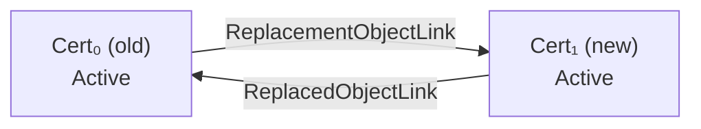

#### Specification

This request is used to generate a **replacement certificate** for an existing
X.509 certificate. It is analogous to the Certify operation, except that the
source is an already-issued certificate rather than a public key or CSR.

The server creates a new certificate with a **fresh Unique Identifier**, copies
the subject public key and the requested validity period from the existing
certificate, and re-signs it using the specified (or inherited) issuer key.

> **[KMIP 2.1], §6.1.6, "Certify"** — "This request supports the certification
> of a new public key, as well as the certification of a public key that has
> already been certified (i.e., certificate update)."
>
> The dedicated `ReCertify` operation tag (distinct from `Certify`) creates the
> replacement certificate as a **new managed object with a new UID**, and wires
> bidirectional `ReplacementObjectLink` / `ReplacedObjectLink` attributes
> between old and new certificates.

**Server behaviour:**

1. A new Certificate object is created with a fresh Unique Identifier.
2. The new certificate is issued with the requested `Offset` (activation delay)
   and `NumberOfDays` validity, or the issuer's defaults if omitted.
3. `ReplacementObjectLink` is added to the **old** certificate pointing to the
   new UID.
4. `ReplacedObjectLink` is added to the **new** certificate pointing back to
   the old UID.
5. The new certificate enters **Active** state (or **Pre-Active** if
   `Offset > 0`).
6. The old certificate is **not** automatically deactivated — its state remains
   unchanged. Call `Revoke` explicitly to deactivate it when ready.

#### Request Payload

| Item                     | Required | Description                                                                                       |
| ------------------------ | :------: | ------------------------------------------------------------------------------------------------- |
| `UniqueIdentifier`       | No       | UID of the existing certificate to re-certify. Defaults to the ID Placeholder if omitted.        |
| `CertificateRequestType` | No       | Type of an optional accompanying certificate request (e.g., PKCS10).                             |
| `CertificateRequestValue`| No       | Raw certificate request bytes (PEM or DER). Overrides the subject information from the old cert. |
| `Offset`                 | No       | Seconds between `Initial Date` and the new certificate's `Activation Date`. `0` → Active immediately; `> 0` → Pre-Active. |
| `Attributes`             | No       | Desired attributes for the new certificate (e.g., issuer private key ID, issuer certificate ID, number of days). |
| `ProtectionStorageMasks` | No       | Permissible protection storage mask selections for the new object.                                |

#### Response Payload

| Item               | Description                                             |
| ------------------ | ------------------------------------------------------- |
| `UniqueIdentifier` | The Unique Identifier of the newly created replacement certificate. |

#### Implementation

The `ReCertify` operation rotates an X.509 certificate.  It is the certificate
equivalent of `Re-Key` for symmetric keys and `Re-Key Key Pair` for asymmetric
key pairs.

**Key differences vs. `Certify` with `certificate-id-to-re-certify`:**

| Aspect                | `ReCertify` operation                      | `Certify` with existing cert UID           |
| --------------------- | ------------------------------------------ | ------------------------------------------ |
| New UID               | Always fresh                               | Optionally same as old                     |
| Object links          | Bidirectional (old ↔ new)                  | Not set automatically                      |
| Old cert deactivation | Manual (call `Revoke`)                     | Manual (call `Revoke`)                     |
| KMIP operation tag    | `ReCertify`                                | `Certify`                                  |

**CLI command:**

```bash
ckms certificates certify \
  --certificate-id-to-re-certify <OLD_CERT_UID> \
  --issuer-private-key-id <ISSUER_SK_UID> \
  --issuer-certificate-id <ISSUER_CERT_UID> \
  --number-of-days 365
```

### Example — Re-certify a self-signed certificate

=== "Request"

    ```json
    {
      "tag": "ReCertify",
      "value": [
        {
          "tag": "UniqueIdentifier",
          "type": "TextString",
          "value": "c3d4e5f6-0000-0000-0000-aabbccddeeff"
        }
      ]
    }
    ```

=== "Response"

    ```json
    {
      "tag": "ReCertifyResponse",
      "type": "Structure",
      "value": [
        {
          "tag": "UniqueIdentifier",
          "type": "TextString",
          "value": "a1b2c3d4-1111-2222-3333-445566778899"
        }
      ]
    }
    ```

### Example — Re-certify with a future activation date (Offset)

An `Offset` of `86400` (24 h) produces a **Pre-Active** certificate whose
`Activation Date` is set to `Initial Date + 86400 s`, allowing a zero-downtime
switchover by pre-staging the replacement before the old one expires.

=== "Request"

    ```json
    {
      "tag": "ReCertify",
      "value": [
        {
          "tag": "UniqueIdentifier",
          "type": "TextString",
          "value": "c3d4e5f6-0000-0000-0000-aabbccddeeff"
        },
        {
          "tag": "Offset",
          "type": "Interval",
          "value": 86400
        }
      ]
    }
    ```

=== "Response"

    ```json
    {
      "tag": "ReCertifyResponse",
      "type": "Structure",
      "value": [
        {
          "tag": "UniqueIdentifier",
          "type": "TextString",
          "value": "b2c3d4e5-aaaa-bbbb-cccc-ddeeff001122"
        }
      ]
    }
    ```

### KMIP link chain after re-certification



The old certificate remains `Active` until explicitly revoked.  To complete the
rotation:

```bash
# Revoke the old certificate when no longer needed
ckms certificates revoke --certificate-id <OLD_CERT_UID> \
  --revocation-reason "Superseded"
```
