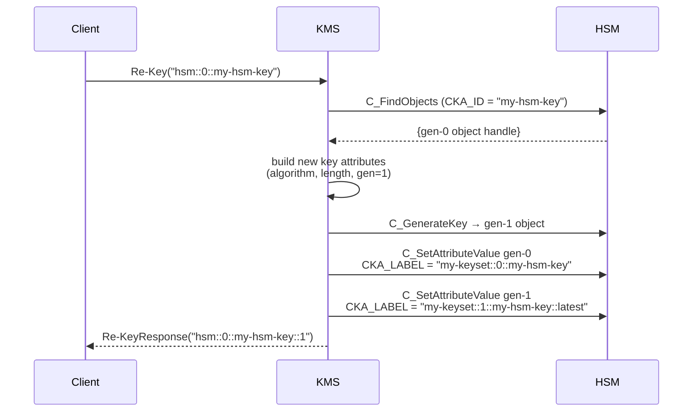
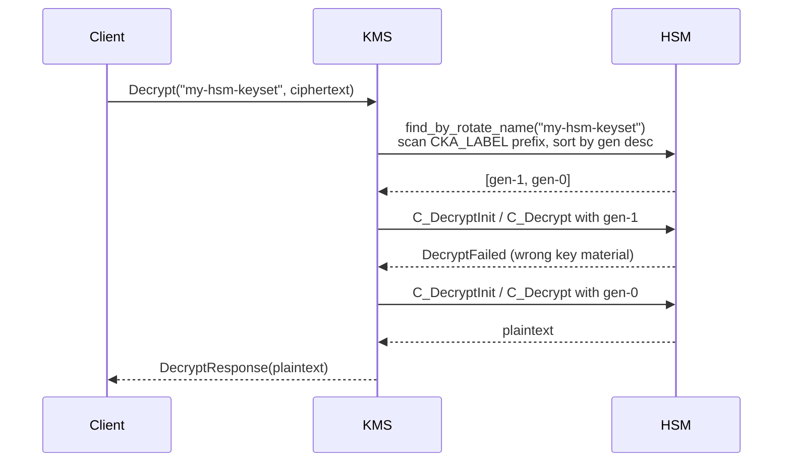

# HSM Key Rotation

Cosmian KMS supports manual `Re-Key` for keys that reside on a
PKCS#11-capable Hardware Security Module (SoftHSM2, Utimaco, Proteccio, …).
The flow mirrors SQL-backed rotation but all keyset metadata lives in PKCS#11
attributes rather than the KMS database.

## Capabilities

| Capability                     | Supported | Notes                                                            |
| ------------------------------ | :-------: | ---------------------------------------------------------------- |
| Manual `Re-Key` via KMIP       | ✅        | Calls `C_GenerateKey` on the same HSM slot.                      |
| Keyset membership (`x-rotate-name`) | ✅   | Stored in `CKA_LABEL`; supports bare-name and `name@N` addressing. |
| `x-rotate-interval` attribute  | ✅        | Writes `CKA_START_DATE` / `CKA_END_DATE` for validity tracking.  |
| Auto-rotation scheduler        | ❌        | `find_due_for_rotation` never returns HSM UIDs; scheduler skips them. |
| `x-rotate-offset`              | ❌        | Not applicable to PKCS#11 scheduling; rejected with `NotSupported`. |

---

## CKA_LABEL convention

HSM keyset metadata is stored entirely in the PKCS#11 `CKA_LABEL` attribute —
no SQL shadow rows are written.

| `CKA_LABEL` value                    | Meaning                            |
| ------------------------------------ | ---------------------------------- |
| `{name}::{gen}::{base_id}::latest`   | Current (newest) key in the keyset |
| `{name}::{gen}::{base_id}`           | Retired (older) key in the keyset  |
| *(anything else)*                    | Key does not belong to a keyset    |

Where:

- `name` — the value set via `set-rotation-policy --name`.
- `gen` — integer starting at `0`, incremented on every `Re-Key`.
- `base_id` — the original PKCS#11 `CKA_ID` of the gen-0 key.

---

## UID scheme

```text
hsm::<slot_id>::<key_id>       ← gen 0 (original key)
hsm::<slot_id>::<key_id>::1    ← gen 1 (after first Re-Key)
hsm::<slot_id>::<key_id>::2    ← gen 2 (after second Re-Key)
```

The numeric suffix is appended to the original `key_id`.  Unlike SQL keys,
the base portion of the UID never changes, so the full chain can be discovered
by scanning `CKA_LABEL` on the HSM slot.

---

## Keyset resolution

When a bare keyset name (e.g. `my-hsm-keyset`) or `name@N` syntax is used,
the server calls `find_by_rotate_name`, which scans PKCS#11 objects in the
HSM slot and filters by `CKA_LABEL` prefix.  Results are sorted by generation
(descending):

- **Encrypt / Sign** → uses the key with `::latest` in `CKA_LABEL`.
- **Decrypt / Verify** → tries each generation newest-to-oldest until one
  succeeds, allowing old ciphertexts to continue to decrypt after rotation.

HSM keysets do **not** use `ReplacedObjectLink` / `ReplacementObjectLink`
back-pointers; all state lives in PKCS#11 attributes.

---

## Full rotation workflow

### Setup

```bash
# 1. Start the KMS server with HSM backend
cosmian_kms \
  --database-type sqlite \
  --hsm-model softhsm2 \
  --hsm-slot 0 \
  --hsm-password 12345678
```

### Create and enrol

```bash
# 2. Create an AES-256 key directly on the HSM
ckms sym keys create \
    --key-id "hsm::0::my-hsm-key" \
    --algorithm aes --length 256

# 3. Enrol the key in a keyset
#    Writes CKA_LABEL = "my-keyset::0::my-hsm-key::latest"
ckms sym keys set-rotation-policy \
    --key-id "hsm::0::my-hsm-key" \
    --name   "my-hsm-keyset"
```

### Encrypt using the keyset name

```bash
# 4. Encrypt — resolves to the latest key (gen-0)
ckms sym encrypt --key-id "my-hsm-keyset" plaintext.bin -o ciphertext.enc
```

### First rotation

```bash
# 5. Rotate: C_GenerateKey on the same HSM slot
ckms sym keys rekey --key-id "hsm::0::my-hsm-key"
# Response: new UID = hsm::0::my-hsm-key::1
#
# CKA_LABEL (gen-0): "my-keyset::0::my-hsm-key"           (retired)
# CKA_LABEL (gen-1): "my-keyset::1::my-hsm-key::latest"   (current)
```



### Decrypt old ciphertext after rotation

```bash
# 6. Decrypt using the keyset name — server tries gen-1 then gen-0
ckms sym decrypt --key-id "my-hsm-keyset" ciphertext.enc -o plaintext.bin
```



### Second rotation and non-latest guard

```bash
# 7. Second rotation (gen-1 → gen-2)
ckms sym keys rekey --key-id "hsm::0::my-hsm-key::1"
# Response: new UID = hsm::0::my-hsm-key::2

# Attempting to re-key a retired generation is rejected:
ckms sym keys rekey --key-id "hsm::0::my-hsm-key"    # gen-0 — REJECTED
# Error: not the latest in its keyset
```

---

## Differences from SQL rotation

| Aspect                  | SQL-backed keys                                  | HSM-resident keys                                  |
| ----------------------- | ------------------------------------------------ | -------------------------------------------------- |
| Keyset metadata storage | KMIP vendor attributes (`x-rotate-*`) in SQL DB  | `CKA_LABEL` on PKCS#11 objects                     |
| UID scheme              | `name@N` (keyset name + generation suffix)       | `hsm::<slot>::<key_id>::N` (original ID + suffix)  |
| Auto-rotation scheduler | ✅ Supported                                      | ❌ Not supported                                   |
| `x-rotate-offset`       | ✅ Supported                                      | ❌ Not supported                                   |
| KMIP link back-pointers | ✅ `ReplacedObjectLink` / `ReplacementObjectLink` | ❌ Not used; chain lives in `CKA_LABEL`            |
| Chain discovery         | SQL query on `x-rotate-name` + `x-rotate-generation` | PKCS#11 `C_FindObjects` on `CKA_LABEL` prefix  |
| Old key state after rotation | Deactivated (§4.57)                        | Retired label set in `CKA_LABEL` (no KMIP state)   |
