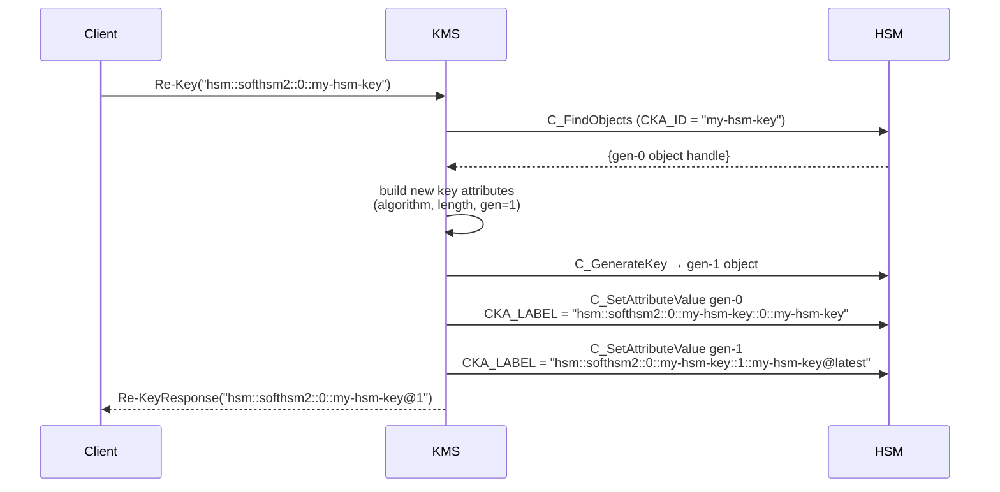
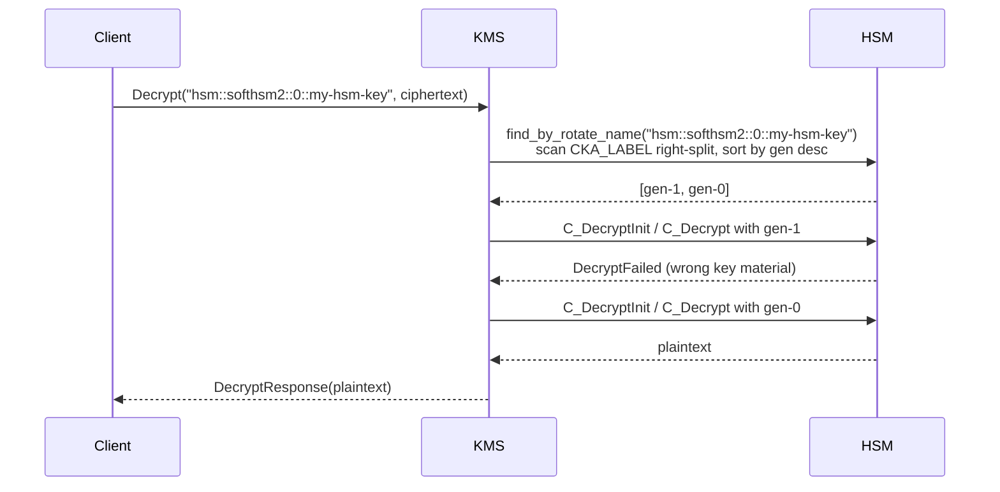

# HSM Key Rotation

Cosmian KMS supports manual `Re-Key` for keys that reside on a
PKCS#11-capable Hardware Security Module (SoftHSM2, Utimaco, Proteccio, …).
The flow mirrors SQL-backed rotation but all keyset metadata lives in PKCS#11
attributes rather than the KMS database.

## Capabilities

| Capability                     | Supported | Notes                                                            |
| ------------------------------ | :-------: | ---------------------------------------------------------------- |
| Manual `Re-Key` via KMIP       | ✅        | Calls `C_GenerateKey` on the same HSM slot.                      |
| Keyset membership (`x-rotate-name`) | ✅   | Stored in `CKA_LABEL`; keyset name **must be the full base UID** (`hsm::model::slot::key_id`). Supports `@latest`, `@first`, `@N` generation addressing. |
| `x-rotate-interval` attribute  | ✅        | Writes `CKA_START_DATE` / `CKA_END_DATE` for validity tracking.  |
| Auto-rotation scheduler        | ❌        | `find_due_for_rotation` never returns HSM UIDs; scheduler skips them. |
| `x-rotate-offset`              | ❌        | Not applicable to PKCS#11 scheduling; rejected with `NotSupported`. |

---

## CKA_LABEL convention

HSM keyset metadata is stored entirely in the PKCS#11 `CKA_LABEL` attribute —
no SQL shadow rows are written.

| `CKA_LABEL` value                                    | Meaning                                                               |
| ---------------------------------------------------- | --------------------------------------------------------------------- |
| `{base_uid}::0::{key_id}@latest`                    | Gen-0 key immediately after `SetAttribute` enrollment (initial state) |
| `{base_uid}::{gen}::{base_id}@latest`               | Current latest key after any `Re-Key`                                 |
| `{base_uid}::{gen}::{base_id}`                      | Retired key (any generation that is no longer the latest)             |
| *(anything else)*                                    | Key does not belong to a keyset                                       |

Where:

- `base_uid` — the **full base UID** of the gen-0 key: `hsm::<model>::<slot_id>::<key_id>`.
  Because it embeds the slot ID, the keyset name is **unique across all HSM slots**.
  A key on slot 0 and a key on slot 1 with the same local name will have different
  keyset names (`hsm::softhsm2::0::my-key` vs `hsm::softhsm2::1::my-key`).
- `gen` — integer starting at `0`, incremented on every `Re-Key`.
- `base_id` / `key_id` — the PKCS#11 `CKA_ID` of the gen-0 key.

!!! note "CKA_LABEL parsing uses right-split"
    Because `base_uid` itself contains `::`, the label is parsed **from the right**
    (`rsplitn(3, "::")`):

    ```
    hsm::softhsm2::0::my-key::1::my-key@latest
    ├─ rotate_name  = "hsm::softhsm2::0::my-key"   (everything left of the last two ::)
    ├─ generation   = 1
    └─ key_id       = "my-key@latest"
    ```

    This is backward-compatible: labels written before the full-UID convention
    (e.g. `"my-keyset::0::my-key@latest"`) still parse correctly.

---

## UID scheme

```text
hsm::<model>::<slot_id>::<base_key_id>      ← gen 0 (original key)
hsm::<model>::<slot_id>::<base_key_id>@1   ← gen 1 (after first Re-Key)
hsm::<model>::<slot_id>::<base_key_id>@2   ← gen 2 (after second Re-Key)
```

Where `<model>` is the HSM model name (e.g. `softhsm2`, `utimaco`, `proteccio`).
The `@N` generation suffix is appended to the original `base_key_id`, using the
same convention as SQL keyset keys (`my-key@1`, `my-key@2`).  Unlike
SQL keys, the base portion of the UID never changes, so the full chain can be
discovered by scanning `CKA_LABEL` on the HSM slot.

!!! note "Backward-compatible two-segment UIDs"
    The older format `hsm::<slot_id>::<key_id>` (without model segment) is still
    accepted for backward compatibility with keys created before the model segment
    was introduced.

---

## Keyset name constraint

For HSM keys the keyset name (`x-rotate-name`) **must be the key's full base UID**
(`hsm::<model>::<slot>::<key_id>` without any `@N` suffix).

| Value                                | Accepted? | Reason                                              |
| ------------------------------------ | :-------: | --------------------------------------------------- |
| `hsm::softhsm2::0::my-hsm-key`      | ✅        | Full base UID — unique across slots.                |
| `my-hsm-keyset`                      | ❌        | Bare name rejected — no slot disambiguation.        |
| `hsm::softhsm2::0::my-hsm-key@1`    | ❌        | Generation suffix rejected — base UID only.         |

```text
Invalid Request: SetAttribute: for HSM keys, rotate_name must be the key's base UID
('hsm::softhsm2::0::my-hsm-key'), not 'my-hsm-keyset'
```

> **Why this constraint?**  A bare name like `"my-hsm-key"` is ambiguous when
> multiple HSM slots are in use — two keys on different slots could have the
> same local name.  Embedding the slot ID in the keyset name prevents cross-slot
> collisions without requiring a central name registry.

---

## Keyset resolution

When a base UID (e.g. `hsm::softhsm2::0::my-hsm-key`) or generation-scoped syntax
(`hsm::softhsm2::0::my-hsm-key@latest`, `hsm::softhsm2::0::my-hsm-key@0`,
`hsm::softhsm2::0::my-hsm-key@N`) is used, the server calls `find_by_rotate_name`,
which scans PKCS#11 objects in the HSM slot and parses `CKA_LABEL` to extract
the `rotate_name` and `rotate_generation`.  Results are sorted by generation
descending:

- **Encrypt / Sign** → uses the key with the **highest `rotate_generation`**
  (current latest). The `@latest` suffix in `CKA_LABEL` is *not* used for
  this determination — generation sorting is the authoritative source.
- **Decrypt / Verify** → tries each generation newest-to-oldest until one
  succeeds, allowing old ciphertexts to continue to decrypt after rotation.

Using a **direct generation UID** with an explicit `@N` suffix
(e.g. `hsm::softhsm2::0::my-hsm-key@0`) bypasses keyset resolution entirely:
only that specific generation is used, with no chain walk.

Using the **base UID without `@N`** (e.g. `hsm::softhsm2::0::my-hsm-key`)
always resolves to the **latest generation** (see [Second rotation and non-latest guard](#second-rotation-and-non-latest-guard)
below for the `Re-Key`-specific stable-handle behaviour).

HSM keysets do **not** use `ReplacedObjectLink` / `ReplacementObjectLink`
back-pointers; all state lives in PKCS#11 attributes.

---

## Full rotation workflow

### Setup

```bash
# 1. Start the KMS server with HSM backend
cosmian_kms \
  --database-type sqlite \
  --hsm-model softhsm2 \
  --hsm-slot 0 \
  --hsm-password 12345678
```

### Create and enrol

```bash
# 2. Create an AES-256 key directly on the HSM
ckms sym keys create \
    --key-id "hsm::softhsm2::0::my-hsm-key" \
    --algorithm aes --length 256

# 3. Enrol the key in a keyset.
#    The keyset name MUST equal the key's full base UID.
#    Writes CKA_LABEL = "hsm::softhsm2::0::my-hsm-key::0::my-hsm-key@latest"
ckms sym keys set-rotation-policy \
    --key-id "hsm::softhsm2::0::my-hsm-key" \
    --name   "hsm::softhsm2::0::my-hsm-key"
```

### Encrypt using the base UID as the keyset address

```bash
# 4. Encrypt — base UID resolves to the latest key (gen-0 initially)
ckms sym encrypt --key-id "hsm::softhsm2::0::my-hsm-key" plaintext.bin -o ciphertext.enc
```

### First rotation

```bash
# 5. Rotate using the base UID as a stable keyset handle.
#    No @N suffix → server redirects to the latest generation (gen-0 here).
ckms sym keys rekey --key-id "hsm::softhsm2::0::my-hsm-key"
# Response: new UID = hsm::softhsm2::0::my-hsm-key@1
#
# CKA_LABEL (gen-0): "hsm::softhsm2::0::my-hsm-key::0::my-hsm-key"          (retired)
# CKA_LABEL (gen-1): "hsm::softhsm2::0::my-hsm-key::1::my-hsm-key@latest"   (current)
```



### Decrypt old ciphertext after rotation

```bash
# 6. Decrypt using the base UID — server tries gen-1 then gen-0
ckms sym decrypt --key-id "hsm::softhsm2::0::my-hsm-key" ciphertext.enc -o plaintext.bin
```



### Second rotation and non-latest guard

The `Re-Key` operation distinguishes two addressing styles for HSM keys:

| Addressing style          | Example                                    | Behaviour when not latest    |
| ------------------------- | ------------------------------------------ | ---------------------------- |
| **Stable handle** (base UID, no `@N`) | `hsm::softhsm2::0::my-hsm-key`  | Silently redirects to the latest generation |
| **Explicit generation** (`@N`)        | `hsm::softhsm2::0::my-hsm-key@0` | Returns an error |

```bash
# 7. Second rotation using the stable handle (always rotates the latest)
ckms sym keys rekey --key-id "hsm::softhsm2::0::my-hsm-key"
# → redirected to gen-1 (current latest)
# Response: new UID = hsm::softhsm2::0::my-hsm-key@2

# Attempting to re-key an explicit retired generation is rejected:
ckms sym keys rekey --key-id "hsm::softhsm2::0::my-hsm-key@0"   # explicit @0 — REJECTED
# Error: ReKey: HSM key 'hsm::softhsm2::0::my-hsm-key@0' is not the latest in its keyset
#   — only the latest generation can be rotated.
#   Use 'hsm::softhsm2::0::my-hsm-key' to always rotate the current head.
```

---

## Differences from SQL rotation

| Aspect                  | SQL-backed keys                                  | HSM-resident keys                                  |
| ----------------------- | ------------------------------------------------ | -------------------------------------------------- |
| Keyset metadata storage | KMIP vendor attributes (`x-rotate-*`) in SQL DB  | `CKA_LABEL` on PKCS#11 objects                     |
| UID scheme              | Plain identifier (keyset name is a `rotate_name` attribute, not in the UID) | `hsm::<model>::<slot>::<base_key_id>[@N]` (generation suffix appended) |
| Auto-rotation scheduler | ✅ Supported                                      | ❌ Not supported                                   |
| `x-rotate-offset`       | ✅ Supported                                      | ❌ Not supported                                   |
| KMIP link back-pointers | ✅ `ReplacedObjectLink` / `ReplacementObjectLink` | ❌ Not used; chain lives in `CKA_LABEL`            |
| Chain discovery         | SQL query on `x-rotate-name` + `x-rotate-generation` | PKCS#11 `C_FindObjects` on `CKA_LABEL` prefix  |
| Old key state after rotation | Deactivated (§4.57)                        | Retired label set in `CKA_LABEL` (no KMIP state)   |
