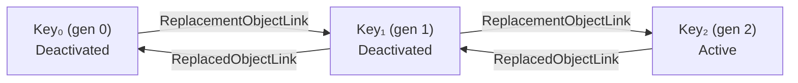
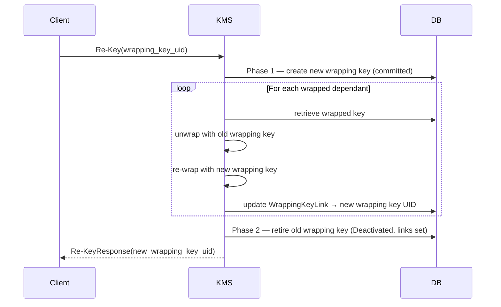
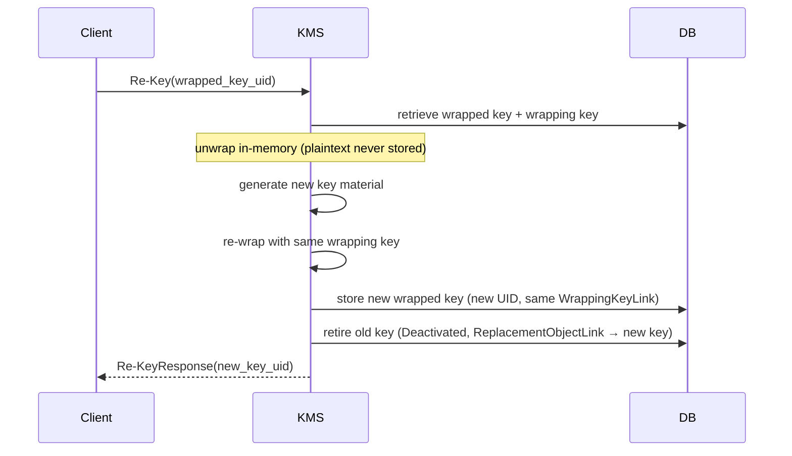
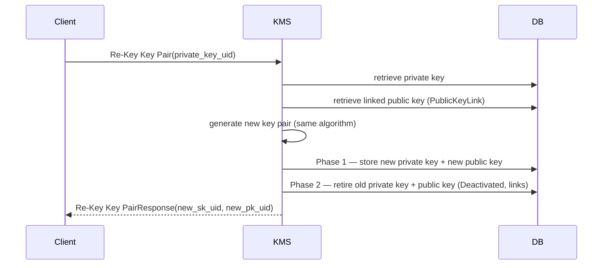
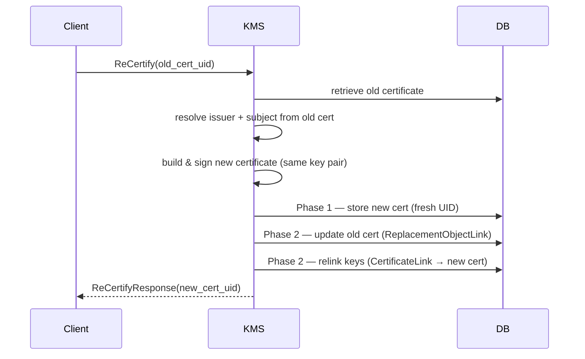
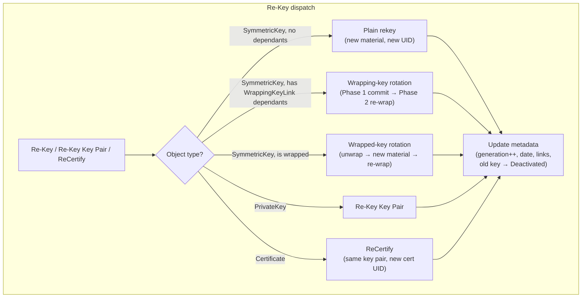

# Key Rotation

Cosmian KMS supports **manual key rotation** for all key types through the
standard KMIP operations:

| KMIP operation   | Applies to                              | CLI command                      |
| ---------------- | --------------------------------------- | -------------------------------- |
| `Re-Key`         | Symmetric keys, secret data             | `ckms sym keys rekey`            |
| `Re-Key Key Pair`| Asymmetric key pairs (RSA, EC, PQC, …)  | `ckms {rsa,ec,pqc} keys rekey`   |
| `ReCertify`      | X.509 certificates                      | `ckms certificates certify --certificate-id-to-re-certify` |

On every rotation the server:

1. Generates a new cryptographic object (or new certificate) under a **fresh UID**.
2. Sets a `ReplacementObjectLink` on the old object pointing to the new UID.
3. Sets a `ReplacedObjectLink` on the new object pointing back to the old UID.
4. Transitions the old key to **Deactivated** (KMIP §4.57, transition 6 — see [below](#old-key-deactivated-after-rotation)).
5. Increments `x-rotate-generation` and records `x-rotate-date` on the new object.

> **Auto-rotation** (scheduler-driven, policy-based) is covered separately in
> [Auto-Rotation Policy](auto_rotation_policy.md).
> **HSM key rotation** is covered in [HSM Key Rotation](hsm.md).

---

## State restrictions

Only objects in the following states can be the **source** of a rotation:

| State               | Rotation allowed? | Rationale                                                           |
| ------------------- | :---------------: | ------------------------------------------------------------------- |
| **Active**          | ✅                | Primary valid source state.                                         |
| **Deactivated**     | ✅                | KMIP §6.1.46 permits it; a replacement key should still be issued.  |
| **Compromised**     | ✅                | Rotating a compromised key is the recommended incident response.    |
| **Pre-Active**      | ❌                | Key material was never activated — rotating unused material is premature. |
| **Destroyed**       | ❌                | Object no longer exists.                                            |
| **Destroyed_Compromised** | ❌         | Object no longer exists.                                            |

> This restriction applies to the **source** key only.  The *output* of a
> rotation can enter `Pre-Active` if the request includes an `Offset > 0`
> (the new key's Activation Date is set to `Initial Date + Offset`).

---

## Old key Deactivated after rotation

Per KMIP §4.57 state transition 6, the old key is **automatically transitioned
to Deactivated** when a `Re-Key` or `Re-Key Key Pair` operation completes
successfully.

Consequences:

- The old key can no longer be used for **Encrypt** or **Sign** operations
  (those require `Active` state).
- The old key remains available for **Decrypt** and **Verify** (processing
  operations accept `Active`, `Deactivated`, and `Compromised` states per
  KMIP §3.31), so in-flight ciphertexts continue to decrypt.
- You can call `Revoke` on an already-Deactivated key; the call succeeds as
  a no-op (the state is already revoked).
- You can call `Destroy` on a Deactivated key directly — no prior `Revoke`
  is required.

---

## Keysets

A **keyset** is a named group of related key generations.  Each generation is
a distinct cryptographic key (different material, different UID) produced by
successive `Re-Key` operations.

### Creating a SQL key in a keyset

For SQL-backed keys the key's UID **must equal the keyset name** from the
start.  Supply both `UniqueIdentifier` and `x-rotate-name` in the same `Create`
request:

```bash
# Create a key whose UID is the keyset name
ckms sym keys create --key-id my-keyset --algorithm aes --length 256
ckms sym keys set-rotation-policy --key-id my-keyset --name my-keyset
```

Attempting `set-rotation-policy --name X` on a SQL key whose UID is not `X`
is rejected:

```text
Invalid Request: SetAttribute: rotate_name ('X') must equal the key's UID — create the key with the keyset name as its ID
```

### SQL keyset UID scheme

UIDs are assigned deterministically at each generation:

```text
my-keyset        ← gen 0  (UID equals the keyset name)
my-keyset@1      ← gen 1  (after first Re-Key)
my-keyset@2      ← gen 2  (after second Re-Key)
```

The `Re-Key` response always returns the new key's real UID (e.g. `my-keyset@1`).

### Addressing syntax

A keyset can be referenced by name wherever a `UniqueIdentifier` is accepted
(`Encrypt`, `Decrypt`, `Get`, `Re-Key`, …):

| Syntax               | Resolves to                                      |
| -------------------- | ------------------------------------------------ |
| `my-keyset`          | Latest generation (bare name = `@latest`)        |
| `my-keyset@latest`   | Latest generation (explicit alias)               |
| `my-keyset@first`    | Generation 0                                     |
| `my-keyset@0`        | Generation 0 (numeric alias for `@first`)        |
| `my-keyset@N`        | Generation N                                     |

**Encrypt / Sign** always resolves to the **latest** generation.

**Decrypt / Verify** walks the chain newest-to-oldest until one generation
succeeds, allowing ciphertexts encrypted with an older (now Deactivated) key
to continue to decrypt after rotation.

> **`@latest` is a virtual alias.**  It is never stored in the database and
> is never returned in a response.  `my-keyset` (bare name) also resolves to
> the latest generation even though `my-keyset` is the literal UID of gen-0.
> To access gen-0 explicitly, use `my-keyset@0` or `my-keyset@first`.

### Non-latest guard

Only the **latest generation** of a keyset can be rotated via `Re-Key`.
Attempting to rotate a retired member is rejected:

```text
Invalid Request: ReKey: key '<uid>' is not the latest in its keyset —
only the latest generation can be rotated
```

Use `my-keyset@0` (explicit generation) rather than `my-keyset` (bare name)
to target an older generation — and expect that call to fail.

### Keyset internals (SQL)

Keyset state is stored as KMIP vendor attributes in the database:

| Attribute             | Type       | Meaning                                              |
| --------------------- | ---------- | ---------------------------------------------------- |
| `x-rotate-name`       | `string`   | Keyset name; equals the key UID for gen-0.           |
| `x-rotate-generation` | `i32`      | `0` for gen-0, incremented on each `Re-Key`.         |
| `x-rotate-latest`     | `bool`     | `true` on the current key; `false` on older keys.    |

KMIP link attributes mirror the chain for protocol compliance:
`ReplacementObjectLink` (old → new) and `ReplacedObjectLink` (new → old).
Keyset chain traversal for `Decrypt` / `Verify` uses
`x-rotate-generation` (sorted descending), not the link back-pointers.

---

## Rotation flows by key type

### 1. Plain symmetric key

A plain symmetric key carries only its own policy.

**What happens:**

1. Fresh key material is generated (same algorithm and length).
2. The new key gets a new UID (`my-keyset@N` for keyset keys, fresh UUID otherwise).
3. `ReplacedObjectLink` on the new key → old key.
4. `ReplacementObjectLink` on the old key → new key.
5. Old key → **Deactivated**.

**KMIP link chain after two rotations:**



**CLI:**

```bash
# Manual rotation of a SQL keyset key
ckms sym keys rekey --key-id my-keyset
# Response: new UID = my-keyset@1

# Manual rotation of a plain UUID key
ckms sym keys rekey --key-id <KEY_UID>
```

---

### 2. Wrapping key

A *wrapping key* is referenced by one or more *wrapped* keys via a
`WrappingKeyLink` attribute.  Rotating a wrapping key re-wraps all its
dependants atomically.

**What happens:**

1. A new wrapping key is created and committed to the database (Phase 1).
2. Every `Active` key whose `WrappingKeyLink` points to the old wrapping key
   is fetched, unwrapped in memory (plaintext never stored), and re-wrapped
   with the new wrapping key (Phase 2).
3. Each wrapped key's `WrappingKeyLink` is updated to the new wrapping key UID.
4. Standard rotation metadata is applied; old wrapping key → Deactivated.



---

### 3. Wrapped key

A *wrapped key* stores its key material encrypted under a wrapping key.

**What happens:**

1. The wrapped key is exported and unwrapped in memory using the current
   wrapping key (plaintext never stored).
2. Fresh plaintext key material is generated from the unwrapped attributes.
3. The new material is re-wrapped with the same wrapping key.
4. The new ciphertext is stored under a new UID with an active `WrappingKeyLink`.
5. Standard rotation metadata is applied; old wrapped key → Deactivated.



---

### 4. Asymmetric key pair

`Re-Key Key Pair` targets the **private key** UID.  The server resolves the
associated public key via the `PublicKeyLink` attribute.

**What happens:**

1. A new private key + public key pair is generated (same algorithm).
2. Both receive new UIDs; the new private key carries a `PublicKeyLink` to
   the new public key.
3. Standard `ReplacementObjectLink` / `ReplacedObjectLink` links are set on
   both pairs.
4. Old private key and old public key → **Deactivated**.



**CLI:**

```bash
# EC key pair
ckms ec keys rekey --key-id <PRIVATE_KEY_UID>

# RSA key pair
ckms rsa keys rekey --key-id <PRIVATE_KEY_UID>

# Post-quantum (ML-KEM, ML-DSA, SLH-DSA)
ckms pqc keys rekey --key-id <PRIVATE_KEY_UID>
```

---

### 5. Wrapped private key (Covercrypt)

A Covercrypt master private key follows the same `Re-Key Key Pair` flow.  The
wrapped key is unwrapped in memory, the Covercrypt partition attributes are
re-keyed, and the new wrapped private key is stored under a fresh UID.

> Setting a rotation policy on a wrapped private key always works: the
> `x-rotate-*` attributes are stored in the metadata column (not inside the
> ciphertext block) and do not require the key to be unwrapped first.

---

### 6. Certificate renewal (`ReCertify`)

Certificate renewal creates a **new certificate for the same key pair** — no
new key material is generated.

**What happens:**

1. The existing certificate is retrieved and its issuer / subject are resolved.
2. A new certificate is built and signed (same key pair, same issuer).
3. The new certificate receives a fresh UID.
4. `ReplacedObjectLink` on the new cert → old cert.
5. `ReplacementObjectLink` on the old cert → new cert.
6. All keys linked to the old certificate have their `CertificateLink` updated.
7. `x-rotate-generation` and `x-rotate-date` are updated.



**Attribute changes (KMIP 2.1 §6.1.45):**

| Attribute                     | New certificate     | Old certificate         |
| ----------------------------- | ------------------- | ----------------------- |
| `Unique Identifier`           | Fresh UUID          | Unchanged               |
| `Initial Date`                | Now                 | Unchanged               |
| `Link[ReplacedObjectLink]`    | → old cert UID      | —                       |
| `Link[ReplacementObjectLink]` | —                   | → new cert UID          |
| `Link[PublicKeyLink]`         | Copied from old     | Unchanged               |
| `Link[PrivateKeyLink]`        | Copied from old     | Unchanged               |
| `Name`                        | Inherited from old  | Removed (per KMIP spec) |
| `State`                       | Active              | Active (not Deactivated — certificates are exempt from §4.57) |
| `x-rotate-generation`         | old + 1             | Unchanged               |
| `x-rotate-date`               | Now                 | Unchanged               |

**CLI:**

```bash
# Renew a CA-signed certificate (same key pair, new validity period)
ckms certificates certify \
    --certificate-id-to-re-certify <OLD_CERT_UID> \
    --issuer-private-key-id <ISSUER_SK_UID> \
    --days 365

# Self-signed certificate renewal
ckms certificates certify \
    --certificate-id-to-re-certify <OLD_CERT_UID> \
    --days 3650
```

**Standards:**

| Standard | Relevance |
| -------- | --------- |
| [KMIP 2.1 §6.1.45](https://docs.oasis-open.org/kmip/kmip-spec/v2.1/os/kmip-spec-v2.1-os.html#_Toc57115677) | Normative definition of `ReCertify` |
| [RFC 4210](https://www.rfc-editor.org/rfc/rfc4210.html) §5.3.5–5.3.6 | CMP Key Update Request / Response (`kur`/`kup`) — the wire-protocol equivalent |
| [RFC 5280](https://www.rfc-editor.org/rfc/rfc5280.html) | X.509v3 certificate structure and validity periods |

---

### 7. KEK-protected key (server-wide key-encryption key)

When the KMS server is started with `--key-encryption-key <KEK_UID>`, every
object stored in the database is transparently wrapped by the KEK.  Rotation
works identically to the wrapped-key flow above — the server unwraps in memory,
generates fresh material, re-wraps, and stores the result.

```bash
# Example server startup with SoftHSM2 KEK
cosmian_kms \
  --database-type sqlite \
  --hsm-model softhsm2 \
  --hsm-slot 0 \
  --hsm-password 12345678 \
  --key-encryption-key "hsm::softhsm2::0::my-kek"
```

No special handling is required for rotation policy — `SetAttribute` on a
KEK-wrapped key writes the `x-rotate-*` attributes to the metadata column, not
into the ciphertext, so no unwrap is needed.

---

## Rotation dispatch overview



---

## KMIP attribute changes on manual rotation

When the user explicitly calls `Re-Key` (e.g. `ckms sym keys rekey`), the
following attributes are set on the old and new key:

| Attribute                     | Old key                                                      | New key                                                        |
| ----------------------------- | ------------------------------------------------------------ | -------------------------------------------------------------- |
| `Unique Identifier`           | unchanged                                                    | fresh UUID (or `name@N` for keyset keys)                       |
| `State`                       | **Deactivated** (§4.57)                                      | Active                                                         |
| `Link[ReplacementObjectLink]` | → new key UID                                                | —                                                              |
| `Link[ReplacedObjectLink]`    | —                                                            | → old key UID                                                  |
| `Link[WrappingKeyLink]`       | unchanged                                                    | copied from old key                                            |
| `x-rotate-generation`         | unchanged                                                    | old value + 1                                                  |
| `x-rotate-date`               | unchanged                                                    | timestamp of rotation                                          |
| `x-rotate-interval`           | **set to `0`** (disabled)                                    | **`0`** — must be re-armed explicitly on the new key           |
| `x-rotate-name`               | unchanged                                                    | inherited from old key                                         |
| `x-rotate-offset`             | unchanged                                                    | `None` (not inherited for manual rekey)                        |
| `Name`                        | removed                                                      | inherited from old key                                         |

> **Manual vs auto-rotation difference:** `x-rotate-interval` is intentionally
> set to `0` (not inherited) on the new key after a manual rotation.  This
> forces the operator to re-evaluate the rotation policy for the new key rather
> than blindly continuing the old schedule.
>
> ```bash
> # After a manual rekey, re-arm the rotation policy on the new key:
> ckms sym keys set-rotation-policy \
>     --key-id  <NEW_KEY_UID> \
>     --interval 3600 \
>     --name    "my-keyset"
> ```

---

## Revoking superseded keys

After rotation the old key is **Deactivated** (not Destroyed).  Its material
persists so that in-flight Decrypt / Verify operations against old ciphertexts
continue to work.  Once all consumers have migrated, destroy the old key:

```bash
# Find the old key UID from the new key's ReplacedObjectLink attribute
ckms objects get-attributes --key-id <NEW_KEY_UID>

# Destroy the old key directly (Deactivated keys do not need a prior Revoke)
ckms sym keys destroy --key-id <OLD_KEY_UID>
```

If you need to place the old key into `Compromised` state (e.g. for audit
records), call `Revoke` first with a compromise reason:

```bash
# Symmetric key
ckms sym keys revoke -k <OLD_KEY_UID> "Superseded"

# Asymmetric key pair (revokes both private and linked public key)
ckms ec keys revoke -k <OLD_KEY_UID> "Superseded"

# Certificate
ckms certificates revoke -c <OLD_CERT_UID> "Superseded"
```
