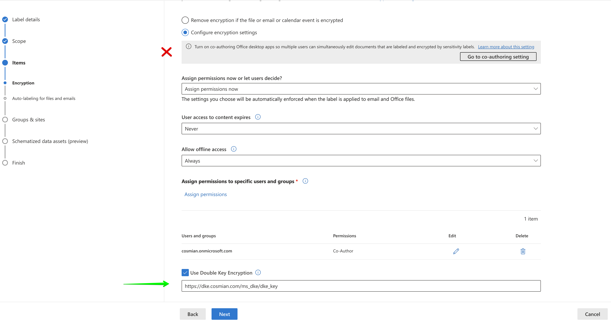

Microsoft Double Key Encryption (DKE) is a feature of Microsoft 365 that allows you to protect your most sensitive
data by encrypting data on the client computer before sending it to Microsoft servers.
One of the keys used to encrypt remains under your control and makes the data unreadable by Microsoft. This key is kept
inside your instance of Cosmian KMS which exposes the required API to integrate with Microsoft DKE.

See [How it works](#how-it-works) for details on the cryptographic process.

## Microsoft Prerequisites

The DKE feature is currently only available for the Office Windows clients. In addition, to use Microsoft
Double Key Encryption (DKE) you must have a Microsoft 365 Business Premium license and must have access to the Microsoft
Purview compliance portal.

## How it works

Once DKE is configured, the whole process consists in assigning a
specific [sensitivity label](https://learn.microsoft.com/en-gb/purview/create-sensitivity-labels#create-and-configure-sensitivity-labels)
to a document. The label will indicate that the document is encrypted and that the key to decrypt it is stored in your
Cosmian KMS.

Please check the dedicated [Microsoft documentation](https://learn.microsoft.com/en-us/purview/double-key-encryption)
for a complete overview of the feature.

From a cryptographic standpoint, the feature works as follows:

Before saving an encrypted document, the Office client will:

1. Generate an ephemeral 128-bit AES key and use it to encrypt the document
2. Call the Cosmian KMS to get your 2048-bit RSA public key (the Office client will cache the key for 24 hours)
3. Use that key to wrap the AES key using the PKCS#11 CKM_RSA_PKCS_OAEP (NIST 800 56B Rev2) algorithm; the hashing
   algorithm is set to SHA-256 (see [the list of supported algorithms](../algorithms.md) for details)
4. Send the wrapped AES key and the encrypted document to Microsoft servers, where Azure RMS will also wrap the
   wrapped AES key with their own key (hence the "double key" acronym)

Retrieving an encrypted document works as follows, the Office client will:

1. Request Azure RMS to perform the first unwrapping using their key, to recover the wrapped AES key
2. Download the encrypted document and the wrapped AES key
3. Call your Cosmian KMS to unwrap the AES key using your private RSA key. Please note
   that the private RSA key never leaves the Cosmian KMS.
4. Decrypt the document using the recovered AES key and display it.

**Note**: The Cosmian KMS implementation of the PKCS#11 CKM_RSA_PKCS_OAEP algorithm is FIPS compliant. The DKE
API is therefore available on the Cosmian server running in [FIPS mode](../fips.md).

## Configuring the Cosmian KMS server

The Cosmian KMS server needs to be started with the `--ms-dke-service-url <MS_DKE_SERVICE_URL>` option.

The `<MS_DKE_SERVICE_URL>`should contain the external URL of this server as configured in [Azure App Registrations
for the DKE Service](https://learn.microsoft.com/en-us/purview/double-key-encryption-setup#register-your-key-store)

The URL should be something like <https://kms.my_domain.com/ms_dke>

Alternatively, you can set the `KMS_MS_DKE_SERVICE_URL` environment variable to the same value, or set the
corresponding entry in the server TOML configuration file.

!!! warning "No authentication => firewalling is critical"
      The Office client does not send any authentication information when calling the Cosmian KMS. Firewalling the
      Cosmian KMS server to only accept requests from valid Office clients is critical.

!!! important "Running the KMS server in the cloud for DKE"
      It is possible to confidentially run the Cosmian KMS server in the cloud [inside a
      Cosmian VM](../zero_trust.md). However, due to the lack of authentication, and thus the need to firewall the server,
      one should make sure to use OS-level firewalling and not rely on the cloud provider's firewalling capabilities,
      particularly if running on Azure.

#### Create an RSA key with tag `dke_key`

Using the `ckms` command line tool, create a 2048-bit RSA key with the tag `dke_key`:

```shell
ckms rsa keys create --tag dke_key --size_in_bits 2048
```

The tag can be changed to any value, but it must be used in the URL of the sensitivity label in the Microsoft Purview
compliance portal. See [Create a sensitivity label for encryption](#create-a-sensitivity-label-for-encryption) for details.

#### Rotate the DKE key

If later on you need to rotate the DKE key, you can use the `ckms` command line tool to create a new key with a new tag.
You must then create a new sensitivity label where the Double Key Encryption URL ends with the new tag value.
See [Create a sensitivity label for encryption](#create-a-sensitivity-label-for-encryption) for details.

Users should now select the new label when creating new documents.
As long as the old key is available in the Cosmian KMS, users will still be able to open documents encrypted with the
old key.


## Configuring Microsoft DKE in Purview

Please follow the [main documentation](https://learn.microsoft.com/en-us/purview/double-key-encryption-setup)
provided by Microsoft. The following paragraphs add details and tips to the process.

#### Activating the protection service from Azure Information Protection

The protection
service [must be activated](https://learn.microsoft.com/en-us/azure/information-protection/activate-service) in order to
use DKE.
If not activated, "Group and Sites" will not be available in the scopes of the sensitivity label.

Run PowerShell as Admin

 ```powershell
 Install-Module -Name AIPService
 ```

In case of troubles with the execution policy, try

 ```powershell
 powershell -ExecutionPolicy ByPass
 ```

Get the status of the AIP service

 ```powershell
 Import-Module AIPService
 Get-AIPService
 ```

You may have to connect to it first

 ```powershell
 Connect-AipService
 ```

If it is disabled, enable it

 ```powershell
 Enable-AipService
 ```

More options for [phased deployments
here](https://learn.microsoft.com/en-us/azure/information-protection/activate-service#configuring-onboarding-controls-for-a-phased-deployment).

#### Microsoft Entra configuration for encrypted content

Check if there is [anything to configure](https://learn.microsoft.com/en-gb/purview/encryption-azure-ad-configuration).

#### Activate sensitivity labels for MS 365 groups

Sensitivity labels must be activated for MS 365 groups which are also called unified groups.
The main documentation on configuring sensitivity labels
is [available here](https://learn.microsoft.com/en-gb/purview/encryption-sensitivity-labels).

The objective is to set the `EnableMIPLabels` parameter to `True` at the Entra ID Directory level (which is set
to `False` by default), using  `Group.Unified` template.

> The `EnableMIPLabels` flag indicates whether sensitivity labels published in Microsoft Purview compliance portal
> can be applied to Microsoft 365 groups. For more information, see Assign Sensitivity Labels for Microsoft 365 groups.

To verify the current value of the `EnableMIPLabels` parameter, run the following command:

```powershell
$Setting = Get-AzureADDirectorySetting | ? { $_.DisplayName -eq "Group.Unified"}
&Setting.Values
```

[See this doc](https://learn.microsoft.com/en-gb/purview/sensitivity-labels-teams-groups-sites#using-sensitivity-labels-for-microsoft-teams-microsoft-365-groups-and-sharepoint-sites)
and [Enable sensitivity label support in PowerShell](https://learn.microsoft.com/en-us/entra/identity/users/groups-assign-sensitivity-labels#enable-sensitivity-label-support-in-powershell)
which will probably
require [configuring groups](https://learn.microsoft.com/en-us/entra/identity/users/groups-settings-cmdlets) first.

#### De-activate co-authoring in Microsoft Purview

Do NOT click the box
on [this page](https://compliance.microsoft.com/compliancesettings/co-authoring_for_files_with_sensitivity_labels),
doing so will prevent the use of DKE in Sensitivity Labels.

If you need to deactivate co-authoring, you can do so by running the following commands:

```powershell
Install-Module -Name PSWSMan # if not already installed
Install-WSMan
Install-Module -Name ExchangeOnlineManagement
Import-Module ExchangeOnlineManagement
Connect-IPPSSession -UserPrincipalName you_admin_user@your_domain.com
Set-PolicyConfig -EnableLabelCoauth:$false
```

#### Create a sensitivity label for encryption

Navigate to [Purview](https://compliance.microsoft.com/homepage) then `Solutions > Information protection > Labels`

Follow [these instructions](https://learn.microsoft.com/en-gb/purview/create-sensitivity-labels#create-and-configure-sensitivity-labels)
to create the label.
Select `Use Double Key Encryption` on the encryption configuration screen and make sure
you do not activate co-authoring.

!!! important "Use the correct URL"
      The URL must be set to a form similar to `https://dke.acme.com/ms_dke/dke_key` where

      - `dke.acme.com` is the address of the Cosmian KMS server. A valid certificate must be installed on the server.
      - `ms_dke` is the root of REST path for the DKE services.
      - `dke_key` is the tag set for the RSA key pair to use for this label.




Activating the label (scope) for meetings does not seem to work.


