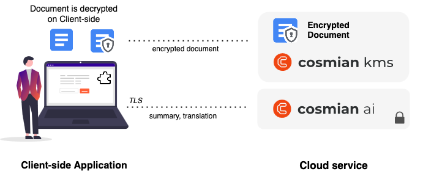

# Using Cosmian ai

Using encrypted Word documents, **Cosmian ai** allows you to add some features like text summary or translation, without losing security.
For this, you'll need to deploy **Cosmian ai** (an AI runner, put on **Cosmian vm** - a confidential and verifiabled VM) and install Cosmian ai Add-in.

## Complete your Identity Provider configuration
To make requests from the Add-in to Cosmian ai runner, users must be authentificated using your Identity Provider application (setup previously for DKE service - should be a Single Page or Web application type).

From you Identity Provider, you need to add the Add-in URL as an allowed callback/redirect URI, enabling full login flow : --URL--

If you are using Microsoft Entra ID, you also need to add an API Permission (API Permission → MicrosoftGraph → Delegated Permission → OpenId), in order to add users' basic information from the fetched authentification ID Token and add email claim in Token Configuration (more details after).

## Deploy Cosmian ai runner
The  **Cosmian ai** runner can be spawned from the different Cloud Providers' marketplace.
It should be configured with the used Identity Provider application (client ID and jwks URI), to authentificate users.

## Install the Add-in
The Add-in  will extract text from the open Word Document, and request on the runner ai using TLS connection, to get text summary/translation.

Users must install Cosmian ai Add-in from Add-in store.

From the Add-in settings page they need to configure:

- the URL of your deployed Cosmian ai runner to fetch

- elements from your Identity Provider Application (client ID, OAuth authorization URL, OAuth token URL)

We provide details for some Identity Provider configurations:

**Auth0:**

From your created Single Page Application, share Client ID and authorization and token URLs (Advanced Settings - URL tab) to your users.

Add the Add-in redirection URL from the allowed callbacks URL section.

Activate Refresh Token Rotation in order to enable the refresh token process.

**Azure Entra ID:**

On an application, share the associated Client ID, authorization and token URLs to your users.

Under Authentification, add a platform : Single Page Application. Add Add-in redirection URL from the Redirect URIs section.

Under API Permission, add an API permission for OpenId : API Permission → MicrosoftGraph → Delegated Permission → OpenId

Under Token configuration, add an optional claim, selecting "ID" as Token type and the email field in claim list.

**Google IAM:**

Create a crendential → OAuth Client ID → Web Application.

Setup the Add-in redirection URL as an authorized redirect URIs.

Share the Client ID, Client Secret and authorization and token URLs to your users.
