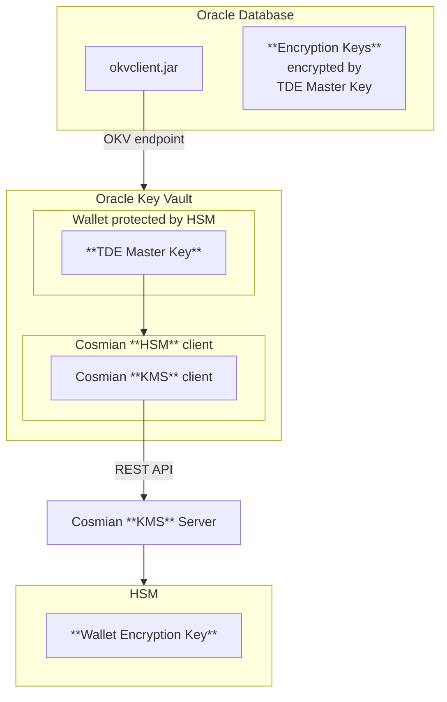

# Oracle Database Transparent Data Encryption (TDE)

**Oracle Database** [Transparent Data Encryption (TDE)](https://docs.oracle.com/en/database/oracle/oracle-database/23/dbtde/introduction-to-transparent-data-encryption.html) enables automatic encryption of data at rest in Oracle databases. Users can execute SQL queries normally while TDE handles encryption transparently in the background. Encryption keys are stored directly in the database but can be encrypted using **Oracle Key Vault**.

**Oracle Key Vault** centralizes encryption key management, offering secure storage and distribution for Oracle databases and enterprise applications. It uses `wallets` to the crucial TDE `master key` which acts as the `Key-Encryption-Key (KEK)` for TDE. The `master key` is stored in a `wallet` that is protected by a password. This `wallet` provides a secure and centralized location for managing encryption keys.

For enhanced security, **Hardware Security Modules (HSM)** can be integrated with Oracle Key Vault to provide additional protection for these `wallets`. This configuration establishes a [Root-of-Trust (RoT)](https://docs.oracle.com/en/database/oracle/key-vault/18.5/okvhm/getting-started-hsm.html#GUID-DADA7E20-82E2-40C9-A63A-4A159EBD5F09): when an HSM is deployed with Oracle Key Vault, the RoT remains in the HSM. The HSM RoT protects the Transparent Data Encryption (TDE) wallet password, which protects the TDE master key, which in turn protects all the encryption keys, certificates, and other security artifacts managed by the Oracle Key Vault server. Note that the HSM in this RoT usage scenario does not store any customer encryption keys. The customer keys are stored and managed directly by the Oracle Key Vault server.

Using HSM as a RoT  is intended to mitigate attempts to recover keys from an Oracle Key Vault server which has been started in an unauthorized environment.
Physical loss of an Oracle Key Vault server from a facility is one example of such a scenario.

When an **Oracle Key Vault server** is HSM-enabled, Oracle Key Vault contacts the HSM every five minutes (or whatever you have set the monitoring interval to) to ensure that the Root of Trust key is available and the TDE wallet password can be decrypted.

What Cosmian provides is:

- **a HSM client**: this is a PKCS#11 provider library that make the Oracle Key Vault a HSM client itself. **It enables the Root-of-Trust** by protecting the Oracle Key Vault wallets passwords. That library also provides a KMS client to communicate with the KMS server.
- **a KMS server** that is interrogated by the KMS client. The KMS server can either front a HSM or act as a HSM but deployed in a secure environment.

<div align="center">



</div>

## Prerequisites

- [Oracle Database](https://www.oracle.com/database/) installed and running
- [Cosmian KMS server](https://docs.cosmian.com/key_management_system) installed and running
- [Oracle Key Vault](https://docs.oracle.com/en/database/oracle/key-vault/21.10/okvig/oracle-key-vault-installation-and-upgrade-requirements.html#GUID-CBAC69C6-14DB-4AB9-8942-6FBF117770B0) installed and running

## Oracle Key Vault Configuration

Before configuring a HSM such as described in [Oracle Key Vault](https://docs.oracle.com/en/database/oracle/key-vault/21.10/okvhm/index.html), some steps are needed:

- Copy the PKCS#11 provider library to the Oracle Key Vault server to `/usr/local/okv/hsm/generic/libcosmian_pkcs11.so`
- Copy the configuration of the PKCS#11 provider library to `/usr/local/okv/hsm/generic/cosmian.toml`
- Override the OKV generic HSM configuration files:

    - `/usr/local/okv/hsm/generic/okv_hsm_env`

    ```bash
    COSMIAN_PKCS11_LOGGING_LEVEL="trace"
    COSMIAN_CLI_CONF="/usr/local/okv/hsm/generic/cosmian.toml"
    COSMIAN_PKCS11_LOGGING_FOLDER="/var/okv/log/hsm"
    ```

    - `/usr/local/okv/hsm/generic/okv_hsm_conf`

    ```bash
    # Oracle Key Vault HSM vendor configuration file
    # Lines must be shorter than 4096 characters.

    # The vendor name, to be displayed on the HSM page on the management console.
    VENDOR_NAME="cosmian"

    # The location of the PKCS#11 library. This file must be preserved on upgrade.
    PKCS11_LIB_LOC="/usr/local/okv/hsm/generic/libcosmian_pkcs11.so"

    # A colon-separated list of the full paths of files and directories that must
    # be preserved on upgrade. All of these files and directories should have been
    # created by the HSM client software setup; none should have existed on Oracle
    # Key Vault by default. These will be necessary when upgrading to a version
    # of Oracle Key Vault that is running on a higher major OS version.
    # Do not use wildcards.
    PRESERVED_FILES=""
    ```

Then you can follow the official [HSM-Enabling in a Standalone Oracle Key Vault Deployment](https://docs.oracle.com/en/database/oracle/key-vault/21.10/okvhm/configuring-hsm-oracle-key-vault1.html#GUID-5645696A-3F19-4CF9-AE79-105569529182).

- At this point, a symmetric key labeled `OKV 18.1 HSM Root Key` has been create in KMS server
- Create an endpoint with an associated `wallet`

## Oracle Database Configuration

For test purposes, we will use the official [Oracle docker container](https://container-registry.oracle.com/ords/f?p=113:4:106545702571334:::4:P4_REPOSITORY,AI_REPOSITORY,AI_REPOSITORY_NAME,P4_REPOSITORY_NAME,P4_EULA_ID,P4_BUSINESS_AREA_ID:1863,1863,Oracle%20Database%20Free,Oracle%20Database%20Free,1,0&cs=3Ti6PWKfgzS30ZJfMaoHY1WKna0Ss_mxMjkSQqTBI7AfugrE1tN9BilNn74Z9ynq_5THQFpwXGPfVnPbkILvCiw) image.

1. Configure TDE on Oracle Database: [United Mode](https://docs.oracle.com/en/database/oracle/oracle-database/23/dbtde/configuring-united-mode2.html#GUID-D3045557-FA85-4EA5-A85A-75EAE9D67E13)

    ```sql
    SQL> ALTER SYSTEM SET WALLET_ROOT='/etc/ORACLE/KEYSTORES/${ORACLE_SID}' SCOPE = SPFILE;
    SQL> SHUTDOWN IMMEDIATE
    SQL> STARTUP
    SQL> ALTER SYSTEM SET TDE_CONFIGURATION="KEYSTORE_CONFIGURATION=OKV" SCOPE=SPFILE SID='*';
    ```

2. Follow the enrollment procedure for the `Oracle Database`: <https://docs.oracle.com/en/database/oracle/key-vault/21.4/okvag/okv_endpoints.html#GUID-5C1A6874-C7A9-41C6-859D-9FFD9010E13D>

3. Create and open a keystore and create the TDE `master key` open it:

    ```sql
    SQL> ADMINISTER KEY MANAGEMENT CREATE KEYSTORE IDENTIFIED BY <password>;
    SQL> ADMINISTER KEY MANAGEMENT SET KEYSTORE OPEN IDENTIFIED BY <password>;
    SQL> ADMINISTER KEY MANAGEMENT SET KEY IDENTIFIED BY <password> WITH BACKUP;
    # Check keystore status:
    SQL> SELECT STATUS FROM V$ENCRYPTION_WALLET;
    # Check encryption keys:
    SQL> select KEY_ID,KEYSTORE_TYPE,CREATOR_DBNAME,ACTIVATION_TIME,KEY_USE,ORIGIN from v$encryption_keys;
    ```

## Example of encrypted table

Create a test database and a table:

```sql
CONNECT SYS AS SYSDBA
CREATE DATABASE test_db
     DATAFILE 'test_system' SIZE 10M
     LOGFILE GROUP 1 ('test_log1a', 'test_log1b') SIZE 500K,
     GROUP 2 ('test_log2a', 'test_log2b') SIZE 500K;

CREATE USER C##u1 IDENTIFIED BY pwd1 DEFAULT TABLESPACE USERS TEMPORARY TABLESPACE TEMP QUOTA UNLIMITED ON USERS CONTAINER=ALL;
GRANT CREATE SESSION to C##u1;
GRANT CREATE TABLE TO C##u1;
```

Connect as C##u1:

```sql
connect test
create table infos_employees (firstname varchar2(40),  name varchar2(40),
  address varchar2(40) encrypt using 'AES256',
  zip_code number(6) encrypt using 'AES256');
insert into infos_employees values ('John','Doe','55 rue de la Boétie, Paris','75008');
```
