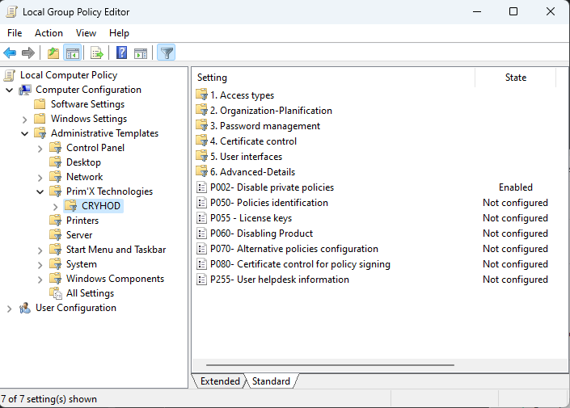
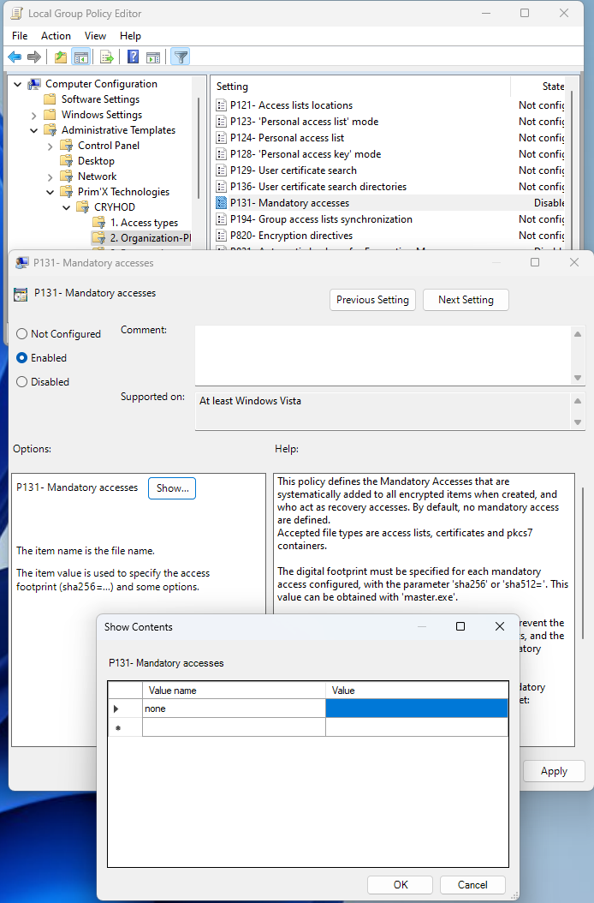
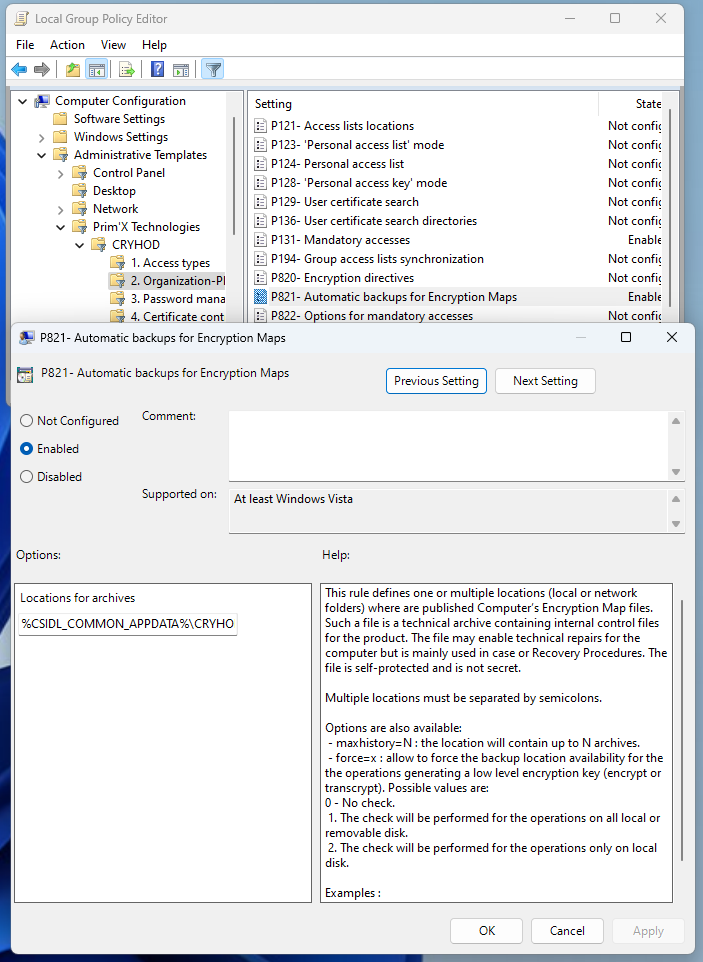
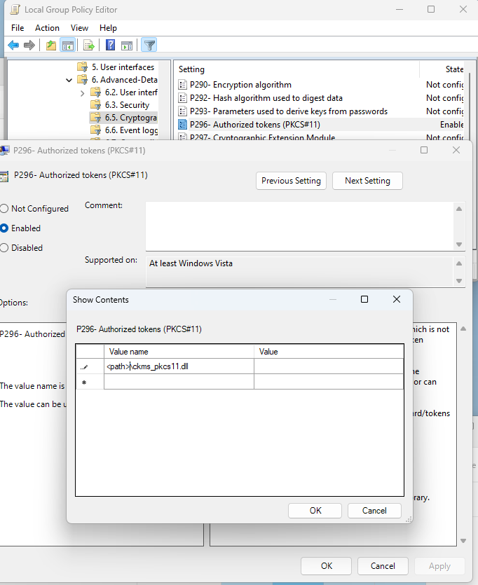
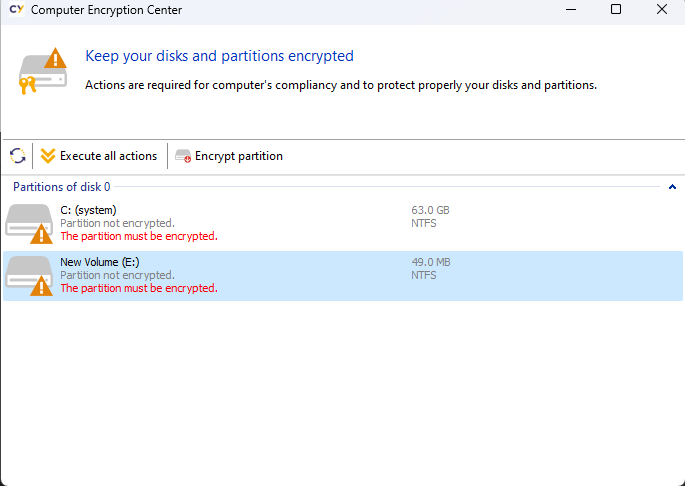
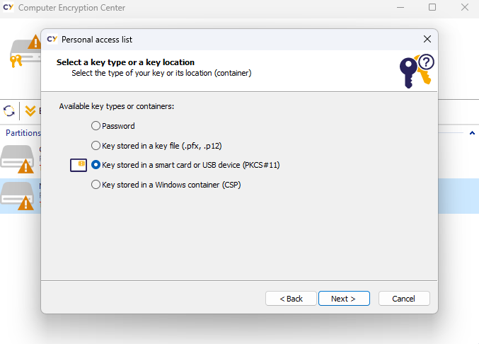
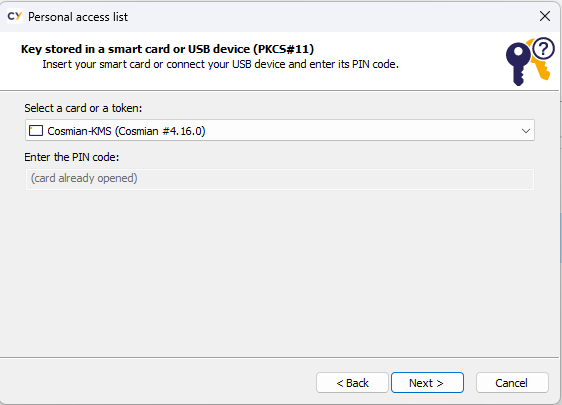

The Cosmian KMS can be used to unlock Prim'x CRYHOD paritions

## Configuring Prim'X CRYHOD

If you get the following popup when trying to encrypt a disk


Additional configuration is required.

Launch the CRYHOD policies application.



Configure the `P131` policy:



For testing you can set the value to th.

Configure the `P821` policy:



For testing you can keep the default values.

Configuring the location of the PKCS#11 provider using the policy P296



Enter the full path of the `ckms_pkcs11.dll` as value name and leve the value empty.

Note: if you change the value, kill all CRYHOD processes or restart
for the change to be taken into effect

## Encrypting a partition

Launch `Computer Encryption Center`



And select the partition to encrypt.

Then select ` Key stored in a smart card or USB device (PKCS#11)`



Click `next`; the Comsian KMS should appear in the list



Click `next`

## Adjusting the KMS location and authentication

The configuration file is located in the User home `.cosmian` sub-directory,
in the `kms.json` file.

See [Authenticating users to the KMS](../authentication.md#using-tls-client-certificates) to learn
how to configure the
KMS to use Open ID connect or certificate authentication (please note that the KMS can
also manage the machines certificates).

Here is an example configuration file for the PKCS#11 provider library accessing the KMS using a
PKCS#12 file for authentication.

```json
{
  "kms_server_url": "https://kms.acme.com:9999",
  "ssl_client_pkcs12_path": "./certificates/machine123.acme.p12",
  "ssl_client_pkcs12_password": "machine123_pkcs12_password"
}
```

## Viewing the logs

By default, the logs are available in the User home `.cosmian` sub-directory.

```powershell
Get-Content -path C:\<USER HOME>\.cosmian\ckms-pkcs11.log -wait
```

The log level can be adjusted using the `COSMIAN_PKCS11_LOGGING_LEVEL` environement variable.

```powershell
setx COSMIAN_PKCS11_LOGGING_LEVEL "debug"
```

## Creating a RSA private key and Certificate to use with CRYHOD

Create an RSA key with 2048 bits and the `disk-encryption` tag.
This tag is the default tag searched. The value can be changed by setting
the `COSMIAN_PKCS11_DISK_ENCRYPTION_TAG` environment value.

```powershell
ckms.exe rsa keys create -s 2048 -t disk-encryption
```

```shell
          Public key unique identifier: ec572e57-eab0-481c-9393-805a11c12ac0
          Private key unique identifier: e70509f9-77ae-4310-bd15-8f6049372426
```