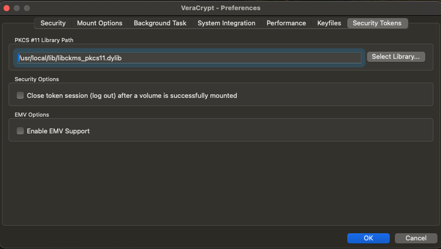
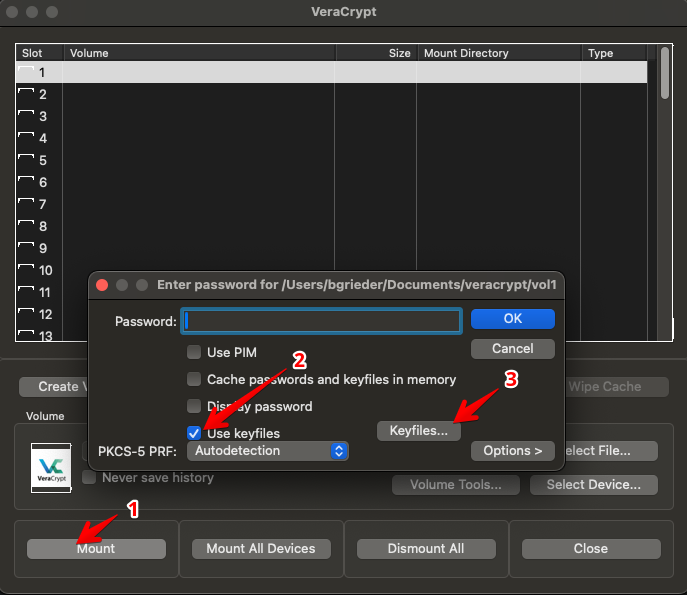
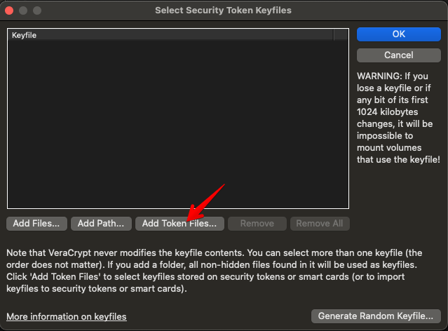
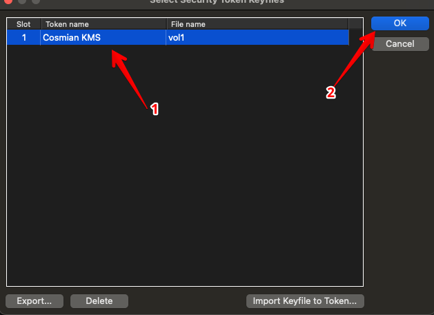

# Veracrypt integration with Cosmian KMS

The Cosmian KMS is integrated with [Veracrypt](https://www.veracrypt.fr/en/Home.html)
disk encryption using the Cosmian KMS PKCS#11 provider library.

Veracrypt is a free, open-source disk encryption software for Windows, macOS, and Linux, and is a successor to TrueCrypt, certified by ANSSI. 
Veracrypt has undergone a formal security evaluation by the BSI.

Using the Cosmian KMS PKCS#11 provider library, Veracrypt can use keys stored in the KMS to
encrypt and decrypt volumes.


## Installing the PKCS#11 provider library on Veracrypt

Go to Veracrypt `Settings > Security Tokens` and use the `Select Library...`
button to select the Cosmian KMS PKCS#11 library for your operating system.
Then click `OK`.



## Configuring access to the KMS

The PKCS#11 provider library uses the same configuration file as the [CLI](../../cosmian_cli/index.md).
The configuration file is typically located at `~/.cosmian/cosmian.toml` on Linux and macOS, 
or the User home subdirectory `.cosmian\cosmian.toml` on Windows.

See [Authenticating users to the KMS](../authentication.md#authenticating-using-tls-client-certificates)
to learn how to configure the KMS to use OpenID Connect or certificate authentication.
Please note that the KMS can also manage the machines' certificates.

Here is an example configuration file for the PKCS#11 provider library accessing the KMS using a
PKCS#12 file for authentication.

```toml
[kms_config.http_config]
server_url = "https://kms.acme.com:9999"
ssl_client_pkcs12_path = "./certificates/machine123.acme.p12"
ssl_client_pkcs12_password = "machine123_pkcs12_password"
```

To use Open ID connect, install the [Cosmian CLI](../../cosmian_cli/index.md) from <https://package.cosmian.com/kms/> and
use the `cosmian kms login` command to authenticate to the KMS first.


## Logging

The PKCS#11 module logs to the `cosmian-pkcs11.log` file in the same `.cosmian` subdirectory of the configuration file.

The `COSMIAN_PKCS11_LOGGING_LEVEL` environment variable controls logging of the PKCS#11 module.
The logging level can be set to `trace`, `debug`, `info`, `warn`, or `error`, and defaults to `info`
when not set.

## Creating keys to use with Veracrypt

The keys used to encrypt Veracrypt volumes are created in the KMS as Symmetric Keys and must
carry at least two tags, one being `disk-encryption`. The other tag(s) will be displayed to the
user in the Veracrypt GUI when selecting the key to use to mount the volume. The other tag(s) can
also be used to identify the key when using Veracrypt CLI.

To create a key using the CLI, which will be shown as `vol1`to the user, use the following command:

```sh
cosmian kms sym keys create -t disk-encryption -t vol1
```

Do not forget to grant `Get` access to the key to the machine that will mount the Veracrypt volume.

```sh
cosmian kms access-rights grant <MACHINE_CN> <KEY_ID> get
```

where `<MACHINE_CN>` is the Common Name of the certificate used to authenticate the machine to the
KMS and `<KEY_ID>` is the ID of the key created in the previous step.

## Mounting a Veracrypt volume using the GUI

When mounting a Veracrypt volume, select the `Use keyfiles` option and select the key to use to
mount the volume using the `Keyfiles...` button.



Click `Add Token Files...`



Select the key to use to mount the volume and click `OK`



## Mounting a Veracrypt volume using the CLI

When mounting a Veracrypt volume using the CLI, use the `-k` option followed by
`token://slot/1/file/vol1` where `vol1` is the other tag chosen to identify the key in the KMS.

## Revoking the access to a key

To revoke access to the key, either

- remove the access to the key <KEY_ID> for the machine <MACHINE_CN> using the following command:

```bash
cosmian kms access-rights revoke <MACHINE_CN> <KEY_ID> get
```

- revoke the key itself using the following command:

```bash
cosmian kms sym keys revoke <KEY_ID>
```

_Note_: a revoked key can never be reused.

## Rotating a key

To rotate a key,

1. Create a new key.
2. Grant access to the machine to the new key.
3. Perform the key rotation/change in the Veracrypt GUI or CLI.
4. Revoke the access to the old key for the machine.
5. Optionally revoke the old key itself.
