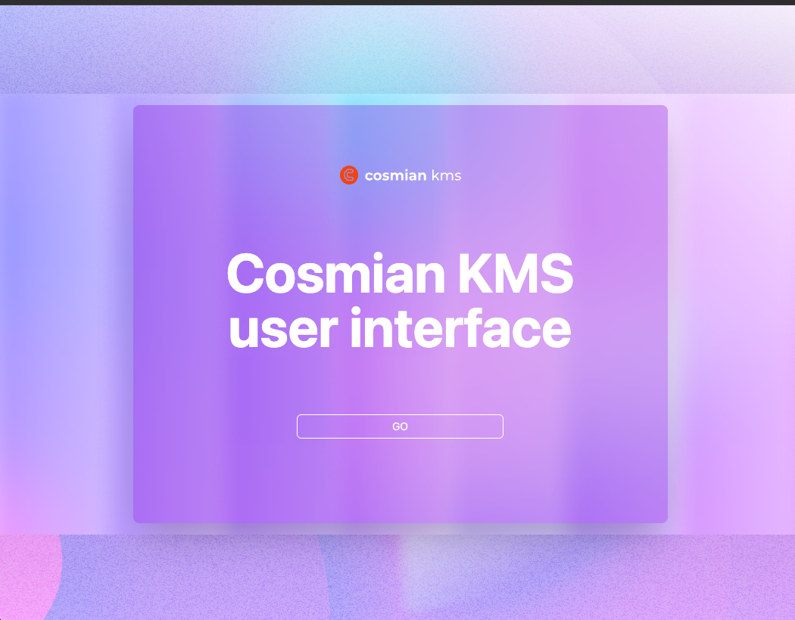

# Quick start

To quick-start a Cosmian KMS server on `http://localhost:9998` that stores its data
inside the container, run the following command:

=== "Docker"

      ```sh
      docker run -p 9998:9998 --name kms ghcr.io/cosmian/kms:latest
      ```

=== "kms.toml"

      ```toml
      # Minimal default configuration
      [http]
      port = 9998
      hostname = "0.0.0.0"
      ```

To run a KMS where the database will survive restarts, run:

=== "Docker"

      ```sh
      docker run  -p 9998:9998 --name kms --volume cosmian-kms:/cosmian-kms  ghcr.io/cosmian/kms:latest
      ```

=== "kms.toml"

      ```toml
      # Same default configuration; persistence is handled by Docker volume
      [http]
      port = 9998
      hostname = "0.0.0.0"
      ```

Please note that if you want to use the KMIP wire protocol, you need to configure TLS and the socket server
using the [server configuration file](./server_configuration_file.md) first.

If you do not have Docker available, install a Cosmian KMS server as described
in [installation guide](./installation/installation_getting_started.md):

## Using the Web UI

Open your web browser and navigate to `http://localhost:9998/ui` to access the GUI.


## Using the CLI

Get the [Cosmian CLI](ckms/index.md) from [Cosmian packages](https://package.cosmian.com/cli/).
You can then easily manage the server:

1. Create a 256-bit symmetric key

      ```sh
      cosmian kms sym keys create --number-of-bits 256 --algorithm aes --tag my-file-key

      The symmetric key was successfully generated.
            Unique identifier: 87e9e2a8-4538-4701-aa8c-e3af94e44a9e
      ```

2. Encrypt the `image.png` file with AES GCM using the key

      ```sh
      cosmian kms sym encrypt --tag my-file-key --output-file image.enc image.png

      The encrypted file is available at "image.enc"
      ```

3. Decrypt the `image.enc` file using the key

      ```sh
      cosmian kms sym decrypt --tag my-file-key --output-file image2.png image.enc

      The decrypted file is available at "image2.png"
      ```
