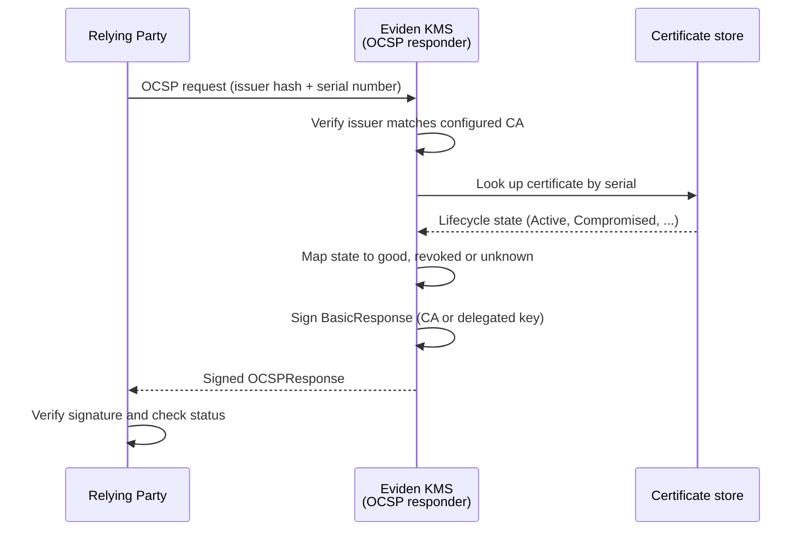
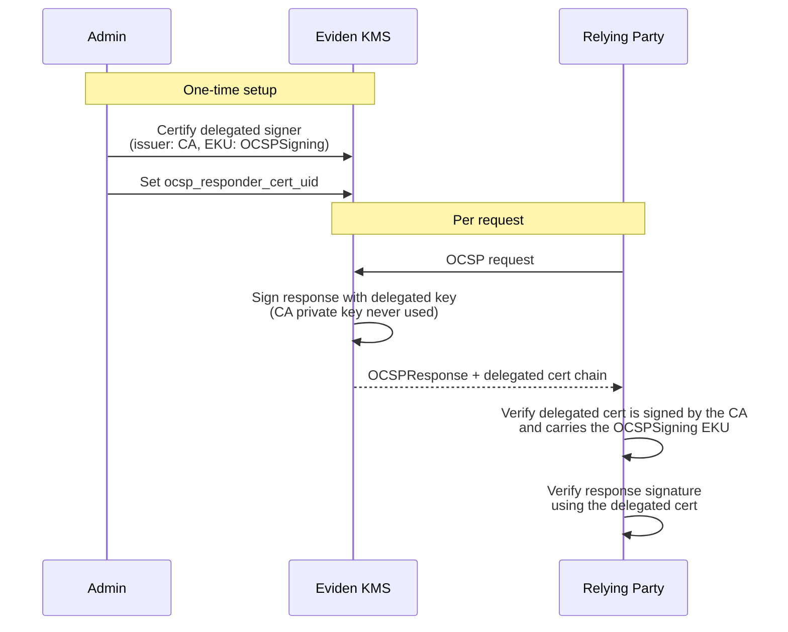
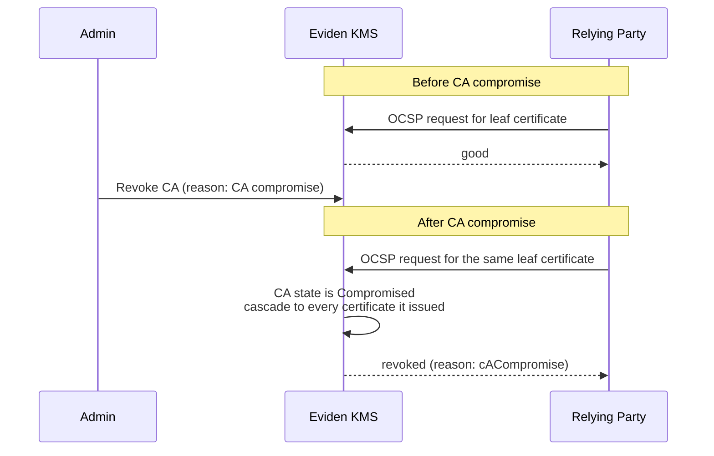

# OCSP Responder (RFC 6960)

The KMS includes a built-in OCSP (Online Certificate Status Protocol) responder,
compliant with [RFC 6960](https://www.rfc-editor.org/rfc/rfc6960), [RFC 9654](https://www.rfc-editor.org/rfc/rfc9654) (nonce), [RFC 5019](https://www.rfc-editor.org/rfc/rfc5019) (lightweight HTTP profile),
and [RFC 5280](https://www.rfc-editor.org/rfc/rfc5280). It complements CRL-based revocation with real-time, per-certificate
status queries and does not require an external OCSP service.

## Protocol flow

A relying party (a TLS stack, browser, or the `openssl ocsp` client) sends a request
identifying the certificate by its issuer and serial number; the KMS looks up the
certificate's current lifecycle state and returns a signed status:



## Endpoints

| Route | Transport | Notes |
| --- | --- | --- |
| `GET /ocsp/{base64url-DER}` | [RFC 6960](https://www.rfc-editor.org/rfc/rfc6960) Appendix A.1 | For small requests (≤ 255 bytes); the request is base64url-encoded in the path |
| `POST /ocsp/` | [RFC 6960](https://www.rfc-editor.org/rfc/rfc6960) Appendix A.2 | Body: DER-encoded `OCSPRequest`, `Content-Type: application/ocsp-request` |

Both routes are **public** (no authentication required) — OCSP response content is
public information per [RFC 6960](https://www.rfc-editor.org/rfc/rfc6960), Section 2, "Protocol Overview"; requiring
authentication would break relying-party tooling (`openssl ocsp`, TLS stacks,
browsers). When `ocsp_enabled = false` (the default), both routes return `404`.

## Configuration

```toml
# kms.toml
[ocsp]
ocsp_enabled             = true
ocsp_ca_uid              = "ca-certificate-uid"
ocsp_responder_cert_uid  = "delegated-signer-uid"  # optional
ocsp_cache_ttl_secs      = 86400
ocsp_nonce_policy        = "optional"               # optional | required | ignore
ocsp_include_cert_chain  = true
ocsp_archive_cutoff_secs = 0
```

Equivalent CLI flags: `--ocsp-enabled`, `--ocsp-ca-uid`, `--ocsp-responder-cert-uid`,
`--ocsp-cache-ttl-secs`, `--ocsp-nonce-policy`, `--ocsp-include-cert-chain`,
`--ocsp-archive-cutoff-secs`.

- `ocsp_ca_uid` — UID of the CA certificate; **required** when `ocsp_enabled = true`.
  Used to verify that incoming requests target this CA (issuer name/key hash) and to
  look up certificate states for revocation status.
- `ocsp_responder_cert_uid` — UID of a delegated OCSP-signing certificate
  ([RFC 6960](https://www.rfc-editor.org/rfc/rfc6960), Section 4.2.2.2, "Authorized Responders"). When set, responses are signed
  by this cert/key pair instead of the CA's own key. The referenced certificate must
  carry `extKeyUsage: OCSPSigning` (OID `1.3.6.1.5.5.7.3.9`); add
  `id-pkix-ocsp-nocheck` (OID `1.3.6.1.5.5.7.48.1.5`, `noCheck` in OpenSSL extension
  syntax) so relying parties don't attempt to check its own revocation status.
- `ocsp_nonce_policy` — nonce handling per [RFC 9654](https://www.rfc-editor.org/rfc/rfc9654), Section 2.1, "Nonce Extension":
  `optional` (echo if present), `required` (reject requests without one), or `ignore`
  (never echo — enables the in-memory response cache described below).
- `ocsp_archive_cutoff_secs` — when non-zero, adds the `id-pkix-ocsp-archive-cutoff`
  extension ([RFC 6960](https://www.rfc-editor.org/rfc/rfc6960), Section 4.4.4, "Archive Cutoff").

### Delegated responder trust model

Keeping the CA's private key offline (HSM-only, never exposed to a public endpoint)
is a common production requirement. Delegating OCSP signing to a dedicated,
narrowly-scoped certificate lets the KMS answer high-traffic OCSP queries without
ever touching the CA key:



## Status mapping

| KMS certificate state | OCSP status | `CRLReason` |
| --- | --- | --- |
| `Active` / `PreActive` | `good` | — |
| `Compromised` / `Destroyed_Compromised` | `revoked` | `keyCompromise` |
| `Deactivated` / `Destroyed` | `revoked` | `cessationOfOperation` |
| Not found under this CA | `unknown` | — |

If the **CA itself** is revoked with a compromise reason, every certificate it issued
is reported `revoked` with reason `cACompromise`, regardless of the leaf certificate's
own state ([RFC 6960](https://www.rfc-editor.org/rfc/rfc6960), Section 2.7, "CA Key Compromise"):



## Manual verification with `openssl ocsp`

The following walks through the same scenarios validated by `mise run test:ocsp`
(`.mise/tasks/test/ocsp`), using only the standard `openssl` CLI and `ckms` — the
tools an external customer already has.

1. **Issue a CA and a leaf certificate**, then enable OCSP for that CA:

   ```bash
   cat > ca.ext <<'EOF'
   [ v3_ca ]
   basicConstraints=critical,CA:TRUE
   keyUsage=critical,keyCertSign,crlSign
   EOF

   ckms certificates certify --certificate-id my-ca --generate-key-pair \
     --algorithm nist-p256 --subject-name "CN=My Test CA" --days 3650 \
     --certificate-extensions ca.ext

   ckms certificates certify --certificate-id my-leaf --generate-key-pair \
     --algorithm nist-p256 --subject-name "CN=my-leaf" \
     --issuer-certificate-id my-ca --days 365

   ckms certificates export ca.pem   --certificate-id my-ca   --format pem
   ckms certificates export leaf.pem --certificate-id my-leaf --format pem
   ```

   Restart (or configure) the server with:

   ```toml
   [ocsp]
   ocsp_enabled = true
   ocsp_ca_uid  = "my-ca"
   ```

2. **Query status over POST** — expect `good`, signed by the CA, nonce echoed:

   ```bash
   openssl ocsp -issuer ca.pem -cert leaf.pem -CAfile ca.pem \
     -url http://localhost:9998/ocsp/ -resp_text
   # leaf.pem: good
   # Response verify OK
   ```

3. **Query the same certificate over GET** ([RFC 6960](https://www.rfc-editor.org/rfc/rfc6960) Appendix A.1):

   ```bash
   openssl ocsp -issuer ca.pem -cert leaf.pem -no_nonce -reqout req.der
   B64URL=$(openssl base64 -in req.der -A | tr '+/' '-_' | tr -d '=')
   curl -i "http://localhost:9998/ocsp/${B64URL}"
   # HTTP/1.1 200 OK, Content-Type: application/ocsp-response
   # Cache-Control / Last-Modified / ETag headers present (RFC 5019)
   ```

4. **Revoke and re-query** — expect `revoked` with the mapped reason:

   ```bash
   ckms certificates revoke "compromised" --certificate-id my-leaf \
     --reason-code key-compromise
   openssl ocsp -issuer ca.pem -cert leaf.pem -CAfile ca.pem \
     -url http://localhost:9998/ocsp/ -resp_text
   # Cert Status: revoked, Reason: keyCompromise, Revocation Time: ...
   ```

5. **Query a serial this CA never issued** — expect `unknown`:

   ```bash
   openssl ocsp -issuer ca.pem -serial 0x7F7F7F7F7F7F7F7F \
     -CAfile ca.pem -url http://localhost:9998/ocsp/ -resp_text
   # : unknown
   ```

!!! note "Nonce policy `required`"
    With `ocsp_nonce_policy = "required"`, a request with no nonce (`openssl ocsp
    -no_nonce`) receives a `malformedRequest` OCSP response ([RFC 6960](https://www.rfc-editor.org/rfc/rfc6960), Section 2.3,
    "Exception Cases") rather than an HTTP error — this keeps the response parseable
    by any standard OCSP client.

## Authority Information Access (AIA)

The AIA extension (`authorityInfoAccess`, OID `1.3.6.1.5.5.7.1.1`) can be added
via the extension config file to point relying parties at the KMS's own OCSP
responder, or at an external one, or at the CA issuer certificate:

```ini
[ v3_ext ]
authorityInfoAccess=OCSP;URI:http://kms.example.com/ocsp/,caIssuers;URI:http://ca.example.com/ca.crt
```
